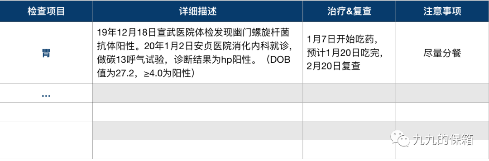

# 就诊资料应该怎么管理？

我给大家做保险方案的时候，通常会先问下大家的身体情况，有没有过住院、门诊或者是体检，好方便给大家找到适合的产品。

这时候收到的回复大部分都是有的，但当问到病历或者检查报告在不在的时候，收到的回复就变成了「我得找找啊」、「可能弄丢了」，很少有人会立马把相关资料发给我。

大家好像对就诊资料的保存都不够重视呀。

作为一个就诊资料保存良好，并且从中受益的人，决定来跟大家聊聊，为什么我们要养成这个习惯，以及我们应该怎么做。

## 1. 方便买保险

医疗险、重疾险、寿险投保都有健康告知，这时候我们就得根据之前的检查资料来看哪些是需要告知，哪些是不需要的。仅凭记忆来告知的话，很容易会有忽略的项目，比如有时候医生说没什么大问题的异常，可能在健康告知里也有问到。

另外，如果要进行人工核保的话，还需要把检查资料提交给保险公司。

如果资料缺失，核保人员不能够获取到有效信息的话，可能就会影响到我们的核保结果。

对于一些需要定期复查的疾病，如果我们能够提供连续的复查结果，可能也会争取到更好的核保结果。比如小A多年前体检发现乳腺结节，每隔半年到一年复查一次，结节一直没有什么变化。这时候如果小 A 可以提交这几年连续的检查报告，就有助于获得更好的结论，比如从除外承保变成标准体承保，或者从延期观察变成除外承保。

## 2. 方便医生判断病情的变化

不知道大家有没有需要定期复查的异常，一般慢性疾病或者是结节肿块这些，医生都建议定期复查的。这时候如果我们保存好每一次检查资料，就可以帮助医生判断病情的变化和发展。

还是以小 A 的结节举个例子，如果小A并没有保存自己的检查报告，在复查的时候，医生就没办法知道结节之前是什么样子的，现在有没有发生变化，需不需要进一步检查，复查的意义也就大打折扣。

所以大家如果有需要定期复查的异常，可以保存好每次的检查报告，下次复查的时候一起带着。

## 3. 方便我们定期复查

听上去好像很简单……但是，也有不少人已经不记得自己上一次复查是什么时候了吧？

如果把检查资料按照时间顺序都保存好，并且有相关表格记录的话，对于下一次该什么时候去复查，会一目了然～

敲黑板，复查真的很重要，乖乖听医生的话，别在这件事上拖延。

## 1. 收集

我一般是按照理赔需要的资料标准来收集，以门诊为例，通常需要病历、检查报告单、发票（要看有没有费用明细，没有的话还需要费用明细清单）、处方笺（如果医生开药了会有）。

这么说大家可能分不清分别是什么，我把自己今年幽门螺旋杆菌感染去看门诊整理的资料贴出来，大家可以参考。

提醒大家一下，现在很多医院都实行电子病历，一般需要我们主动索要，医生才会给打印。检查报告单和发票的话，医院通常会有自助打印的地方。需要注意的是，有的地区和医院发票打印有时效性，要在规定时间内打印才可以，大家最好在医院的时候就把这些资料收集齐全，免得再跑一趟。

## 2. 归类

先按照检查项目把资料分类，比如这一部分是结节的，下一部分是胃炎的；然后按照时间先后顺序把资料排起来；最后选一个自己习惯的工具来保存，比如我用的是插页资料册（就是上学时用来放资料的那种），也可以用夹子夹起来。

## 3. 备份

为了防止丢失，我把所有的资料进行了扫描，做了电子版备份，同时还做了一个这样的表格，方便自己看。

## 结语

如果之前没有做过整理的话，赶快行动起来。如果大家有更好的方法，也可以安利给我。

最后再跟大家聊点题外话，有小伙伴私信我说，每次体检发现异常心情就会很低落。看过无数份体检报告的我悄悄「安慰」大家，现在已经很少有人是没有任何身体异常的了。

如果异常已经发现，我们能做的只有主动管理，遵医嘱，定期复查，改变生活状态，照顾好自己的身体，不要让异常再给我们带来消极情绪。

祝愿我们每个人，都健康快乐～

> 本文章所载信息仅供参考，不构成任何投资建议。如转载使用，请参考[《文章转载声明》](https://youzhiyouxing.cn/agreements/ARTICLE_REPRINTED)。
