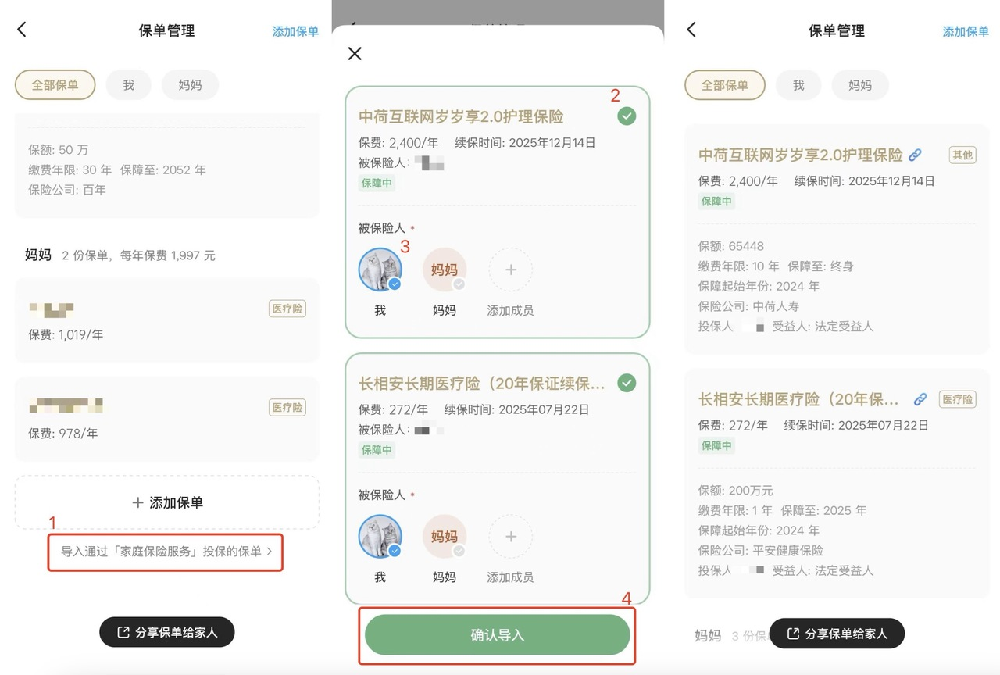
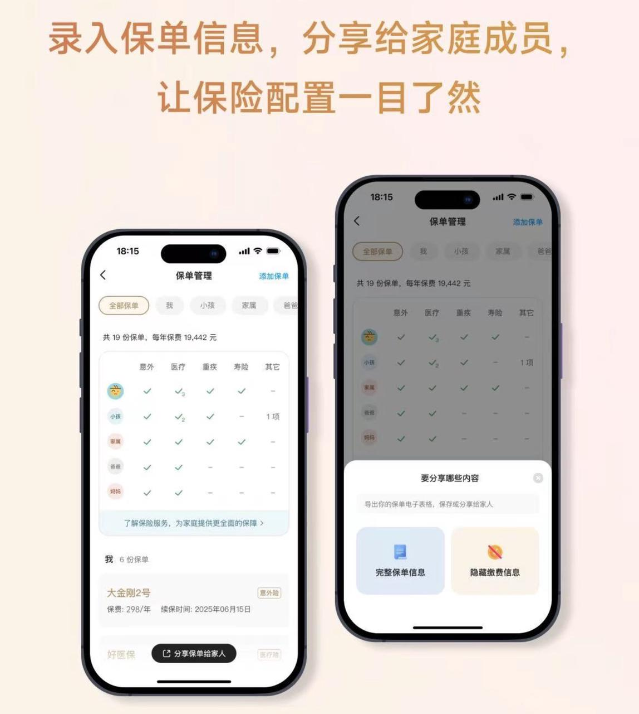
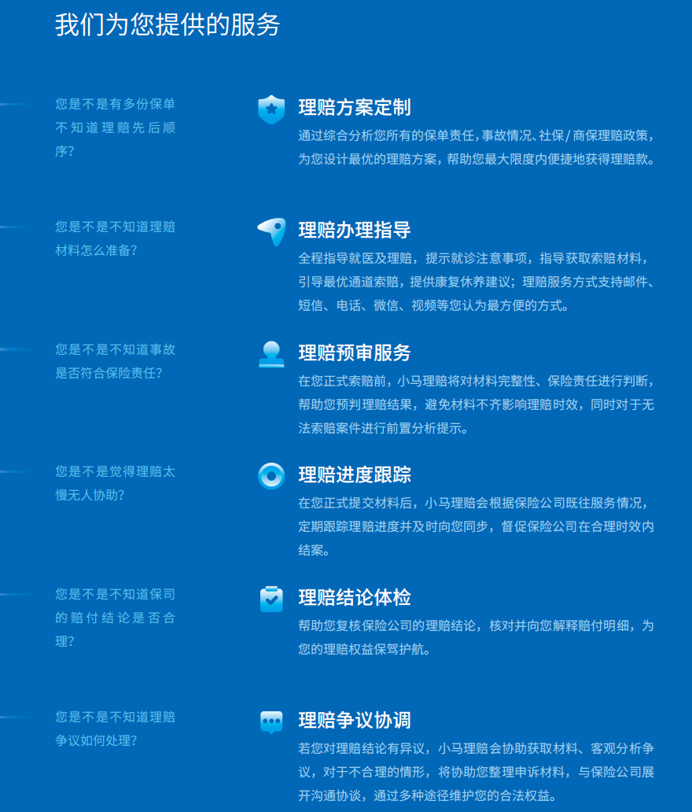
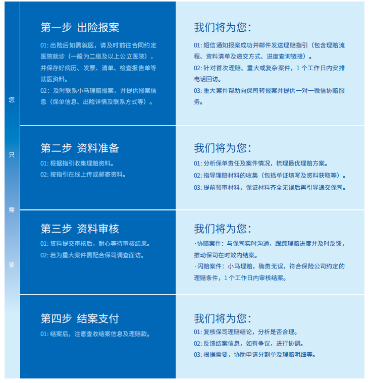

# 投保完成后，别忘了这两件事

恭喜你完成投保，成功迈出了重要的一步，为家庭保障又添砖加瓦～

接下来，还有两件非常简单的小事，花不了多少时间，却能帮助你更好地发挥保单的保障作用：

* 整理保单信息：在「保单管理」工具中导入已投保保单，方便日后进行管理；
* 了解理赔协助服务：万一需要理赔了，找「小马理赔」协助，方便又省心。

**整理保单信息：**在「保单管理」工具中导入已投保保单，方便日后进行管理；

**了解理赔协助服务：**万一需要理赔了，找「小马理赔」协助，方便又省心。

下面将详细为大家介绍导入流程，和小马理赔的服务内容。

## 整理保单信息

这一步，可以通过有知有行 App 中的**「保单管理」**工具来完成。

通过「家庭保险服务」或有知有行相关内容（文章、链接等）投保的保单，如果投保人手机号与有知有行注册手机号一致，**可以直接将保单导入「保单管理」中。**

导入的保单除了无需手动输入数据之外，后续每年的保费变化、续保时间、缴费年限、保额等数据都会自动更新。已导入的保单还支持部分修改，可以关联/修改被保险人，也可填写你觉得有必要的备注。

体验过的朋友们都反馈过程很丝滑～

如果你在其它渠道投保过保单，也可以手动录入保单信息，方便统一管理。

录入后，别忘了将保单分享给家人。

在有知有行的保单管理工具中，只需点击「分享保单给家人」，就可以一键生成保单的 Excel 表格，方便地分享给家人。同时，工具还贴心地提供了「隐藏缴费信息」的选项，既能分享保单的核心内容，又避免暴露具体费用信息，兼顾了隐私和实用性。

保险配置不是一蹴而就的，随着人生阶段、家庭责任、收入水平以及负债情况的变化，保险配置也需要动态调整。每年或者每 2～3 年需要定期做保单检视，具体的方法可以参考 👉 [买了不等于完事，一起给保单做个「年检」](https://youzhiyouxing.cn/n/materials/1851)

## 理赔协助服务

万一出险了，需要理赔，很多人并不知道该怎么办。

比较推荐的做法是，**在面临可能出险的情况下，千万不要犹豫，第一时间联系保险顾问，获取专业帮助，确保理赔流程顺利进行。**

针对「理赔流程繁琐、理赔太慢不及时、理赔争议无人帮」等痛点，我们的保险合作方推出了协助理赔服务。你可以*关注***「小马理赔」公众号，或拨打全国服务电话400-678-8169**，在需要时与他们联系，获得及时有效的帮助。

「小马理赔」专门帮助解决大家在理赔过程中常遇到的难题：

操作起来也很简单：

而且，这项服务是**完全免费**的！如果你的保单首期保费达到5万元及以上，不仅自己的理赔可以得到协助，家人的保单也可以通过小马理赔服务获得支持。

通过这两步简单操作，不仅能让你的保单管理更高效，理赔时也能得到更及时的帮助，让你的保障更全面、更有保障。

别忘记哟～

> 法律声明 本文所载内容皆以交流分享为目的，仅供参考。本文所涉保险对比/试算/报价比价等内容均来自保险机构自营平台齐欣云服，有知有行力求本文内容的准确可靠，但对相关信息的准确性、可靠性、时效性及完整性不作任何明示或暗示的保证。有知有行提示您，保险配置方案请您结合自身情况独立判断，或预约专属保险顾问进行咨询。如需转载或引用本文所述内容的任何文字、图片、音频或视频，请注明出处。转载前请与有知有行取得联系并经同意，转载时须注明来源及作者。
