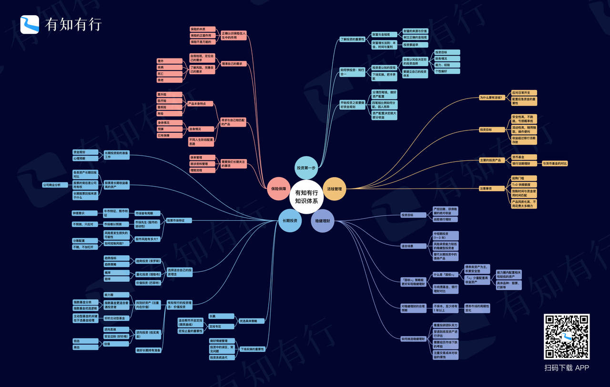

# 全面了解有知有行投资知识体系

开篇一张图，是不是还挺酷。

这是「有知有行」的知识体系全览图，凝练了我们对投资的主要认知。不夸张地说，真正掌握这套知识体系，你的投资知识可以打 80 分了。

对刚接触投资的朋友来说，这张图是「*导航*」。在你进入投资这个陌生领域时，这条主线可以提升学习效率。

对进阶的朋友来说，这张图是「*检测仪*」。对照它，你可以查漏补缺，逐步建立和优化自己的投资体系。

当然，这张图只是冰山一角， 你看到的每个节点都有精选内容，供大家阅读和查看。

大多人学投资，是成年后自己慢慢摸索着学的，一路上可能走了不少弯路。

也许你曾长时间纠结某个具体指标，也许你有过「抓起就学，学到哪儿算到哪儿」的经历，就像是到一个陌生城市，语言不通，没有地图，就这么漫无目的地游荡。

就这样，投资变成了生活中一件苦哈哈的大事。

其实，不论学什么，都是从茫然无知到逐步建立体系的过程，学到的大量零散知识能够各归其位，才能在随时调动出来。

我们打造的这套知识体系，就是想解决这个问题——*为大家梳理一条学习主线，让你知道哪些是投资的重要知识，也知道不同知识点之间的关系；知道每个知识点该放在哪里，也知道它会通向何方。*

如果说这些知识点是一个个地标，那么，知识体系就是一幅全景地图，有它陪你一起走出投资这片迷雾森林。

对个人投资者来说，学习的目的地在哪儿？

这是我们一直在思考的问题。

我们知道，很多人学投资不是因为对投资有多热爱，更多的是，希望自己辛苦赚的钱能投得踏实些。我们不需要像专业投资者那样，把大量时间花在投资上。

所以，我们的知识体系*不求「大而全」*，只收录那些投资中的*「重要知识」*。

格雷厄姆说：「投资艺术有一个特点不为大众所知。门外汉只需些微努力与能力，便可以取得令人尊敬（即使并不可观）的结果。但是如果想在这个容易获取的标准上更进一步，则需要更多的实践和智慧。」

作为投资领域的「高级外行」，我们只需要具备一些基础的金融素养，就可以避开投资中的大部分坑了。

比如，理解金融市场的运行规律，理解财富是怎么创造的，知道我们赚的钱是哪儿来的，知道如何识别一个好的基金经理或投资顾问，知道如何分配自己的钱……

这需要花一些时间来学习，但并不难。当你真正建立这些认知，普通人也能获得良好的投资收益。

这，正是有知有行想和你一起做到的。

整个知识体系一共「五大板块」，分别是：*投资第一步、活钱管理、稳健理财、长期投资和保险保障。*

知识体系目前还在持续填充中，每*周四 20:00* 更新，开启 App 通知后即可收到更新提醒。

你可以沿着板块逐步探索，也可以在一个板块下持续深挖。

从「投资」到「知投资」，从「盲目」到「有体系」，希望这套知识体系，能帮助你更好地学习投资，也欢迎你分享给有需要的投资者。

已经体验过的朋友们不妨在想法区聊聊你的感受吧～
