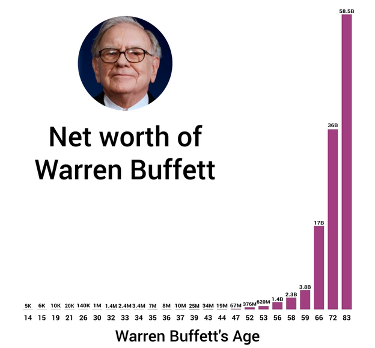
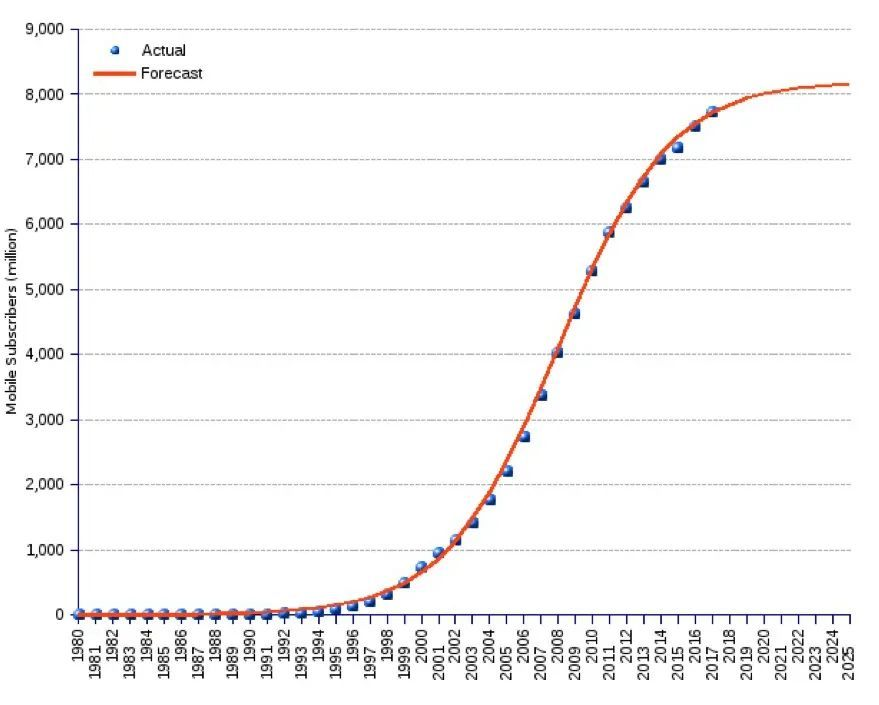
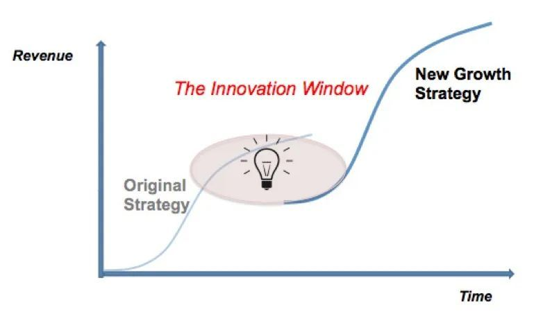

# 你看到的神奇复利都是骗人的

复利，是投资中最重要的一个概念，同时也是人生的重要算法。

所谓复利，就是利滚利，民间也称驴打滚，你从网上书上可能听过一万遍复利的神奇威力了。

复利是如此重要，以至于**爱因斯坦说复利是世界第八大奇迹，是宇宙中最伟大的力量。**

但是请注意，本号不是流量号也不是鸡汤号，希望你看完本文能获得一点有关复利的真知灼见。

**你看到的神奇复利，都是骗人的。**

你看过的复利鸡汤一般是这样开始的：

17 世纪的时候有一个荷兰人，用价值 24 美元的布料和饰品, 从印第安人手里买下了曼哈顿岛。

曼哈顿岛现在是全世界最为繁华的商业中心，保守估计价值 2.5 万亿美金。

现在你乍一听上去，肯定感觉荷兰人这笔买卖简直是无敌的暴利，从 24 美金到 2.5 万亿美金。

别急，我们再看看如果他当年用这 24 美元投资，按照咱们老师的指导正确理财，按照美国股市近 100 年的平均投资收益率 9% 来计算，会变成多少？

从 1626 年到 2000 年，经过 300 多年的时间之后, 按照 9% 的投资回报率，这 24 美金会神奇地变成 2386 万亿美金，差不多能买下 1000 个曼哈顿岛!

当然这都是老外的故事，我们中国有简化版本。

1.01^365 = 37.78 0.99^365 = 0.026

每天只进步一点点，一年 365 天下来也是惊人的进步，同样只退步一点点，一年下来基本啥也不剩了。 结果是不是很鸡汤很励志？确实，复利的力量确实很强大。

你如果还嫌不够刺激，那我还有更厉害的给你看：

1.01^1000 = 20959.15 0.99^1000 = 0.000043

但是很遗憾，你看到的这些，都只是鸡汤而已。

曼哈顿岛的那个故事里，1626 年根本就还没有股市。

就算有，谁能保证稳定年化 9% 呢？还得连续 300 年？世界第一的美国不过也才两百多年的历史。

再说中国版本的计算题，每天进步一点，一年下来就比过去的自己厉害了 37 倍？这么厉害，你不早上天了么兄弟？

**年初工资 1 万块，难道到年底你去跟老板说：老板，我每天都在变厉害，我的月工资应该是 37 万？**

虽然有关复利的鸡汤，细想起来非常的沙雕，但复利的公式，是我们人生算法的一个很重要的模型：

**复利 = 本金 ×（1 + 收益率）^时间**

把复利的三要素琢磨透了，你的努力方向会豁然开朗。

（1）本金

我们先说说本金。

你在狗血电视剧里经常看到一穷二白的男主对反派富二代说：有钱了不起啊！

清醒点朋友，在真实世界里，有足够多的本金，确实很重要。

你可能听过，按照 10% 的复利，7 年本金就能翻倍了。

(1 + 10%)^7 ≈ 2

那么如果你不用复利的逻辑呢？如果你只是本金放在那，用单利去算，7 年每年 10%，那也有 70% 了，和 100% 其实差不了太多。

所以不要过度地把成果都归功于利滚利，以 7 年为期，你大部分的收益，还是来自于你本金的基本利息，而不是复利。

足够多的本金，真的很重要。

很多人往往会忘记本金的重要性，其实它的增加决定着未来资产的高度，但本金的增加并不是理财能带来的，是要你不断努力去从外部获取。

现在市面上各种沙雕的理财培训，坏就坏在他们只给你讲复利的重要性，却从来不告诉你，你那点本金，复利上天也没多少。

（2）时间

你为什么不能去跟老板要求一个月发你 37 万的工资呢？

因为，「一年里，每天都比前一天进步 1%」这件事情是极不合理的。

你可能会说，我每天能比昨天多背 5 个单词啊？不难啊？

抱歉，这是线性叠加，不是复利。而且，不光不是复利，你还会背的越多，忘的越多。

炒股票的都知道，净值一天涨个 1% 很轻松，但谁能一年每天都涨 1%？

365 次方的确是非常美好的想像，可惜现实生活中并不存在。

比较合理的算法，应该是用 「年」 为单位。这样你会发现，要达到 365 次方，你大概需要十辈子，才能去跟老板要 37 万。

你可别嫌慢，复利的意义恰恰就在于，它从来不是告诉你应该速成，应该一年涨 37 倍。

我们看看沃伦·巴菲特（Warren Buffett，以下简称「巴菲特」）的例子，下面这张图是巴菲特的资产增长曲线：

这个曲线也非常符合上面说的复利曲线，早期很不起眼，后来迅速飞升。换句话说，巴菲特的巨额资产，绝大部分都是在他 50 岁以后赚到的。

也就是说，即使巴菲特这么厉害的人物，在他 50 岁之前，其实资产也并不算多。

也就是说，我们普通人没有他的收益率那么高，大概率会比他的复利增长更慢一点。

所以，如果你真的相信复利增长曲线，那你就应该接受一个现实：变富是需要慢慢实现的。

这个慢慢，可能是三年五年、更可能是十年二十年的持之以恒丝毫不敢懈怠。

（3）收益率

我们在做任何复利增长的曲线的时候，都会假设一个 10% 或者 15% 这样的增长率。

但是，在真实世界中，你不但找不到 20% 的利率，你也找不到 15% 的利率，你甚至找不到 10% 的利率。

你可能见过无数民间股神，一年 5 倍。但你应该知道，一年 5 倍的人多，5 年一倍的人少。

如果华尔街哪个投资公司说我能提供保证 10% 的利率，无数人会哭着喊着把资金交给它管理。

在现实世界里，只有庞氏骗局那种非法集资公司，才敢做这样永续增长的保证。

也就是说，真实世界中很少存在长期指数增长的东西。

现实世界的增长，常常是 S 曲线。

下图是全世界手机用户的增长情况，就是典型的 S 曲线。

你可以找出很多生活中的例子满足这样的 S 曲线，比如你练习一个新技能的熟练度，比如微信的全球用户数，等等。

说到这，你也可以理解，为什么咱们的 GDP 从改革开放快速增长，但是最近增速下降，不能一直保持年化十几的增长（年化 20% 的增长，不用多久我们就能一统世界了）。

不断持续的稳定复利，只存在于想象中。

所以我说，那些把发财的希望寄托在复利上，每天算算这个利率在理论上 30 年 50 年后以后能带来多少钱的人，是认知上的懒惰者。

当 S 曲线到达瓶颈，我们需要的是创新、突破，认知的升级，才能继续保持增长。

**真实世界是复杂的，我们能做到的，唯有用个人的不断学习和成长，去不断拉升这个复利曲线的增长。**

对我们个人来说，一旦认知掉队，可不仅仅是停止增长这么简单，更可怕的是曲线掉头向下。要知道，不管咱赚了多少钱，亏完所有本金只需要 100%。

最后咱也讲一个复利的毒鸡汤故事：

「你别总抽烟了，如果现在戒烟的话，15 年省下的钱，利滚利都可以买一辆宝马了！」

「你抽烟吗？」

「从来不抽。」

「那好，请把你的宝马开出来吧~」

苏格拉底曾说，不经过思考的人生是不值得过的。

投资最有意思的地方就是反常识，所以你脑海里的所有的概念都需要重新打磨，接触到的知识也都需要用自己的认知体系过滤一遍。

**据考证，爱因斯坦根本没说过什么 「复利是宇宙中最强大的力量」 这种傻话。**

> 来源：公众号「时钟先生聊财报」转载文章发表的所有信息仅代表作者个人观点，不对您构成任何投资建议，详见[《文章免责声明》](https://youzhiyouxing.cn/agreements/ARTICLE_DISCLAIMER)。
