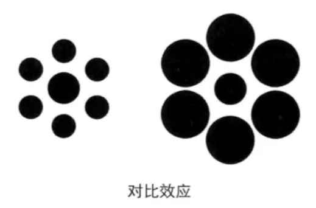
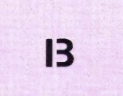
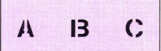
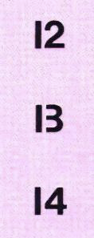
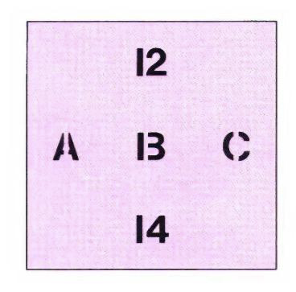
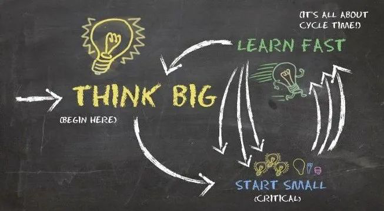

# 比较是万恶之源

生活中大部分的痛苦，源于非理性的比较。这些比较常常与金钱挂钩，比如大学室友事业飞黄腾达，别人的股票飞涨而自己的纹丝不动，新来的同事工资比自己还高……

但很少有人意识到的是，优秀的人能够成功，往往也源于他拥有一套成功的比较系统。今天推荐的这篇文章，彻底为你把「比较」这件事情讲清楚：我们该怎样对糟糕的「比较」免疫，又该在什么时机善用「比较」。

本文较长，大概需要 18 分钟阅读，但值得你静下心慢慢看。

祝开卷有知。

以下三位男性的爱情，你更喜欢哪一个？

1. 「成功男」，身家一个亿，拿出资产的 1%，为女友买了一辆价值 100 万的保时捷；
1. 「奋斗男」，存款 100 万，拿出资产的 10%，为女友买了一个价值 10 万的爱马仕包包；
1. 「白手男」，钱包里一共有 1 万块钱，100% 拿出来为女友买了一个价值 1 万的苹果笔记本。

「*成功男*」，身家一个亿，拿出资产的 1%，为女友买了一辆价值 100 万的保时捷；

「*奋斗男*」，存款 100 万，拿出资产的 10%，为女友买了一个价值 10 万的爱马仕包包；

「*白手男*」，钱包里一共有 1 万块钱，100% 拿出来为女友买了一个价值 1 万的苹果笔记本。

姑且让我们不正确地用礼物来评估三位男性的爱情，你一定看出来了，比例小的，绝对值大：

论绝对数值，「成功男」最为大方；

论相对比例，「白手男」最有诚意。

假如你是女性，你会选择哪一位？

假如你是男性，你又愿意做哪一位呢？

类似关于「比例」故事有不少，例如有人说王思聪花 30 万元买给女朋友的礼物未必比一个普通人花几百块更真诚。

有次巴菲特带盖茨去自家的珠宝店。盖茨当时刚结婚，巴菲特怂恿他花 3.7 亿美金给自己的老婆买个钻戒。理由是：

> 巴菲特自己结婚时身家不到两万，给太太买了个 1200 美元的婚戒，占资产的 6%。而当时盖茨的资产是 62 亿美金，若按照 6% 的比例算，就是 3.7 亿美金。

巴菲特自己结婚时身家不到两万，给太太买了个 1200 美元的婚戒，占资产的 6%。

而当时盖茨的资产是 62 亿美金，若按照 6% 的比例算，就是 3.7 亿美金。

这个说法有道理吗？

*关于「比较」的话题，不仅是情感八卦，还与生物学、行为科学、幸福理论有关，甚至也与个人成长、创业、投资紧密关联。*

本文将围绕「比较」展开一场有趣的大脑旅行。

人类喜欢比较。

*比较，产生美。*

*比较，也是万恶之源。*

人天生就是一种「爱比较、但是又经常把自己比晕」的动物。

你有没有想过：

为什么你会跑到另一个超市，去购买一个从 10 元降价到 5 元的商品；却不愿意跑同样的路，去购买一个从 300 元降价到 295 元的商品？

人有时候会按照「差异的比例」去比较，有时候又会按照「差异的绝对值」去比较。

说一个我自己被「比较」捉弄的亲身经历吧。

> 上个星期，我去买户外家具。去到一家店里，看到商品不错，就是价格略贵。当时看中一套不错的户外组合沙发，折后价一万二。心想，再去两家店对比一下，转回来就买下得了。又去了家具店RH，类似的沙发要更贵一点儿，关键是订货需要四个月以上，那时候都要冬天了……接下来，「惊喜」发生了：我们在手机上搜到一家户外家具货仓店，跑去一看，又有现货，价格对比前两家又便宜，还有额外折扣，于是一顿选（像是双十一抢特价商品）。这时，女儿打电话来要去接，于是我们恋恋不舍地离开，打算第二天早上再来抢购。晚上在家，随便上 Costco 的官网上转了下，看到类似的户外沙发组合正做特价，折后只要 2700 刀！

上个星期，我去买户外家具。去到一家店里，看到商品不错，就是价格略贵。

当时看中一套不错的户外组合沙发，折后价一万二。心想，再去两家店对比一下，转回来就买下得了。

又去了家具店RH，类似的沙发要更贵一点儿，关键是订货需要四个月以上，那时候都要冬天了……

接下来，「惊喜」发生了：我们在手机上搜到一家户外家具货仓店，跑去一看，又有现货，价格对比前两家又便宜，还有额外折扣，于是一顿选（像是双十一抢特价商品）。

这时，女儿打电话来要去接，于是我们恋恋不舍地离开，打算第二天早上再来抢购。

晚上在家，随便上 Costco 的官网上转了下，看到类似的户外沙发组合正做特价，折后只要 2700 刀！

为什么下午我们却那么「惊喜」呢？

原因就是之前逛的两家店都有点儿贵，于是在「比较」之下，该货仓店就显得格外实惠了。

罗伯特·西奥迪尼在他的 《影响力》里将其称为「对比效应」，他讲了希德和哈利两兄弟的故事 ：

> 两人在美国经营一家服装店，希德负责销售，哈利负责裁剪 。每当希德发现站在镜子前的顾客真的喜欢一套西服时，他就会假装有点耳聋 。当顾客询问价格时，希德就对他的兄弟喊 ： 「哈利，这套西服多少钱？」哈利就从他的裁剪台上抬起头，回答说 ：「这套漂亮的棉质西服 42 美元。」希德听完后向他的顾客转过身来说 ： 「他说 22 美元。」那位顾客听到后就赶紧将 22 美元放到桌上，抢在可怜的希德发觉 「错误」之前，带着昂贵的衣服匆匆离去。

两人在美国经营一家服装店，希德负责销售，哈利负责裁剪 。

每当希德发现站在镜子前的顾客真的喜欢一套西服时，他就会假装有点耳聋 。

当顾客询问价格时，希德就对他的兄弟喊 ： 「哈利，这套西服多少钱？」

哈利就从他的裁剪台上抬起头，回答说 ：「这套漂亮的棉质西服 42 美元。」

希德听完后向他的顾客转过身来说 ： 「他说 22 美元。」

那位顾客听到后就赶紧将 22 美元放到桌上，抢在可怜的希德发觉 「错误」之前，带着昂贵的衣服匆匆离去。

其实，类似的故事，天天都在上演，商店里的打折，网络上的特价，莫不如是。

打折商品胡乱买买也就算了，人们对于打折的股票也会有捡便宜的心理。例如看到某曾经大牛的股票大跌，就去抄底，结果接到了飞刀。

生活中的「对比效应」比比皆是：

* 你去旅游的时候，一路上都吃得很差，但最后一顿导游基本上会安排一顿不错的，充分利用「对比效应」和「峰终效应」；
* 中介可能先带你看一堆差房子，最后再带你看他真正想卖给你的房子；
* 你年底奖金比去年多了好几万元，正高兴呢，一看同事小明居然比你多 500 元，你顿时心情沮丧； 你相亲的时候，带上自己的好朋友一起，却忘了他又高又帅像个模特儿……

你去旅游的时候，一路上都吃得很差，但最后一顿导游基本上会安排一顿不错的，充分利用「对比效应」和「峰终效应」；

中介可能先带你看一堆差房子，最后再带你看他真正想卖给你的房子；

你年底奖金比去年多了好几万元，正高兴呢，一看同事小明居然比你多 500 元，你顿时心情沮丧； 你相亲的时候，带上自己的好朋友一起，却忘了他又高又帅像个模特儿……

为什么人类这么容易被「比较」支配呢？

并且，人世间的许多恶，都是源自非理性的「比较」。

人爱比较，有生理基础上的原因。

人类进化的目的是为了「生存」而适应，而非真实和精确。

博·洛托在《错觉心理学》里说：

> 进化的「目标」是获得适应性、稳健性和可发展性。人类物种是这个过程发挥作用的一个绝佳案例。这意味着当你观察周围的世界时，你在使用数百万年的历史。

进化的「目标」是获得适应性、稳健性和可发展性。人类物种是这个过程发挥作用的一个绝佳案例。这意味着当你观察周围的世界时，你在使用数百万年的历史。

他由此得出了一个有趣的观察：

*你的进化不是为了看到现实……而是为了生存。*

为什么呢？博·洛托解释到：

> 准确看到现实并不是生存的必要条件。实际上，它甚至是生存的阻碍。如果没有这个关于感知的基本前提，你就会停留在古老的观察方式之中，因为如果你用错误的假设解决问题，那么不管你是否更加接近真理，你都会更加相信这种假设。

准确看到现实并不是生存的必要条件。实际上，它甚至是生存的阻碍。如果没有这个关于感知的基本前提，你就会停留在古老的观察方式之中，因为如果你用错误的假设解决问题，那么不管你是否更加接近真理，你都会更加相信这种假设。

例如下图，左右两图中间的圆，哪个更大？

其实是一样大的。

再比如，一包一公斤重的棉花，和一块一公斤重的铁，不考虑浮力，你会觉得铁更重。

为什么会这样？

19 世纪的时候，德国生物物理学家赫尔曼·冯·赫姆霍兹曾说：

*大脑不过是一台预测机器，我们的所见、所听、所感不过是它对输入信号的最佳猜测罢了。*

一大包东西，大脑会预测「较重」，但是因为棉花比「预期」轻，大脑就会感知到「轻」，而一小块同样重量的铁却显得很重。

轻和重，是一种基于相对比较的感知，而非精确的度量。

再看一个例子：我们将看到同一个图案，在四张图里的「变化」。

**第 1 张图**

如下这张图中的图案，你看到的是什么？

看上去，既可以是 13，也可以是字母 B。

**第 2 张图**

同样的图案，把它放在下面的序列中，你看到的是什么？

可能大部分人都会说：是字母 B。

因为这个时候我们看到的世界多了一个相关信息：A 和 C。

我们的脑袋里马上浮现出 ABC 的顺序。

**第 3 张图**

再把该图案放在下面的序列里，你看到的又是什么呢？

几乎所有人都会说是 13 吧。

**第 4 张图**

接下来，我们再把该图案放入下面这个交叉序列，你看到的又是什么？

通过增加一个维度的比较，我们可以知道这个图案既可以是 13，也可以是字母 B。

通过这个例子，我们也能够更加形象地理解「多元思维模型」的意义所在：

*我们无法「看到」现实，只能像瞎子摸象一样，从不同的角度多摸几次。*

神经科学家博·洛托（Beau Lotto）用了一个有趣的比喻：

> 我们的五种感官就像计算机的键盘一样，它们提供了外部信息进入大脑的途径，但它们与我们所感知到的事物几乎没有关系。它们本质上只是机械媒介，因此对我们的感知只能起到有限的作用。

我们的五种感官就像计算机的键盘一样，它们提供了外部信息进入大脑的途径，但它们与我们所感知到的事物几乎没有关系。它们本质上只是机械媒介，因此对我们的感知只能起到有限的作用。

人类的错觉，不止因为「瞎子摸象」的局限性，更因为我们擅长「脑补」。

即使只说视觉系统，就神经连接的绝对数量而言，形成视觉的信息只有 10% 来自眼睛，90% 来自大脑的其他部位。

达尔文不是说过眼睛的神奇和强大差一点儿让他怀疑自己的进化论吗？

那为什么人的视觉有这么大的局限性呢？

麻省理工学院的视觉专家泰德·阿戴尔森谈及人类的错觉时说：

*这表明了视觉系统的成功之处而非失败之处，我们的视觉系统并不能作为物理学的测光表，这也不是它存在的目的。*

正所谓成也萧何，败也萧何。

*比较带给我们智慧，也令我们愚蠢。*

在漫长的进化历程中，我们的大脑形成了某些自动机制，例如，会把树丛后的一个黑色石头「处理」成老虎。

科学家认为：

*我们的大脑可能是把自己的预测与感知到的信息结合到一起，形成了感知意识。*

而且，这种预测，经常是自动发生的，我们自己都没有觉察到。

这就是预测和感知之间的*选择性比较。*

就像上面的例子，到底是数字 13，还是字母 B，取决于我们此前的预测。

而我们的预测，又被顺序和模式之间的比较所支配。

并且，大脑十分热衷于「发现」模式。

聪明人容易干蠢事，就是因为大脑的这种先入为主的「预测」能力太强大了，以至于影响并削弱了对感知信息的观察。

当然，说回来，这又是进化的代价–人类不就是靠想象力走出丛林的吗？

似乎这类代价，不少都与「自动驾驶」有关。

不仅有如上所说的意识上的自动驾驶，还有时间的自动驾驶。

迄今我们都没搞懂时间的机制，觉得「时间匀速向前」天经地义，前因后果，先来后到。

*于是，我们仅仅因为时间的先后，而做一些虚幻的比较。*

例如，有次你到超市买了种饮料，喝了以后感觉不错，心想这家公司应该挺有前途。第二天，你发现该公司的股票涨停了。

你懊恼不已。

为什么会懊恼？你的潜意识里觉得有另外一个自己喝了饮料之后立即就去买了股票，结果抓了个涨停板。

事实上，该「另外一个自己」并不存在。

你的懊恼源于让自己和那个虚幻的自己做比较。

*这类「很近」，其实很远。*

假如你买了张彩票，号码和头奖只差了一位数，也没什么可懊恼的，这个只差一位数字的号码，和所有数字都不对的号码在概率上是一样的。

*八杆子打不着的比较，有时候是因为无知。*

就像两个人下棋，即使两人水平差距巨大，水平低的人也会觉得和水平高的人很接近。

此外，假如有人说你很像她的初恋男友，你最好不要知道那个人长啥样。

诗人威廉·布莱克（William Blake）说：

> 如果感知之门得以清净，世间万物就会以其原本无尽的姿态呈现在你面前。但人们自己关上了这扇门，直到他通过狭窄的裂缝看到所有一切。

如果感知之门得以清净，世间万物就会以其原本无尽的姿态呈现在你面前。但人们自己关上了这扇门，直到他通过狭窄的裂缝看到所有一切。

我们也因此得到上天的赐予，用双眼，用一团肉乎乎的大脑，就能感知到无尽的宇宙。

只是，我们也该随时谨记物理学家亥姆霍兹(Hermann von Helmholtz)的观点：

*大脑从外界得到的信号，不过是大脑预期与实际状态之间的误差。*

知晓了这一点，我们就能从另外一个角度理解认知的本质，并且可以笼统地将人分为两类：

第一类：通过比较去发现「大脑预期与实际状态之间」的相同之处；

第二类：通过比较去发现「大脑预期与实际状态之间」的不同之处。

如果说「大脑预期」是思考，那么上述行为则是「思考的思考」。

我们不应该把人类因为「比较」而付出的代价视为临时的错误，也不要试图去清除这类错误，而应将其视为长期共处的常态。

「比较」的科学原理，除了进化理论和生理结构，以及目前我们尚未搞明白的大脑机制，还有（也许称得上科学的）行为经济学。

在这个领域，行为经济学大师丹尼尔·卡尼曼和阿莫斯·特沃斯基做出了巨大贡献，他俩一个人是心理学家，一个人是数学家，可谓双剑合璧。

*行为经济学的主要关键词，几乎都与「比较」有关。*

从期望值，到期望效用，再到展望理论，行为经济学家们发现人是非理性的，而且这种非理性成群结队，是可以被整体观察和「计算」出来的。

在丹尼尔·卡尼曼和阿莫斯·特沃斯基看来，传统经济学中，没有考虑心理坐标系问题。

但是，如前所述，人类感知事物，理解世界，需要依靠参照物来做比较，也就是参考依赖（Reference Dependent）。

丹尼尔·卡尼曼举了一个简单的例子：

> 人们把手长时间浸泡在冷水当中，再把手放到 20℃ 的水中会感到温暖；而把手长时间浸泡在热水当中，再把手放到 20℃ 的水中会感到凉快。

人们把手长时间浸泡在冷水当中，再把手放到 20℃ 的水中会感到温暖；而把手长时间浸泡在热水当中，再把手放到 20℃ 的水中会感到凉快。

说个我自己的例子吧，我有一个曾经被评论为世界上最好的耳机，但是也有几个普通的耳机，为什么呢？

原来，听一阵子「最好的耳机」，就会习以为常。这时候换相对差的耳机听一阵子，再听回最好的耳机，就会再次找到「哇」的感觉。

这说明，人们的认知是基于参考依赖的，是一个相对的概念。

在丹尼尔·卡尼曼和阿莫斯·特沃斯基的研究中，经常可以看见基础概率和贝叶斯定律。

这里面有个好玩儿的矛盾之处：

一方面，人们会通过财富的变化（也就是比较）而非等级去感知生活，变化可能是与现状不同的变化，或是与预期不同的变化；

另一方面，人们对比较的感知和计算并不高明，尤其是涉及两层的比较（例如贝叶斯定律的某些应用场合），绝大多数人更是绕不过弯儿。

此外，丹尼尔·卡尼曼和阿莫斯·特沃斯基还发现了因为比较而带来的开心和痛苦是不对称的，也就是说你有奶茶而别人没有时的快乐，小于别人有奶茶而你没有时的痛苦。

行为经济学让我们重新看待人的理性。

按照卡尼曼等大师的风格，对于「比较」，我们没必要让自己成为一个刀枪不入的圣人，而是应该用行为和框架去实现让个体满意的效用。

一个厉害的人，往往是因为有一个*成功的比较系统。*

概括而言，厉害的比较系统由下面的三个模块构成：

*Think big.大处着眼；*

*Start small.小处着手；*

*Learn fast.快速进化。*

假如我们将「比较」的概念引入到上面这个看起来有点儿鸡汤的框架里，就会非常有趣：

*大处着眼：*是指长期来看，你应该选择一个大一点儿的「比较对象」；

*小处着手：*是指短期来看，你应该不要太频繁地去做微观比较；

*快速进化：*自我比较的目的是为了进化，而不是为了学习。

## 1. 大处着眼

不管在学业上，还是在生意上，我都有过「低估自己」的切肤之痛。

就长远而言，你应该高看自己一点儿。

也就是指长期来看，你应该选择一个大一点儿的「比较对象」。

例如互联网的「百团大战」，大家起初都是以团购鼻祖Groupon为「比较对象」。

最后跑出来的美团，早早切换了比较对象，如今市值也高达Groupon的一百多倍。

又如特斯拉，如果以传统厂商为「比较对象」，就算把全行业的利润都拿来，也撑不住这么高的估值。

但如果瞄准的是出行市场和能源领域，特斯拉则充满了想象空间。

*所谓的格局，以及想象力，都是建立在你的「比较对象」的选择基础之上的。*

并且，比较的尺度，和时间的尺度，二者之间是正相关、并且（比较的尺度随着时间的尺度）加速向上的。

## 2. 小处着手

在比赛中频繁地去看比分牌，不是高手所为。

*多么平坦的地面，拿放大镜去看都是沟沟坎坎的。*

*多么坎坷的路途，时间拉长了看也不过是来去匆匆的一条直线。*

过于频繁地比较，只会收获一堆噪音。

如果天天都去比较，过于悲观的人会成为惊弓之鸟，过于乐观的人会成为掰苞谷的猴子。

假如你有几十个自选股，每天都能看到有几个涨得很好，于是你每天都很不舒服。

生活中我们总是能听到一些幸运儿，在不同的时期因为不同的投机大赚一笔。

如果总做这样的比较，既伤害情感，又破坏智力。

波动是人生的常态，有人随之冲浪，而有些人则被波动的「锯齿」割得头破血流。

《聪明的投资者》里说：

> 从根本上讲，波动对真正的投资者只有一个重要意义，即当价格大幅下跌后，给投资者买入的机会，反之亦然。在除此之外的其他时间里，投资者最好忘记股市的存在，更多地关注自己的股息回报和企业的经营结果。

从根本上讲，波动对真正的投资者只有一个重要意义，即当价格大幅下跌后，给投资者买入的机会，反之亦然。

在除此之外的其他时间里，投资者最好忘记股市的存在，更多地关注自己的股息回报和企业的经营结果。

## 3. 快速进化

之所以说快速进化，而不是说快速学习，是因为不以进化为目的的学习并无太大意义。

快速学习，快速失败，都是围绕个体的「自我比较」而展开的一种进化机制。

这样一来，就会发生一件有趣的事情：

*小尺度上的自我比较，会视波动为反馈，所以，不管是上涨还是下跌，是成功还是失败，就反馈的意义和价值而言是等价的。*

生物的进化并非追求最优，而是在比较中选出那个稍微好的。

所以别总拿身边最好的人和事儿去折磨自己，专注于自我比较，小步快跑地进化。

如上所述，你要建立一个长线的比较系统：

*短线和自己比，长线和牛人比。*

*如此一来，一个完整的「比较系统」，就形成了飞轮般运转的闭环。*

比较是万恶之源，而万恶之首，也许是嫉妒。

罗素说：*除了担心，嫉妒也许是不幸福的最大原因之一。*

*人为什么会担心？*其实就是对不确定性的恐惧。

*人为什么会嫉妒？*也是因为人喜欢比较，而比较也是人们试图摆脱不确定性的一种方法。

亚当·斯密在《道德情操论》里写道：

> 「人类生活痛苦和混乱的一个主要的根源，似乎是人们过分看重一种永久状况与另一种永久状况之间的差异。贪欲的根源是过分看重贫困与富有之间的差异，野心的根源是过分看重私人身份和社会地位之间的差异，虚荣的根源是过分看重默默无闻和声名远播之间的差异。受到这些过度的激情影响的人，不仅在个人的实际处境中是悲惨的，而且还经常为了达到他愚蠢的目的而扰乱社会的秩序。」

「人类生活痛苦和混乱的一个主要的根源，似乎是人们过分看重一种永久状况与另一种永久状况之间的差异。

贪欲的根源是过分看重贫困与富有之间的差异，野心的根源是过分看重私人身份和社会地位之间的差异，虚荣的根源是过分看重默默无闻和声名远播之间的差异。

受到这些过度的激情影响的人，不仅在个人的实际处境中是悲惨的，而且还经常为了达到他愚蠢的目的而扰乱社会的秩序。」

*所谓嫉妒，就是一种「关你屁事」的比较。*

听人讲过一个故事，某人看中一套市场价 600 万元的房子，跑去对卖家开价 500 万元。他的理由是：

我查过那个人是 400 万元买的，就当让他赚 100 万元，500 万元很够意思了。

问题是，人家多少钱买的，关你 P 事呢？

结果当然是没买到。

这类故事听起来似乎很荒唐，可是，生意场上总去算计别人赚了多少钱的事儿，还真不少。

而且，越是喜欢如此算计的地方，经济越不发达。

*比较是万恶之源，而恶会受到惩罚。*

下围棋时，容不得别人有半点儿地盘，这不是道德品质的问题，而是智力水平的问题。

偏向于嫉妒的比较，会让一个人的思考走偏，动作变形。

没错，嫉妒也许能激发一个人的斗志，例如那句内涵令人发指的「今天你对我爱答不理，明天我让你高攀不起」。

然而，要通过别人的眼光、别人的嘴巴来验证的幸福，要建立在「我高你低」的比较基础上的幸福，不是真正的幸福。

*你过得好，又关别人 P 事呢？*

史蒂芬·平克的《当下的启蒙》（Enlightment Now）里有个笑话，主角是伊戈尔和鲍里斯，两个家徒四壁的农民。

> 他们两家都靠着自己芝麻绿豆大的土地里那一点儿可怜巴巴的收成勉强度日。鲍里斯家有一头皮包骨头的山羊，这是两人之间唯一的区别。有一天，一名仙子出现在伊戈尔面前，承诺兑现他的一个愿望。结果伊戈尔说：「我希望鲍里斯的山羊死翘翘。」

他们两家都靠着自己芝麻绿豆大的土地里那一点儿可怜巴巴的收成勉强度日。鲍里斯家有一头皮包骨头的山羊，这是两人之间唯一的区别。

有一天，一名仙子出现在伊戈尔面前，承诺兑现他的一个愿望。

结果伊戈尔说：「我希望鲍里斯的山羊死翘翘。」

这个故事荒诞吗？

一点儿也不。

*我们每个人，都是那个希望别人家山羊死翘翘的农民。*

让我们做个大脑实验：

有一天，外星人飞到地球，随机抓了些人，其中有你，还有比尔·盖茨。

也许你会感慨自己和比尔·盖茨之间的差距，为「人和人之间的差距为什么这么大」而惆怅。

可是，在外星人眼里，你俩就是两个穷得要命的农民，比尔·盖茨最多比你多只山羊而已。

你们都生活在地球这个破星球上，都可怜巴巴地靠太阳的能量生存，你们可能都活不到 100 岁，你的智商 100 与比尔·盖茨的智商 160 在外星人看来都是昆虫……

在外星人看来，你和比尔·盖茨 99.9% 都是相同的。

可是，我们在现实中，却把那 0.1% 的差异，当作 100% 来比较。

并因此忽略那更为宝贵的 99.9%，原因居然仅仅因为大家都一样……

*我们既要对糟糕的「比较」免疫，也要善于运用「比较」。*

经济学家李嘉图的「比较优势」概念，解释了「为何在一方拥有较另一方低的机会成本的优势下生产，贸易对双方都有利」。

集中优势兵力，其实就是在局部形成比较优势。

所以，以后谈起优势时，最好说「比较优势」，这是一句非常有用的废话。

黑石创始人在谈及人生经验时，说自己学到的第 1 堂课是：

*发挥你的比较优势。*

> 千万不要被一份工作牵着鼻子走，如果仅仅是因为它薪水高、福利好、地理位置好或给你大办公室等诸如此类的理由；你需要集中关注的是：能否在工作中发挥你的优势，尤其是你的比较优势。我的第一份工作，在零售业，利用的正是我的相对劣势，所以以惨败结束。在那之后，我真正学会了拒绝那些不适合我的工作机会，不管它看上去多么诱人。最后，我发现我事业的好坏，确实取决于我在工作岗位上的表现，也就是说是否充分发挥了我的优势。

千万不要被一份工作牵着鼻子走，如果仅仅是因为它薪水高、福利好、地理位置好或给你大办公室等诸如此类的理由；你需要集中关注的是：能否在工作中发挥你的优势，尤其是你的比较优势。

我的第一份工作，在零售业，利用的正是我的相对劣势，所以以惨败结束。在那之后，我真正学会了拒绝那些不适合我的工作机会，不管它看上去多么诱人。最后，我发现我事业的好坏，确实取决于我在工作岗位上的表现，也就是说是否充分发挥了我的优势。

*聪明人擅长比较，是因为他们的类比能力很强。*

*类比，是大脑的脚手架，用完要拆除。*

我们没有必要重新发明轮子，但是要记得从头推理一次。

爱因斯坦的秘诀之一，就是会亲自将要用的公式从头推一遍。

*类比+第一性原理，拿来主义+独立思考，是马斯克的秘密武器。*

再有，关于比较的绝对值和相对值，我的经验是：

*对于大数字，看比例；对于小数字，看绝对值。*

例如买套 500 万元的房子，假如你真的很喜欢，房价差个 10 万元，其实只有 2%，不必在意； 假如你要买瓶饮料，近处卖 6 块钱，远处卖 3 块钱，貌似差 100%，但其实绝对差值只有 3 块钱，不值得省。

再说个我自己经历过的事儿吧。

假如你打算买腾讯股票，突然看到一个新闻：

> 突发！腾讯总裁又卖股票了，接近 2 个亿！近 5 年累计变现超 20 亿，时机太精准！

突发！腾讯总裁又卖股票了，接近 2 个亿！近 5 年累计变现超 20 亿，时机太精准！

套现两个亿，看起来很吓人。你会想，什么情况，难道对自己的公司没信心？

于是你吓得不敢买腾讯股票了。

再细看，腾讯总裁有 5000 多万股股票，他卖的 50 万股只占 1% 都不到。人家只是想改善一下生活而已。

要是根据这个得出总裁对公司的态度，那就陷入了「绝对值迷惑相对值」的陷阱。

*对于教育孩子，更别掉入比较的陷阱。*

单一维度的竞争，不会有真正的赢家。教育更是如此。

教育部最近打算禁止各地搞分数排名，绝对英明。

就像《星际穿越》里说的，买条裤子还需要两个数字，为什么一个孩子的未来可以用一个数字决定？

*人生有太多维度，孩子有太多可能，简单粗暴的比较，是对未来的伤害。*

关于「比较」，有太多有趣的话题，请允许我将一些火花罗列于此而无需细说：

## 人的大多体验是基于比值的

1、小孩子的时光过得慢，是因为年龄基数小，过一年相当于过往此生的几分之一；

2、边际效用递减，部分原因也是与基数的比值关系。从这一点来看，男性那种因为繁衍任务而被赋予的对异性孜孜不倦的兴趣很特别（边际效用不递减）；

3、另一种边际效用递增是知识依赖型经济；

4、划定某一边界，并在其中取得绝对优势确实能增大收益（a、这是「宁作鸡头」的好处；b、巴菲特的所谓呆在能力圈内）；

5、人活到 1000 岁会更加幸福吗？除非别人都 100 而你 1000，因为人们对年龄的体验主要来自寿命的百分比；

6、财富体验也是一样的。很多富豪说钱多了只是一个数字，纯属胡扯。钱是海水，越喝越渴。钱和前面所说的性一样，有着某种与众不同的特性；

7、比较产生美。有时这种比较可在自身内部完成。例如芭比娃娃（靠自身的比例），例如一个人的命运与抗争；

8、比较是万恶之源。贪婪，嫉妒，欲望，莫不如此。

9、在「无」的世界里，只有通过用比较的差值，除以人为界定的基数，才能营造一个陆离光怪的人间幻想。

## 很多事都取决于完成度而非完成量

1、损失厌恶放大了未完成比例的不爽感；

2、追求完成度，能把人关在能力圈内；

3、用增大完成量去掩盖完成度是极有效的自欺；

4、完成度高，便有了滚雪球的内核，进而令完成量加速倍增；

5、量很小但闭环程度高的完成度，常常决定了烧烤摊老板比跨国公司副总更适合创业。

## 为何时光过得越来越快？

1、相对密度。我们用时光消耗比例，来体验生命密度，即：时光感受密度＝当下的消逝／已消逝岁月。岁数越大，密度越小，时光满足感越小，时间便很快；

2、相对速度。运动时参照物越大越远（如太阳），行进速度越慢。岁月的参照物是未知世界。

3、想时光慢？1、缩小过往；2、扩大未知。

## 最后

黑塞说：*幸福是一种方法，不是一样东西。是一种才能，不是一个目标。*

不是每个人都非要驶入所谓快车道，也不是每个挤入了所谓「上升赛道」的人最后都真的上升了。

打好手上的牌，别老想着要抓王炸。

可以有一个野心，但最好是自己的真爱，并且循序渐进，坚持到底。

不要总和别人比较财富和幸福的绝对值。

有些人可以不断提升自己幸运的绝对值，却不能改变自己命运中「幸运和不幸的比例」。

而我们对幸福的感知，如同我们对冷热的感受，恰恰是来自于比较和比例的。

比较是万恶之源。

比较也是我们生存和进化的基础。

明白了关于「比较」的科学原理和人生道理，海明威的那句话就显得没那么鸡汤了：

*优于别人，并不高贵，真正的高贵应该是优于过去的自己。*

> 来源：公众号「孤独大脑」转载文章发表的所有信息仅代表作者个人观点，不对您构成任何投资建议，详见[《文章免责声明》](https://youzhiyouxing.cn/agreements/ARTICLE_DISCLAIMER)。
