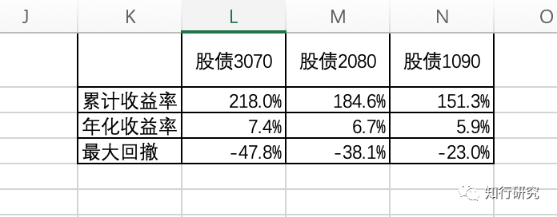
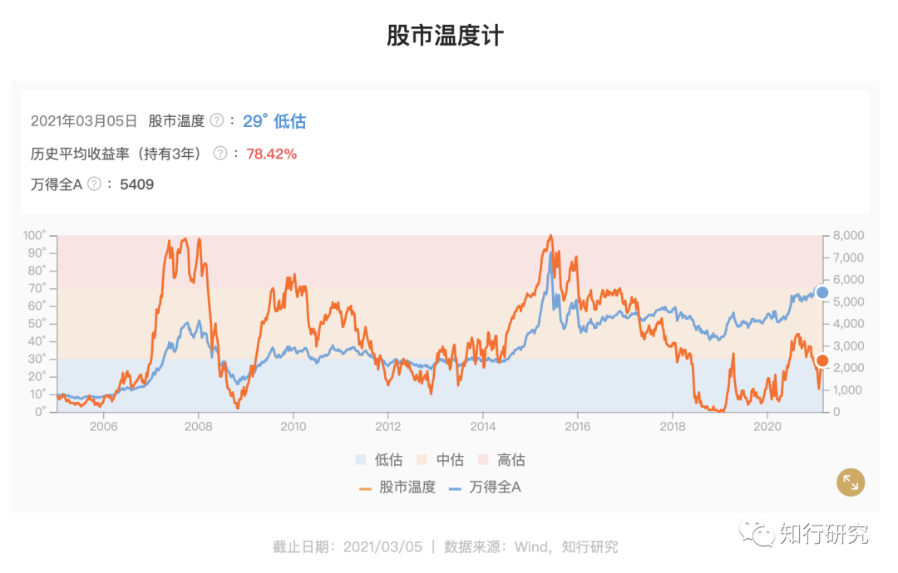

# 给一个朋友的理财方案

这周一个朋友跟我说：「我有一个朋友想理财，你能不能帮我给个方案啊？」。我明白，当一个人说我有一个朋友时，通常意味着什么😛。朋友有需求，当然要尽力而为啊。

首先我需要了解他的理财需求，才能对症下药。

通过沟通，他的可投资的资金量还挺高的，为了保密，这里假设有 1000 万，妥妥的大客户。这些资金可以用来进行长期投资，家里有充足的现金流，不会动用到这笔钱，*至少能投资 5 年以上，*用他自己的话来说，投 10 年都是没问题的。

确定了他能进行长期投资，我以为他可以做一些股票类产品的投资，可以承担很高的风险，期望获得更高的收益。但沟通后却发现不是这样的。他对回撤和下跌比较敏感，最好不超过 5%。*也就说，即便他明白股票跟其他品种相比，是长期收益最高的资产，但他心理上，承受不了股市的大涨大跌。他的投资风格相对保守的多。*

我继续询问他对收益的预期，他想了想说：「年化收益率 10%，应该难度不大吧？」

大家觉得难度大不大呢？如果仅仅是长期获得年化 10% 的收益，就还好。但如果要在*最大回撤不超过 5% 的前提下，获得年化 10% 的收益，*难度还是非常大的。

接下来我询问他有没有精力放在投资上，他表示不想操心，就想按照我的方案买入，长期获得稳健收益。

通过跟他的沟通，我觉得他更适合进行长期的大类资产配置。例如买入优质的股票基金、债券基金等长期持有。

接下来我需要确定股票、债券等资产的配置比例。为什么先考虑这个，因为股债的比例不同，最终会决定能获得多少收益，期间承受多大回撤。

先看一下过去基金的表现。

从 2005 年到现在，投资偏股混合基金指数（主动型基金）、纯债基金指数，股债比例分别是 30:70、20:80、10:90，年化收益率和最大回撤如下图所见。

可以看到，要想获得年化收益 10%，股票仓位至少要 2 成。另外，不论股票仓位是 1 成、2 成、3 成，最大回撤都很大，即便我们配置了 20% 的主动型基金、80% 的纯债基金，长期年化收益率接近 10%，但最大回撤仍有 28%。这主要是因为碰到股灾等系统性风险时，基金下跌幅度都很高，很多基金下跌幅度达到了 50%。

我又看了一下，如果不选择主动型基金，选择长期持有指数基金和纯债基金的情况。指数基金拿沪深300全收益指数做代表，由于A股主动型基金整体有超额收益，所以配置指数基金效果比主动差一些。收益低，回撤也更大。

通过上面的分析，为了实现朋友的理财需求，在制定方案时要考虑以下几点：

*1. 股债比例采用 20:80，即长期来看，股票仓位不超过 20%。*

*2. 通过优选资产提高整体收益率，尽力达到长期年化 10%。*

由于上面回测分析中配置的是偏股类主动型基金和纯债基金，要想提高收益，可以分别从这两类资产角度出发，看看如何进行收益增强。

首先，先来看下债券方面。纯债基金平均年化收益在 5% 左右，最大回撤在 4% 左右。目前市场上「固收+」产品可以替代纯债基金进行收益增强。

例如交银基金的「我要稳稳的幸福」和兴全基金的「兴全低波动小确幸」就是这类产品，它们最大回撤目标是 5%，一般会控制在 3% 以内，预期收益目标是 6%～8%。这两个产品都实盘运作的很久，公司整体实力都很强。过往来看，回撤都没超过 3%，每年都达到了预期收益目标，长期平均收益能达到 7% 左右，属于很稳健的产品。

由于朋友的资金量很大，又很保守，建议两个产品都进行配置，「我要稳稳的幸福」是纯债为主，加上打新基金和主动基金，「兴全低波动小确幸」是纯债为主，加上可转债基金和主动基金。两个产品一起配置的话，资产更分散，会更稳健。

也就是说，建议朋友将总资产的 40%（400 万）配置「我要稳稳的幸福」，40%（400 万）配置「兴全低波动小确幸」，由于这两个产品是稳健型产品，波动较小，不需要择时。现在就可以买入。

需要强调一下的是，虽然这两个产品本身有少量的股票仓位，但产品主理人是将产品中的股债标的作为一个整体去管理的，目的是控制回撤，追求绝对收益，所以我是把他们当作比纯债基金更好的替代品去看待。

其次，再看一下如何增强股票方面的收益。

从标的上选择更好的资产：最上面的回测是拿指数进行对比的，代表的是平均收益，我们挑选优秀基金经理的产品和优秀的指数增强基金，在长期能够起到增强收益的目的。例如过去所有偏股主动基金，长期年化收益是 17% 左右，优秀基金经理过去可以达到年化 20% 以上。指数增强基金跟普通指数相比，长期年化收益有一定的增强效果，不大，在 1%～2% 左右，但为了尽力提高收益，我们也可以考虑。

只不过主动基金和指数增强基金在长期管理方面，需要有人去帮忙管理。比如基金经理发生变更、规模太大增强效果打折扣等。这需要我经常帮他去关注，去调换。

另外，更关键的是，要想获得收益增强，尽力要买的价格低一点，积累一些安全边际。低买的话，获利概率更大，对收益的增强效果更明显。

股票类资产的总仓位是不超过 20%，如何分配呢？

目前市场上估值比较低、比较便宜的指数基金，可以考虑买入中证红利指数基金和中证500指数基金，在长期持有的前提下，可以配置指数增强产品，目前就可以买入 5%（50 万）的富国中证红利指数增强基金、5%（50 万）的富国中证500指数增强基金。

关于主动型基金，这两年由于抱团，涨幅过高，目前还在回调之中，建议先缓一缓，先观望观望。毕竟朋友对风险是很敏感的。我们的目标是期望买的价格不高，手里先留些子弹，控制一下风险。

建议先把剩下的 10%（100 万）的资金，放在银行活期理财里面，例如招行的朝朝宝，目前年化收益率 3% 出头，可随用随取，很方便。如果未来市场下跌较大，将 100 万分批配置到较好的主动型基金或者好的指数基金里面。

*3. 为了有效控制回撤，我们要尽量避免在系统性风险发生时承受太大的损失。*

这方面可以利用我们的股市温度计，之前的股灾发生时，都是牛市中后期，情绪高涨时，往往这个时候，市场温度很高，我们会在市场温度 70 度以上的高估区域，提醒用户慢慢减仓，如果高估时发生大幅下跌，我们会建议用户进行卖出操作，没有办法卖在最高点，但也不会承受全部回撤。以此方式期望能很好的控制回撤。

总之，通过上述方式，期望能帮助朋友达到长期的投资目标。当然，未来市场是不可预测的，但从上面的方案也能看出，通过层层拆解，我们做了充分的准备，尽力做到不预测，只应对。朋友也明白，收益和风险都是不能保证的，但看了整个的推导逻辑，他觉得清晰了很多。

以上是帮朋友梳理理财方案的思路，不知道是否对大家有所帮助。最近我在帮公司的一些伙伴梳理他们的投资情况。*深深地感觉到，帮别人出理财方案和挑选基金管理组合策略是有很大的不同的。*

对于后者来说，更多的是站在产品的角度去思考问题，哪个收益好，哪个回撤低。但帮别人出理财方案，说大点是帮别人在做财富管理，更多的是站在人的角度去思考问题，家庭财务状况如何，四笔钱如何分配，资金如何流入流出，能承受多少风险，期望达到什么目标，每个人的情况是不一样的。

当初提出的四笔钱是站在用户的角度做了简单划分，那么接下来如何能更进一步的打理大家的资产呢？这是个有意义也有挑战的事情，我们期望能做出自己的特色。

> 本文章所载信息仅供参考，不构成任何投资建议。如转载使用，请参考 [《文章转载声明》](https://youzhiyouxing.cn/agreements/ARTICLE_REPRINTED)。
