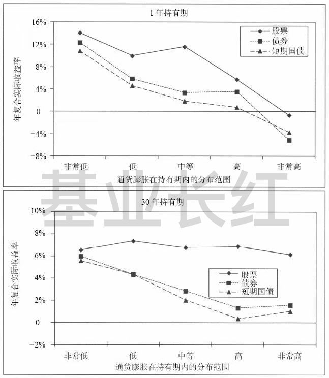

# 你是跑赢 CPI 的穷人吗？如何正确理解通货膨胀

很多人都有过这个困惑，一年下来算算投资收益率，明明跑赢了 CPI，但还是觉得钱不够花，手头紧。

为什么我们对物价的感受和 CPI 不一样？事实上，CPI 涨得快不等同于通货膨胀，由于每个人的消费结构不同，CPI 往往与你的实际情况有出入。今天知识体系上新的这篇文章，就为你一次性讲清楚：什么是CPI，怎样正确地理解通货膨胀，以及我们该如何对冲通胀风险。

祝开卷有知。

无论投资环境如何，投资者对收益有一个基本要求 —— 跑赢通胀。

理由很简单：跑不赢通胀，任你操作猛如虎，资产都是在缩水。

可仔细一想，为什么明明保本理财已经「跑赢通胀」，我们还是觉得钱不够花、需要学习投资？

或许，是我们误解了这 4 个字。

CPI (居民消费价格指数) 反映了消费价格的变动，是观察通货膨胀的重要指标。

上周国家统计局刚公布了 2019 年 12 月的 CPI 数据（注：本文发表于 2020 年 1 月 14 日）：

全国居民消费价格同比上涨 4.5%

我们可以简单粗暴地理解为：如果收益率低于 4.5%，那么你的资产实际上缩水了。

想要达到 4.5% 收益难吗？

难，也不难。

说难，因为以余额宝为代表的货币基金，收益已经赶不上这个数了。

说不难，因为银行有不少理财产品以「跑赢 CPI」为卖点，不难买。

问题是，通过理财产品跑赢 CPI 就够了吗？

当然不够。

一个重要原因是：CPI 代表不了我们的个人消费结构。

国家统计局在《CPI 数据为什么与公众的感受不一致？》提到过：

各种商品和服务项目的权数对分类指数、总指数的影响程度不同。

而权数的确定是一个地方总体消费结构所决定的，和个人的消费结构可能很不一致。

划重点：*消费结构。*

举个例子，油价上涨时，车主的感受远比其他人强烈，但「平均」下来的 CPI 可能不那么明显。

又比如，抽烟的人对烟草涨价会有感知，但不抽烟的人几乎不受影响，这就是消费结构的差异。

了解指数基金的同学，想必听说过「必需消费」和「可选消费」。

*「必需消费品」*是需求弹性较低的商品，比如*农牧渔产品和食品饮料。*生活中少不了鸡鸭鱼猪牛羊和柴米油盐酱醋茶，所以价格涨跌对这些商品的需求量影响较小。近期的一大典型就是猪肉 —— 嘴上都说吃不起，销量不见得会下降。

以*手机、汽车和家用电器*为代表的*「可选消费品」*与之相反，需求弹性较高。不过，随着经济环境提升，可选消费品在咱们家庭生活支出里的比重越来越大。比如你现在手里拿着的手机，虽然算「可选」，但几乎人手一台，还越买越贵。

有些隐蔽的可选消费品常常被大家忽略，比如孩子*上兴趣班和补习班的学费。*现代家庭花在孩子身上的钱越来越多，兴趣班和补习班也随着「起跑线论」成为了某种意义上的刚需。这种费用我甚至不确定是否有纳入 CPI，毕竟不少补习班还是以老师开小灶的方式，悄悄进行的。

除此之外，让你沦为「跑赢 CPI 的穷人」的另一个因素是：*房价*。编制规则清晰表明：*商品房的购房价格不在CPI考虑范围。*可现实是，购房是许多家庭要办的一件大事，甚至是许多人一生最大的一次支出。如果把学区房的溢价考虑进去，房价的影响就更大了。

我们对物价的感受和 CPI 不一样，关键在于消费结构的差异。CPI 是按一定权重计算出来的平均结果，就像我们常常吐槽的「平均工资」一样，往往和个人相去甚远。可选消费品和未被纳入CPI的支出，进一步扩大了这种差异，所以 —— 跑赢CPI，解决不了你资产缩水的问题。

许多人把通货膨胀等同于 CPI 涨得快，这是不对的。国家统计局在官网有专门撰文解释，反映物价变化的CPI虽然是观察通胀的重要指标，却不是通货膨胀本身。通货膨胀，是指货币发行量超过流通中实际所需量而引起的货币贬值现象（可参考国家统计局官网《[CPI 与通货膨胀有什么关系？](http://www.stats.gov.cn/ztjc/tjzs/zjcpi/201106/t20110613_71508.html)》）

重点在于 4 个字：*货币贬值*。

资产大致可以分为 4 个大类：

1. 权益类资产，以股票指数基金为代表2. 债权类资产，以利率债指数基金为代表3. 大宗商品和REITs，以黄金、原油和REITs为代表4. 现金，以货币基金为代表

现金只保持 5% 的最小比例，可我却一直留着，为什么？因为货币 (现金) 和其他资产的相对价值，是有意义的 —— *货币本身，就是一类资产。*

当我们把货币当作一类资产时，问题就变得简单了：某一资产发生贬值时，持有其他资产可以对冲这个风险。现在这个「某一资产」等于货币，「贬值风险」就是通货膨胀。

可是新问题又来了：哪一类资产对冲通胀效果最好？

西格尔教授在《股市长线法宝》中，用 142 年的数据为我们找到了答案。

下图展示的是 1871 年~2012 年的股票、债券与短期国债在 1 年及 30 年持有期内，经通过膨胀调整后的年复合平均收益率：

持有期收益与通货膨胀 （1871 年~2012 年）数据来源：杰里米·西格尔，《股市长线法宝》

在*短期内*（持有 1 年）股票、债券和短期国债都很难有效地对冲通货膨胀风险。但是*从长期来看*（持有 30 年），*股票的实际收益率几乎不受通胀影响*，而债券收益率被远远抛在后面。

西格尔教授解释道：

股票代表着对真实资产盈利的要求权。二战后是有史以来通胀最严重的时期，而股票的实际收益率并不低于此前150年……股票在通胀时期保持购买力的能力，让其成为一种通货膨胀的套期保值工具。

西格尔教授并不是第一个做出类似研究的人。

早在 1924 年，埃德加·史密斯在《普通股长期投资》中以美国内战至 20 世纪初的数据证明：

无论物价是上涨还是下跌，股票的表现都优于债券。

而西格尔教授用更全面的数据重新验证，这个结论依然有效。

看到这里，或许会有同学疑惑：

「民间保值神器」黄金不是更好吗？

当然不是。

看过我之前写的《[210 年，资产收益率的前世今生](https://mp.weixin.qq.com/s/owScPAzOsFGGbBO8jUnrSA)》就会知道，黄金连跑赢通胀都勉强，论收益更是被股票和债券甩开一大截……别跟我说什么「盛世翡翠乱世黄金」，文中的数据囊括 1802 年~2012 年，两次世界大战都在其中了，你还需要多乱的乱世？

洋洋洒洒展开了不少，我把关键点浓缩为 3 条：

因为每个人的消费结构不同，CPI 往往和你的实际有出入； 加上房价因素，跑赢 CPI 你也可能资产缩水，沦为「跑赢 CPI 的穷人」； 长期的通货膨胀风险，完全可以通过股权类资产对冲。

希望对你有所启发。

> 来源：公众号「基业长红」转载文章发表的所有信息仅代表作者个人观点，不对您构成任何投资建议，详见[《文章免责声明》](https://youzhiyouxing.cn/agreements/ARTICLE_DISCLAIMER)。
