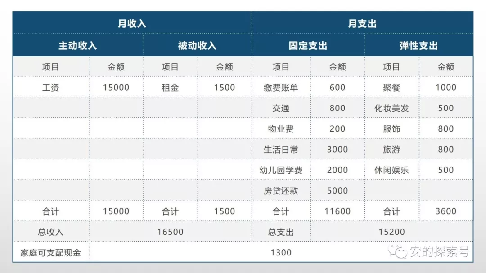
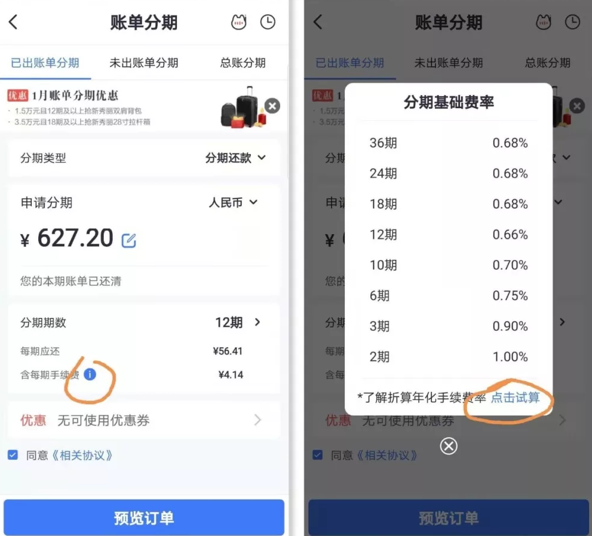

# 家庭理财第一步：梳理家庭财务

最近很多朋友都问我关于投资理财的问题：

* 安安妈，房产还值得投资吗？泰国房产值得买吗？
* 安安妈，什么是指数定投，每月固定投一部分钱，就肯定能赚钱吗？
* 安安妈，我想给家人买些保险，但是不知道怎么选，你能不能帮我看看？
* 安安妈，我家里有一些闲钱，但是不知道怎么理财，你有没有什么推荐的理财产品？

安安妈，房产还值得投资吗？泰国房产值得买吗？

安安妈，什么是指数定投，每月固定投一部分钱，就肯定能赚钱吗？

安安妈，我想给家人买些保险，但是不知道怎么选，你能不能帮我看看？

安安妈，我家里有一些闲钱，但是不知道怎么理财，你有没有什么推荐的理财产品？

面对这些问题，我内心的想法是：我无法告诉你具体该买哪种产品，我能做的，是把我认为正确的理财观念、理财方法分享出来。

大家都直接把问题直接简化到了买什么产品，而忽略了理财最重要的第一步，就是梳理家庭财务情况。

一上来就问投资投什么，买什么产品？这个问题，你问谁都回答不了。

因为要回答这个问题，背后需要先梳理一系列的问题，比如：

## 1、你处在什么样的人生阶段？

不同人生阶段，风险承受能力不一样，收入支出模式不一样，理财方式也不一样。

## 2、你真的知道你有多少钱可以用来投资吗？

* 你以为你银行卡余额减去每月贷款，剩下的都可以理财吗？
* 你的家庭保障都完善吗？每月需要多少流动资金清楚吗？
* 你家庭的收入结构和支出结构你都了解吗？

你以为你银行卡余额减去每月贷款，剩下的都可以理财吗？

你的家庭保障都完善吗？每月需要多少流动资金清楚吗？

你家庭的收入结构和支出结构你都了解吗？

## 3、你是什么样投资风格的人？

只有了解自己的风险承受能力和风险承受意愿，才能找到适合自己的投资方式，才不至于盲目投资，每天焦虑。

## 4、你知道怎么设置合理的理财收益目标和投资期限吗？

理财最终是为家庭生活服务的，围绕你的家庭规划，才能设置合理的理财收益目标和不同产品的投资期限。

只有梳理了上面这些问题，你才能开始设置理财方案，才能开始去做所谓的资产配置。

今天，我要分享的就是对所有人来说**最重要却最容易忽视的一环，梳理家庭财务情况。**

可能有些小伙伴有记账的习惯，这样很好。但是大多数人怕麻烦，于是钱不知不觉的就花掉了，觉得反正够花就行了。

如果你想理财，就一定要知道一个家庭每个月的收支情况，这样，你才能知道有多少钱可以拿来理财。

如果你已经有一定的积蓄，那么了解家庭开支情况和开支规律，有助于你了解你的存款中有多少是需要用作备用流动资金的，剩下的就可以用于理财，而**不必担心中途取出来应急。**

做企业的都知道企业需要做账，有三张表：利润表、资产负债表和现金流量表。

那么一个家庭的财务情况可以通过一张表格反映出来，叫做**家庭现金流表：**

## 1、合理的收入结构是避免中年危机的关键

什么是主动收入？

很好理解，主动收入就是你付出劳动获得的收入，比如工资收入，兼职收入、经营小店的收入等等。

什么是被动收入？

被动收入就是「躺赚」或「睡后收入」，比如租金，理财收入。简单说就是钱生钱的部分。

把收入分为主动收入和被动收入，就是要你清楚地知道家庭的收入结构。

可能很多人认为高收入可以带来安全感，所以拼命追求高工资，这无可厚非。但是我认为，**高收入不能带来安全感，合理的收入结构才能带来安全感。**

因为不管你现在能赚多少，如果收入结构中大部分是主动收入的话，如果有一天，公司或个人健康出现任何状况，现在看起来安稳的家庭财务状况，分分钟就破灭。

这也是为什么会出现中年危机。

**35～45 岁，是一个人劳动价值的顶峰时期，如果在这个阶段，不能逐步改变家庭的收入结构，那么走下坡路是必然的事情。**

## 2、健康的消费观的关键在于控制弹性支出

什么是固定支出？

固定支出就是家庭必须的开支，不支出就无法生活和工作的开支：比如水电物业费、交通费、日常吃用开支，小孩的教育、奶粉、尿不湿等。

什么是弹性支出？

弹性支出就是可花可不花以及可多花可少花的开支。比如出去吃一顿火锅，看一场电影就属于可花可不花的开支；衣服化妆品就属于可多花可少花的开支。

把家庭支出分为固定支出和弹性支出，你才能知道：为什么你会月光？哪些开支项目是不必要的，哪些是可以少开支的？

这样才能逐步增加可理财的现金，逐步提高被动收入的比例。记住，**只有弹性支出才是你需要关注和控制的部分。**

说到控制弹性支出，很多小伙伴会有困惑，会觉得很难，特别是现在各种信用卡、花呗、微信支付、分期支付这么方便，很容易闭着眼睛就花了。

* 你以为买杯饮料 20 块没多少钱，每天喝，一年就能花掉 7000 多，是很多人一个月的工资；
* 你以为每周出去吃一顿 300 块没多少钱，一年下来就花了超过 15,000 ，是很多人两个月的工资；
* 你觉得每周出去周边旅游一次没多少钱，一次住宿交通门票吃饭等各种费用不少于 800，一个月两次就 1,600，一年就是 19,200。

你以为买杯饮料 20 块没多少钱，每天喝，一年就能花掉 7000 多，是很多人一个月的工资；

你以为每周出去吃一顿 300 块没多少钱，一年下来就花了超过 15,000 ，是很多人两个月的工资；

你觉得每周出去周边旅游一次没多少钱，一次住宿交通门票吃饭等各种费用不少于 800，一个月两次就 1,600，一年就是 19,200。

有了小孩后，一些细小花费，比如玩一次游乐场、买些可有可无的小玩具、小零食，更是以看不见的速度流走。

那怎么办呢？怎么控制弹性支出呢？

在你梳理了收入支出现金流表之后，就能清楚的知道你每年每个月在弹性支出方面能支出的最大限额是多少。

如果你希望有更多的钱理财，就必须尽可能缩减弹性支出。

你可以**给弹性支出中比较大的项目设置一个合理的月度消费额预算，**比如外出聚餐，化妆品、服饰，旅游等项目。

把这些项目预算放在显眼的位置，比如床头、办公桌，手机桌面上，这样每次想消费的时候，看看这个月的额度还有没有。

把你的银行卡分为收入卡，和支出卡。每个月往支出卡里转不超过支出预算的数额，每个月只花支出卡里的钱。

可能有些小伙伴会说，这个不现实，我们都用信用卡花呗，不用储蓄卡消费啊。

其实，方法一和方法二的目的是为了培养你良好的消费习惯，**等你懂得控制欲望，控制消费，形成良好的消费习惯后，再用信用卡和花呗。**

为什么一定要这样呢？

因为，在没有良好的消费习惯前提下，用信用卡和花呗，**很容易超前消费而不自知，**等需要还款的时候，就不得不走上消费贷和分期还款的不归路，慢慢的就变成了「月光分期」一族。

而分期还款的费率，根本不是你认为的那样低廉。

## 3、尽早告别分期生活

现在很多年轻人，为了所谓的精致生活，在各种消费贷，分期付款的诱惑下，过上了「小负翁」的生活。如果不改变消费方式，尽早摆脱分期生活，成家之后也很难有积蓄，何谈理财呢？

我的一个健身教练，人特别专业，服务态度也很好，一个月收入一万五左右，31 岁，结婚了，但是不敢要小孩。我问他为什么？他给我看了看他每个月需要还贷的账单。

他每个月还完房贷，车贷，还有各种消费贷后，根本没有剩余。但是生活品质要求还很高。新房子装修要花钱，怎么办，消费贷呗；电器要买全套智能家居，怎么办？刷卡分期呗。

所以，每个月他的工资都没有任何结余，还背负了一身负债，几张信用卡、微粒贷等各种网贷，各种分期付款，信用卡之间来回倒腾，疲于奔命。

信用卡分期付款的利率到底有多高呢？

我可以毫不夸张的说是：14～18%

你可能会说，没那么夸张吧，不是每期费率是 0.7% 左右吗？

一部手机 4,500 元，分期嘛，每月手续费 31.5 元，一年 378，好像没什么。

旅游一次 12,000 元，分期嘛，每个月手续费 84 元，一年 1,008，好像没多少。

**日费率，月费率，12 期总手续费率，这些概念，统统都是误导性的，一定要折算为年化利率才可比。**那么年化利率怎么算呢？

以 12,000 元，分 12 期，0.7% 的月费率计算（月还款 1,000 元本金，84 元手续费），年利率是 1008/12000= 8.4% 吗？

当然不是！

因为你不是第十二个月才还本金，你是每个月都在还本金。

在第十二个月的时候，你只欠银行 1,000 元，但是银行却还是按照 12,000 的本金收取了 84 元。

这个时候正确的算法应该是算这十二个月现金流的内部收益率（IRR）：0.7% 的月费率，折算为正确的年化利率是 15.16%。

那么你不会算怎么办呢？不用担心，银行都告诉你了。

大部分银行分期的时候都有「点击试算」告诉你真实的年化利率是多少，但是很隐蔽，很多人不知道。

你想想，现在什么理财投资能保稳有 15% 的年收益率？

所以如果陷入了分期生活，而你的收入又没有短期大幅增长的话，债务就会滚雪球般越滚越大。

有些小伙伴会说，我知道分期的费率很高啊，所以我只选择那些免息的分期消费，比如白条有很多产品都提供免息分期。

我想说，你很精明。但是，白条之所以提供这样的方式，目的就是培养你分期消费、超前消费的习惯。

当你形成分期消费的习惯后，就很难控制自己的消费欲望了。

梳理完了之后，当然是攒钱了。攒下你的第一个一万，两万，十万，为家庭理财打下一个健康的基础。

控制支出，并不一定会降低生活品质。节流的目的是为了更好的开源。

通过控制弹性支出攒下的钱，才可以帮助我们慢慢提高被动收入的比例，形成健康的收入结构。

记住，**一个不懂得控制欲望的人，永远都无法财务自由。**

在此基础上，我们再慢慢讲，如何做好家庭保障，认识金融市场的基本结构，了解一些基础的理财产品，比如债券基金股票等，了解不同资产类别的风险收益特征，了解什么叫做资产配置。

最后，分享一个记账小工具，就是支付宝的「账单」功能，你只需要每次大额消费的时候记得正确归类，它自动记账，自动展示各类别的支出统计图，这样，你就可以轻松比较每个月的各类别的消费情况，做到消费心中有数，逐步摆脱冲动消费。

为了方便每个月统计，建议消费的时候都用一个出口，这样，家庭账单一目了然。

> 来源：公众号「安的探索号」转载文章发表的所有信息仅代表作者个人观点，不对您构成任何投资建议，详见[《文章免责声明》](https://youzhiyouxing.cn/agreements/ARTICLE_DISCLAIMER)。
