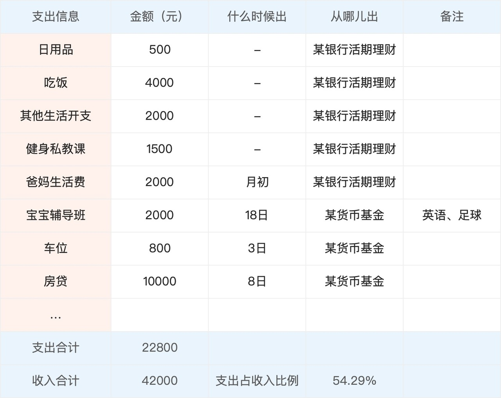

# 日常开支的钱该怎么规划？

高流动性，随时要用，活钱简直是天然为日常开支量身打造的：

房贷、房租、车贷、生活费，从哪出？总不能把股票基金卖了吧，万一亏着呢？

准备一笔随时可用的资金，来支付这些固定支出项目，应该是大部分人都会做的事。只不过，以前大部分人是把这些日常开支的钱放在银行活期存款，现在变成了货币基金、银行活期理财等等。

不过，别小看日常开支，留多少，怎么留也不简单。

最重要的是要**做好预算**，仔细算算自己日常开支到底有多少，未来有哪些可预计的支出项目。

以下面这张图为例，这是一张普通一线城市家庭的每月开支预算表。我们需要关注的是金额、支出时间（什么时候出）、支出来源（从哪儿出）。一些难以确定具体金额的项目，不需要追求绝对的精确，可以接受 20% 左右的浮动。

对于支出时间不太确定的支出项目，比如日用品、吃饭，这个家庭选择了取出时间更加灵活的银行活期理财。像每月有固定支出时间的项目，比如房贷，这个家庭选择的则是货币基金，走快速赎回或者提前一个交易日赎回，也很方便。

这样做还有附加的好处，**对自己的日常开支有个数，能控制住额外消费欲望**。很多人平时不做预算，月底一看账单，发现自己不知不觉就花了很多钱。就像很多企业运营压力大，并不是因为业务不好、盈利不好，而是因为资金链出问题了，比如过度扩张，导致没有充足的钱应对银行账款、员工工资等日常开支。

另外，通过预算结果，我们还可以进行一些数据分析。比如大家可能知道恩格尔系数，即食品消费的支出占家庭总支出或总收入的比例。 国际上常常用恩格尔系数来衡量一个国家和地区人民生活水平的状况。

类似的，我们也可以**检查日常开支占我们总收入的比例**，如果这个比例过大，说明我们该节流或者开源了。像上面例子中的家庭，每月支出占收入比例约为 55%，支出压力适中。

在做好预算后，我们可以留下 1～2 个月的日常开支。其他的钱能承受更久的投资期限，用来追求更高的收益率，我们可以考虑放入稳健理财或者长期投资。

> 本文章所载信息仅供参考，不构成任何投资建议。如转载使用，请参考 [《文章转载声明》](https://youzhiyouxing.cn/agreements/ARTICLE_REPRINTED)
