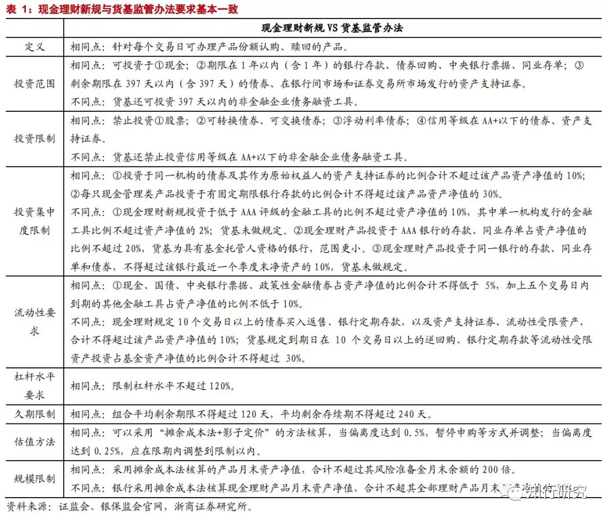
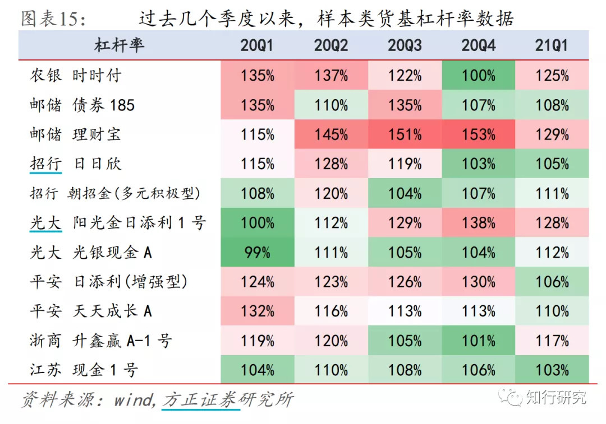

# 收益高过货币基金？聊聊如何挑选银行活期理财

理财如战场，虽然没有硝烟，没有兵戈厮杀，但也处处危机四伏。

而各种理财产品，就像是战场上士兵的各种武器。了解这些武器的特点，有助于我们在合适的场景，使用合适的「武器」。

活钱管理产品虽然看起来收益低，但却是最基础的武器，使用场景非常广泛。

今天，我们就将介绍一种活钱管理产品——银行活期理财。

银行活期理财，指的是由商业银行或者银行理财子公司发行的，每个交易日可办理份额认购、赎回，主要采用「摊余成本法」估值的理财产品。

由于其「类现金」的特点，这类产品又称「银行现金理财」或「现金理财」。

*要了解银行活期理财，不可不知的是 2021 年 6 月由银保监会、央行联合发布的《关于规范现金管理类理财产品有关事项的通知》*（后简称「新规」）。

这个规定，以 2022 年底为限，将银行活期理财划分成为新规前后特征不同的两种产品。

因为距离 2022 年底还有一段时间，我们现在如果购买银行活期理财，依旧是偏向前者的特征。

在下文中，我将同时介绍新规前后的两种产品。

一个产品的收益风险特征，离不开它的底层投资资产。

*在现金管理类产品新规实施之前，银行活期理财的投资范围是比较广的。*

相比货币基金只能投资期限一年以内的货币市场工具，银行活期理财还能投资众多风险更高、久期更长、利率也更高的非货币市场工具类资产，比如二级资本债、永续债、同业借款、私募资管产品等等。

要知道，*活钱管理产品普遍采用的都是「持有到期策略」，主要收益来源就是票息收益。*

银行活期理财，除了和货币基金一样，投资于货币市场工具，还能够选择风险更高、利率更高的其他债权资产。*相应地，银行活期理财能够获取更高的票息收益。*

*另外，银行活期理财的杠杆率限制原本也比货币基金宽松。*

我们都知道，增加产品杠杆可以提高产品收益率。货币基金的现行杠杆率限制是不超过120%，而不少银行活期理财过去实际的杠杆率是超过这个水平的。

由于这两个主要原因，*银行活期理财过去的实际收益普遍水平高于同期货币基金*：

比如 2020 年，银行活期理财的平均七日年化收益率平均在 3% 以上，显著高于同期货币基金 2.5% 的平均七日年化收益率。

看到这里，你也许有点担心了，银行活期理财底层资产风险似乎相比货币基金高？那是不是说明银行活期理财的风险就要比货币基金高很多？

不是的。

首先，由于要应对每日大量的份额认购、赎回，银行活期理财也不会选择期限太长、风险太高的投资标的。

同时，刚刚提到了，银行活期理财的投资策略和货币基金一样，是「持有到期策略」。

这就意味着，只要不发生信用风险，比如违约，银行活期理财基本上都能如约收回本金和利息。再加上其投资一般都较为分散，即使发生了概率极小的信用风险事件，对其收益的影响也不大。

另外，除了少部分净值产品外，大部分银行活期理财的收益计算方式也和货币基金一样，使用我们多次介绍过的*「摊余成本法」* 。

由于银行活钱理财持有资产风险较低，所以，尽管这些资产的票息收益也许尚未实现，它也会提前将其收益预估出来，平摊到每日，提前支付给投资者。

*因此，尽管投资范围和杠杆率更宽松，新规实施前的银行活期理财风险仅稍微比货币基金高一些。只有部分极端情况，才会发生亏损。*

前面我们了解到，银行活期理财在投资范围、杠杆率上的监管其实是较为模糊的。

比如，不少银行活期理财会投资的私募资管产品，我们其实很难穿透其底层资产情况，界定其风险。虽然过去违约发生的情况极少，但难以预估其未来风险情况。

为了弥补监管的空白，银保监会、央行先后在 2019 年 12 月和 2020 年的 6 月发布了《关于规范现金管理类理财产品有关事项的通知（征求意见稿）》及其正式稿，明确了「现金管理类理财产品」的定义，具化了其监管要求。

其中，相比「新规」前，这类产品监管要求最主要的变化集中在投资范围、杠杆率、流动性规则上。*这些要求几乎和货币基金的现行要求一致*：

*这也意味着，银行活期理财原本使用的信用下沉、长久期和增加杠杆的策略不能持续。*

最迟在 2022 年底，其收益率会十分接近货币基金的水平。

而从现在到 2022 年底期间，银行活期理财收益优势将与货币基金逐步缩小。

事实上，甚至在新规正式稿发布前的 2020 年一季度，据方正证券研究所统计，有许多产品就已经开始按照征求意见稿的内容主动降杠杆，将杠杆率控制在 120%附近及以下。

说了那么多，作为一类不输货币基金的活钱管理工具，普通投资者最关注应该还是怎么挑选银行活期理财：

*第一，我们先需要准确的从银行琳琅满目的货架上识别出银行活期理财。*

大家别觉得这个问题愚蠢，实际上不少人分辨不清究竟哪些银行理财产品是银行活期理财。

一般来说，为了与其他产品进行区别，银行会将这类产品分类在理财产品的「现金」、「货币」、「活期」等板块下。

*第二，我们需要关注银行或者银行理财子公司的资管能力。*

虽然银行活期理财的亏损风险小，但由于其底层资产相对不那么透明，选择资管能力更强的银行或者银行理财子公司也十分重要。

对普通人来说，获取并辨别银行的风控能力、人均管理规模、业务独立性等专业指标并不现实。

但我们可以关注银行的理财产品成熟度，比如理财产品线种类、数量、信息透明度、信息规范化等等。

甚至一个银行是不是很用心的在做产品的展示页面，也体现了其是否在意客户投资体验以及客户的投资安全性，可以纳入考虑。

*第三，看收益率和收益率稳定性。*

前面说了，银行活期理财主要是使用摊余成本法估值。

所以，其收益一般用最近 7 个自然日计算的复合年化收益率——「七日年化收益率」，以及每日持有 1 万元该产品的实际收益「万份收益」展示。

但和货币基金一样，我们不能只看「七日年化收益率」和「万份收益」。毕竟这两个指标高只能说明其短期收益情况，不代表未来的收益就能永远这么好。

尤其是年中、年底资金面紧张时，不少银行活期理财也会大幅拉高短期业绩，但这种短期高收益并不可持续的。

所以，我们需要查看过去较长一段时间（一个月左右）的收益表现，来确定其收益是否稳定。

> 来源：公众号「知行研究」本文章所载信息仅供参考，不构成任何投资建议。如转载使用，请参考[《文章转载声明》](https://youzhiyouxing.cn/agreements/ARTICLE_REPRINTED)
