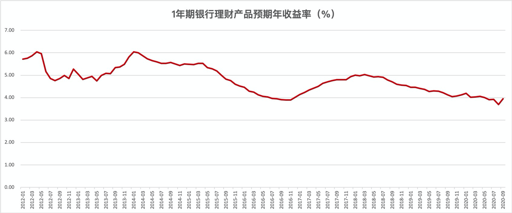

# 战胜银行理财

市场上稳健理财产品很多，银行、信托、保险资管、券商资管、基金公司等机构都有布局。那大家该如何挑选呢？既然稳健理财是以绝对收益为目标，那么这个目标该如何确定呢？

事实上，大家一直都对稳健理财有需求。只不过时代不一样，可投资产品不一样，每一代人的选择不同。

对于我们父母一辈而言，年轻时候的理财方式很少，以银行活期、定期存款等储蓄为主，有些还去购买国债。

后来伴随着财富的增长，人们已经不甘心只获得较低的存款利息了，对于财产保值增值的需求日益增加。但是大多数人风险偏好较低，对于产品收益波动较为敏感，所以人们很需要一种低门槛、低风险、高收益的理财产品。

这个时候，银行理财开始出现了。第一只银行理财产品是 2004 年光大银行发行的「阳光理财B计划」。

银行理财的目标是战胜存款利率，它的出现让稳健理财有了更好的选择。收益提升了，那么需要承担额外的风险吗？并没有。因为银行理财在相当长的时间里是进行刚兑的，产品会按照约定收益率进行支付，再加上银行有国家背书，对于人们来说，银行理财风险极低。这也带动了银行理财市场规模的扩张。

刚兑的文化在理财市场逐步扩张起来，信托、保险资管、券商资管发行了很多稳健型的刚兑的产品。人们的选择范围更广了。但对于普通用户来说，银行理财仍旧是稳健理财的主要选择。

后来 P2P 开始兴起，野蛮生长。P2P 承诺的收益率远远高于银行理财，也是刚兑，很多人都把稳健理财的资金投入了 P2P，对银行理财等产品造成了很大冲击。

看上去「刚兑」非常美好，承诺投资者能够赚取很高的无风险收益，但这背后隐藏着巨大的风险，对理财机构的资金链造成了极大的压力。2018 年，监管开始出台资管新规，专门对打破刚性兑付作出了要求，要求金融机构对产品实行净值化，反应所投资标的的真实收益情况，引导大家接受「卖者尽责、买者自负」的理念。

站在当下，稳健理财面对的市场是什么样子呢？P2P 就不用说了，大量 P2P 公司承受不了高收益的兑付，不断暴雷、清盘、跑路，逐步退出舞台。银行理财、信托等正在进行净值化转型。「普益标准」的数据显示，截至 2020 年 2 季度，银行理财净值化转型进程已由资管新规前的 15% 大幅提升至 53.82%。

收益率方面，随着市场利率下行，银行理财的预期收益率也不断下滑。万得数据显示，1 年期银行理财产品预期年收益率已经下滑到 4% 附近（见下图）。

刚兑的打破，收益率的下滑，意味着市场需求和供给再次发生了变化。

对于产品供给方来说，银行等机构不能保本保收益了，必须跟其他资管机构例如基金公司等一起 PK 投资能力。

对于产品需求方，也就是用户来说，现在传统的银行理财的收益率越来越低了，还不保本，已经不满足自己的收益目标了。为了达到自己的收益目标，用户可以选择承受一定的风险。

在这种背景下，稳健理财里又兴起了一种「固收+」策略的产品，传统的理财产品主要是投资固收类资产，「固收+」策略则是固收打底，同时少量配置一些高收益的资产，希望通过承受较小的风险来追求更高的收益。

基于现在的背景，我们的稳健理财会在「固收+」策略产品里进行选择，收益目标是战胜银行理财。

> 本文章所载信息仅供参考，不构成任何投资建议。如转载使用，请参考 [《文章转载声明》](https://youzhiyouxing.cn/agreements/ARTICLE_REPRINTED)
