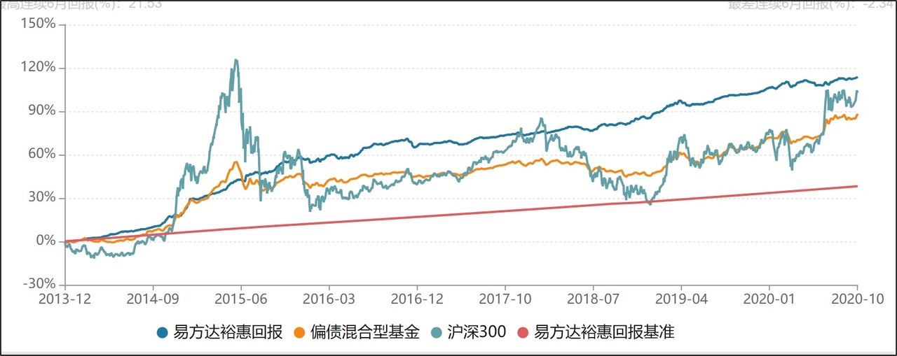

# 稳健理财的魅力在哪儿？

我们当中有很多人，由于不想自己的资产贬值，愿意进行投资理财，但又不希望冒太大的风险。这一类投资者会更倾向稳健的理财产品，风险小一点，收益少一点也没关系。

即便是能承受高风险的人们，有些资金能投资的期限也很短，例如有一笔钱现在可以拿出来投资，但是未来两年可能要用它去旅游，或者未来一年要拿来付买房首付。

由于投资期限较短，也会倾向于稳健的理财产品。

那么「稳健理财」的稳健如何定义呢？

一方面是**收益的实现概率要高，**另一方面是**要控制住风险。**

所以我们在挑选「稳健理财」时，主要挑选以绝对收益为目标的产品。什么是绝对收益呢？

绝对收益追求的是绝对的正收益。无论市场涨跌，绝对收益都期望追求资金的安全性，在控制最大回撤的基础之上以正收益为目标，不与任何其他基准进行比较。

我们常接触的很多理财产品，尤其是大多数基金都是以相对收益为目标的，这些产品的目标是战胜市场指数，例如沪深 300 。如果赶上市场是长时间的熊市，这些产品也会经历长时间的亏损。

绝对收益则不与市场指数进行比较，而是以某个确定的收益率为业绩比较基准。例如现在很多银行理财产品的预期收益率在 4% 左右，无论市场涨跌，都期望能达到目标。

当然，以绝对收益为投资目标，并不保本，也不保证绝对收益，更多的是用目标来指导投资操作。

在努力达到目标的过程中，「稳健理财」还要控制风险，主要是控制最大回撤。最大回撤是衡量产品风险的重要指标，可理解为可能发生的最大亏损幅度。最大回撤的数值越小越好，越大说明风险越大。现在市场上的稳健理财产品一般都需要把最大回撤控制在 5% 以内。

我们拿市场上一只追求绝对收益的基金举例，这只基金的业绩基准是：三年期银行定期整存整取存款利率(税后)+ 1.75%，按照现在的利率水平，这只基金每年的收益目标是 4.5% ，实际上这只基金近 5 年的年化收益率达到 7% 左右。

从历史走势图上也能看出，这只基金的走势很平稳，最大回撤也在 4% 左右。虽然每一年的收益率并不高，但这种稳稳向上的状态会让人们很安心。

这就是「稳健理财」的魅力所在，「行稳方能致远」。

> 本文章所载信息仅供参考，不构成任何投资建议。如转载使用，请参考 [《文章转载声明》](https://youzhiyouxing.cn/agreements/ARTICLE_REPRINTED)
