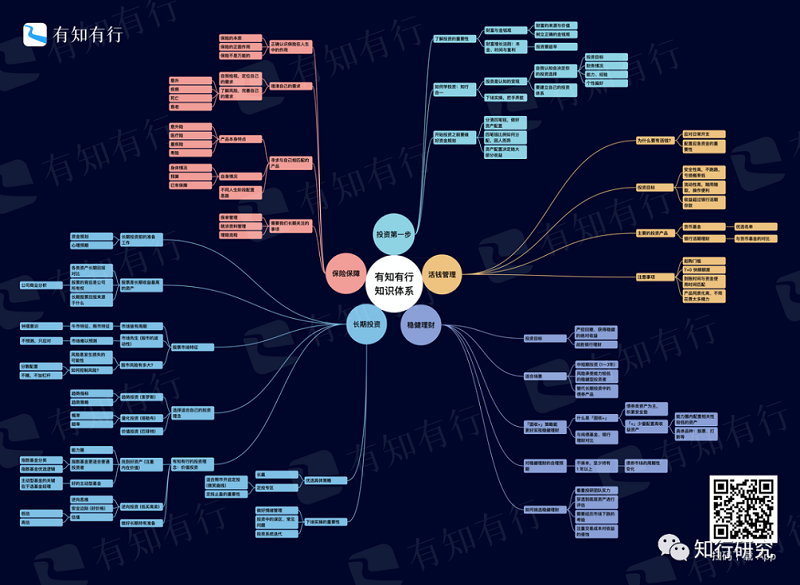

# 债券基金（一）：债券的基本常识

知识体系更新从来不是一件容易的事情，每周我们需要花大量时间精力围绕体系去寻找和自产内容。时常关注知识体系的用户可能已经发现，目前我们大部分都填充得差不多了，剩下的大多是很难找、需要自产的内容。

例如四笔钱之一的稳健理财板块，里面涉及的债券、债券市场、债券基金、打新基金等相关的内容，相比股票类资产来说，很少，而且很多内容理解门槛很高。问问我们考基金从业的同事们，债券部分对于他们来说，都是最难的。

所以我一直都在纠结，这类的内容，普通投资者要不要理解，需要理解到什么程度。毕竟普通投资者大多都不会直接参与债市，对大家来说，债券收益也不高，需要付出很多精力学习么？

但债券作为重要的大类资产，在我们的财富管理中具有稳定器的作用，我们平常接触的存款、货币基金、银行理财、债券基金等，主要的底层资产都是债券。我觉得大家还是需要对债券、债券市场的基本知识有所了解的。所以接下来我会开展一个小的专题内容，这期先简单介绍一下债市，后续会重点介绍一下债券基金。

债券，是政府、企业、银行等债务人为筹集资金，按照法定程序发行并向债券持有人承诺于指定日期还本付息的有价证券。

债券的品种很多，比如，固定利率债券的发行人将承诺每年向债券持有人支付一定固定数额的利息，浮动利率债券则以当期的市场利率为基础支付利息，利息是浮动的。

*虽然债券的品种多样，但实质上，债券就是一种债权凭证，债券持有人与债券发行人是债权债务关系。*债券发行人即债务人，债券持有人即债权人。

再通俗点，债券发行人通过发行债券，向债券持有人筹措资金，承诺还本付息，筹措的资金主要参与社会财富创造，例如国家发行国债来支持国家基础设施建设、公司发行公司债来筹集资金开展业务等。所以债券具有融资功能。*债券投资者作为债券持有人，通过投资债券参与财富创造，享受投资收益。*

对于投资者而言，理解债券需要搞清以下几个问题：谁向谁借钱？借多长时间？借钱的代价是多少？能够借钱不还吗？

## 1. 债券发行人

债券发行人是资金的借入者，是债券的债务人。投资者需要明确债券的发行人是谁，是不是具有还本付息的能力。

常见的政府债券（国债、地方政府债）、金融债券、公司（企业）债券就是按照发行人来分类的。

其中，政府债券、金融债券由于是政府、银行等金融机构发行的，信用风险很低，这些债券价格主要是由利率来决定，又被称为 [利率债](https://youzhiyouxing.cn/n/materials/802)；公司（企业）债券由于是股份制公司或者非股份制企业发行，其价格主要由发行人信用决定，存在信用风险，又被称为*信用债。*

通过债券发行人的范围能够看出，债券作为融资工具，跟股票相比，发行人更为广泛，不论是国家、地方政府、金融机构、股份制公司，甚至有些非股份制企业都可以发行债券。这也决定了债券及债券市场在金融市场中的地位还是非常重要的。

## 2. 面值及票面利率

债券面值，是债券发行人在债券到期后应偿还的本金数额，也是发行人向债券持有人按期支付利息的计算依据。在我国，债券面值通常是 100 元。

*票面利率是指债券利息与债券面值的比率，一只债券的票面利率决定了能获得多少债券利息。*票面利率就是借钱的成本。例如：一只债券，面值为 100 元，票面利率为 5%，每年付息一次，则投资者在每年付息日可得到利息 100 × 5% = 5 元。

债券票面利率的高低如何确定呢？这主要受到银行利率、发行者的资信状况、偿还期限和利息计算方法以及当时资金市场上资金供求情况等因素的影响。例如同样期限的国债由于发行人是中央政府，票面利率一般会低于公司债。

## 3. 付息期

付息期指债券利息支付的时间。它可以是到期一次性支付，或一年、半年或三个月支付一次。

付息期的设置是有一定讲究的：到期一次支付，对于投资者而言，面临风险太大，万一中途出现违约，本金、利息将颗粒无收。但付息期设置太短，对于债券发行人而言，不利于资金的长期规划，影响经营。所以付息期设置得太长或太短都不太合适。目前，债券市场的付息期以一年最为常见。

## 4. 偿还期

债券偿还期是指债券上载明的偿还债券本金的期限，也就是债券发行日至到期日之间的时间间隔。债券偿还期习惯上以 1 年、3 年、5 年、7 年、10 年、15 年、20 年、30 年、50 年为主。

## 5. 债券名称和债券代码

不同债券的命名规则略有差别，但大多都是以「*年份+发债主体+债券类型+期数*」来命名的。

比如「19付息国债03」，其含义为：2019 年由财政部发行的第三期付息国债，由于国债的发债主体只有财政部，所以名称中不需要体现； 「18国开11」，其含义为：2018 年由国家开发银行发行的第十一期金融债。

当然，由于发债主体、债券的细分类型很多，再加上发行年份和期数也不一样，所以债券的名称众多，但命名基本是按照上面规则来的。

大家在看到债券时，尽量了解一下上面这些基本要素，做到心中有数。

不论是机构投资者直接参与债券交易，还是个人投资者通过理财产品间接投资债券，都需要了解投资债券一般可以获得多少收益，要承担多少风险。

*债券收益主要来源于三部分：债券的利息收入、资本利得和再投资收益。*

债券的利息收入，这是债券发行时就决定的，票面利率越高，债券收益越大。例如风格稳健的投资者配置债券主要是为了获得安全稳定的现金流，就会选择购买并持有到期策略，不考虑存续期内债券价格如何波动。

资本利得，是指债券买入价与卖出价或买入价与到期偿还额之间的差额。债券价格随市场变化而周期性波动，投资者可以通过低买高卖获得资产价差收益。当然，如果预测不准确，则有可能承受亏损。

再投资收益是投资债券期间获得的利息收入，通过再次投资获得的收益。

与证券市场上的其他投资工具一样，债券投资也面临一系列风险。这些风险主要包括信用风险、利率风险、通胀风险、流动性风险、再投资风险、提前赎回风险等。

我就不一一介绍了，只挑需要重点关注的说一下：

*首先就是信用风险。*信用风险很好理解，就是债券发行人出现违约，未按照契约的规定支付债券的本金和利息，给债券投资者带来损失的可能性。发行人财务状况越差，债券的违约风险越大。

之前债券基本上是刚性兑付的，我记得特别清楚，2014 年「11 超日债」出现了违约后，我们债务「零违约」才被正式打破。经济越不景气，债券违约发生概率越高。一旦出现违约，投资者会面临投资损失，甚至损失本金，债券价格也会大幅下跌。

有些投资者购买个别债券基金后，会出现净值的大幅下跌，跌起来不比股票跌的少，主要原因是配置的债券出现了违约。这个时候，债券的低风险不复存在。

所以，在投资债券时，投资者除了关注收益率，还要关注债券的信用风险，尽量挑选发行人资质良好、信用风险低的债券。这两年，债券违约案例越来越多，高信用等级债券更受欢迎，而中低信用等级的债券越来越少有人问津。

*其次是利率风险。*利率风险是指利率变动引起债券价格波动的风险。*债券的价格与利率呈反向变动关系：*利率上升时，债券价格下跌；而利率下降时，债券价格上升。尤其是对于固定利率债券，利率风险特别重要。

所以对于投资者而言，如果预期未来货币政策宽松，利率将处于下降周期，则此时买入债券享受价格上涨的概率越高，相反，如果预期未来利率处于上升周期，则此时买入债券，则会面临未来债券价格下跌带来的损失。

*另外还需要关注通货膨胀风险。*所有种类的债券都面临通胀风险，这是因为利息和本金大多都是约定好的，通胀使得物价上升，债券持有人获得的利息和本金的购买力下降。对于投资者而言，如果预期未来经济出现很严重的通货膨胀，则利空债券。今年年初债市的回调就是市场基于对通胀的预期。

*为什么债券跟股票相比风险较低呢？*我们经常管股票投资叫做「炒股」，但从来没有听说过「炒债」的说法。原因有很多，我觉得主要原因是股票和债券的本质是不一样的。

股票作为公司的所有权，收益主要来源于公司盈利增长，是面向未来的，是对未来的定价，而未来带有相当程度的不确定性，这就导致了股票价格波动很大。

而债券作为债权凭证，是对过去借钱行为的补偿。首先，我们知道债券的票面利率和期限都是约定好的，其次，债券存续期内，债券价格的涨跌主要受利率影响，而利率作为资金成本一般都是受到调控的，不会大涨大跌。另外，不论存续期内债券价格如何变化，债券价格最终要回归到面值，也就是说，最终会按照面值归还本金。

所以，债券跟股票相比，风险较低，可以当作避险资产。当然，这是大多数情况下，如果某只债券违约，有可能造成本金亏损，那么此时债券可能比股票的风险还高。

历史上看，投资债券能获得多少收益，承担多少风险呢？

在美国，短期国债和长期国债的年化收益率分别为 2.7% 和 3.6% 左右。在我国，以主要投资债券的纯债基金为例，从 2005 年到 2022 年底，中长期纯债基金指数的年化收益率为 4.89%，年化波动率为 2.01%。但随着国内无风险利率的下移，债券基金的收益预期也有所降低，其中从 2017 年到 2022 年底，纯债基金指数的年化收益为 3.68%，过往的历史收益也并不代表未来的预期回报。

投资者要建立合理的预期。*中长期来看，投资债券具有保值增值的作用，债券的风险不高，但短期持有仍可能会面临亏损。*

目前我国债券市场主要包括银行间债券市场、交易所市场和商业银行柜台市场。主要有机构投资者参与的银行间债券市场在各方面都占据绝对主导地位。作为个人投资者的普通人，更多是通过资管机构发行的债券类产品进行投资，例如货币基金、银行理财、债券基金等。

作为个人投资者，投资债券主要以配置为主，目的是为了获得稳健的收益，很少以低买高卖、获取价差、频繁交易为主要目的。作为可配置的资产，投资者该如何配置债券类产品呢？

如果投资者本身是稳健型投资者，想获得比银行存款更高的收益，但可承受的风险较小，可以选择配置债券类产品。

如果投资期限不长（1～3 年），有明确的到期日期，例如 2 年后出去旅游，3 年后换车等等，也可以选择配置债券类产品。债券类产品虽然长期收益不如股票，但在中短期，股票亏损的可能性比较高，但债券的收益则更稳定，更适合配置。

在长期投资中，在配置股票的同时，配置风险较低的债券类产品，通过分散配置，可以降低波动，获得稳健的收益。

接下来，我们就会围绕普通投资者能够买到的债券基金做详细说明，看看如何选择好的债券基金才能更好的发挥债券在财富管理中的作用。

[为什么债券基金会亏损？| 知行黑板报](https://youzhiyouxing.cn/n/materials/71)[今天聊聊利率债 | 知行黑板报](https://youzhiyouxing.cn/n/materials/802)[债券基金小课堂第二讲 | 知行黑板报](https://youzhiyouxing.cn/n/materials/790)[债券基金小课堂第一讲 | 知行黑板报](https://youzhiyouxing.cn/n/materials/771)

> 来源：公众号「知行研究」转载文章发表的所有信息仅代表作者个人观点，不对您构成任何投资建议，详见[《文章免责声明》](https://youzhiyouxing.cn/agreements/ARTICLE_DISCLAIMER)。
