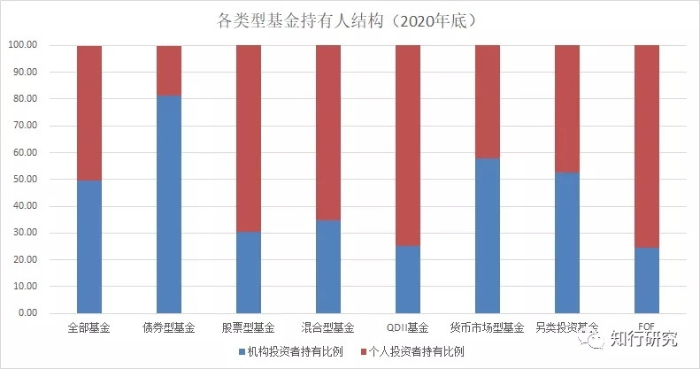
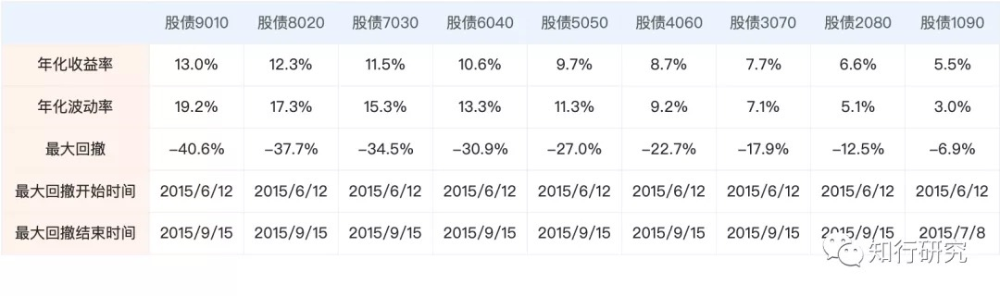
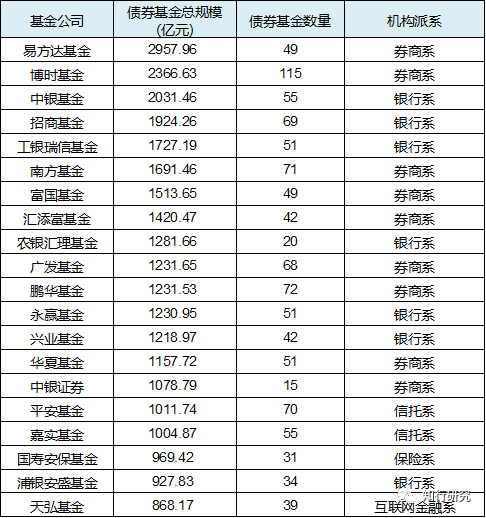

# 债券基金（三）：个人投资者能从机构对债券的偏爱中学到什么？

这是债券基金的第三篇文章，前两篇分别介绍了债券的基本常识、国内债券基金的发展过程、以及债券基金的风险收益来源。之前没看过的可以先去看一下（编注：文末「延伸阅读」有直达链接）。

不知道大家有没有注意到，身边人一说买基金时，默认就是偏股类的基金。尽管基金有很多类型，但货币基金还不如余额宝等宝类产品的名字更响亮，债券基金、商品基金、QDII 等个人投资者关注的就更少了。大家一说基金，就默认去跟股票挂钩了。

我在公募基金圈工作 9 年了，身边觉得债市不错、问我能不能给讲讲债券基金的人实在不算太多。但关注的人少，不意味着债券基金在公募基金中是个小众品种。

*债券基金目前有 5 万多亿的规模，在所有基金规模中的占比在 25% 左右*，是跟大家熟悉的混合基金规模差不多，仅次于货币基金。规模很大，但个人投资者很少关注。那么，都是什么人在买入持有呢？

下图是根据每只基金 2020 年报中披露的个人投资者持有比例和机构投资者持有比例，汇总统计的各类型基金的持有人结构情况，通俗点就是，每类基金中散户和机构的占比。

可以看出，大多数基金类型中，散户的占比是比机构要高的。在很多渠道推荐的热门基金，以及被大多数人熟悉的股票型、混合型基金中，散户的占比会更高一点。而债券型基金则与众不同，它的机构占比在 80% 以上。

原因有很多，比如机构投资者在做资产管理时，更看重大类资产配置；比如，银行、保险等资金很多要求业绩稳健，偏好中低风险投资；比如，可以借道债券基金，享受节税、高杠杆投资带来的好处；比如，选择债券基金，通过基金经理的分散化操作，降低自己挑选单个债券的风险等等。

这些原因里面，我觉得对很多人有启发的是：*投资要像机构那样，更注重大类资产配置的作用*。

对于散户来说，更关心某个产品赚不赚钱，是不是风险很高，而忽略了大类资产配置对于家庭财富整体的影响。就拿股票、债券、现金这三类资产来说，它们的流动性、风险性、收益性都不一样：

* 股票，虽然长期收益高，但波动也大，亏损的概率很高，如果短期要用钱，就要面临亏损卖出的风险，更适合将长期资金用来投资；
* 债券，长期收益介于现金和股票之间，业绩更稳健，但短期也有亏损的可能；
* 现金，流动性最好，可以随用随取，风险最低，但收益也很少，跑不赢通胀。

股票，虽然长期收益高，但波动也大，亏损的概率很高，如果短期要用钱，就要面临亏损卖出的风险，更适合将长期资金用来投资；

债券，长期收益介于现金和股票之间，业绩更稳健，但短期也有亏损的可能；

现金，流动性最好，可以随用随取，风险最低，但收益也很少，跑不赢通胀。

当我们投资时，*我们首先需要了解自己。先了解自己的风险承受能力，再结合自己的投资情况来确定大类资产的比例，分配股票投资、债券和现金的比例*。

虽然说这个比例没有标准答案，需要自己根据自己的情况去动态调整，但具备这样的思维意识很关键。对投资账户的整体表现来说，*建立这样的意识比纠结于选 A 产品还是 B 产品重要得多*。

目前来看，对于很多人来说，债券类资产的配置是被*轻视*了的。

为什么说是轻视呢？

*很多人不配置债券，并不是理性选择。*

不配置债券，不是因为自己能承受股市暴跌带来的冲击，或者说，能承受股市在很长时间内处于熊市不能赚钱带来的结果。不配置债券，更多的是因为想多赚钱，搏一搏，单车变摩托。恨不得把自己开支之外的钱都放在了股票投资里面，满仓干，债券那点收益怎么能放在眼里呢？

在《聪明的投资者》中，格雷厄姆提出，对于大多数人来说，都需要同时配置一定比例的股票和债券，并且债券的比例不能低于 25%。这部分债券的配置，可以满足中短期资金的需求，可以降低账户的波动，可以让你在股市大跌时预留一些子弹从而能够更好的坚持下去。

*所以，在开始挑选哪家公司、哪个基金经理、哪只基金之前，我觉得大家需要考虑清楚的是，债券、债券基金等债券类资产，对于你来说，它的作用是什么？你将配置多少的比例？这比基金代码要重要得多。*

最开始那张图里，债券基金机构占比高，又引出了另外一个问题，那就是*债券基金的管理人，能不能把基金卖出去？*

基金规模能有多大，更关键的是，得到*机构的认可*。

除了基金公司投研团队在债券管理上需要下功夫之外，渠道的优势、机构的资源也是相当重要的考虑因素。这两方面做得好，自然规模增长就快。规模大，会进一步加大公司对债券管理人才的配置，进一步得到机构的认可，从而实现正向循环。当然，如果表现不佳（例如，经常踩雷），那就是会被机构抛弃，马太效应会越来越明显。

下图是债券基金管理规模前 20 家公司，这 20 家公司的规模已经占到了全部债券基金的 55%。这些公司要不就是公募基金中的头部公司，要不就是有很强的渠道优势。

例如，永赢基金、兴业基金、浦银安盛基金凭借自己银行系股东（宁波银行、兴业银行、浦发银行）的优势，国寿安保凭借自己股东人寿资管的优势，在债券基金规模上排名很靠前。原因就是银行、保险、券商是债券基金的主要客户。

在这种局面下，债券基金经理也会往这些头部和有机构优势的公司靠拢，彼此相互成全。

面对这种现象，*对于我们而言，在挑选债券基金时，要尽量选择这些在债券管理规模上靠前的公司*。

当然，这不意味着，除了他们之外，没有好的公司和产品。例如，鹏扬就不错。只不过面对这种局面，选择头部对于大家来说，相对容易一些。相信如果还是机构为主的市场，鹏扬这种才发展几年的公司，凭借自己的口碑，也会很快建立起规模优势。

**延伸阅读**[债券基金(一):债券的基本常识](https://youzhiyouxing.cn/n/materials/808)[债券基金(二):债券基金的发展](https://youzhiyouxing.cn/n/materials/897)

> 来源：公众号「知行研究」本文章所载信息仅供参考，不构成任何投资建议。如转载使用，请参考[《文章转载声明》](https://youzhiyouxing.cn/agreements/ARTICLE_REPRINTED)
