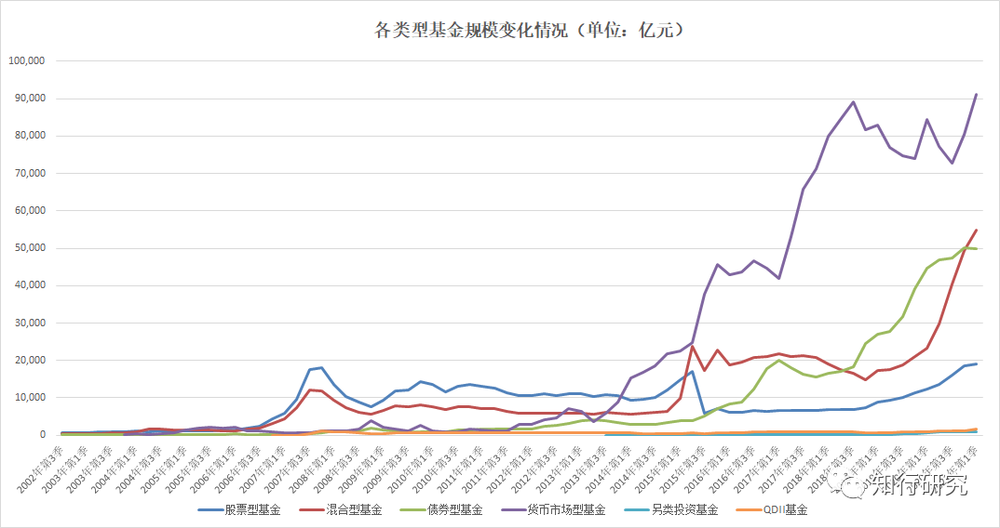
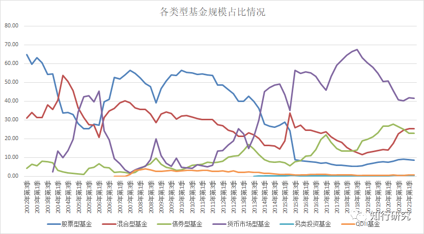
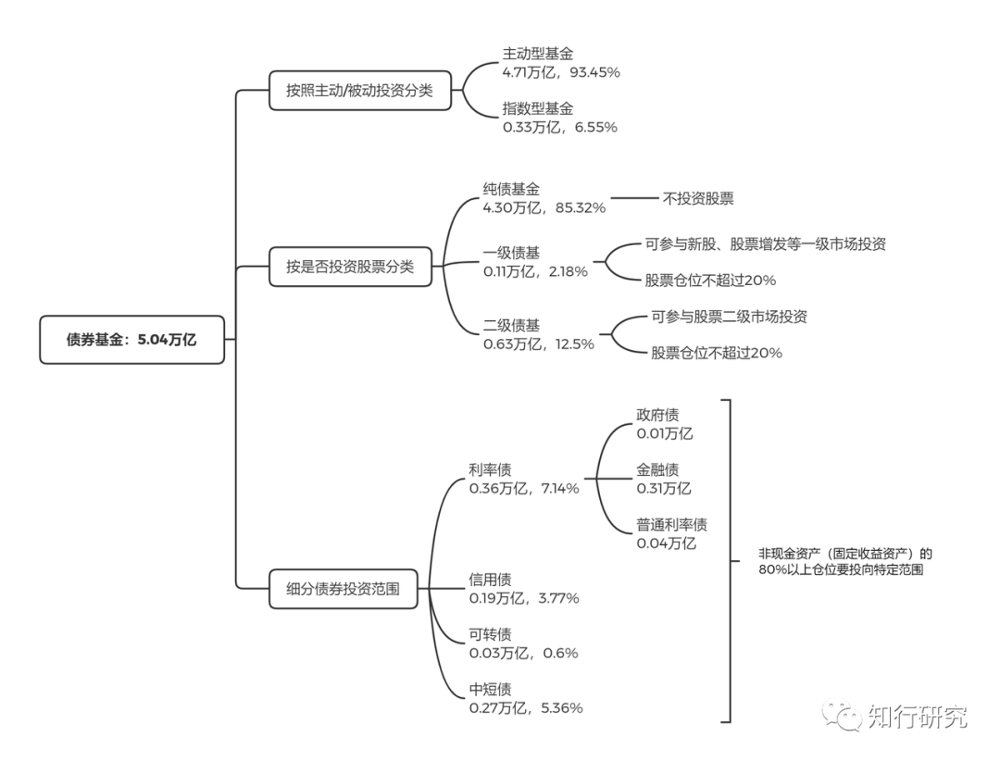
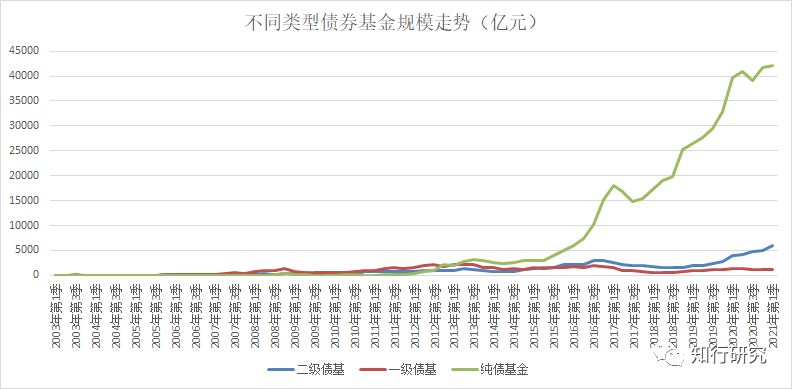
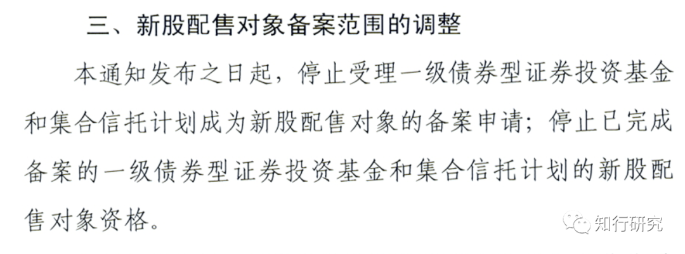

# 债券基金（二）：债券基金的发展

> 本文发表于 2021 年 5 月 9 日。

本文发表于 2021 年 5 月 9 日。

在《[债券基金（一）：债券的基本常识](https://youzhiyouxing.cn/n/materials/808)》，我们讲到了什么是债券、债券包含哪些基本要素、债券的风险收益特征，以及普通人如何投资债券。这周我们来简单介绍一下什么是债券基金、债券基金的发展过程，以及现状。

*大家知道国内第一支债券基金是什么吗？是南方宝元债券，成立于 2002 年 9 月。*它以债券投资为主，股票投资为辅，债券投资的比例为 45%～95%，股票投资的比例为 0%～35%。它将普通投资者的钱募集到一起，交给基金经理去管理，主要投向门槛很高的债券市场，少量投资股票市场。

按照目前监管层对债券基金的定义（*百分之八十以上的基金资产投资于债券的，为债券基金*），南方宝元不能算作严格意义上的债券基金，很多平台现在把它分到了偏债混合型。但在当年，公募基金还在探索中，南方宝元债券就是被当作国内第一支开放式债券基金，来进行试水的。

从成立日期能够看出，债券基金不是公募基金公司刚开始建立时就有的产品形态。国内第一批公募基金管理公司国泰、南方，是 1998 年 3 月成立的，成立之后，最开始推出的是封闭式基金，也就是大家经常听到的「老封基」，这些基金主要投向股票市场。

也就是说，*国内基金业在试点初期，选择从封闭式基金起步。*事实上，海外发达国家或地区的基金业，通常也是先从封闭式基金起步，经过一段时间的探索后，逐步转向开放式基金。原因主要是开放式基金由于要不停的面临投资者的申购赎回，对基金管理、托管、技术系统、监管要求都很高。相对而言，封闭式基金买入后一直不能赎回，更好管理一些，更适合起步阶段。

老封基运作几年之后，陆续才有其他类型的产品出现：开放式基金、债券基金、货币基金、QDII 等等。

从基金类型的发展我们能想象出，各类型基金自己的发展也是一个逐步迭代的过程。这里面很多人做了很多事，发生了很多故事，吸取了很多经验教训，才有了现在的样子。

下面两个图是不同类型基金历年来的规模变化以及占比情况，大家可以看看，之前什么类型的基金发展的好，现在又是什么情况了。

说回到债券基金，从图上能够看出，虽然第一支债券基金成立于 2002 年，但债券基金的规模快速上升发生在 2016 年以后，之前一直都是不温不火的样子。*现在不论是总规模还是规模占比，普通人并不熟悉的债券基金已经可以跟混合基金一较高下了。*

随着近些年打破刚性兑付，货币基金、银行理财收益率不断下滑，管理层打击非标资产推荐标准化债券这些行为，促进了债券基金的发展。

拿我们自己来说，我们四笔钱中的稳健理财，购买的「我要稳稳的幸福」和「兴全低波动小确幸」这两个基金组合，主要的持仓就是债券基金，债券基金已经开始帮助我们来平衡股票投资的风险，获得稳健的收益了。

债券基金的分类方式有很多种，有按照主动投资、被动投资分为主动型债券基金、指数型债券基金的，有按照是否投资股票分为纯债基金、一级债基、二级债基的，有按照运作方式分为开放式、封闭式、定期开放式的，也有一些专做细分债券的类似于主题基金的特色债基，例如利率债、信用债、可转债、中短债等。下图是截止到 4 月底，不同类型债券基金的规模占比情况。

今天先来说说跨越周期最长的分类方式：纯债基金、一级债基、二级债基。债券基金要求 80% 以上的基金资产投资于债券，在此基础上，剩下的 20% 仓位能投什么，决定了不同的基金类型。

纯债基金是仅能投资债券等固定收益类金融工具，不能投资股票市场。一级债基是主要投资债券，剩下的 20% 仓位可以适当参与新股申购和股票增发等。二级债基剩下的 20% 仓位，既可以适当参与新股申购和股票增发，也能进行二级市场股票投资。

从第一支债券基金成立到现在，我们从图里能看到三种类型的债券基金不同的历史走势。

2013 年之前，一级债基整体规模上要好于二级债基和纯债基金，2013 年之后，纯债基金开始快速崛起，现在占据了绝对地位，而一级债基开始没落。二级债基则是一直不温不火，这两年随着股市上涨，规模有所提升，但地位跟纯债基金是不能相比的。

那么，到底发生了什么事情呢？

其实，一级债基之前在国内是个特殊的存在，国内打新股长期被看作无风险、收益还不错的存在，一级债基在债券投资的基础上，通过打新股增强收益，要比纯债基金有吸引力，同时又不用像二级债基那样承受股市波动的风险，所以更受欢迎。

但 2012 年 7 月，证券业协会下发《关于首次公开发行股票询价对象及配售对象备案工作有关事项的通知》，明确要求一级债基和集合信托产品不得成为新股配售对象，简言之，*一级债基和集合信托产品不得参与新股网下申购。*

虽然网上打新以及参与定向增发资格仍被保留，但由于网上打新规模比较少，定向增发不够连贯，对一级债基的收益贡献就很小了。被叫停的原因有很多，从结果来看，一级债基和纯债基金的差别被缩小了，*债性更纯粹了，更符合本身中低风险的定位。*

既然一级债基从投资范围上更接近纯债基金，那么基金公司在考虑产品发行上，自然就弱化了一级债基之后的发行力度，主要铺在了纯债基金的布局上。现在市面上的一级债基主要以老产品为主。

为什么二级债基没有被大力发展呢？*作为投资工具，定位清晰很关键。*如果我想选择反映债市表现的产品，帮我获得稳健的收益，我可以选择纯债基金，如果我想参与高风险投资期望获得更高收益，我可以选择偏股型产品。二级债基这种就很尴尬。

所以，从整个过程来看，债券基金越来越纯粹，越来越反映债券市场的表现。

接下来聊一下债券基金是如何赚钱的，债券基金究竟是如何赚钱的。盈亏同源，理解了它的收益来源，也就知道债券基金为什么也会面临亏损了。一般来说，债券基金收益来源于以下几个方面：

## 1. 利息收入

债券本质上就是借条：债权人把钱借给债务人，债务人按照借款约定按时偿还利息，并且在债务到期时偿还本金。只要债券不出现违约、兑付困难，持有至到期一般是不会出现亏损的。

## 2. 价差收入

然而债券基金很多时候不能采取持有到期策略，需要对未到期的债券进行交易。例如，很多债券基金不是封闭的或者定期开放的产品，需要随时应对投资者的赎回需求，有时就需要被动卖出债券。

受基本面、市场利率、通货膨胀、信用情况变化等因素影响，债券价格是存在波动的。例如市场利率上升，债券价格下降；利率下降，债券价格上升。债券基金在二级市场买卖债券过程中，会获得价差收入，也存在卖出时机不好而亏损的可能。

## 3. 杠杆收入

估计很多人不了解，债券基金是可以加杠杆的。主要做法是通过回购业务将持有的债券进行「质押融资」，融得的资金又继续投入到债券市场，这就可以获得额外的杠杆收入。*通常用债券基金的总资产和净资产的比率来表示杠杆率。*

加杠杆会放大债券基金的净值波动幅度。另外杠杆是一把双刃剑，不是稳赚不赔的。当融资成本高于持有债券的利息收入时，也会出现亏损。

为了控制风险，监管层对杠杆比例是有限制的。目前，开放式债券基金的杠杆率上限为 140%；封闭式债券基金的杠杆率上限为 200%；定期开放式债券基金在开放期内的杠杆上限为 140%，封闭期的杠杆上限为 200%。

如果你看一个债券基金披露的季报等，就能看到这只基金是不是加杠杆，杠杆率多高。既然运作方式不一样，杠杆率的要求不同，意味着给基金经理的权限高低是不同的，那么，为什么不选择权限更高的运作方式呢？这也是这几年，定期开放式债券基金很流行的原因。

## 4. 股票投资收入

债券基金中有些是可以投资股票，例如，二级债基，或者有些债券基金可以通过可转债转股方式，持有一些股票，从而可以通过投资少量的股票获得更高的收益。当然，相应地也要承担股票市场波动的风险。

很多人对债券基金有着「还本付息」的印象，把注意力只放在了利息收入上。然而，债券基金这四大收入来源，除了利息收入之外，违约、债券买卖、加杠杆、股票买卖都存在着亏损的可能性。分析完债券基金的来源，你就能更好地了解它在追逐收益时所面临的风险。

今天先聊到这里，在债券基金的第三讲，我们会聊一下债券基金该如何挑选。

[债券基金（一）：债券的基本常识](https://youzhiyouxing.cn/n/materials/808)[债券基金（二）：债券基金的发展](https://youzhiyouxing.cn/n/materials/897)

> 来源：公众号「知行研究」 转载文章发表的所有信息仅代表作者个人观点，不对您构成任何投资建议，详见[《文章免责声明》](https://youzhiyouxing.cn/agreements/ARTICLE_DISCLAIMER)。
