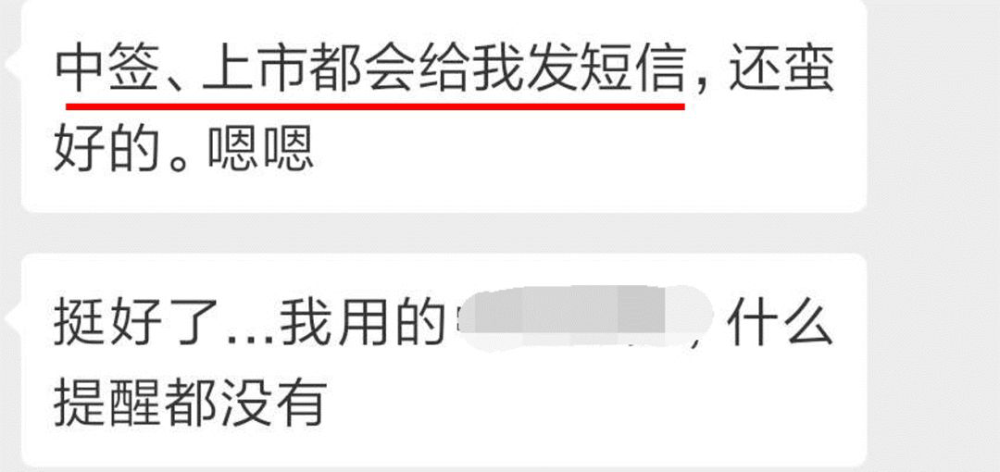
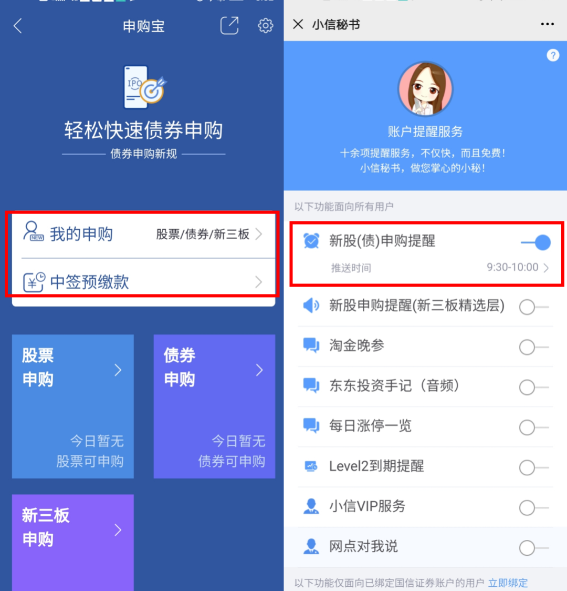
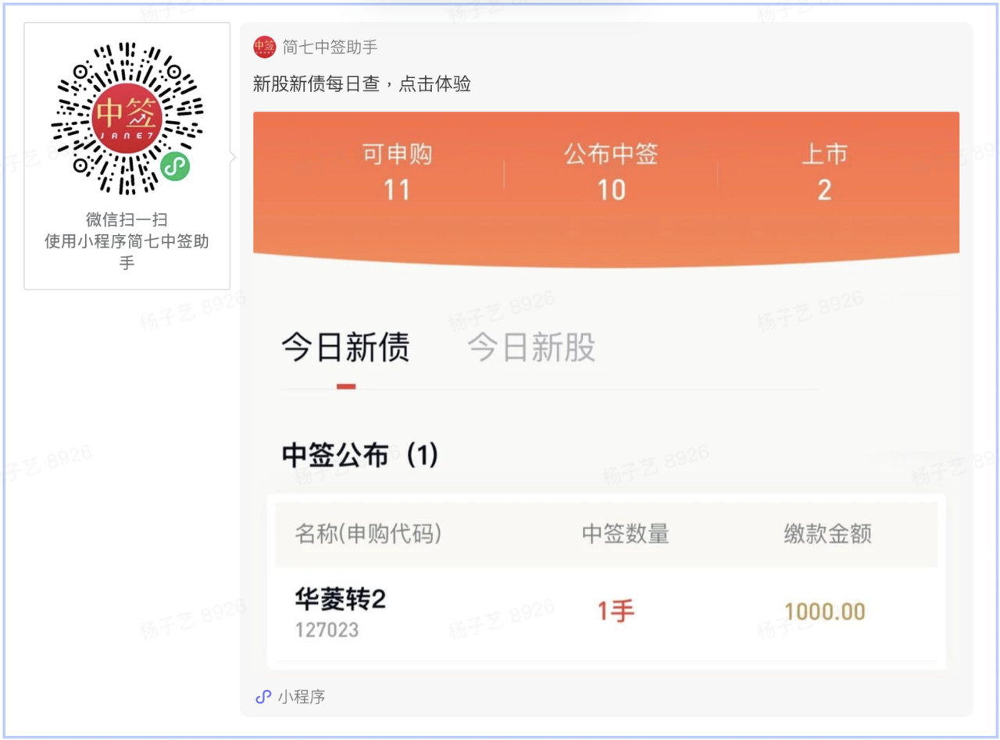
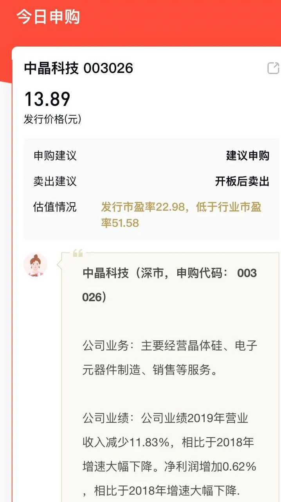
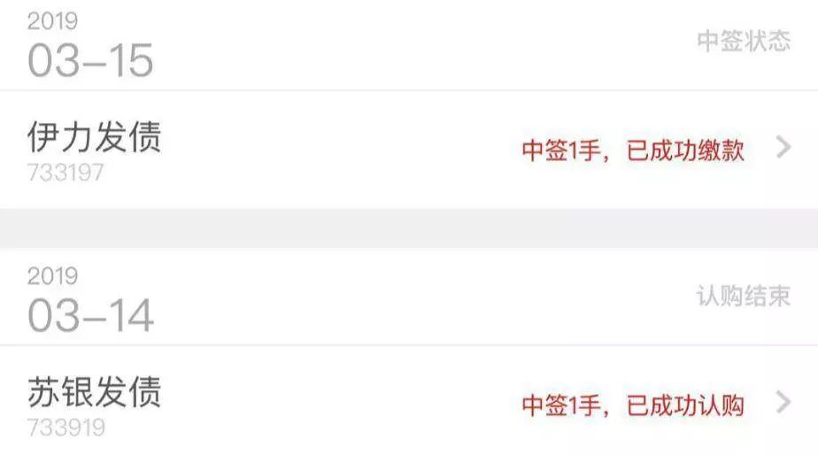

# 如何正确地操作「可转债打新」？

在最近不温不火的市场行情里，有着「下有保底，上不封顶」名声的可转债依然大受欢迎。

如果你对可转债已经有了一定的知识储备，却不清楚从哪里下手，那么在迈出第一步前，务必看看今天的文章。简七在文中一口气讲清楚了打新债必知的操作步骤和注意事项，比如，怎么选平台、需要多少钱、数量怎么填，等等。

可是，正如我们在 [解读「可转债为何大火」的文章](https://youzhiyouxing.cn/n/materials/136) 中提到的，虽然可转债无论是作为打新工具，还是作为长期投资标的，它都是一个不错的工具，但我们还是要回归本源——看它是否具备投资价值，而不是把它当作追涨杀跌的筹码。

以及，即使「可转债打新」可以带来相对稳健的收益，但因为债券始终比基金复杂许多，所以并不建议完全没有经验的新手参与，但我们非常鼓励新手点开上方的超文本链接，增进对可转债的理解。

祝开卷有知。

打新债和「抢周杰伦演唱会门票」，有点相似。

每一年，人气爆棚的周董演唱会门票基本都是「秒光」，不少死忠粉都「一票难求」，最后不得已高价求购。

于是不少「黄牛」，就在门票开抢的时候，先来抢一下。

没抢到，没什么损失。如果抢到了，就可以原价买入、高价卖出大赚一笔。

打新债，其实就和这个抢门票有一些类似。同样也是*没有门槛、抢购人数多，最终只有一批幸运的朋友才能中到。*

只不过，抢购的「东西」，从门票变成了一种投资品——可转债。

可转债，本质上是公司借钱的一张「欠条」，是我们把钱借给了上市公司。借钱期限到了，公司是要返还我们本金还有利息的，这是「债」的部分。

同时，它还可以转化为股票。如果我们不想做公司的债主，还可以做公司的股东。这就是「可转」的含义。

由于这两个原因，*可转债有着一个特征：下有保底，上不封顶。*

那么，可转债打新具体怎么操作呢？

首先，可转债交易是要通过券商账户的，*而选一个有单独打新债入口、提醒及时的好券商，真能省下不少事。*

但一般的券商 App，都不会单独设立打新入口，想参与，要自己获取新债代码。

也有体验好的，不仅有专门的「一键打新」入口，还会有打新日历、中签、充值、上市的短信提醒，更人性化的，还会有客服小姐姐电话你不要忘记中签后充值等等。

可以说是对新手用户很友好了～

我替大家整理了一下，目前上线了「新债一键申购」功能的券商有：

*国信证券、华泰证券*等，图省事的，选这几家肯定不会错。

来源：国信证券

但如果嫌新开户麻烦，或者看不到打新提醒的，欢迎*关注简七的打新小程序，*点点右上角的订阅，就会每天收到及时更新的新债信息了。

在微信搜索「简七中签助手」体验小程序，查新债

参与打新债，没有资金门槛，账户里没钱都能参与。

只需在中签后，补足款项就行啦——一般中一次也就 1000～3000 元，不会太多。

但最近新债的发行量比较大，很多朋友经常隔几天就收到中签消息。所以还是建议大家，至少预留 5000 元资金给打新债，要是打中了但是没有备用资金，就太可惜了。

对于申购时间，虽然沪深指有差异，但在*早上 9 点半之后，统一打新，就不会有「漏网之鱼」啦。*

如果想了解具体的交易时间，看这里——

沪指：9:30～11:30；13:00～15:00 深指：9:15～11:30；13:00～15:00

至于申购数量，我们的建议是：*顶格申购。*

这么做，主要还是为了提高中签率。

打新债其实跟买彩票有点类似，每位打新者，在申购时，会被随机分配一组数字。

是否中签，就跟最后官方公布的中签号码有关。

申购数量越多，获得的随机数也越多，中签的概率自然提高了。

放心，即便是顶格申购，每一次打中的签数也就 1、2 张，2、3 张，不会特别多 。所以，大家不妨放心大胆地全数申请申购。

还真不是。*资质一般的新债，不如不打。*

*其实打新债的收益，受对应股票的表现影响很大。*

如果持有期间对应股票上涨，那你赚钱的概率就比较大；反之，就容易亏钱。

像 2018 年，市场持续下跌的环境下，有近一半的新债打中了都是跌破发行价的。

所以，我们得进一步精挑细选，找那些有投资价值的新债打。

如果你关注了上面的小程序，可以在每天打新提醒中看到申购建议；不推荐申购的我们会做出标注哈～

在*申购后第二个交易日，就可以在券商账户中查询结果。*

一般中签结果的公布流程是这样的：

申购日后的第一个交易日，分配签码；申购日后的第二个交易日，显示中签结果。

如果你是周五申购，那中签结果一般要到下周二公布；

如果是周一申购，周三就能知道中没中啦。

至于中签信息怎么查询？一般券商都会给你发短信提醒，如果没收到，也能在券商 App 里找到。

比如，我用的华泰证券 App 里，就在「*我的申购*」中可以查询到。

*虽然，沪深两个板块，中签后显示的单位不同，但起始金额都是 1000 元。*

1 手（沪指）= 10 张（深指）= 1000 块钱

如果你中了 3 手，那就需要转入账户 3000 元，以此类推。

*万一今天又接到中签提醒，但是没钱付怎么办？*

按照证券交易所规定，个人投资者在 12 个月里，*如果有 3 次中签却没能付款的，此后至少半年的打新都不能参加——新股新债都暂时别想啦。*

所以，参与打新债的同学，千万记得要交款，或是在账户里多留点钱备用。

一般来说，*申购完成后，一个月左右才会上市，有的时间会更长一点，具体看上市公司公告。*

所以，对资金有一段比较长的占用时间，这个大家要有心理准备。

至于上市提醒，现在大多数券商都不提供此类服务，需要每天开盘后自行查询。

最近市场不错，很多人在打新债的过程中尝到甜头，月赚上千都不是梦。

*个人力量有限，不妨邀请家人朋友一起参与，多个账户大家同时打。我机智的朋友经常碰到自己和爸妈都中签。*

*对可转债打新感兴趣，想多赚一些的小伙伴，赶紧动动手，行动起来吧。*

[疯狂的可转债背后，谁在炒作?](https://youzhiyouxing.cn/n/materials/136)

> 来源：公众号「简七读财」 转载文章发表的所有信息仅代表作者个人观点，不对您构成任何投资建议，详见[《文章免责声明》](https://youzhiyouxing.cn/agreements/ARTICLE_DISCLAIMER)。
