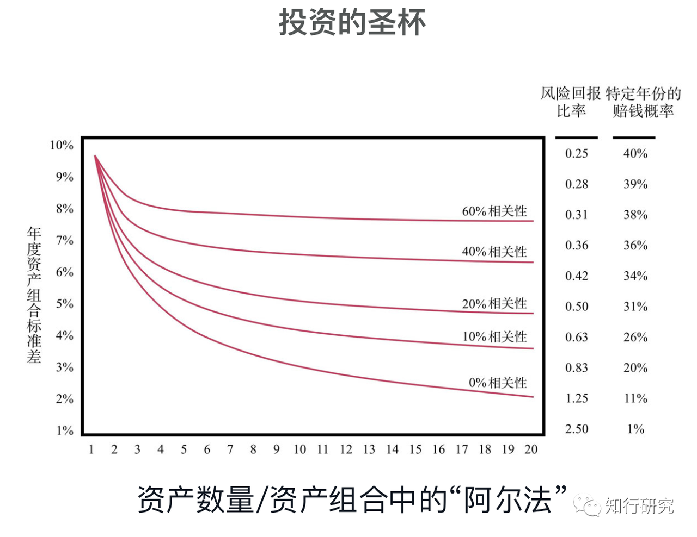
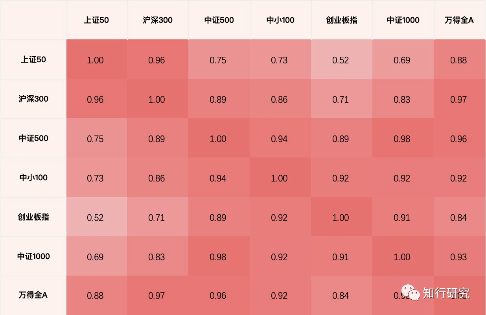
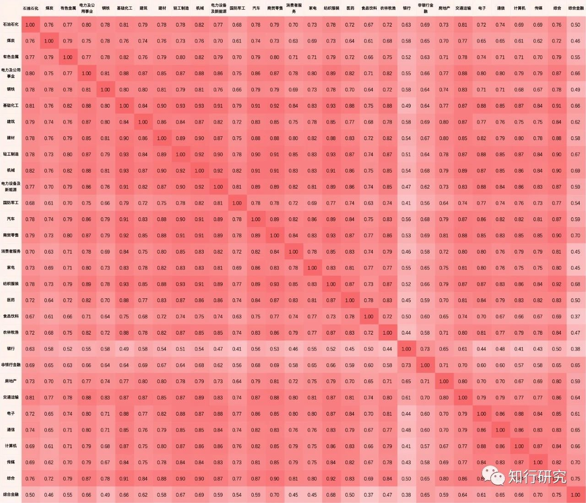
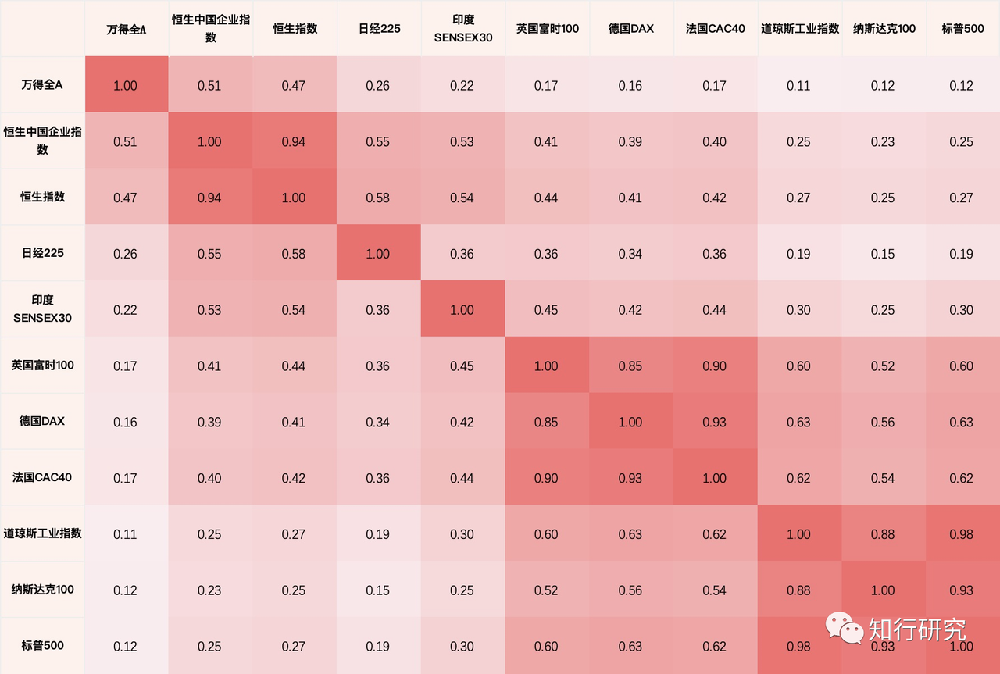
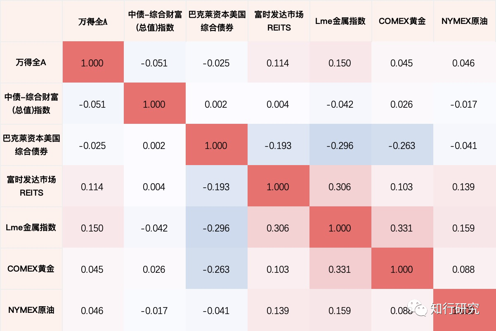

# 想分散风险？你需要关注相关性

我们都知道，分散投资不同的资产可以降低风险。

但是，*这并不意味着我们简单增加组合内的资产品种，风险自然就降低了。*

根据马科维茨投资组合理论以及实证研究结果，*只有低相关性、负相关性的资产才能有效地降低资产组合风险。*

在达里奥的《原则》一书中有一张图表，直观地展示了在逐渐增加具有不同相关性的投资时，资产组合的波动性如何减弱、组合风险回报比率如何提升。

可以看到，我们增加相关性更低的资产，组合的风险（标准差）下降幅度明显高于相关性更高的资产；而且增加的越多，组合的风险越低。

达里奥在书中将该图表其誉为*「投资的圣杯」*。

所以，相关性分析在投资组合的构建中很重要。只有知道了哪些资产相关性高，哪些资产相关性低，我们才能有效的完成风险分散。

在我们确认了相关性分析的重要性后，另一个问题就是如何衡量相关程度。

在这一点上，前人已经贡献出了丰富的研究成果，他们寻找到了众多衡量资产间相关性的指标。

其中，最常见的指标是 *Pearson 相关性系数。*一般我们看到相关文章只说相关性系数，没有特意标注是什么相关性系数，大概率使用的就是它。

Pearson 相关性系数描述得是资产间回报的线性关系。简单的说，假如一类资产上涨，另一类资产也同以一个固定的比率上涨或下跌，这两类资产间就是相关的。

Pearson 相关性系数的取值范围为「-1，1」：

当该值为 0 时，表明二者之间表现完全独立，不相关；

当该值为 1 时，表明二者之间完全正相关；

当该值为 -1 时，表示二者之间完全负相关。

接下来，我们就使用 Pearson 相关性系数，分别对A股市场、全球不同股票市场、不同大类资产进行相关性分析，看看不同的资产层级之间，相关性如何。

在这里，我们选取了一些A股市场的常见指数（每两个指数之间的数据时间范围，为这两个指数历史上重合的最大范围，数据截止 2021 年 4 月 9 日）。

首先，我们能够观察的到的是，这些指数都是正相关的。

这从逻辑上很好理解，因为它们同属于股票资产，并且都受到一些共性的中国宏观基本面因素影响。

其次，我们还能发现，除了wind全A这个全市场指数外，其他指数按照相关性系数的高低可以分为两组：

上证50、沪深300；

中证500、中证1000、中小100、创业板指

这正好对应着它们成分股的市值风格特征，大盘和中小盘。这也是为什么，很多投资组合会关注市值风格上的分散配置。

我们再看看中信一级行业指数之间的相关性。

这张图数据比较多，不过没关系。我们能够一眼看出，这些指数的依旧都是正相关的。

而且它们之间的相关性系数也都不低，原因和之前一样，在各个行业的本身影响因素外，它们都受到一些共性的中国宏观基本面因素影响。

对比这张图与上一张图中的相关性系数，我们还能发现，这些行业指数的相对性系数则相对要小一丢丢。说明在行业指数上进行分散配置，比单纯的在宽基指数上进行要稍微有效一些些。

不过，显然无论是A股的宽基指数，还是行业指数，相关性系数都不算低。*如果仅仅只将投资范围局限在这些A股指数中，能够得到的风险分散效果肯定是有限的。*

所以，我们马上看看全球股票市场的情况。

下图，是全球主要股票市场的相关性情况（时间区间为 2005 年至 2021 年 4 月 9 日）。

我们的相关性系数图明显变白了。

虽然这些资产指数间依旧是正相关的，但正相关的程度明显更低。之前的图表中，最低最低的相关性系数都要有0.38，而这张图的多数相关性系数都比这个低。

原因显然是每个国家的上市公司所处的国家宏观环境不同。*说明分散配置全球股市的风险是低于是仅投资单一国家股市的。*

另外，我们还能发现，这些资产间的相关性系数也可以明显分为亚太市场、欧美市场两类。说明在地区之间，仍旧有一些影响因素是共享的。

再看看我们常说的债券、商品等其他大类资产之间情况（时间区间为 2005 年至 2021 年 4 月 9 日）。

这里，终于出现了负相关以及几乎不相关的相关性系数。*说明不同大类资产之间的分散配置更为有效。*

比如，万得全A代表的股票与中债综合指数、巴克莱美国综合债券指数都是负相关的；万得全A代表的股票与COMEX黄金、NYMEX原油、Lme金属指数（伦敦金属期货指数）代表的商品指数相关性系数非常接近于 0。

这是因为每类资产的收益来源不同。就拿股债来说，股票收益最主要的来源是企业盈利增长，债券收益的最主要来源是票息。

到这里，我们能总结出一个常见资产间的相关性高低规律：

*单一股市指数之间相关性 > 不同国家及地区股市指数之间相关性 > 不同大类资产指数之间相关性*

说明在进行投资时，如果按照大类资产、不同国家及地区、单一资产内部的细分资产这样一个顺序来进行资产配置，对风险的分散是更为有效的。

很多人现在陷入了一个误区，把大量时间纠结于单一资产内部的风险分散。

比如很多人会配置许多A股行业指数基金，纠结于这些行业指数之间的相关性系数高低。

殊不知，也许仅仅只加入一只债券基金，就能更有效的将整体投资组合的风险降下来。

> 来源：公众号「知行研究」转载文章发表的所有信息仅代表作者个人观点，不对您构成任何投资建议，详见[《文章免责声明》](https://youzhiyouxing.cn/agreements/ARTICLE_DISCLAIMER)。
