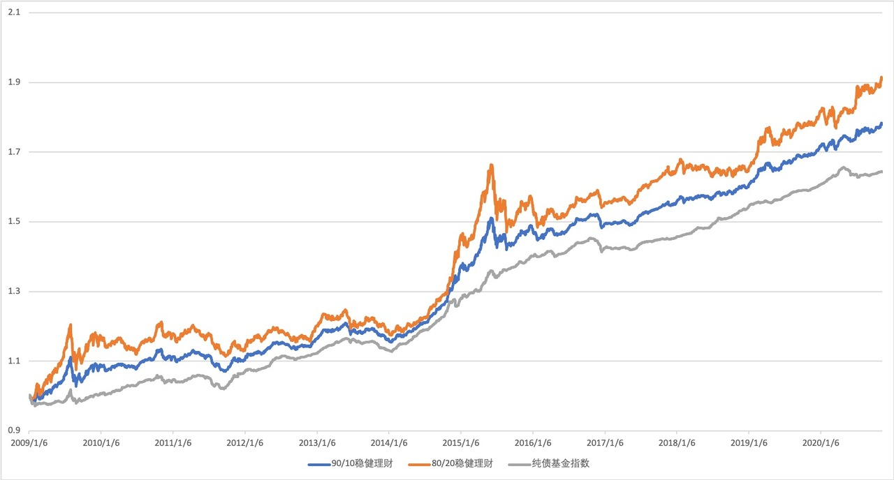

# 为什么稳健理财适合中短期投资？

之前我们在「投资目标」里，介绍了大家对稳健理财的诉求，也就是不想承受太多风险，获得超越银行理财的稳健收益。

从本篇内容开始，我们来分别介绍一下「稳健理财」适合的场景，也就是看大家的哪笔资金适合投资这类产品。

第一个场景就是进行 1～3 年的中短期投资。

如果你有一笔钱，不需要 1 年内使用，也拿不了太长时间去进行股票的长期投资，建议你买入稳健理财产品。

例如，我还有 2 年要换车，我就会用这笔钱买入「我要稳稳的幸福」这种类型的产品。等到 2 年后，可以放心地取出，也许赶上行情不好，赚得不多，但亏本的概率很低。

假如我觉得未来 2 年股市行情不错，就投入股市怀抱，万一赶上市场大跌，就只能悲惨地降低买车的预算了。

**为什么要至少持有 1 年以上呢？主要原因是持有 1 年以内有亏损的可能。**

虽然稳健理财产品风险很小，但不是没有风险的。

稳健理财产品的投资策略是以债券类资产为主，少量配置一些高收益高风险资产，例如股票、可转债等。我们拿常见的**债券资产 + 股票资产**为例，说明一下这类产品面对的风险：

1、债券类资产存在短期亏损的可能性

虽然债券一直持有是还本付息的，但稳健理财产品为了应对用户赎回，不能一直持有到期，需要中途卖出。而债券价格受到基本面、市场利率、通货膨胀、信用情况变化等因素影响，是存在波动的，短期买卖有可能会亏损。

下图中灰色的线是纯债基金指数，纯债基金是只投资债券的基金，大家可以看到，虽然整体上涨，但在上涨过程中，也会出现回调，如果你买入赶上回调，那么就会出现亏损。

2、加入股票类资产，增加收益的同时也承担了风险

稳健理财产品为什么要增加股票类资产呢？主要是因为随着利率下滑，债券类资产的收益越来越低了，但大家想多赚钱的欲望却一直存在，怎么办？那就需要承担一些风险去博取更高的收益。但为了稳健考虑，还需要控制股票类资产的比例。

市场上的稳健理财产品里，如果配置股票资产，股票仓位一般有 3 个档位：10% 以下、10%～20% 区间波动、上限不超过 30% 。前两种是比较常见的。

我们模拟了两种稳健理财的产品：

* 一种是 90/10 稳健理财——持有纯债基金指数 90% 的仓位，持有沪深 300 指数 10% 的仓位，每年再平衡一次；
* 另一种是 80/20 稳健理财，持有纯债基金指数 80% 的仓位，持有沪深 300 指数 20% 的仓位，每年再平衡一次。

一种是 90/10 稳健理财——持有纯债基金指数 90% 的仓位，持有沪深 300 指数 10% 的仓位，每年再平衡一次；

另一种是 80/20 稳健理财，持有纯债基金指数 80% 的仓位，持有沪深 300 指数 20% 的仓位，每年再平衡一次。

从上图能够看到，长期持有来看，股票仓位高一些的业绩会更好，但股票仓位高一些的波动也更大。

2015 年股市大跌的时候，80/20 稳健理财的回撤要大于 90/10 的回撤，相比而言，如果想随时买入都获得正收益，需要持有的时间更长。

拿 80/20 稳健理财来说，在 80% 的概率下，持有 11 个月才不会出现亏损。为了获得更好的体验，建议大家至少持有1年以上。

另一方面，如果持有时间过长，例如 3 年以上、甚至 5 年以上，我们还是建议大家去投资股票仓位更高一点的产品。即便股票仓位高一些会导致短期波动大一些，但随着持有时间的增加，这种短期波动的影响会降低，我们有机会获得更高一些的收益。

综上，如果你有一笔钱，可以进行 1～3 年的中短期投资，那么你可以考虑选择稳健理财产品。

> 本文章所载信息仅供参考，不构成任何投资建议。如转载使用，请参考 [《文章转载声明》](https://youzhiyouxing.cn/agreements/ARTICLE_REPRINTED)。
