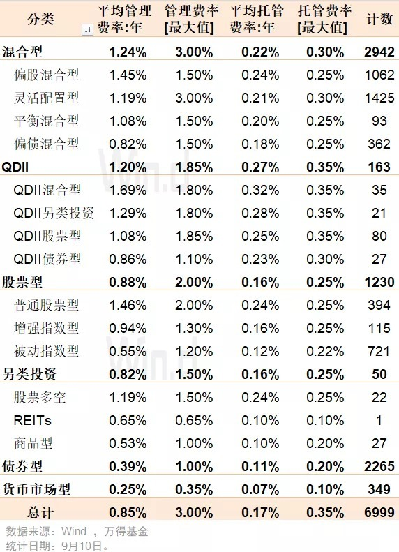
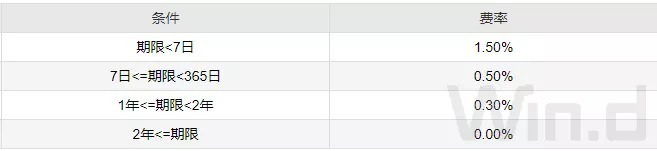

# 一文捋清投资公募基金的费用

购买公募基金，已经成为老百姓理财的主要渠道之一，但很多基民对投资基金收取的费用理不清楚。比如管理费、认购费、托管费等收取的标准一般是多少，不同类型基金费率有何区别。今天，我们给大家做一次梳理，并分享一些省钱小贴士。

总的来讲，投资公募的费用分为两块，持有期间的费用，以及流通环节的费用。

持有公募基金需缴纳管理费和托管费，这两者占据了基金费用的绝大部分。

## 1. 管理费

管理费是指支付给实际运用基金资产、为基金提供专业化服务的基金管理人的费用，也就是管理人为管理和操作基金而收取的报酬。基金管理费是基金公司的主要收入来源。

## 2. 托管费

基金托管费是指基金托管人为基金提供托管服务而向基金收取的费用，主要为银行机构。基金资产由基金托管方独立托管监督，依据基金经理的指令进行操作，保障基金资产安全。

从上表可以看出，管理费用的高低与基金类型有关，管理难度越大的基金管理费收取越高。Wind 数据显示，截止 9 月 10 日，市场上 394 只普通股票型基金（只统计主基金，下同）平均管理费为 1.46%，而被动股票型管理费为 0.55%，增强指数股票型为 0.94%。混合型和 QDII 型基金平均管理费处于较高水平；相比而言，债券型和货基管理费较低，平均分别只有 0.39%、0.25%。

值得一提的是，各类基金的管理费的分散度也比较大，多数类型管理费最大值要比平均值高出 50%。以灵活配置型为例，平均管理费率为 1.19%，该类管理费最大值为 3%（中邮核心竞争力 000545.OF），也是全市场最高的。

基金托管费也与基金类型有关。就平均而言，QDII 型托费费率最高为 0.27%，混合型其次为 0.22%。债券型、货币型较低，分别只有 0.11%、0.07%。而且，各类基金托管费率分散度不大，比较靠近平均值。

还有一类持有费用就是指数使用费，是针对指数基金收取的，其他类型基金没有这项费用，年费率多数集中在 0.02% 至 0.04%，收取方为指数发布公司，比如中证指数公司等。

需要说明的是，很多投资者担心购买 ETF 联接基金存在费用重复收取的问题，因为该类基金约 90% 的资产投资于对应的 ETF 基金，ETF 已经收取的管理费、托管费、指数使用费，ETF 联接会不会再收取一遍。

这里对 ETF 联接基金费用做一澄清，不存在重复收取费用。ETF 联接基金不再对持有的 ETF 资产收取管理费、托管费、指数使用费，只对非 ETF 资产部分收取相应的管理费、托管费，ETF 联接基金实际费率不高。

值得一提的是，市场上现有 41 只基金采用浮动管理费率，基金按照不同的收益档次收取不同的管理费，回报越高收取的管理费也越高。该类基金目前还处于试点阶段，我们会在后期的文章专门介绍。

基金流通费用包括购买基金产生的费用，以及卖出基金产生的费用。主要包括以下几种：

## 1. 认购费

认购费指投资者在基金发行募集期内购买基金时的手续费。以今年以来成立的基金为例，主动型偏股型基金的认购费通常 0.8～1.2% 不等，被动股票型认购费多在 0.5～0.8%，债券型基金认购费多在 0.3～0.6%；另外，货币基金以及部分短债基金不收认购费。为了便利基金募集资金，认购费一般会比基金成立后的申购费低一些。

## 2.申购费

申购费是指投资者在基金存续期间向基金管理人购买基金时所支付的手续费。申购费率一般比认购费高出 0.2～0.3 个百分点，偏股主动型基金申购费在 1%～1.5%。

在基金申购时，又分前端收费和后端收费，前端收费就是指投资者在购买基金的时候，一次缴纳购买费用；后端收费是指购买时先不支付申购费，待赎回时将申购费和赎回费一并支付。不过，今年成立的新基金没有采用后端收费模式的，现在市场上申购时可采用后端收费的基金合计有 239 只，属于小众收费模式。

不过需要注意的是，以上是在申购费不打折的情况下计算的。现在包括万得基金在内的很多第三方平台申购费都是打一折了，有时候甚至是 0.1 折，所以选择后端收费模式意义不是很大。不过，像东方红、睿远有些基金全网不打折，这个时候可以考虑前后端收费的不同。

## 3.赎回费

基金赎回费率，指的是投资人卖出基金份额时支付的费用比率。而持有基金的时间不同，赎回费率也是会有所不同的。以基金 A 为例。

基金持有 7 天以内赎回费用最高为 1.5%，2 年以上费用低至 0。很明显，持有时间越长，赎回费费率越低。7 天以内赎回是属于惩罚性收费。一般建议持有 2 年以上，这时大部分基金赎回费就为 0 了。

## 4. 销售服务费

部分基金为了方便短期投资者还设计了 C 类份额。A 类份额是代表常规的前端收费，C 类份额没有申购费，赎回费一般持有超过一个月免收，但收取销售服务费。

同一只基金，选 A 类还是选 C 类份额的问题，一般根据投资时间的长短进行选择。以偏股型基金为例，C 类的销售服务费通常为 0.4%～0.8% 每年。对比 A 类份额 0.15% 的申购费 + 0.5% 的赎回费，差不多 6～8 个月为两种收费模式的临界平衡点。*所以对于偏股型基金，拟持有 8 个月以上选 A 类划算，6 个月以下选 C 类划算。因费率不同，各个基金优劣分界线略有不同。*

以基金 A 为例，基金的销售服务费为 0.4% 每年，持有超过 1 个月免收赎回费，这样算来，如果持有期限在一年内，购买 C 类是划算的。

从严格意义上讲，销售服务费属于基金持有环节的费用，因为该费用的设计为了便于基金流通，所以列在了基金流通环节的费用。

最后需要说明的是，管理费、托管费、销售服务费是按照年化列示，但操作上，基金公司是依照每只基金的实际费率按日扣费，基金每天的公布的基金净值是扣除上述费用属于基金投资者的资产净值。值得一提的是，托管机构每日会对基金公司上报数据进行复核，确保数据准确。

> 来源：公众号「万得基金」转载文章发表的所有信息仅代表作者个人观点，不对您构成任何投资建议，详见[《文章免责声明》](https://youzhiyouxing.cn/agreements/ARTICLE_DISCLAIMER)。
