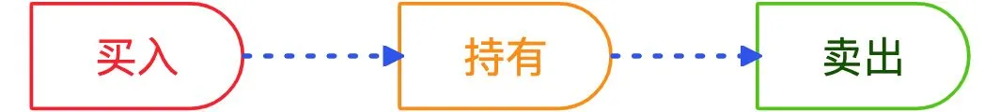

# 成本思维：这 5 种成本，你真的懂吗？

在投资交易里，大家很容易就能留意到，像申购费、赎回费这样的摩擦成本，以及，管托销费率（管理费/托管费/销售服务费）这样的持有成本。

但是，你不一定考虑过，决定购买某一只基金时，除了以上这些成本，你还面临着机会成本；也不一定想过，如果你做出了错误的决定，还不肯及时止损，你其实是在为沉没成本付出额外的代价。

因此，我们认为有必要和你分享今天这篇文章。作者在解析投资成本的基础上，还引入了「成本思维」的概念，介绍了「机会成本」、「沉没成本」、「边际成本」对投资的影响。

希望读完之后，你能对「成本」建立起更全面的认识，从而更好地做出决策。

祝开卷有知。

任何交易都有成本，投资离不开交易，所以投资也有自己的成本。

我在《[投资 4 维度](https://mp.weixin.qq.com/s/rMujYiU9yp7_SoyrdSpnLA)》，将收益、风险和成本比作长、宽、高，三者合起来，才是完整而立体的投资。

普通投资者常常谈收益，谈风险，唯独很少谈成本。这就好比只盯着长和宽，在一个平面「纸上谈兵」，真要上阵只怕是惊险万分。更何况，投资者需要了解的成本，不止一种。

今天，咱们就来好好聊聊「成本」这个话题。

*投资成本*，对很多人来说是一个「有意识，但说不清」的概念。不信的话，问问身边朋友，看有多少人能说清楚自己的投资成本？

还记得《[投资还是投机](https://mp.weixin.qq.com/s/HBJfJ1mrxhvVgnGaKscSZg)》里，我把收益拆解为「投资收益」和「投机收益」两部分吧？同样的道理，为了便于解析，投资成本也可以拆解为 「摩擦成本」和「持有成本」两部分。

一项完整的投资会涉及买入、持有和卖出 3 个阶段。一买一卖，是*摩擦成本*；中间，自然是*持有成本*。

## 1. 摩擦成本

先说说 *「摩擦成本」*。

对于个股而言，摩擦成本主要是交易佣金、过户费和印花税（即，两费一税）。投资者的优化空间集中在交易佣金上，也就是尽可能找低费率的券商。

对于基金来说，摩擦成本主要是申购费率和赎回费率，优化空间包括基金公司、渠道和持有时间：

* 相似甚至相同基金（尤其是，指数基金），找费率更低的公司的产品
* 相同公司的相同基金，找费率更低的渠道，尽量一折甚至免申购费
* 尽量长期持有，因为赎回费率一般按持有时间来分段，越久越便宜

相似甚至相同基金（尤其是，指数基金），找费率更低的公司的产品

相同公司的相同基金，找费率更低的渠道，尽量一折甚至免申购费

尽量长期持有，因为赎回费率一般按持有时间来分段，越久越便宜

## 2. 持有成本

再看看 *「持有成本」*。

对于个股而言，在没有杠杆的情况下，几乎没有成本可言。硬要说的话，「股票红利税」算是一个——持有时间不足一年的话，股息红利是要交税的。

对于基金来说，持有成本要分成「显性」和「隐性」两种。

*「显性持有成本」是基金的管托销费率（管理费/托管费/销售服务费），每天都从净值中扣除。* 根据[约翰·博格的研究](https://mp.weixin.qq.com/s/rMujYiU9yp7_SoyrdSpnLA)，假设基金每年取得 10% 收益率，但是收取 2.2% 的费率，那么，实际上投资者每年有 22% 的收益都被基金公司夺走了。巧的是，国内大多数主动型基金的管托销费率合起来也接近 2%，上面的结果完全适用于国内。

*「隐性持有成本」是主动型基金经理们调仓换股的摩擦成本，隐含在净值结果之中。* 基金经理直接操作个股，即便你对基金「长期持有」，也无法保证这只基金对股票「长期持有」。换句话说，你在承担基金经理们的摩擦成本，而且是不受控制地承担。

查尔斯·埃利斯对此的[评价](https://mp.weixin.qq.com/s/U9V-e89IQlJa1CqzYTVO9A)是：

> 主动基金经理年换手率通常超过 100%，带来的费用全部由投资者买单。

主动基金经理年换手率通常超过 100%，带来的费用全部由投资者买单。

上面谈的「摩擦成本」和「持有成本」，都是理性分析下的产物。无论看起来有多复杂，只要耐心拆解，总归是可以捋清楚的。

但是，*接下来的 3 种成本，是多数人思维的盲区，乃至思考的陷阱*。

「机会成本」这个词听起来玄乎，我举个简单例子。

周六上午，你可以选「补觉到中午」，也可以选「起床去跑步」：

* 选择补觉，就放弃了跑步的锻炼效果，这是补觉的机会成本；
* 选择跑步，就放弃了补觉的休息恢复，这是跑步的机会成本。

选择补觉，就放弃了跑步的锻炼效果，这是补觉的机会成本；

选择跑步，就放弃了补觉的休息恢复，这是跑步的机会成本。

换句话说，「选A」不仅仅是「选 A」，还意味着「不选 B」。你在获取 A 的收益的同时，也放弃了 B 的收益。*这份「被放弃的收益」，构成了 A 选项的「机会成本」*。

机会成本还有另外一个名字：*我本可以*。

时间是线性的，我们在人生路上经历过无数分岔口，但只能选其中一条路。夜深人静，辗转反侧之时，你是否也会想过：如果当初选了另一条路，我本可以……

这个「我本可以」，就是你的机会成本。

机会成本的概念放到投资里同样有效，甚至，*极其重要*。

对于投资者而言，把资金投入到 A，就意味着这笔资金无法投入到 B。如果 A 的预期收益率是每年 10%，B 是每年 9%，那么「预期收益 > 机会成本」，这个决策还是明智的。更严谨的做法是：预期收益扣掉 A 的投资成本，机会成本也扣掉 B 的投资成本，这个对比才公平。

当然，实际的投资场景没有这么简单 —— 我们还没考虑 A 和 B 的「风险」。

如果两者的风险水平一致，上面的结论当然成立；但如果 A 的风险比 B 更大，结论就不一定正确了。

比如说，虽然货币基金的预期收益远低于股票基金，但是对于 1 年内就要用来买房的钱，货币基金显然是更理性的选择。

完整的投资决策，必须把「收益、风险、成本和时间」这 4 个要素都考虑进去，感兴趣的同学可以参考《[投资 4 维度](https://mp.weixin.qq.com/s/rMujYiU9yp7_SoyrdSpnLA)》和《[投资里的时间魔力](https://mp.weixin.qq.com/s/4Lx7j9FcWjfpcgXAD0HsVA)》，这里就不再展开了。

「机会成本」不是为了精确计算而存在的，它更像是一个警钟，提醒我们，当你面临多个选择时，不要忘了：*被弃选择的收益，也是一种成本*。

现在，打开你的投资账户看看还在浮亏的基金或者股票，你持有多久了？再看看浮盈的那些，你持有的时间，是不是比浮亏的要短一点？

更具体地说，*浮亏幅度越大的基金，你的持有时间可能就越长*。被我说中了是不是？我不懂什么读心术，只是知道有一种心理叫 *「损失厌恶」*。

第一次接触这个词，是在大学的市场营销课程。口香糖广告里夸大口臭的坏处，就是利用人们的损失厌恶心理 —— 不想被周边的人疏远，那就多嚼口香糖吧。

损失厌恶心理，不只存在于消费场景，还存在于金融行业。人类在面对同等数量的收益 （gain） 和损失 （loss） 时，对损失的感受会更强 —— 赚 50% 的愉悦，远没有亏损 50% 的痛苦来得强烈。卖出亏损的基金，等于把「浮亏」坐实成「损失」，这是非常难受的。

这种情况也叫处置效应，在这种心态的驱使下，很多人会死死抱着浮亏的投资不放，希望能「守」到回本的那一天。然而，*错误的投资决策从不会因为你等得久就变成对的*。他们中的大多数，永远也等不到那一天，反而越到后面，越是后悔地追问：我为什么就没有早点割肉止损呢？

要破解损失厌恶的蛊惑，首先要理解 「沉没成本」。

*沉没成本，是指发生在过去，将来也无法收回的支出，包括时间、精力和金钱。*

其中的关键词有两个：过去——沉没成本已经发生，不是现在可以选择的；将来——沉没成本收不回来，就像泼出去的水一样。

举个例子：2020 年巴菲特「割肉」航空股，承认自己之前判断有误。

尽管此前巴老投注了大量时间精力研究进行研究，才做出买入决定。但是，时间、精力和金钱都是收不回来的沉没成本，不应该继续影响决策。发现自己的判断错了，就要摒弃损失厌恶心理，果断认错止损——

*股神不是从不犯错，只是，他不会为沉没成本付出额外代价。*

相反，大部分人总惦记着自己之前投入的沉没成本，才会死死捂着自己浮亏的投资，不肯放手。但，错了就是错了，死攥着不放，难道说 ——

*凭实力亏掉的钱，你想靠运气收回来吗？*

「边际成本」的概念来源于经济学，看似高大上，其实不复杂。

比如我要开一家煎饼店，原材料成本为每份 3 元，铺租每月 30000 元。

假如生意一般，每天卖 1000 份，一个月 30 天，每个煎饼的成本大约是： (3 × 1000 × 30 + 30000) / (1000 × 30) = 4 元

如果生意红火，每天卖 10000 份，每个煎饼的成本会变成： (3 × 10000 × 30 + 30000) / (10000 × 30) = 3.1 元

因为铺租是固定成本，所以卖的煎饼越多，平摊到每个煎饼上的成本越少，这叫作：*边际成本递减*。

生活中的边际成本无处不在，《[再见，死工资](https://mp.weixin.qq.com/s/2FH_ufrpmJfHJSu-nocE1g)》把工作分成了三类：

* 「一分耕耘，一分收获」，让你出售更多的时间换钱，是饮鸩止渴
* 「一分耕耘，N 分收获」，让你提高出售时间的单价，是扬汤止沸
* 「无需耕耘，也有收获」，让你脱离「时间换钱」，才是釜底抽薪

「一分耕耘，一分收获」，让你出售更多的时间换钱，是饮鸩止渴

「一分耕耘，N 分收获」，让你提高出售时间的单价，是扬汤止沸

「无需耕耘，也有收获」，让你脱离「时间换钱」，才是釜底抽薪

*三者的差别，就在于边际成本。*

投资里有没有应用「边际成本」的例子呢？当然有。

很多人知道要看估值，却不能灵活运用估值，比如说，为什么互联网行业的 PE 大多比较高？原因有很多，但一个基本因素是「边际成本」，互联网行业的边际成本，通常更低。

以微信为例，新增一个微信用户，既不需要购买服务器，也不需要多写几行代码，边际成本极低。

而这名用户的加入，让微信变得更「好用」 —— 因为 ta 的朋友现在可以通过微信找到 ta，不需要借助其他通讯工具了。这种「网络效应」让微信的*边际成本几乎降到了负数：新增用户所带来的收益可能超过成本*。

国内的微博，海外的 Facebook、Twitter……带有社交属性的工具，都有网络效应。而这，也让它们背后的公司享受不一样的估值逻辑，其中一个表现就是更高的 PE。因为，它们的边际成本比一般行业低得多。

让我们重新看看今天介绍的 5 种「成本」：

* 「摩擦成本」和「持有成本」，要通过「合理选择」和「长期持有」来优化
* 「机会成本」提醒我们，被弃选择背后的收益，也是一种成本
* 「损失厌恶心理」会误导你的投资，必须正确看待「沉没成本」
* 「边际成本」不但影响你的工作选择，还影响你的投资决策

「摩擦成本」和「持有成本」，要通过「合理选择」和「长期持有」来优化

「机会成本」提醒我们，被弃选择背后的收益，也是一种成本

「损失厌恶心理」会误导你的投资，必须正确看待「沉没成本」

「边际成本」不但影响你的工作选择，还影响你的投资决策

希望从今天起，你能*带着成本思维，重新审视这个世界*。

> 来源：公众号「基业长红」转载文章发表的所有信息仅代表作者个人观点，不对您构成任何投资建议，详见[《文章免责声明》](https://youzhiyouxing.cn/agreements/ARTICLE_DISCLAIMER)
