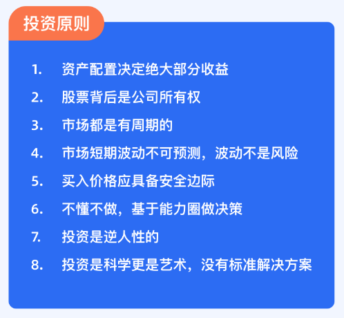

# 这两本投资经典，我浓缩成了 10 句话

每天的精选文章多是聊投资知识，今天我们来聊一个投资习惯。

你还记得吗？我们在给大家的第一封信中，写到了「有知有行」总结的八个投资原则。

我们相信，大道至简。市场是千变万化的，但很多具体问题，都能回归到几个重要原则。

今天的这篇文章来自二鸟老师，他分享了 10 句话，称之为基金投资的「战略问题」。

我觉得特别形象。战略大于战术。想明白自己认可什么样的投资原则，记录下来，这样当我们遇到各种各样的问题时，才能以不变应万变。

希望你读过后，能停下来想想，自己认可的投资原则有哪些？

祝开卷有知。

> 本文来自用户@菜卜Shihab 的推荐，谢谢你对同路人的帮助。

2020 年 7 月 5 日，我参加了东方红线上读书日活动，并作了分享。内容是以公募基金投资者的视角，对《投资最重要的事》和《周期》两本价值投资经典著作进行解读。我将这两本书浓缩成十句话，用十句话讲清楚「基金投资的战略问题」。此次分享不涉及基金选择和个基评价等战术问题，纯读书。

关于读书，我一般是分两步。**先把书读厚，再把书读薄。**

读厚，就是要前后融会贯通，包括和其他知识点的融会贯通。这时我会做很多读书笔记，书上基本上全部写满画满，这个我叫把书「读厚」。

读薄，就是读完之后要高度浓缩，把一本书概括成几句话，对自己的认知有所帮助。能概括出来，那离真理就又进了一步。概括不出来，要么书没啥价值，要么是自己没真正读懂。

今天分享的《投资最重要的事》和《周期》，是众多投资者公认的两本价值投资的经典著作。相比而言，《投资最重要的事》更为经典，其中一些观点，如第二层次思维、钟摆理论等，都是非常经典的理论。我知道一些基金经理，他们业绩不好的时候，也去翻一翻这本书，心情马上会好很多。

我把《周期》看作是《投资最重要的事》第 8 章和第 9 章的展开论述。《周期》一书，在我来概括，就是三句话：**周期客观存在，周期不可预测，用心感受周期。**

作者霍华德·马克斯（Howard Marks）总结了包括经济周期、市场周期在内，将近 10 种周期的规律。但这些周期规律并不会简单的重复，所以他建议我们要重视研究周期、用心感受周期。

这两本书并不是专门讲基金投资的，甚至连股票投资都算不上，实际上是在讲投资哲学。

那么，这两本书对我们基金投资者有什么帮助？按照前面「先把书读厚，再把书读薄」的原则，我把这两本书从公募基金的投资视角进行解读，浓缩成了 10 句话，力争用这 10 句话来给大家讲清楚基金投资的问题。今天分享的主题叫作「**基金投资的战略问题**」，不涉及战术方面的问题，比方说如何选择一支基金。

经常有朋友问我：二鸟老师，你说的长期投资，是多久呢？

我回答：投资是一辈子的事。

然后这位朋友就愣了一下，后面没说话了。我知道他心里在想什么：你没毛病吧？

从这里，我能看得出来，很多人虽然赞成长期投资，但实际上并没有真正理解为什么要长期投资。

关于为什么要长期投资，这两本书里面应该讲得很清楚了。**就公募基金而言，我认为要将长期投资提升到一辈子的高度。**这一点，我和东方红的观点是比较接近的。

为什么我要这么强调呢?

第一，从投资的目的来讲。你投资是为了什么？

很多人的理解就是为了赚钱。你要是用「赚钱」这两个字来回答我的话，那你的理解就太肤浅了。

**投资的本质就是现在将购买力让渡给他人，合理期待未来仍能获得更高的购买力。**我们放弃当前的消费，是为了将来能有能力消费得更多。

但实际上，通货膨胀一直是在侵蚀着我们的资产。20 年前我在北京上大学时，煎饼果子是 2 元一个，现在已经是 8 元一个了。20 年 4 倍，按照复利规则倒推，年增长率（可以理解为实际通胀率）约 6%～7%。

你必须放在一个长期的时间段来考虑这个问题。你只投资了几天，赚了几个钱，后面就不投了，这样是没法增加购买力的。因为通货膨胀每年都在滚动复利，你的投资也得是复利，而且是更高的、持续的复利。

以煎饼果子为例，如果你做了 20 年投资的年化收益率低于 6%，并不能增加未来的购买力，更不要说不做投资了。

**我认为就是要把投资提升到一辈子的高度，用长期的复利来解决这个问题。**就是要活到老，投到老。

第二，从人生的生命周期来讲。一个人的阅历、能力、经验随着会他的年龄一起增长，当然也包括获取财富的能力。

2005 年，我在北京买房，当时每月贷款月供 1500 元，占工资收入的 1/3 。当时我的母亲很愁，愁我压力太大。1500 块钱的月供对于现在的我来说，根本就不算啥。

所以，随着年龄的增长，人生总归会富有。**你不必等到有钱了才去投资。**

对于年轻人来说，你要从整个生命周期去规划。投资越早越好，时间越长越好。

通过对时间的看法，基本上就能看出一个人的投资格局。**任何投资，其收益来源的本质，都是货币的时间价值。**

长期投资是整个投资体系的理论基石（之一）。如果你不能理解和接受这个观点，后面就没法往下讲了，咱们不是一路人。

如果你认可长期投资，那么长期投资应当首选哪类资产呢？股票？债券？商品？还是另类投资？

不论是理论上，还是实践上，可以明确地回答你：**长期投资，性价比最高的是股票类资产。**

股票的收益最终来自净资产的增值——通胀导致投入成本增加，产出价格随之上升，最终股票的价格和股息水平也会随着通胀率的上升而上升。从这个角度来看，**股票是一个能够长期抵御通货膨胀的工具。**

当然，并不意味着所有股票都可以（长久地）抵御通货膨胀。只有像巴菲特所欣赏的那些具有「**护城河**」的上市公司，才具有这样的能力。

诺贝尔奖已经颁发了 118 年，不仅没花完，而且「越花越多」，奥妙何在？

在成立初期，基金章程中将基金投资的范围限定为「安全的资产」。当时大家也是将其理解为「国债与存款」，并未将股票列入投资范围。

但事实证明，**这些所谓的「安全的资产」，并不能保证基金的安全，反而牺牲了收益率。**

考虑到奖金发放的因素，基金资产在 50 年后就会消耗殆尽。为扭转这一局面，基金会在 1953 年修改了基金章程，将股票、对冲基金等纳入投资范围，在这之后才实现了基金资产的长期可持续增长。

所以，长期投资的资产中，必须要配置有股票类资产。基金投资的话，就是偏股型基金。长期投资，你可以用时间去熨平波动，所以你完全可以加入偏股类资产来获取更高的收益。

到现在，仍然有很多投资者将基金投资理解为预测市场，通过「低买高卖」来赚钱。

我想说：**通过预测市场短期走势来赚钱是比较困难的，也是不靠谱的。**

在这两本书里面，霍华德·马克斯很明确地说了：短期走势不可预测。

也没有基金经理说他们的业绩是靠择时做出来的。

所以我很不理解，他们这些人都认为做不好的事、都不去做的事，为什么普通投资者们却乐此不疲？

牛市里才能赚到钱，这个道理大家都懂，所以很多人都在等牛市的到来——才大笔买入权益类资产。

我可以明确地告诉大家，等到普通投资者都知道牛市来了的时候，也意味着牛市基本上已经走得差不多了。

如果你这么买的话，完全就是搞反了。**你并不需要去预测市场时点，你要做的是逆市布局。**

市场什么时候能涨，这个很难判断，但判断「不贵」的位置并不难——你应该是在跌的时候买或者没人要的时候去买资产。像 2018 年那种情况，你就应该去买。当时我劝大家买，但没几个人能听得进去。

这里要强调一点的是——即使你买了，也不一定马上就会涨。按照霍华德·马克斯的钟摆理论，你的买点不一定正好就是将要回摆的那个点，也许还会继续下跌一段时间才能回摆。

因此，你还需要耐心地等待一段时间。

其实，投资也是很简单的一个事。**逆市布局之后，长期持有就行了。**

讲到这里，有的朋友可能会问：投资那么长的时间，坐过山车怎么办？

这是一个非常典型的问题，但**波动并不是长期投资的绊脚石。**如果这个问题没搞清楚的话，你是很难做好长期投资的。

对于风险，我举个例子来解释。贵州茅台和乐视网，这两只股票是不是都有波动？答案：是的，而且还都不小。

如果你长期拿着这两只股票，会是什么结果？茅台现在 1500 多元，乐视网退市了。对乐视网的投资者来说，波动毫无疑问就是风险；但对茅台的的投资者来说，**波动 ≠ 风险。**

为什么会是这样的结果？简单一句话来说，茅台就是巴菲特所说的那种有「护城河」的公司。

因此，你不能简单地把波动理解成风险，也不要完全厌恶波动。只有造成了本金不可逆转的损失，这才是风险。对茅台的投资者来说，承受一定的波动是实现较高收益的必由之路。

投资基金的道理也是一样的，你要去找像茅台这种能穿越周期、长期趋势向上的基金。对于这样的基金，你根本就不用害怕波动；相反，每一次下跌正是你买入的机会。

我已经投资十几年了，对波动早已经习以为常。2018 年，跌了 20 多个点，很多人就痛得不得了。在我看来，这都是很正常的事。20 多个点的回撤都受不了，那你玩什么偏股型基金？

所以，我想跟大家说：**以回撤定仓位。**什么意思？你能承受 20 个点的回撤，那你适合满仓持有偏股型基金；如果只能扛 10 个点的回撤，那建议你砍掉一半的仓位去买债券基金。总之要让自己舒服，不要成为一种负担。

这是霍华德·马克斯说的「第二层次思维」的问题，书中关于这块的内容很丰富。

在基金投资中，我把它解读为：不要以市场的一致判断作为投资的依据。

市场上的很多人并没有自己的独立思维，很多人都是随大流——大多数人怎么说，我就照着说的做。

从心理学的角度来讲，人都有趋利避害的本能。这种「随大流」是心理负担最小的，也就是「最舒服」的决策。

这一点在 2018 年最为明显。在那一年，我就是一个另类。有人质疑我：没听说「扛」还能赚到钱。

有的朋友听了我的话，坚持长期持有，不卖出。当时市值天天跌，他的家人、朋友都很不理解，他承受了很大的压力。

拉长时间来看，「扛」到现在的，都赚到钱了；当时割肉卖了的，就是永久性地亏了。

为什么会是这种结果呢？今天不展开说了，我只说结论：股市里赚钱的，只能是少数人，不可能人人都赚钱。**大多数人达成共识的一致判断，并且都赚钱的概率很小。**

就好比两军打仗，大家都把阵地挖好了，大炮摆开了，然后跟对方说：「兄弟，来，我们开打吧。」等散户都布局好了，让庄家来抬轿子，想的也太美了吧！

建议大家不要以市场的「一致判断」作为投资的依据，减少预测市场，减少追涨杀跌。投资永远是一场孤独的修行，战胜自我，战胜人性才能赢。

在投资中，预期管理也很重要。因为收益预期过高，往往容易做超出自己能力圈的事，像在 2020 年的 2 月份跑去「抄底原油」。根据我们的经验，这很容易成为亏损的源头。

**前面说到逆市布局，要求你「不惧」；做好预期管理，则是提醒你「不贪」。**

偏股型基金的年化收益率预期是比较合理的。

基金的收益 = 投资收益 - 投资成本

其中，投资收益 = 股息率 + 盈利增长 + 市盈率变化。

**按这个模型算下来，公募基金偏股型产品，其正常的长期年化收益率也就是在 10%～15% 之间。**

这个预期区间和我们看到的现实情况，是基本吻合的。能做到 15%～20%，就是优秀的基金；还有部分顶级高手，能做到 20%～25%，即「十年十倍基」，是「皇冠上的明珠」；比这收益率更高的基金，基本就没有了。至于债券基金，能做到长期年化收益率在 6% 以上，就算是比较优秀的了。

所以，**对于公募基金的长期年化收益率，大家要有合理的预期，不要「这山望着那山高」。我们只需要做时间的朋友，并不需要同时间赛跑。**

不要去羡慕某人今年赚了一倍，短期的暴利比不上长期的复利。

基金投资的魅力正是长期的复利，而不是短期的暴利。偏股型基金 15% 的长期年化收益率，如果你真正拿到手了，就很了不得了。按复利的「72 法则」，不到 5 年时间，本金就可以翻倍了。但据我所知，并没几个人能拿到这个成绩。

有的人长期持有基金，却感到很痛苦。我跟他们沟通过，主要是因为没有搞清楚公募基金的收益属性，导致了错误的投资心态。

公募基金的收益属性有哪些？**公募基金是相对收益。第一，不保本；第二，不保收益。**是相对于「绝对收益」而言的，说通俗一点就是「不保本」。投资公募基金一段时间之后产生了浮亏，这是很正常的事，不用大惊小怪。

**公募基金是非线性收益。**「非线性」可能不太好理解，我举个例子。

从 A 到 B，有两条路径，一条是直线，另一条是曲线，代表最终的结果（收益）是一样的。

直线代表线性收益，例如借贷后需要还本付息；曲线代表「非线性收益」，过程波动无序，没有规律可循。

我们拿年化复合收益率 5% 和三年 15% 的收益率（不考虑复利）来举例。一种情况下，连续三年的收益率分别是 -8%、6%、17%，三年后投资收益为 15%，这是非线性收益；另一种情况下，连续三年每年都是 5% 的收益率，三年后的投资收益也是 15%，这是线性收益。

大家都很喜欢线性收益，因为本金有保障，收益可预测。但**所有的公募基金都是曲线（非线性）收益。**在你买入公募基金后，短期内没有规律可循，产生浮亏是很正常的事。虽然你感受到的过程不一样，但结果都是一样的。

如果你从绝对收益、线性收益去理解投资，那你买公募基金就会带来痛苦。另外，由于 A 股市场具有「牛短熊长」的特点，公募基金 80% 的收益基本是在 20% 的时间里赚到的。所以你要依靠长期持有，熬过 80% 不赚钱的时间。

市场周期是客观存在的，我们每个人都在用心感受周期，力争把握好市场周期。

关于如何应对市场周期，绝大多数人给出的方案是逆向投资，即「低买高卖」。但要真正做到「低买高卖」还是比较困难的，霍华德·马克斯也只是让大家用心感悟周期罢了。

我们可以换一个角度来思考，将「低买高卖」变成「**高不买，低不卖**」，就会大大增加可操作性。

在估值较高的时候，判断是否要卖出可能会比较困难，但此时肯定不能买；在市场估值较低的时候，是否会继续下跌可能无法判断，但此时绝对不能卖出。

高不买，低不卖。做到这一点并不是什么太难的事，这是成为一名合格的投资者的基本要求。这样做以后，不好说能赚多少钱，但起码不会吃大亏。

像 2020 年 2 月 3 日的大跌，有人总结的很好：这种情况下，根本就不考虑卖出。又比如 2018 年，大家都很难熬，但那种情况你绝对不能卖出。

某支基金能不能买，需要用到概率论的思维做出决策。

首先要定好你的投资时间，比如 3 年。现在这个点位，买入并且持有三年后盈利的概率，如果高于 60%，那就可以买。我们回过头来看 2018 年上证指数 2500多点的时候，买入后持有三年，盈利的概率是不是很高呢？当时为什么不买呢？

买入和卖出的依据，取决于决策的胜率。你需要评估一下胜率，如果胜率高于心理设定值（如 70%），那就果断下手，不要瞻前顾后。胜率不需要达到 100%，对于风险承受能力较高的人，只要高于 60% 就可以了。

从概率论的角度来看，投资和博彩之间的确有相通之处，尽管人们不愿意将两者相提并论。

如果将投资买入行为理解成「下注」，赚钱的概率就是博彩中的「胜率」。在博彩中，能不能押，要评估胜率；押多少钱，则要评估赔率。基金投资，能不能买以及要买多少，是一个道理。

今天，我们从投资者的视角将《投资最重要的事》和《周期》结合公募基金做了解读。

长期投资是理论基石。长期投资最适合的大类资产是股票类资产。贪婪和恐惧是人性的弱点。做到逆市布局，就是不惧；做好预期管理，就不会贪。

正确理解公募基金的相对收益和非线性收益的属性，正确理解风险与波动的关系，坚持独立思考拒绝从众，能让我们具备良好的投资心态，坚持长期持有。高不买，低不卖，就不会被「割韭菜」。概率论思维，能帮助我们更好的决策。

能做到上面几点，你想亏钱都难。其中最重要的是什么呢？我认为还是时间。

资本市场是很残酷的。普通投资者在专业性方面拼不过职业玩家，但我们最不缺的就是时间。只要我是长钱，你想割我，门都没有。相反，我可能反倒割了你的短钱。

我们坚信：时间不会辜负每一位追梦人。

分享：「有知有行」的八个投资原则

> 来源：公众号「二鸟说」原标题：基金投资的战略问题转载文章发表的所有信息仅代表作者个人观点，不对您构成任何投资建议，详见[《文章免责声明》](https://youzhiyouxing.cn/agreements/ARTICLE_DISCLAIMER)
