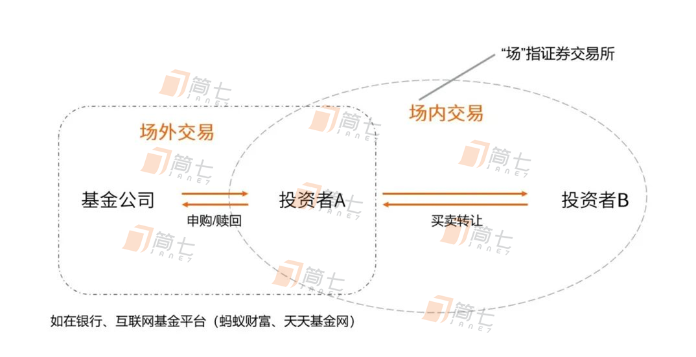
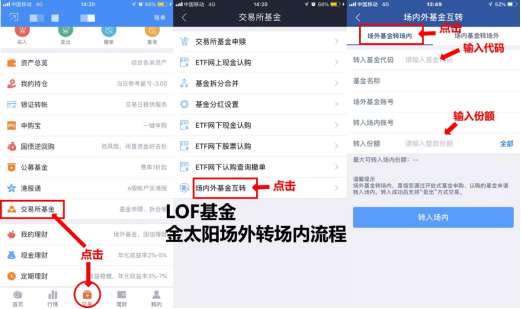
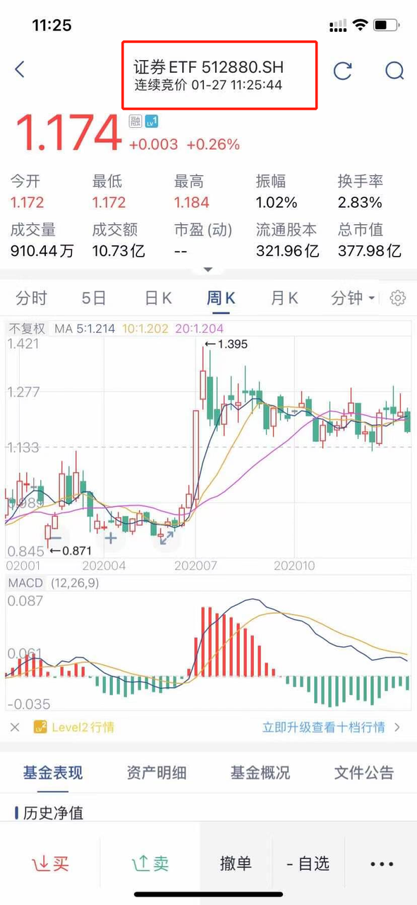
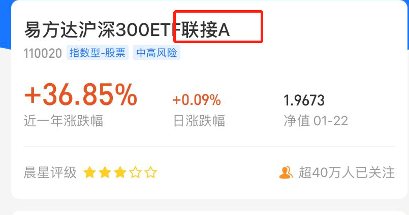
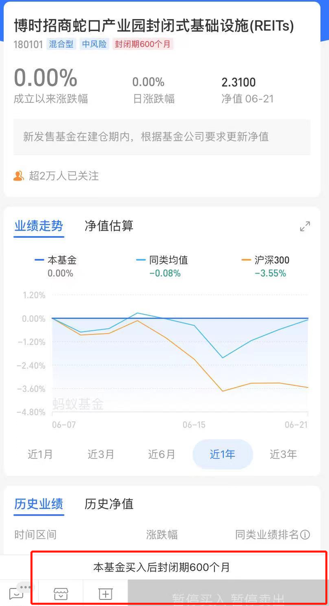

# 「场内基金」是什么？怎么知道自己适不适合买？

还记得第一次在第三方交易平台买指数基金时的不知所措吗？以「南方中证500ETF联接(LOF)A」为例，当时的你也许能理解包含基金公司、指数名字的前半部分，却不知道后半部分的「ETF联接」和小括号里的 LOF 是什么意思。

甚至，那时候的你未必知道自己买的是「场外基金」，但是随着经验的累积，你会渐渐觉得「联接」和小括号像是累赘，而自己已不再满足于只买场外基金。

一直听说场内基金的费率低、产品更丰富，还常常能第一时间尝鲜，可是，「场内基金」到底是什么？在场内交易的时候，需要留心什么？最重要的是，自己真的适合买「场内基金」吗？

相信读完简七的这篇文章，不管你是新手还是熟手，都能找到自己的答案。

祝开卷有知。

> 原文发表于 2021 年 6 月 22 日。

原文发表于 2021 年 6 月 22 日。

这两天，基金市场有点儿热闹——

先是之前热度很高的 *REITs基金*在周一上市了。

接着 9 只*双创50指数基金*也和大伙见面了，一键上车新兴产业龙头公司，多了个选择。

要是还不了解这些产品，可以先看看我们之前的相关介绍。

上面提到的基金，*都可以认购「场内」版本*，上市后也可以在「场内」买卖交易。

有的小伙伴很好奇：

* 「场」到底是什么意思？
* 交易「场内」基金该注意什么？
* 最重要的是，你适合在「场内」买基金吗？

「场」到底是什么意思？

交易「场内」基金该注意什么？

最重要的是，你适合在「场内」买基金吗？

别急，*今天就带你揭开「场内基金」的神秘面纱，掌握它的投资小秘密。*

对咱们国内的基金来说，这个「场」指的就是*上海证券交易所*和*深圳证券交易所，*也就是我们俗称的深市和沪市。

*场外基金，简单来说是从基金公司手里直接买，常见的交易平台有银行 App、基金公司自己的 App 以及支付宝这类第三方平台。*

*场内基金，大多数情况下，是从其他的投资人手上，买他转手的基金，类似于于在二手市场买卖基金。这个买卖，要在交易所（股票账户）进行。*

> 少数情况下，ETF 也可能在场内进行申购赎回，一般投资门槛比较高，普通人参与较少。

少数情况下，ETF 也可能在场内进行申购赎回，一般投资门槛比较高，普通人参与较少。

图片来源：简七读财

场内能够买到的基金中，最常见就是 ETF 基金，还有 LOF 基金和封闭型的基金。

## 1. LOF 基金

LOF，全称是上市型开放式基金。*你既能在支付宝这样第三方平台买到它，也能开通个股票账户，在交易软件中购买。*

细心的朋友会发现，这类基金有两个价格。

我们举个例子来具体说说：

小七想吃王老板家的虾饺，但王老板说今天的虾饺还没做好，要等到下午做好后，按照今天的成本计算完售价再卖。

但小七中午就等着虾饺下火锅，王老板建议她去附近市场看看，那里有之前他家做好的。

于是小七去了市场，但是市场里虾饺的价格，是根据买卖人数多少实时变化的。因为非常想吃，*小七还是用比平时王老板家更高的价格买到了。*

在这个故事里，小七既可以按照下午做好后的固定价格，从王老板手里直接购买，也可以在市场以波动的实时价格从别的人那里买。

虾饺的两个价格，对应着 LOF 基金场内外的价格：

1. 王老板直接卖的价格——场外价格，每日交易结束后基金公司计算的基金净值；
1. 附近市场内找别人买的价格——场内价格，交易时间内实时波动的价格。

王老板直接卖的价格——*场外价格，每日交易结束后基金公司计算的基金净值；*

附近市场内找别人买的价格——*场内价格，交易时间内实时波动的价格。*

另外，现在不少券商 App 和第三方基金购买平台，都支持同一支 LOF 基金场内外互相转换。

券商 App 端，场内外基金转换

## 2. ETF 基金

ETF，全称是交易型开放式指数基金。只能在场内交易的指数基金，也就是*只能在股票账户买卖。*

查询和买卖都和股票类似，在交易软件中输入对应代码：

很多用天天基金、支付宝买基金的朋友，就有点困惑了，*自己也在上面买了带有「ETF」这几个字母的基金，是一样的吗？*

我们在「场外」买的，其实是「ETF联接基金」，没错，常常这类基金都带有「联接」这两字的小尾巴。

图片来源：支付宝

简单来说，*ETF 联接基金，就是替你去投资对应的场内的 ETF 基金，同样也能比较好的跟踪相应指数。*

但并不是所有的场内 ETF 基金都可以找到相应的 ETF 联接基金，一般来说，常见的宽基指数都会有场外联接版本。

举例来说，「易方达沪深300ETF联接基金」主要的投资对象就是「易方达沪深300ETF」。

以后再看到这类基金，相信你也能分清楚了。

## 3. 封闭式基金

是指*事先确定发行总额，设定一个封闭期，在此期间内，不能申购和赎回。*这类基金中的一部分，*同样可以在场内，通过股票账户进行转让、买卖。*

比如，最近很火的公募 REITs 基金，就是一种非常典型的封闭式基金。

由于在*场外有着非常长的封闭期，*少则 10 年，多则 99 年，如果你是一开始场外申购了，那就意味着，得等 10 多年后才能赎回资金。

并且现在场外也无法购买了，这时候，如果想参与，就需要选择在场内交易了。

那么场内基金适合什么样的人来投资呢？

具体来说👇

## 1. 想投资场内封闭基金（比如，REITs）的朋友

有些封闭基金场外确实已经没办法购买了，但产品本身还是不错的，那不妨试试买场内版。

## 2. 想尝鲜新产品的朋友

指数基金在发行时，往往会先发行场内版本，比如这次的双创50，如果觉得质地不错，想先买点尝试一下的，可以试试场内版本。

## 3. 在乎手续费的朋友

如果遇到佣金优惠的券商，场内投资是一个节约手续费的选择。特别对于单笔交易金额大的，比场外买省钱。

所以，场内可以买到一部分场外没有的基金，还可以参与场外暂停买卖的基金。

可能你已经觉得可以尝试一下投资场内基金。

这里还有两点，值得在投资前关注 ——

## 1. 选择费率合适的券商

一般场内基金的购买费在*万分之三*左右，根据不同券商会有一定的上下调整。

所以投资前，还是*尽量选择一家费率低的券商，降低买卖造成的手续费。*

## 2. 注意场内基金的折溢价风险

前面，我们提到 LOF 基金有两个价格。折溢价具体指的就是，这两个价格对比的结果。

*有的基金场内交易火爆，买的人多，成交价可能比场外价格高（溢价）；反之，可能会比场外的低（折价）。*

就像二手市场上，除了东西本身的价值，还取决于买卖双方的需求。

你可能听说过「基金套利」，说的就是根据这两个价格之间的差异，来进行低买高卖，赚取一定价差收益。

但这种操作，风险不低，有的基金流动性太差，场内无人问津，拿在手里降价也卖不出去，很可能套利不成反赔本。

总的来说，*我们投资基金，还是更看重未来长期的价值，这种套利的方法，还是不建议大家过度关注。*

好啦，今天关于场内基金的详细解答就到这。

*投资基金的你，平时是通过什么方式买基金的呢？*不妨留言和大家一起分享你的买基心得吧。

> 来源：公众号「简七读财」转载文章发表的所有信息仅代表作者个人观点，不对您构成任何投资建议，详见[《文章免责声明》](https://youzhiyouxing.cn/agreements/ARTICLE_DISCLAIMER)。
