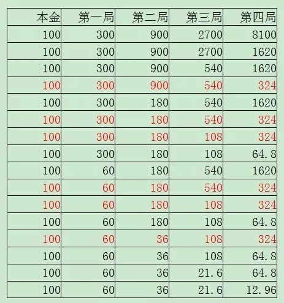

# 不必为坏运气反省

2020 年 2 月 3 日，鼠年第一个交易日，据说有超过 3600 只股票以跌停开盘。

记忆中这应该是中国股市有史以来排名第二恐慌的开盘数据，仅次于 1997 年 2 月 20 日沪深两市全体跌停开盘的气势（ 2 月 19 日晚，小平同志逝世），不过，那时深沪两地股票总数也没有 3000 只。

从市值回撤的角度看，这也是老唐 25 年投资生涯里，市值回撤额最大的开盘时刻。

上午 9:30 那一瞬间「亏掉」的市值，比十五年前的账户总值还多。说完全没有一点点的压力，那也是不现实的。

将心比心，估计书房里不少朋友都有同样的压力，并可能在痛心之中引发一些反思。

但是，此时老唐要提醒朋友们的是，*千万不要因此陷入为坏运气反省的误区。*

这个世界上，本就没有完美的交易系统。任何一种投资体系，都有其利、有其弊（否则，全世界的钱会让你一个人赚光）。

享受其利，承受其弊，这应该是我们在投资理念建立过程中就必须明确的。理念不够清晰和坚定的朋友，往往在*应该正常承受其弊时，开始「反省」。*

此时最常见的反省，比如：春节前已经有疫情苗头了，我居然毫无反应，太迟钝了。如果我春节前抛出，哪怕今天开盘补回来，也是足足赚 10% 啊，那是多少多少钱；

或者总结出经验教训：在形势不明朗的时候，应该清空离场，待形势明朗再重新进入，哪怕为此负担一点差价，也可以视为保险支出云云。

这其实是不知不觉地陷入了穿越者视角。

人类每天面临的各种疾病或者灾难信号，不计其数。疫情发展到今天的模样，我们站在未来视角回溯历史，会发现所有信号如此清晰，如此完整，一环套一环，完全不应该被忽视。似乎正是因为我们的疏忽大意，才导致陷入如今的局面。

然而，如果假设有一个平行宇宙，哪怕从春节前一模一样的局面开始，今天也有非常大的可能性和现有局面完全不同：可能更好，也可能更糟。

无数偶然的小事、意外、关键人物的一念之差，甚至只是某个小人物的灵光一现，都可能改变历史的进程。完全一样的发展，反而是极小概率的事情。

曾经在网上遇到过一些文章，说 2008 年「512」大地震前，已经有许多媒体或网民在网络上发出警告，并言之凿凿地截图证明这些推理和警示不是马后炮，均发生在地震之前。

逻辑稍微糊涂的人，很容易就会被这些「证据」激怒，似乎那场伤亡数十万人的灾难，纯粹是因为某些官员不作为造成的。

但理智的或者有经验的朋友会知道，几乎任何一场灾难发生后，回溯寻找的话，都能发现之前言之凿凿的警告。

这并没有什么神奇的，原因说穿了，不过是因为地球有 70 亿人，每天都会有无数闲人，或认真或扯淡地撰文或发帖，警示某某地方会在某某时间出现某种灾难。

灾难没有发生，这些帖子或文章可能就会淹没在无穷无尽的垃圾信息里。而灾难一旦发生，这些帖子就会被用关键词搜索出来，展示其「英明神武」。

简单的比喻就是：「某某经济学家准确地预测到了过去 20 年里 3 次经济危机中的 108 次」，或者「为什么每天都有人买到涨幅榜排名第一的股票呢？」，其实一点儿也不神奇。

有些人知道这并不神奇，只是作为茶余饭后的谈资；有些人不知道自己并不神奇，忘乎所以地过过嘴瘾；而有些人则是有意的骗子，因为某些阴暗目的，选择性表述和展示所谓「事实」（的一部分）。

至于等待形势明朗再入市，那是电视股评师们的口头禅：「建议投资者持币观望，待形势明朗后再入市」。如果你也有这种症状，证明你已经被电视股评师感染，需要隔离电视股评，冷静思考。

*资本市场永远是不明朗的。*明朗的形势只有两种：过去的形势和不开盘时的形势。明朗的股票也有两种，一种是过去的股票，一种是别人的股票（一旦你参与就不明朗了。这是个玩笑，请勿当真）。

如果形势真的明朗，那就不会有成交，因为大家都在向一个方向冲，无法形成交易。比如今天这样的形势，接下来究竟会怎么走，明朗吗？100 位投资者可能有超过 101 种看法。

今天跌停板乃至盘中购买的数以亿计的资金，和跌停板抛出乃至盘中持续抛出的另外数以亿计的资金，谁眼中的形势会是未来真正的「形势」，谁知道？——时间知道，别急，未来会告诉你的。

真知道未来的人不需要投资股票，随便买买彩票赌赌球赌赌马炒炒金融衍生品，收益都会远高于投资股票。

能来投资股票，这件事本身就已经证明了你我他不是知道未来的人。

对于投资者来说，*投资理念或企业分析「错误」和只是遇到「坏运气」，这两件事一定要区分清楚。*

错误，可以反省，并在以后努力纠正。而坏运气，不需要反省，只需要笑笑后忽略（哭哭后忽略也可）并继续按照原来的策略进行即可。

*对坏运气进行「反省」，越深刻越糟糕。*它将严重破坏你的投资体系，使你陷入患得患失的焦虑之中，并不知不觉跟随市场先生的指挥棒，做出有损投资回报的错事。

什么叫坏运气？让我引用经济学巨匠，诺奖得主保罗·萨缪尔森的一篇论文里的一个例子来解释一下它：

假设有一个赔率很高、赌徒享有明显优势的赌局：抛硬币，输赢概率各 50%，赔率为 5:1，头朝上收回 6 元（含 1 元本金），字朝上赔掉 1 元。

这样的赌局，很显然，不去占个便宜简直不配叫做投资者。按照凯利公式的计算，能够保证永远不会输光，且能利润最大化的单次投注比例是 40%。

假设一个赌徒以 100 元为起点，每次下注手头全部资金的 40%，即第一次赌局后衍生出两个轨迹，赢了变 300 元（40 × 6 + 60 = 300），输了变 60 元。

如此这般持续四次后，将产生16条财富轨迹，如下表所示：

四次赌局之后，赌徒的资金额必将是 8100 元，1620 元，324 元，64.8 元，12.96 元六个结果中任意一个。其中概率最大的是 324 元，来自四次赌局中两赢两输的六种组合。

四次 50% 胜率的赌局两赢两输的结果，是统计学意义上的「大概率」。但是*「大概率」并不等于「必然」。*

*即使是优势如此明显（胜率 50% ，赔率为 5）的赌局，最终仍然有高达 5/16 的可能性是亏损。*其中有 1/16 的可能性亏的只剩下 12.96 元，亏损 87.04%；有 4/16 的可能性亏的剩下 64.80 元，亏损 35.2%。

如果你遇到这 5/16 几率时，开始反省自己不应该参与赌局，或者反省自己没有在赢钱的时候及时撤退，那你就是在为坏运气反省。

这样具备明显优势的赌局，任何理性的投资者都应该尽最大可能持续参与，并明白出现 5/16 的亏损几率是正常态，只要持续按照规则下注，不但亏损会拿回来，盈利也是必然的。

*从概率角度说，投资人真正所做的事情其实可以归纳为两件：第一寻找开错赔率的赌局，保证自己参与具有明显的胜率或赔率优势，第二管理资金以保证自己可以持续待在赌桌旁。*

*留个思考题：*如果你是上面这个赌徒，假设你已经连续抛出四把人头，手中变成了8100元本金，此时，你会停手离开吗，为什么？你认为应该停手离开吗，为什么？

另外，有些新朋友比较惊奇地追问（可能是有些不敢相信）：此时老唐真的会继续坚持满仓不动吗？

道理老唐在《[鼠年开篇散打](https://mp.weixin.qq.com/s/cl5ftX894MFrWDOmhHXQUQ)》里已经谈过，不再啰嗦，好奇而又没懂的朋友返回去再读就是了。

其实进书房较早的朋友都实时围观过，2018 年最厉害的时候，年内亏损高达 24%，老唐还不是一边满仓傻坐，一边熬鸡汤分享给朋友们。

此时 2020 年内亏损还不到 9%（其中 2 月 3 日当天亏损 4.87%），哪到哪儿啊，没压力没压力，不用替老唐担心。

不过，需要郑重声明的是：

*老唐说的是自己的钱和自己所在的赌局。*

你的金钱期限，承压能力，所处赌局的胜率和赔率，仓位分配等等，恐怕都不可能和我完全一样，所以*决策只能你自己做，并由你本人为你的账户承担责任，万万不可将老唐的文章理解为鼓励你满仓扛下去。*切记切记！

朋友们多保重，尤其是被封在湖北及武汉疫区里的朋友们，这场战「疫」一定能赢，我们目前要做的，除了对奋斗在一线的所有人员心怀感激之外，最重要的就是保护好自己，保护好家人，等待光明和胜利的到来！

> 来源：公众号「唐书房」转载文章发表的所有信息仅代表作者个人观点，不对您构成任何投资建议，详见[《文章免责声明》](https://youzhiyouxing.cn/agreements/ARTICLE_DISCLAIMER)。
