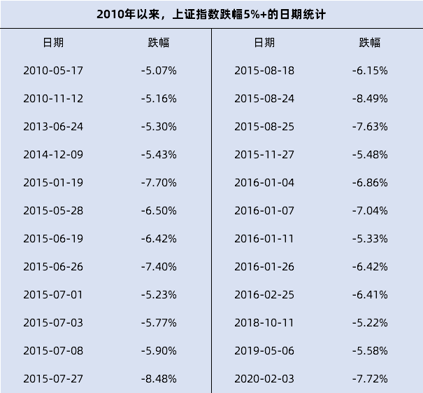
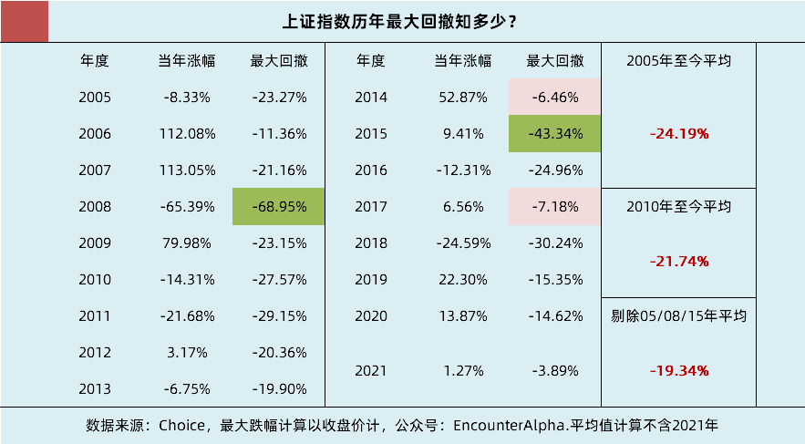
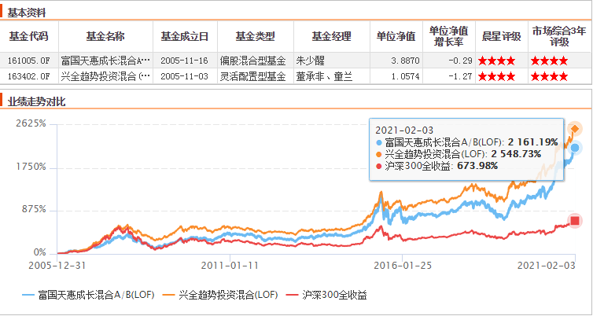
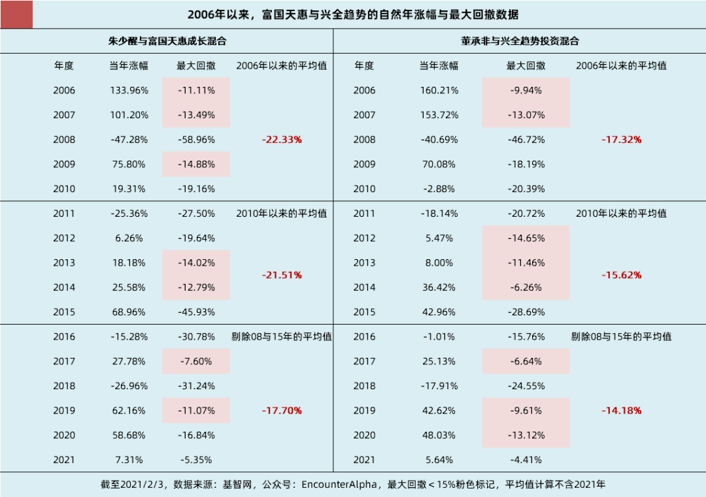
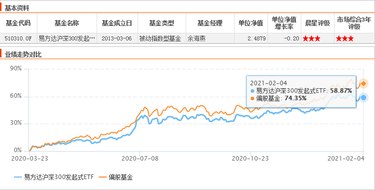

# 为何要时刻准备股市下跌的考验？

每周四，为你精选一篇投资好文。

2 月份的A股走势仿佛是一列过山车——上半月持续走强，下半月急转直下，不少投资者备受煎熬。

今天的这篇文章来自 EA 君，他在 2 月初的时候就根据近十几年的A股数据，分析了当前市场的客观情况，提醒投资者要建立心理预警机制。

股市涨跌是常态。无法承受下跌的波动，只会给自己带来财务损失和心理打击。希望文中的几点建议能抚慰你最近的情绪，帮你走得更远。

祝开卷有知。

2020 年的 3 月中下旬是A股市场最近的一个大型黄金坑，在境外新冠肺炎疫情爆发的冲击结束之后，A股市场开启了一轮幅度不小的震荡慢牛行情。因 2020 年的 6 月底与 12 月底有两轮比较明显的赚钱效应，不少新手投资者来到了A股市场。

不少投资新人只是抱着试试水的心态参与其中，但因为整体的赚钱效应不错，很多投资新人都关心加仓基金的问题。平和的震荡慢牛当中好似没有什么危险，好似再难有较大幅度的回调给我们以买入的机会了。事实果真如此吗？

*以古为镜，可以知兴替。参与A股市场投资，必须要充分了解A股市场的历史与特色。*尽管A股市场的参与力量正在逐渐发生变化，散户的力量减弱，机构与外资的影响力与日俱增，但因为散户与机构的人性不变，A股市场的脾气秉性恐怕与过去并无太大的变化。

*承平日久，人不知兵。我们可能逐渐习惯了震荡慢牛，但真实的A股市场却是一个以波动大著称的市场。*太久远的历史先不说，就看 2010 年以来的A股市场便可知。*自 2010 年以来，上证指数单日收盘跌幅大于 5% 的日子共有 24 天，平均每年能摊上两天。*

过去 10 年有 24 天，上证指数日涨跌幅大于 5%

事实上，自 2010 年以来，只有 2012 与 2017 年未出现此种情况，其他各年份都出现过上证指数单日收盘跌幅大于 5% 的情况。上证指数收盘都大于 5% 了，一般性的指数与基金跌幅必然大于 5%，因为上证指数里的大市值金融与油气公司一般是抗跌的。

来到A股市场进行股票型基金投资，您做好单日承受 5% 以上跌幅的准备了吗？*历次大跌几乎都是不可预测的，*虽然从2010年的交易日来看，只有 0.89%（24/2698 个交易日）的发生概率，但别忘记*一年可是有 240 多个交易日的。*

说完了极端的单日跌幅，我们再来看看上证指数自 2005 年以来的自然年最大回撤情况。2005 年，A股市场拉开了*股权分置改革*的序幕，自此A股市场愈发规范化。

2005 年至今上证指数自然年最大回撤统计

2005 年以来，统计上证指数自然年内的收盘价最大回撤幅度，映入眼帘的很多数值都是 -20% 甚至更大。在统计时段之内，只有 2014 和 2017 年，上证指数的自然年最大回撤在 10% 以内。

*即便是 2006 与 2007 年、2015 年的牛市行情中，也都出现过上涨途中，上证指数突然回调 10% 左右的情况。2007 与 2015 年都是统计的牛市最高点到来之前的情况，非牛熊转换后的统计。*

自 2005 年以来，即便我们剔除了 2005 股权分置改革的元年，剔除了 2008 与 2015 牛熊转换之年的巨大下跌，*上证指数的平均自然年跌幅还是接近 20%。*

我们再乐观一点，考虑到A股市场的进化，参看最近几年的情况，我们认为投资中，在自然年内要做好上证指数回撤 15% 左右的心理准备不过分吧？

我之所以选择上证指数先行讨论，是因为大家对上证指数的熟悉程度最高，上证指数的跌幅与关键点位会有较大的市场影响力。

考虑到读者朋友都投资公募基金，那我就选取 2006 年以来投资极为成功，基金经理在职极为稳定，投资风格有互补的两只基金来进行考察。*它们就是大家非常熟悉的朱少醒经理的富国天惠成长混合、董承非经理的兴全趋势投资混合。*

公募基金长期投资价值的典范

我们可以看到，除却遥远的 2006 年，兴全趋势只有 2014、2017 和 2019 三年，基金净值最大回撤在 10% 以内；富国天惠只有 2017 年基金净值最大回撤在 10% 以内。

富国天惠与兴全趋势的自然年最大回撤统计

观察富国天惠与兴全趋势自 2006 年以来的自然年最大回撤，*我们剔除 2008 与 2015 年这样的极端牛熊转换年份，两只基金的最大回撤平均值依旧大于 15%。*

虽然样本极少，但富国天惠和兴全趋势当前仍是晨星网的四星评级基金，两位老将的管理实力依然是中上等的，他们的行业布局依然是比较均衡的。*据此合理推测，投资偏股型基金每个自然年也要时刻准备接受 15%～20%的下跌考验。*

如果我们不是准备在A股市场赚一票就走，而是立志于要长期投资，我们应该做好这样的心理建设，坦然接受偏股型基金在自然年内出现 15%～20% 的回撤。

*这是长期投资的代价，也是未来历史新高之际，你还在的最简单办法（尽管代价大一点）。*当然，A股市场的整体估值越高，投资者的贪婪情绪越高，最大回撤的幅度就会越大。

*投资中出现下跌波动不是风险，无法承受下跌波动，「中道崩殂」却是极大的风险。*

因为只要持有的资产质地过硬，时间没有填不上的价值之坑。下跌提供了*稳健理财类资产（稳健型二级债基、偏债混合基金）转换为优质股权资产的机遇，*能勇敢逆向而行的投资者，就可以化危为机。

尽管这些逆向而行的投资者没躲过下跌，他们此前的盈利大幅缩水，长期投资的年化收益率数据也降低了。但他们把握了机遇，用稳健理财类资产换到了更多数量的优质股权资产。

*当相关资产价格再度回到此前下跌的起点时，逆向而行的投资者的盈利金额却比之前多得多。对于普通投资者来说，好看的年化收益率，绝不如大资金中等年化收益率来得实在。*

如果无法承受下跌波动，跌怕了不敢再把股权资产用更低的价格买回来，等到黄金坑填平再用同等甚至比当初卖掉时更高的价格悻悻买回，则这一笔投资无疑是失败的——没躲过下跌，也没有把握机遇，回到最初下跌起点的位置，自己持有的优质股权资产还更少了。

*这样的结局还不如那个一直呆呆持有，回调也没有加仓，但一直能等到黄金坑填平的投资者，因为他只是年化收益率降低，但股权资产一分没少。*

参与时间早，盈利可提升应对下跌波动的信心

既然A股市场每个自然年都大概率有 15% 左右的回调，那对于刚入市还没有什么仓位的投资新手来说，就空仓等待吗？并非如此。我们可以看到，A股市场有回调，*但回调带来的冲击也可以用时间积累下来的价值去抵消。*

尽管从价值的角度去考虑，不应该想那么多成本的问题。但从解决心理问题的角度考虑，哪怕是有个 15%～20% 的整体盈利，面对 15%～20% 的回撤也不会太慌。

我们敬畏A股市场，但我们同样敬畏A股市场短期涨跌不可预测的常识。*因此，即便当前上证指数在 3500 点徘徊不前，投资新手依然可以建立自己的一次性投资计划。*

从长远来看，20%～30% 的股票资产配置，不会有不可控的大风险。当然，股票资产的配置比例，要看个人的具体情况，这就无法给出具体的数值了。*但切记，千万不要市场上涨觉得自己仓位轻，市场下跌又觉得自己仓位重。*

上证指数、沪深300、优质偏股型公募基金的自然年最大回撤还启示我们，结合市场估值温度，在下跌 10%、20%、30%、40% 或者 15%、30% 这样的档位（自定就好），我们要注意把一定比例的稳健理财资产转换成优质股权资产，*以免自己毫无作为，不知不觉间错过了黄金坑的大好机会。*

*如果中途没有资产的卖出，买入的价格就决定了你未来每一个时点的收益。*A股市场的投资注定不会一帆风顺，为了避免极端行情中的情绪失控，*多建立一些人无我有的认知是非常必要的。*无论从投资心态上还是从资产配置上，我们都时刻准备着迎接 15%～20% 的下跌考验！

> 来源：公众号「EncounterAlpha」转载文章发表的所有信息仅代表作者个人观点，不对您构成任何投资建议，详见[《文章免责声明》](https://youzhiyouxing.cn/agreements/ARTICLE_DISCLAIMER)
