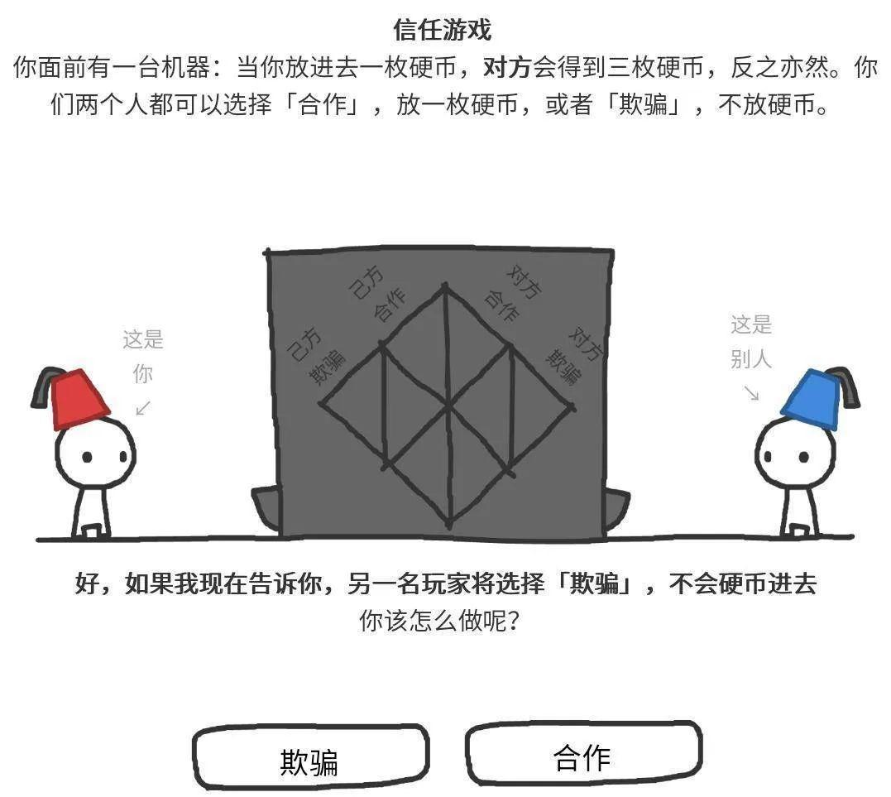

# 小心投资中的「伪规则」

投资中有很多看似正确的话，这些话看起来有道理，但其实没有办法指导我们的操作。

拿「越跌越买」来举例。如果一只股票的内在价值是 10 元，牛市时涨到 30 元，你一直忍着没买。牛市顶峰过后，跌了 20% 到 24 元，按照「越跌越买」的规则，你应该开始入手。但高估就是高估，牛市情绪过后，股价大概率会慢慢回归内在价值，股价从 24 元继续一路下跌到 15 元。如果你按照「越跌越买」的规则一路购买，结果我不说你也知道了……

根本原因在于，「越跌越买」并不是一个可以放到投资系统里面，真的能起到作用的规则。

如何验证哪些规则可以真的帮到我们呢？谭老师的这篇文章，可以给你答案。

祝开卷有知。

昨天收盘后的下午茶时间，我跟团队小伙伴在讨论一个很有意思的话题——规则与弹性。（注：文章首发于 2020 年 6 月 17 日。）

曾经有很多读者都跟我提起过，有一句我原创的话，他们印象特别深刻，那句话是：**预测如醉驾，规则是铠甲。**他们觉得这句话特别受用，也特别重要。

那么，到底什么是「规则」呢？

别小看这个简单初级的问题，别忘了，一百个人的眼中有一百个哈姆雷特。

比如说，很多价值投资者信奉「越跌越买」，这四个字是不是一条规则？

我把这个问题抛给了小伙伴，得到的答案却有些出乎我的意料。

一开始，他们都认为，这是一条规则。

于是我接下来问了他们另一个问题：为什么我们都认为规则那么重要，规则的重要性体现在哪里？

我得到了三个答案：

* 一，规则让我们赚钱；
* 二，规则确保我们实现目标；
* 三，规则约束我们，我们不犯大的错误。

**一，规则让我们赚钱；**

**二，规则确保我们实现目标；**

**三，规则约束我们，我们不犯大的错误。**

我说这三个答案都对，那么我们再来看看，「越跌越买」这句话，能够确保能实现这三个目标吗？

越跌越买，如果在熊市中，也许不但不能赚钱还会赔大钱，因此它不能保护我们不犯大的错误，也不一定能让我们实现目标。

很显然，「越跌越买」这四个字，并不能确保我们实现以上三个目标。那这一条还算规则吗？

有些小伙伴们会说，这只是一条规则呀，它还需要跟其他的规则配合。比如要有一个价值的股票池，比如在什么条件下不能越跌越买等等。所以只靠一条规则，肯定达不到以上目标，达成目标必须要有一整套的规则。**好比要十几条车轴才能组成一个车轮，或者是有很多零部件才能构成一个机器，你不能指望一个零部件就能达到目标。**

我认为这个比喻用得特别好，只有一个车轮才能称之为车轮，我们不能把一条车轴称为车轮。所以，同样地，我认为，越跌越买这句话不构成一条规则。

那规则的标准是什么呢？我觉得至少要满足以下几点：

**第一点，规则是不二的。**老喻曾经说过一句话叫「灰度认知，黑白决策」。我们的认知是个连续谱，但是我们做决策的时候是一个离散谱。

一个公司的判断，你很难简单地用好或者坏来定义。大部分公司都介于好坏之间。但是它的股票你买还是不买，这个决策却是一个要么黑，要么白的决策——要么买，要么不买。

**规则也应该是黑白的，它没有中间地带。**

**就像传说中的倚天剑的刃——没有东西能够立在中间，要么在左边，要么在右边。**

那我们再来看「越跌越买」这句话，它充满了弹性，就好像一个橡皮筋。是跌 10% 买，还是跌 20% 再买呢？是买 1 万块钱还是买 100 万呢？

这句话都没有界定，所以充满了弹性，而橡皮筋不能成为规则。

**第二点，规则能够让我们对行为产生明确的预期。**

在博弈论中，有很多学者做过大量关于人际交往模型的研究。通过计算机模拟最后得出的结论是，「一报还一报」是一个最佳模型，长期来看收益最稳定。

「一报还一报」的意思就是说：如果你对我好，我就对你好；如果你对我不好，我也对你不好。如果你一段时间对我不好，突然又对我好了，下一个回合我也会对你好，我不记仇。

小游戏：信任的进化

以上这些就是明确的规则。它会让自己和别人对你的行为产生一个明确的预期。事实上，在人际交往中，让预期明确，恰恰也正是模型起作用的关键要素之一。

规则让你的行为变得可预测。

那我们来看「越跌越买」这句话，它其实不会对行为产生明确预期，因为它的弹性太大了。

在有些时候越跌越买，你的收益就增长了，有些时候可能破产了，没有明确预期。

**经过讨论之后，我们就这两条标准达成了共识：** 1）规则必须是黑白的，不二的； 2）规则要能对行为产生明确的预期。

而这个时候，小伙伴提出了另外一个问题——什么是弹性？

在纯量化的策略中，我们可以说每一条规则都是零弹性。当价格出现一个变化，就会产生一个对应的交易行为，没有中间地带。

但是在主动交易中，比如说巴菲特在买入一家公司的时候，跌到什么价位，具体买多少，它不是一个严格量化的结果，这里面有一定的弹性。

再比如说一个价值投资者用某个标准选出了 5 只股票，最终他可能只买其中的一只。他买哪一只？这里面也有弹性，甚至是随机性。

可以说，弹性在投资决策中是大量存在的。**规则和弹性之间是什么关系呢？**

我认为，**好的规则是可以容纳弹性的。**举个例子，你对一只股票的配置权重是 8%～10% 之间，这是一条有明确界限的规则，但是它包容了弹性，你仓位在 8%～10% 之间都符合规则。

接下来这句话很重要：**规则可以包容弹性，但是规则执行不应该有弹性。**

如果我们定了一个规则，这只股票应该配 10%，但是在执行的时候偏离了这个数字，这种执行的弹性，是我们所不应该允许的。

当我们明白了这一点，就能打通量化交易和主观交易中间最底层的那个逻辑。

**在量化交易中，所有的规则都写死在计算机代码里面，可以说是零弹性。这样做的好处是确保决策的一致性，确保不受情绪的干扰。**

**而在主观交易中，真正能够长期稳定的人，他一定有一套内化的规则。这个规则是可以容纳弹性的。**比如说他要买高 ROE 的股票，到底高到多少算高？这里面有一定的弹性，它可以根据主观经验去做一些取舍。

**之前我讲过冯柳的「心动即行动」，那也是一种弹性。但是，确保长期盈利的绝对不是这种弹性，这种弹性只是一种对心态的对冲和修复。确保长期稳定盈利的恰恰是弹性外面的那个圈，我称之为决策弹性圈。**

当我们能够划定一个圈的时候，圈内的弹性是可以允许的，但是如果没有圈，光靠这个弹性就一定不行。

就好比孙悟空用金箍棒画了一个圈，唐僧在圈内干什么，都是安全的。

小结一下，今天我们谈了关于规则的深度理解，规则有两种：

* 一种是倚天剑的刃，零弹性，非左即右；
* 另一种是孙悟空用金箍棒画的那个圈，在圈内可以允许一定的弹性存在。

一种是倚天剑的刃，零弹性，非左即右；

另一种是孙悟空用金箍棒画的那个圈，在圈内可以允许一定的弹性存在。

如果连这个圈都没有明确的界定，那就是伪规则，你要很小心，这样的伪规则其实很多，它们都是很大的坑。

你有这方面的经验或者教训吗？欢迎你留言分享自己的看法。

> 来源：公众号「RIH投读会」原标题：小心投资中的「伪规则」，那是很大的坑|谭校长一千零一夜NO.147转载文章发表的所有信息仅代表作者个人观点，不对您构成任何投资建议，详见[《文章免责声明》](https://youzhiyouxing.cn/agreements/ARTICLE_DISCLAIMER)
