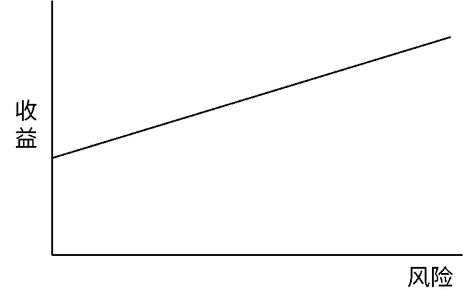
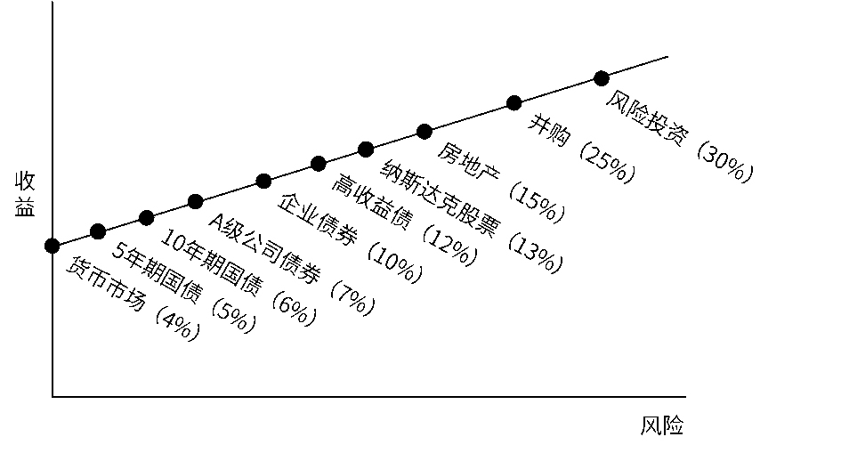

# 感受心理和情绪的周期影响

在[《投资第一课》的第五章](https://youzhiyouxing.cn/n/materials/186)中，我们提到：市场之所以会有周期，是因为经济周期、企业盈利周期和情绪周期这三大因素的存在，而其中对市场波动的影响大的要数「情绪周期」了。当时，我们一起回顾了「漂亮50」的兴衰成败，感受了一次完整周期。

今天为你精选这篇文章，同样是在讨论「情绪周期」，但换了个角度带我们感受它。作者以霍华德·马克斯对「高风险产生高收益」的解读为起点，厘清了为什么这样的表述存在过度简化的问题。先引导我们对风险和收益的关系，形成起更合理的认识，再提示我们留意，投资过程中常见的两种面对风险的态度。

如文中所说，我们很难拥有直接感知市场周期的能力。但是，我们能做的是，留心观察自己当前所处的位置，感受心理和情绪的周期影响，做出更好的投资决定。

祝开卷有知。

> 恐惧和贪婪，怀疑和信任……这些心理和情绪周期充分表明，投资人只有极少时间走幸福的中庸之道，大部分时间都在走极端。——霍华德·马克斯《周期》

恐惧和贪婪，怀疑和信任……这些心理和情绪周期充分表明，投资人只有极少时间走幸福的中庸之道，大部分时间都在走极端。

——霍华德·马克斯《周期》

将时间的跨度拉长来看，自然界从来不乏周期的迭代。而在投资的世界里，无论是投资者耳熟能详的美林时钟模型，还是堪称经典的市场周期四阶段论，似乎也在传达一个信息：尽管市场的未来是难以预料的，但周期的存在却是永恒的。

关于市场周期的话题，我们之前已经讨论过（点击查看：[经济周期与投资中的长期主义](http://mp.weixin.qq.com/s?__biz=Mzg2MDEyNDczMw==&mid=2247486347&idx=1&sn=623028873c1bde684bb9a2b876d613d8&chksm=ce2a68d9f95de1cfb99e45d82bf68186c3e8762939f7e5e47721d03c2d5d83b187e00c5e6692&scene=21#wechat_redirect)）。投资人对待风险的态度同样存在周期规律，一方面受到市场周期的影响，另一方面也可能成为市场周期的放大器。

从实践的角度来看，如果说，作为普通投资者的我们，对于市场周期的感知存在难度，那么时刻保持对市场上大多数投资人风险态度的关注，对于我们的投资行为或许具有一定的指导意义。

霍华德·马克斯在《周期》中谈到风险和收益时，曾经提到一张我们每个人都不陌生的图片——

很多人将这张图解读为「高风险产生高收益」，但马克斯指出这种过于简单的表述，具有严重的误导性。我们需要反复斟酌的问题是：

*风险和收益之间的关系究竟是不是线性的？或者说，在多大程度的可能性上存在线性关系？*

单从理论研究的角度审视上图，本无可厚非，但投资者真正置身投资过程时会发现，图中这条直线夸大了风险和收益之间的相关性。事实上，*每种水平的风险对应的不是只有一个收益，而是一个包含多个收益水平的区间*。

因而，对于上图正确的解读应该是：那些*看起来*更高风险的投资，必须*显得*能够保证更高的收益，否则愿意投资的人就会寥寥无几。马克斯在这句话中用「看起来」、「显得」这两个词颇为严谨，因为*投资中的风险和潜在收益只能是估值，而不具有确定性*。

当风险上升时，我们需要一定的补偿收益来作为担保。此时，我们追求的就是所谓的「风险溢价」，即我们承担一个单位的增量风险*所预期得到的增量收益*。为此，马克斯为我们画出了一条贯穿了市场上主要投资标的的「风险 - 收益线」。

风险 - 收益关系与资本市场线 | 图片来源：霍华德·马克斯《周期》

尽管国外金融市场和资产类别与我国存在一定差异，但图片背后隐藏的逻辑仍然是相通的——在现实中，人们的风险规避心理及其相应的投资行为共同塑造了投资环境。在这样的环境里，「承担的风险越高，要求的收益率也越高」似乎成为了投资者的共识。

厌恶风险是大多数投资者天性使然，也正是投资者的这种风险规避心理，为市场的理性运作提供了可能。但在现实生活中，投资者也常常可能会产生偏离理性的心理和行为，从而和市场周期产生背离。

*第一种情况，风险规避不足*。这种情况常常伴随着牛市或利好事件的爆发。当市场行情过热，一切看似顺风顺水的情况下，投资者往往变得更加兴奋和过于乐观，从而放松对风险的警觉。此时即便风险溢价十分微薄，投资者也敢冒风险作出投资决策。这种现象使高风险资产的价格得以抬升，而相对安全的资产则变得鲜有人问津。

也因此，本杰明·格雷厄姆在《聪明的投资者》中坦言：*牛市是普通投资者亏损的主要原因*。群体狂热之下，冲动代替了理智，投资变成了投机，每个人都不敢停下脚步，于是人们纷纷蒙眼盲奔，忘记了真正的方向在哪里。

在这种大多数投资人对风险过度容忍的情况下，真实的风险其实正在逐渐高企，而它真正能够给投资人带来的风险补偿或风险溢价却是逐渐降低的。所以，投资人之中普遍的风险容忍可能成为后面市场下跌的征兆，也是最容易被理智投资者发现的征兆——当我们发现大多数投资人已过于狂热之时，这可能提醒我们在投资时一定要多加谨慎。

风险规避不足导致追涨买入的代价是高昂的，但当市场反向下跌，市场情绪转为萧条之时，*第二种非理性心理便出现了——风险规避过度*。

马克斯通过对 2008 年金融危机中投资者的投资情绪进行观察，得到了一个奇妙的发现——金融危机爆发前的风险规避不足者与爆发后的风险规避过度者几乎是同一批人。

当幻想中的牛市泡沫碎裂之后，人们纷纷从美梦中醒来，却又走向另一个极端，变得畏畏缩缩。原来买入未经考验的金融工具是基于积极利好的假设和做梦一样的承诺，但现在这些人的态度转而相信整个金融体系随时都可能崩溃。因此，负面环境导致投资人过度风险规避，群体恐慌之时，人们更多时间用于确定如何才能避免任何损失，却忽略了这样做也可能会错失极佳的投资机会。

对于每一个投资者来说，市场周期运动与投资者情绪反复相互影响，*我们要做的不仅仅是修炼自己的平常心，更应该时刻关注当前我们处在风险态度周期中的哪个位置*。

* 当市场乐观主义因素占据了极大比例时，要当心利好因素可能已经被纳入市场定价，此时在狂热中我们应当保持谨慎；
* 而当市场上乐观主义水平处在低位甚至没有时，就有可能出现市场价格很低的情况，业绩预期不高，负面意外发生的可能性就会大大降低，而等到乐观主义稍微有一点儿好转，又会导致市场价格上升。

当市场乐观主义因素占据了极大比例时，要当心利好因素可能已经被纳入市场定价，此时在狂热中我们应当保持谨慎；

而当市场上乐观主义水平处在低位甚至没有时，就有可能出现市场价格很低的情况，业绩预期不高，负面意外发生的可能性就会大大降低，而等到乐观主义稍微有一点儿好转，又会导致市场价格上升。

**延伸阅读**[《投资第一课》：为什么市场会有周期?](https://youzhiyouxing.cn/n/materials/186)[霍华德·马克斯：你不能预测，但你可以准备](https://youzhiyouxing.cn/n/materials/30)[霍华德·马克斯：市场皆有周期之牛市和熊市的特征](https://youzhiyouxing.cn/n/materials/140)

> 图文来源：公众号「睿远FUND」作者：黄凡 转载文章发表的所有信息仅代表作者个人观点，不对您构成任何投资建议，详见[《文章免责声明》](https://youzhiyouxing.cn/agreements/ARTICLE_DISCLAIMER)
