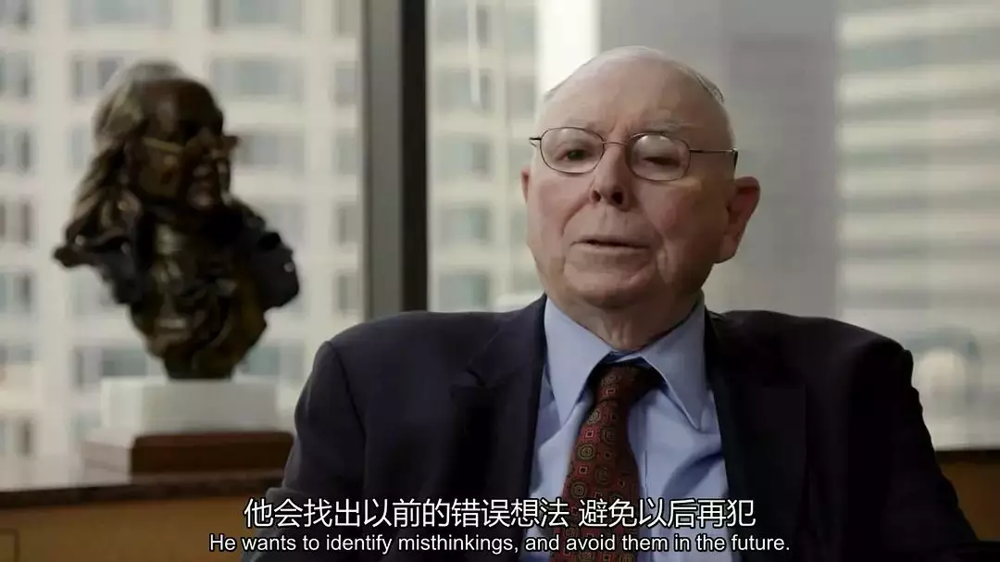

# 投资者的一生，其实都在和自己的情绪作战

彼得·林奇说：「投资的窍门不是要学会相信自己内心的感觉，而是要约束自己不去理会内心的感觉。」

投资，是一门逆人性的艺术。这几乎是所有投资大师们的共识。

年少的时候，我们会更容易看重某些显性优势，比如智力、比如口才，之后会逐渐让位于自律、耐心、踏实等品格。

因为在时间的考验下，这些「逆人性」的品格才是真正帮助我们走得更长更稳的利器。

本文从心理学的一个概念「控制错觉」入手，提出这个心理现象与投资中的「频繁交易」和「坚持捂盘」息息相关。

投资一时得志易，持久成功难，投资大师们最突出的共性就是「逆人性」的品格。

玩飞行棋和大富翁游戏掷骰子时，大家可能都有这个感觉，如果我们想要掷出一个小一点的数字，我们的动作就会比较轻柔；想要大一点的数字，动作就会更重。

我们不是赌神，动作自然不会影响骰子的结果，可我们明明知道这一点，就是下意识地想要去控制结果。

为了控制某个不可控的因素，人们总是想给自己「加戏」，比如等电梯时狂按按钮，好像这样就能更快一点；打游戏时猛击键盘，好像这样更能提高力度。

这种现象，心理学称之为「控制错觉」，即：人们倾向于把外面世界看成有组织的、有序的、可控的，然后高估自己对局面的控制能力——就算你的理性知道这不可能，你仍然会下意识地这么做。

这种倾向有多强烈呢？

在一项研究中，研究人员向受试者出售彩票，其中一组可以自行选择彩票号码（类似体彩福彩），而另一组则不可以（类似即开型彩票），结果彩票可接受的售价，前者是后者的近五倍。也就是说，人们认为自己选出的号码，中奖概率会高出近四倍。

那么，这个心理现象跟投资有关系吗？

有，而且大到出乎你的意料。

开放大学（The Open University）商学院教授 Mark Fenton-O’Creevy 在一篇论文中指出，股票交易员很容易产生「控制错觉」，因为他们的工作环境有以下三个特点：

第一、虽然交易权在你手上，但结果中，*运气占相当大的比重，*而每个人都想「战胜运气」，这就跟前面掷骰子的心理一样；

第二、巨大的压力下，*交易员需要通过某些方式去排解压力，*不管是阅读学习交换小道消息，还是求神拜佛抽签许愿——交易本身也是一种「解压」方法；

第三、大部分交易员都会把长期目标转化为短期目标，而*短期目标看上去更可控一些；*

正是这三个特点，让*个人投资者很容易产生「控制错觉」，其结果就是——频繁交易。*

做点什么吧，总比什么都不做好。

在一波大涨的过程中，大盘在某些阶段都会出现成交量突然剧烈放大，通常的解释是有新增资金入场。

但从投资心理的角度看，却有另一种看法。

新增资金只能买入，那是谁在卖呢？只能是场内的老资金，而且新增资金再多，相对于庞大的场内现有资金，也只是少部分，成交量的暴增主要还是来自原有资金。

真正的原因是新增资金入场，高位接走了老资金的筹码，导致股价大幅上涨。老资金在卖出后，发现股价未跌，被迫在更高的位置重新买入。

剧烈变化的市场让投资者心理失衡，无所适从，再加上大涨初期，由于一般投资者喜欢慢慢加仓，仓位不足而导致跑不赢大盘。*为了缓解内心的焦虑情绪，就产生了「控制错觉」，希望用「频繁交易」来控制局面。*

很多技术分析理论，都把「量价齐增」看成是一种健康的上涨，其实，回顾历史大顶，既有不放量的，也放量的。所以*「放量」的真正含义是此时市场出现了大量的「情绪驱动交易」，*很短的时间内，有的买，有的卖，有的卖了又买，有的买了又卖，最典型的是以下四种心态：

*厌倦：*终于解放了，以后再也不玩了——这是长期套牢后的解套盘；

*恐惧：*前几次上涨都坐了过山车，这次说什么也要先落袋为安——这通常是熊市买的业绩还不错的股票；

*后悔：*卖飞了，这回恐怕真的来牛市了，赶紧追——这是踏空的心态；

*贪婪：*这个涨停了，那个连板了，不管什么交易纪律了，人生能有几回博——这是参与垃圾股、题材股炒作的典型情绪……

而这些被情绪牵着鼻子走的交易，最大的特点是稍有利润就拿不住，这在牛市基本上是必输的。

更深层次的原因，正是*因为绝大部分散户都是「情绪驱动的交易者」，缺乏交易计划，才为那些「逻辑驱动的交易者」提供了超额回报。*

简称「割韭菜」。

那么什么是情绪驱动的交易？什么是逻辑驱动的交易呢？

「趋势交易」和「价值投资」，都属于标准的逻辑驱动交易。

先来看最典型的「趋势交易」的老祖宗，《股票大作手回忆录》的主人公杰西·利弗莫尔的经典一战。

利弗莫尔第三次宣布破产后，找到了一家经纪行，希望能够进行买空卖空的信用交易。凭着以前的口碑，经纪行借给他 500 股的信用买入额度，他看中了一支叫伯利恒钢铁的股票，因为这支股票是当时上涨的领头羊，当时的股价是 50 美元，正在缓缓上升。

因为是信用买入，他不能有太多浮亏，也无法用他惯用的上涨加仓法。也就是说，利弗莫尔只有一次翻本的机会。

一把梭定输赢，如果是你，你怎么办？

可能大部分人的想法是，既然现在是缓缓上涨，那就先买一点，多多少少赚一点，以后再找机会吧——但这恰恰是「情绪交易者」的想法。

利弗莫尔的做法是「等」。

股价从 50 涨到 60 ，利弗莫尔没有动手；从 60 涨到 70 ，没有动手；从 70 涨到 80 ，又涨到 90 ，他还是没有动手。

他到底在等什么呢？

*因为只有一次机会，所以他必须等待「最好的机会」，一个出手后获利最大的机会。*

在他看来，最好的机会是一支股票经过一段时间的上涨后，到了 100、200、300 的整数关口，因为关注者的增加，而出现的「趋势加速」行情。

这就是趋势交易的经典逻辑之一。

伯利恒钢铁终于到了 98 元，在等候了 16 周后，利弗莫尔像猎豹一般全仓出击了，虽然只能买 500 股，但因为当天的收盘价就到了 114 元，所以，他利用浮盈争取到了一个宝贵的加倍加仓机会，第二天，股价大涨至 145 元，几个月后，最高涨到了 591 元。

「股神」再度归来。

换成情绪交易者，99% 的人都会在 50 到 100 元之间不停地进进出出，赚一点小钱，甚至亏损，然后眼睁睁地看着股价从 100 元加速涨到 500 多元。

一定有人问，为什么利弗莫尔要放弃从 50 元到 100 元的利润空间呢？

*因为他在等待「趋势加速」这个逻辑的成立，而这才是股票上涨过程中「确定性」最强、涨幅最大、最值得重仓的一段，*因为绝大部分趋势不好的股票顶多从 50 元涨到 70 元。

*趋势交易者通常是短线交易，但绝非「频繁交易」，它的逻辑性是非常强的，每次出手都要严格符合边际条件，处处都要「反情绪」。*

而情绪交易者自称「做短线的」、「做趋势的」、「做技术分析的」，实际上完全凭感觉，毫无意义地频繁出手，杀进杀出，刚好成为趋势投资者的对手盘。

再看「价值投资者」。

价值投资者的逻辑其实很简单，在反复研究一家公司之后，认为今后几年，业绩将每年增长 25% ，而且确定性很高，而现在的估值又处于合理位置，这就意味着，每持有一年，同样的估值下，股价将会上涨 25% 。

*所以不管市场炒什么题材什么概念，不管市场是成长风格还是价值风格，反正我只要我的 25%。*

这就是价值投资者的「交易驱动逻辑」。

所以，虽然价值投资者看中一支股票后，常常越跌越买，而且没有趋势交易者那么「择时」，但*因为他们对价值的判断过于严格，对安全边际的要求非常之高，实际上出手机会更少。*

巴菲特有一个著名的「打孔理论」：假设你有一张卡片，只能打 20 个孔，代表着你这一辈子可以做的投资，那么，你必然会认真地考虑你的每一次投资。

*利弗莫尔和巴菲特，一个是趋势交易高手，一个是价值投资大师，方法完全背道而驰，但在「逻辑驱动，反对情绪交易」上，看法完全一致。*这个价值投资者最耳熟能详的比喻，却刚好解释了利弗莫尔最经典的趋势交易案例。

不过，「控制错觉」的结果并不一定是「频繁交易」，另一种同样常见的心理刚好相反——对正在累积的风险和正在进行下跌，毫无反应。

投资者在「频繁交易」之后，一复盘，发现卖出的股票个个都上了天，自己的一番杀进杀出还不如一直持股不动，然后就开始总结经验，提出「牛市要捂股，打死都不卖」，「涨不怕，不怕涨，怕不涨」……

散户操作频率的下降，开始捂股的心态，反应在大盘上，就是指数在上窜下跳一阵子之后，成交量通常会慢慢萎缩下来，走出底部慢慢抬高的「慢牛走势」。

相对暴涨，这种走势往往又会让人很放心地「捂股」。

这是大家心态都变好了吗？不是，*这只是对风险麻木了，认为高估值是理所当然的。*其实，缩量慢牛和放量暴涨并无本质区别，都是估值在提升，风险在聚集。

前面说过，控制错觉的原理是「高估自己对局面的控制能力」，那么，*长期牛市养成的「捂股」的习惯，让投资者无视估值过高的系统性风险，对真正的危险来临视而不见，也是一种「控制错觉」*——

起初大盘从最高点跳水，大家见怪不怪，以为还是洗盘；

接着继续跌，套牢 20% 后开始反弹，大家以为另一轮牛市开始了；

此后仍然跌，资金腰斩，大家终于承认凛冬已至，但还不忘自我安慰：所以春天还远吗？

其实，真正折磨意志、消耗精力的阴跌才刚刚开始……

真正成功的投资者都是「反情绪」的，甚至是「反人性」的，所以，投资最困难的事，不是寻找好的交易机会，而是保证这些交易都能严格地遵守「逻辑驱动买入，逻辑驱动卖出」的原则。

以交易频率为例，当大盘放量时，你是否能主动降低交易频率，冷静思考自己的持股策略？当大盘缩量上涨时，你是否对手中不断抬升的股票「失去警惕」了？

你是否喜欢预测指数的上涨下跌，并在短期得到验证后，坚信自己的想法没错？是否在几次赚钱之后，产生过「投资的方法很简单，赚钱其实可以很轻松」的想法？

……

人是很难摆脱情绪的控制的，所以利弗莫尔一生数次破产，所以「擅长价值发现但易冲动」的芒格只有在找到巴菲特后，才能成为一代价值投资大师。

投资者的一生，其实都在和自己的情绪作战。

> 来源：公众号「人神共奋」转载文章发表的所有信息仅代表作者个人观点，不对您构成任何投资建议，详见[《文章免责声明》](https://youzhiyouxing.cn/agreements/ARTICLE_DISCLAIMER)。
