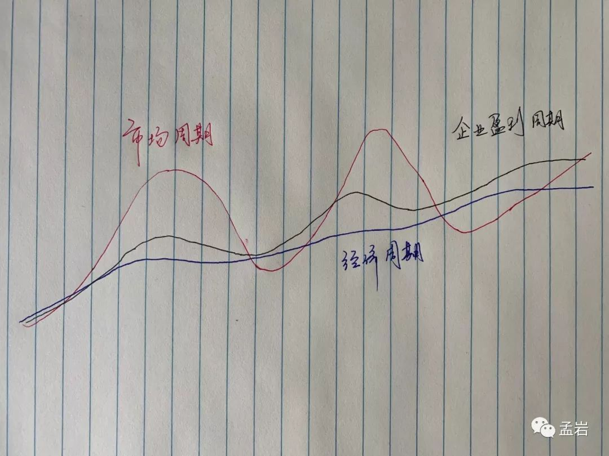

# 为什么市场的波动远大于经济的波动？

我把《周期》读完了，整体感觉很棒但有些啰嗦，车轱辘话来回说，于是去豆瓣打了 4 分。

不过，当我打开笔记整理标注的时候，我发现我可能错了。

这些翻来覆去说的东西，虽然都是在讲不变的主题——周期，但穿插了很多变化的细节。

这让读者的印象更加深刻，也更能感受到霍华德·马克斯（Howard Marks）的良苦用心。于是，我又跑回去把 4 分改成了 5 分。

上次一个读者问到一个问题：你说股票市场长期获得的根本收益是经济的增长，但中国的 GDP 一直以 7% 左右增长，为什么我炒股没有获得这个收益呢？

今天我借用《周期》这本书的内容，从以下几个方面，来解答这个问题。

* 经济周期、企业盈利周期以及市场周期是什么？
* 为什么这三个周期的波动逐级放大？
* 周期的起点和终点可以准确得到吗？
* 我们该如何应对周期来投资？

经济周期、企业盈利周期以及市场周期是什么？

为什么这三个周期的波动逐级放大？

周期的起点和终点可以准确得到吗？

我们该如何应对周期来投资？

霍华德·马克斯眼中的周期包括**经济周期、企业盈利周期以及市场周期。**

平时，我们每天直观感受到的是市场周期，也就是所谓的大盘涨跌。但其实，市场周期是最外一层的表现。最根本的是内在因素，是经济周期以及企业盈利周期。

从经济周期说起：经济周期的长期趋势是 GDP。GDP 的学名是国内生产总值，它表示一个经济体生产的所有商品和服务最终被出售的总价值，它大概等于这个国家的国民工作小时总数乘以每小时产出价值的乘积。

一个国家经济长期的产出主要取决于像人口出生率或者劳动生产率这样的基本面因素，而这些因素的变化会非常缓慢。因此，经济周期的波动会比较小。

在经济周期的影响下，企业盈利的波动也遵循一个周期。企业盈利周期会受到宏观经济周期的影响，但它的上下波动幅度，要大大超过整个国家经济周期震荡的幅度。

这里面最重要的原因，是企业借助的双重杠杆 —— 经营杠杆和财务杠杆（比如公司的固定资产和从银行借的钱）。这两个杠杆大幅放大了企业盈利周期的波动。

市场周期是股票价格的周期。而股票是企业价值的外在定价，因此反映企业价值的股票价格，是最外一层的放大器。

简单从 PE 的角度来比喻的话，乐观的时候给 100 倍，悲观的时候给 10 倍，这样就更大幅度的放大了市场周期的波动。

我简单地画了一下，大概是这样：

其中，蓝色代表经济周期，黑色代表企业盈利周期，而红色代表市场周期。需要说明的是，这三个周期互相影响的情况会更加复杂，并不是严格的同向波动，这里仅为示例。

经济周期、企业盈利周期、市场周期，波动逐级放大，但终会收敛回归到长期趋势本身。

这就是我们不停在说的，股票市场获利的根本，是一个国家经济的增长和企业的盈利增长。

当然，只有最外层的市场周期是你能得到的（通过股票市场公开价格的买卖），这个价格的波动幅度巨大，但终究会回归到最内层的经济增长和企业增长上来。

霍华德·马克斯统计了从 1970 年到 2016 年整整 47 个完整年度的统计数据：这 47 年间，他的年化收益是 10%。

如果我们认为 10% 加减 2%，也就是 8%～12% 是「正常水平」的话，你猜有多少可以落在这个正常区间呢？答案是，只有 3 个年度。

也就是说，只有 3/47 年度的收益率处于正常水平，换句话说，平均 16 年，才正常一次。

接下来，霍华德·马克斯分析了证券市场的价格波动幅度远远大于企业盈利波动的根本原因，答案很简单：**心理和情绪。**

放大企业盈利周期波动的，主要是企业管理人员的心理和情绪。

经济形势好的时候，过度盲目的投资再生产，银行等金融机构在经济上升周期的信用宽松（容易贷款）也助长了这种行为，这些在经济好的时候进一步放大了企业的盈利。

反应到市场周期上：媒体都是好消息，企业盈利屡超预期，一片欣欣向荣。这时候投资者的心理和情绪就接管了现场。「这样的景象一定能持续下去，黄金十年不是梦」，于是股票价格大涨。

某个时候，某个因素导致企业盈利不及预期，而这时最后的接盘手也已经进场，于是股市开始下跌。经济形势良好时候的经营和财务杠杆，此时变成了企业的包袱，企业的盈利迅速减少甚至亏损。

股市进一步下跌，媒体上都是坏消息，投资人认为这样的景象一定会持续下去，经济要完，于是抛售股票。企业裁员、投资者身家缩水，大家纷纷勒紧裤腰带，减少不必要的消费，企业的收入和盈利进一步降低……直到开始下一个周期。

人的心理和情绪，就这样大幅加剧了市场周期的波动幅度。

霍华德·马克斯引用了著名的物理学家理查德·费曼（Richard Feynman，以下简称「费曼」）的话：「想想看，要是电子有感觉，研究物理学会是多么困难。」

费曼的意思是，如果电子有感觉，有情绪，我们就不能指望电子总是做出科学家所预期的电子要做的事情，那些物理规律就会变得时而灵时而不灵。

换个角度，如果市场的参与者都是理性、不受情绪影响的人，那么经济周期、企业盈利周期和市场周期，就会变得可以预测。它们会变成一条斜向右上方的直线。

看到这里，你可能会说：如果我了解了周期，耐心等到周期的拐点去买卖是不是就可以了？

答案是：要精确的界定一个周期从哪里开始、何时结束，是不可能的。

市场周期不像四季的周期那样泾渭分明。我们知道北京的冬天十分寒冷，所以 10 月起可能就不会来北京度假。但市场周期要复杂的多，你很难知道市场周期的起点和终点在哪里。

同时，周期持续的长度也不可预测。我们经常说 A 股市场的一个周期是 5～8 年，但其实你无法知道，牛市具体什么时候来。

股票市场的周期长度相对还是比较短的，每个人一生中，总会经历几次大的牛熊，抓住一两次就会不同。而有的周期会更长，长到可能你的整个生命都生活在周期的一个趋势之中。

书中霍华德举了一个房地产周期的例子。

耶鲁大学的罗伯特·希勒（Robert Shiller）教授分析了一栋可考历史最长的房子从 1628 年到 1973 年的价格变化，这栋坐落于阿姆斯特丹市绅士运河区房地产的价值在经过通货膨胀调整以后，在长达 350 年的时间里，涨了一倍，也就是说：年化涨幅只有 0.2%。

这还不是重点，重点是：其中有 50 年，房子的价格一直在上涨。

看到这里我有三个感想：

* 中国的商品房市场大概有 20 多年的历史，这 20 年的房价一直在涨，因为我们一直在一个趋势里面；
* 在如此长的趋势里面，去预测拐点，太难了。过去 20 年的预测史也说明了这一点；
* 你需要根据自己是自住还是投资，结合你认为我们在房地产周期中的大概位置，去选择合适的行为。

中国的商品房市场大概有 20 多年的历史，这 20 年的房价一直在涨，因为我们一直在一个趋势里面；

在如此长的趋势里面，去预测拐点，太难了。过去 20 年的预测史也说明了这一点；

你需要根据自己是自住还是投资，结合你认为我们在房地产周期中的大概位置，去选择合适的行为。

最后，说回到股票市场。

这本书的最后，霍华德·马克斯认为「周期定位」是橡树资本投资成功的根本原因：

发现市场走到极端，并且能利用走到极端的市场，真的是我们能找到的最好的方法了。

而且我相信，这种事情做起来很可靠，前提是你能系统地深入分析，有洞察力（或者对历史很精通），而且做事沉着冷静、不动感情。

可是，这也意味着，你别指望能够每天、每个月，甚至每年都能做出能赚钱的决策。

他认为，每天市场短线的涨跌，是如芝麻一般小的事情；而当周期走到极端的情况，则是如西瓜一般的 大事。不要捡了芝麻丢了西瓜。

应对方式说来简单：

感受我们在周期大致的位置，根据这个位置判断未来市场走势的概率区间，根据这个概率区间调整投资的仓位和布局。在极端的情况下重注，最后耐心地等待市场回归均值。

是不是很熟悉？

如果依然用四季来打个比方的话：

你要在冬天的时候把大部分种子撒下去， 你不需要也不可能等到最冷的那一天， 秋天是收获的季节，在那之前，没必要每天查看种子的生长状态， 你不知道收获那天究竟什么时候来， 但你知道，不远的将来，她一定会来。

> 本文章所载信息仅供参考，不构成任何投资建议。如转载使用，请参考 [《文章转载声明》](https://youzhiyouxing.cn/agreements/ARTICLE_REPRINTED)
