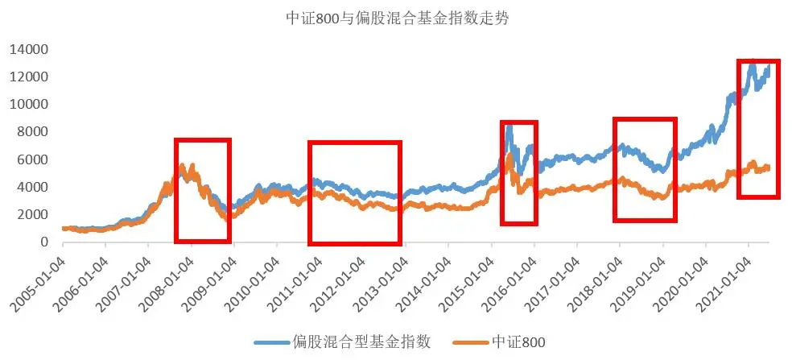

# 有人看到了风险，也有人看到了机会

> 本文发表于 2021 年 7 月 28 日

本文发表于 2021 年 7 月 28 日

*有人看到了风险，也有人看到了机会*（Where you see risks, l see opportunity）。

这是电影《神迹》中的一句对白。电影讲述的是，一个外科医生与一个黑人助理如何合作，协力攻克法洛四联症（又称紫绀婴儿）的真实故事，没有爱情，不涉及财富。提及这句话，是因为朋友发了一句「问君能有几多愁，恰似割肉站岗空两头」。

每当遇到市场短期波动明显的时候，朋友总会一改往日「一跃而起、一飞冲天、一发不可收拾」的豪迈，变成「一泻千里、一蹶不振、一把鼻涕一把泪」的担忧。

2005 年至今的 16 年里，偏股混合基金指数（885001.WI）经历了 5 次比较大的回撤：

第一次，发生在 2008 年 1 月4 日 至 2008 年 11 月 4 日期间，2006 年和 2007 年大牛市积累的巨大泡沫，叠加2008年全球金融危机，偏股混合型基金指数最大回撤 56.63%，同期中证800指数最大回撤 71.72%。

第二次，发生在 2010 年 11 月10 日 至 2012 年 12 月 3 日期间，4 万亿政策退出，偏股混合型基金指数最大回撤 32.49%，同期中证800指数最大回撤 42.43%。

第三次，发生在 2015 年 6 月12 日 至 2016 年 1 月 28 日期间，在杠杆资金的推动下，股市泡沫化，去杠杆资金和接下来的熔断机制，触发市场快速下跌，偏股混合型基金指数最大回撤 43.35%，同期中证800指数最大回撤 48.98%。

第四次，发生在 2018 年 1 月 23 日至 2019 年 1 月3 日期间，核心资产阶段性高点，叠加国内去杠杆政策和中美贸易战冲突，偏股混合型基金指数最大回撤 27.78%，同期中证800指数最大回撤 33.24%。

第五次，也是最近的一次，起始于 2021 年 2 月18 日，截止到 3 月底，偏股混合基金指数的最大回撤是 16% 。从市场估值比较，类似于 2018 年初的核心资产阶段性高估，整体的估值相对而言并没有泡沫化。从政策来看，后疫情时代，极度宽松的流动性已然过去，国内政策强调不急转弯，有人看到了「不急」，有人看到了「转弯」。

但是，2005 年至 2021 年 6 月底，偏股混合型基金指数翻了 12 倍，同期中证800指数翻了 4.6 倍。

数据来源 Wind，截至 2021 年 6 月 30 日

过往来看，市场表现长期向上，短期捉摸不定，但更捉摸不透的是人的情绪。13 年 29 倍收益的美国传奇基金经理彼得·林奇的鸡尾酒会理论也是一个很好的例证——

当某一股票市场一度看跌，而同时又无预期其会看涨时，纵使股市略有上升，人们也不愿谈论股票问题，我们称这一时期为第一阶段。在这一阶段，如果有人慢慢地走过来，问我从事何种职业，而我回答说我从事共同基金的管理工作，人们会客气地点一下头，然后扭头离去。假如他没有走，他会迅速地转移话题，讲凯尔特人玩的游戏，即将到来的大选，或者干脆说天气。过一会儿，他会转到牙科医生那儿，说说牙床充血什么的。

当有 10 个人都情愿与牙医聊聊牙齿保健，而不愿与管理共同基金的人谈股票时，股市就可能涨。

在第二阶段，在我向搭讪者说明我的职业后，他可能会和我交谈长一点，聊一点股票风险等。人们仍不大愿谈股票，此间股市已从第一阶段上涨了 15％，但无人给予重视。

到了第三阶段，股市已上涨了 30％，这时多数的鸡尾酒会参加者都会不理睬牙医，整个晚会都围着我转。不断有喜形于色的人拉我到一边，向我询问该买什么股票，就连那位牙医也向我提出了同类问题，参加酒会的人都在某种股票上投入了钱，他们都兴致勃勃地议论股市上已经出现的情况。

在第四阶段，人们又围在我身边，这次是他们建议我应当买什么股票，向我推荐三四种股票。随后几天，我在报纸上按图索骥，发现他们推荐的股票都已经涨过了。当邻居也建议我买什么股票，而我也有意听从时，正是股市已达到疯癫、下跌就要来临的准确信号。

彼得·林奇也说过：股市下跌没什么好惊讶的，这种事情总是一次又一次发生，就像明尼苏达州的寒冬一次又一次来临一样，只不过是很平常的事情而已。如果你生活在气候寒冷的地带，你早就习以为常，事先早就预计到会有气温下降到能结冰的时候，那么当室外温度降到低于零度时，你肯定不会恐慌地认为下一个冰河时代就要来了。而你会穿上皮大衣，在人行道上撒盐，防止结冰，就一切搞定了，你会这样安慰自己—冬天来了，夏天还会远吗？到那时天气又会暖和起来的。

人生在世如长河入海，决定胜负的从来不是一关一隘的得失。投资也一样，不能在意一天一月的盈亏。

投资从来不是一场冲刺赛，而是一场耐力跑。能笑到最后的，才是真正的赢家。别怕来不及、赶不上、到不了。有耐心的人无惧市场震荡，因为每次震荡都是投资的垫脚石，你坚持的每一个当下都会通向未来美好的「年化」。

> 图文来源：公众号「睿远FUND」作者：李鹏飞 转载文章发表的所有信息仅代表作者个人观点，不对您构成任何投资建议，详见[《文章免责声明》](https://youzhiyouxing.cn)
