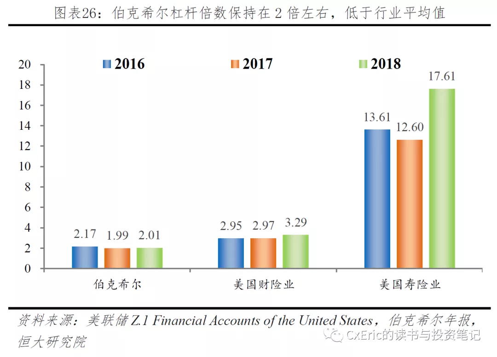

# 杠杆随想：市场先生提着砍刀来敲门

巴菲特曾说过：「远离金融杠杆，没有人会因为不借钱而破产。」

这句话应该怎么理解？何况，巴菲特自己用杠杆用得可谓是不亦乐乎。

这听起来简直自相矛盾。

更矛盾的是——有些人即使已经知道很多杠杆的危害，但还是心存侥幸，觉得「我就稍微用一点点」，风险可控，又能冲击更高的收益，何乐不为？

但这种「何乐不为」的反面，或许就是「勿以恶小而为之」。

用不用杠杆？这是个问题。曾做客「知行小酒馆」的 CxEric，在去年写过一篇文章回答这个问题，明确表达了自己不建议普通投资者使用杠杆的观点，很多人对此提出质疑——杠杆只是一个工具，没有好或坏的属性，关键在于我们如何使用；和其它工具一样，杠杆带来高风险，同时也带来了高收益，富贵总在险中求；杠杆不就是借钱炒股嘛，和企业借钱搞经营本质上差不多......

面对从四面八方抛来的质疑和困惑，CxEric 用一篇文章，一次性讲清了杠杆到底是什么，帮助我们破除掉杠杆给我们的诸多虚假诱惑。

祝开卷有知。

在某个程度上，建议炒股不要上杠杆，跟劝人「吸烟有害健康」是很相似的。

* 第一，不论说多少次，不论谁来说，都会有一大批烟民继续抽烟。
* 第二，不论有多少证据，都会有人跳出来说，某某通过吸烟活得更好了。
* 第三，总有人追求某种意义上的「安全剂量」，或限制用量、或指定品种、或改造形式，务求「吸烟无害健康」。
* 第四，戒烟很难。
* 第五，不抽第一根烟很简单。

第一，不论说多少次，不论谁来说，都会有一大批烟民继续抽烟。

第二，不论有多少证据，都会有人跳出来说，某某通过吸烟活得更好了。

第三，总有人追求某种意义上的「安全剂量」，或限制用量、或指定品种、或改造形式，务求「吸烟无害健康」。

第四，戒烟很难。

第五，不抽第一根烟很简单。

上述关于吸烟的论述，都可以不违和地替换为杠杆炒股、借钱炒股。

*吸烟有害身体健康，杠杆有害财务健康。*

为什么杠杆有害财务健康？这是杠杆的内在特征决定的。

以场内融资 margin 为例，杠杆炒股一般具有四个特征：

* 第一，融资有资金成本。
* 第二，融资有强制偿还条款。
* 第三，强制偿还与股价存在某种强联系。
* 第四，短期股价无法预测。

第一，融资有资金成本。

第二，融资有强制偿还条款。

第三，强制偿还与股价存在某种强联系。

第四，短期股价无法预测。

*只要这四个特征同时存在，杠杆炒股就只有幸运的方式，很难有安全的方式。*

第一个特征决定了，*借钱炒股是在与时间为敌，*如果特定时间内没有发生预期事件（如股价大涨），投资者的账户将不断受损，而绝大多数融资者都低估了5%~8%资金成本的杀伤力。

后三个特征决定了，*杠杆炒股引入了一种「出局风险」，*即投资者会在最艰难的时刻遭遇强制偿还，突然地被「踢下牌桌」，且这一事件的触发条件高度不可知、不可控。

杠杆炒股的窘境就在于此：*投资者总是在最不情愿的情境下卖出股票；而不是依据既定策略，在他想卖的时候卖出。*

杠杆是一把双刃剑吗？

很多人赞成使用杠杆就是基于这个逻辑，认为杠杆只是一种工具，关键看人怎么用。所谓水可载舟，也能煮粥；刀可杀人，也能切菜。

这个逻辑是有问题的。*不是所有工具都天然中性、没有危害，尤其是考虑到人类自带复杂、脆弱和不稳定的心理机制，一些工具从上手之日起就是偏负面的。*

*杠杆是双刃剑，但这把双刃剑在砍自己时出奇地锋利，砍别人时却越砍越钝。杠杆的好处与危害呈现高度非对称。*

这一特性在数学上就可以展现：杠杆会随股价上涨而下降，却会随着股价下跌而快速上升。

举例如下：

> 假如你有 100 万元，场内融资 100 万元，融资/总资产=1/2。情景 1：股价上涨 100%，总资产升为 400 万元，融资/总资产降为 1/4。结论 1：顺风局，股价上涨，杠杆比率从 1/2 下降为 1/4，杠杆赋予的加速（上行）效果不断削弱。情景 2：股价下跌 25%，总资产会降为 150 万元，融资/总资产升为 2/3。结论 2：逆风局，股价下跌，杠杆比率从 1/2 上升为 2/3，杠杆赋予的加速（下行）效果不断增强。

假如你有 100 万元，场内融资 100 万元，融资/总资产=1/2。

情景 1：股价上涨 100%，总资产升为 400 万元，融资/总资产降为 1/4。

结论 1：顺风局，股价上涨，杠杆比率从 1/2 下降为 1/4，杠杆赋予的加速（上行）效果不断削弱。

情景 2：股价下跌 25%，总资产会降为 150 万元，融资/总资产升为 2/3。

结论 2：逆风局，股价下跌，杠杆比率从 1/2 上升为 2/3，杠杆赋予的加速（下行）效果不断增强。

如果能体认到这种数学关系，就不难理解股市里一个常见现象：使用杠杆时，上涨加速效果在开始时最明显，之后越来越弱，但一旦迎来逆风，股价意外下跌，净值下跌速度却一天比一天快。

因而，*杠杆炒股本身就是一个非对称游戏，玩家天然地站在概率的劣势一方。*

杠杆的另一个非对称性在于，当股价下行的时候你会遇到一条「出局」的线，碰到即宣告游戏结束；但股价上行的时候，并没有一条线名为「胜利」，宣告你已获胜不用再继续。

可以想象下，只要是顺风局，你会一直坐在牌桌上，同时背负着隐含的出局风险；但只要有一把逆风局没操作好，你就被踢下牌桌——没有什么隐忍、等待、越跌越买可言。

玩得很好？继续。

玩得不好？出局。

不管资金规模多大，不管收益记录多漂亮，只要乘一个 0，账户资产就归零。

这是不证自明的常识。

*使用杠杆，就是为你的资产招引那个名为「0」的幽灵。*

它或许会来，或许不会来；

你祈祷它永远不出现；

如果它来，你不知道什么时候，也不知道以什么形式。

假如你很幸运，它从未造访你的账户，这很值得庆贺。

但到底是什么样的收益，才能抚慰无数个大跌日里的胆战心惊？

如果你看多了炒股「惨案」，就会发现一个规律：「失败的投资案例，十有八九跟杠杆有关；且越是惨痛的失败，越是跟杠杆有关。」

不信你可以找找看，你很难找到一个投资者输得非常惨，过程中却丝毫没碰杠杆的。

另一个有意思的现象是，尽管很多失败案例是因为使用杠杆，但一些当事人并不否定杠杆的「合理性」，反而选择反省自己的杠杆「使用技巧」。言下之意，杠杆本身还是好的（中性），只是自己没用好。如果是这个意思，那恐怕下次还会再用一次杠杆。

在我看来，一个投资者只要不用杠杆，他遭遇到的麻烦事至少要减少 50% 以上，而且越是惨痛的失败案例，越是如此。

投资者使用杠杆的初心是「放大收益」，但在众多失败案例里，杠杆本身就是最大的麻烦制造机。

当然，如果没有杠杆，股民体验到的刺激和兴奋感也会少很多。

芒格说，如果我知道自己会死在哪里，我就不去那里。

如果企业可以借贷经营生意，那为什么投资者就不能借钱炒股？二者有什么区别吗？

有区别。

*一个显著区别是，现实中没有这么多随机性。*

在现实中，企业所能遇到的随机性远小于股市，不管是贷款建厂房、借钱购买原材料，这些借贷虽然有强制偿还条款，但由于环境相对稳定，它们不会被飘忽的随机性随时触发强制偿还——抵押物不会一周内大涨大跌，银行也不会以交易日为单位来考虑是否抽贷。

*另一个显著区别是，强制偿还条款的差异。*

以房贷为例，只要你能够按时交纳月供，即便房价已经跌破购买价，银行也不会强制收回贷款，又或强制卖出房子。但在股市里，券商并不会因为你能缴纳融资利息，而决定不强制平仓。

强制偿还条款+不可预测的随机性+群体不可测的情绪，当这三者合一的时候，融资炒股注定是一件危险的事情。

不过话又说回来，即便是在现实世界，借款经营也一样涉及风险，是大部分企业破产的原因，尤其是身处一个动荡经济环境的时候。

另外，与场内融资炒股相似，企业借贷经营也经常面临一个显著麻烦：债主总是在最糟糕的时候要求你还钱。

所谓，「晴天送伞，雨天收伞」。

一个被A股股民熟知的事实是，巴菲特虽然告诫投资者不要用杠杆，自己却用浮存金用得飞起，那凭什么股民不能借钱炒股？

在词汇上，这两者虽然都可以叫「杠杆」，但二者有巨大差异。

## 1、资金成本差异

与*股民需要承担借款利息*不同，巴菲特的「杠杆」不仅不要钱，还能赚钱。

截至 2018 年，BRK（伯克希尔哈撒韦）的保险浮存金达到 1227 亿美元，但这一惊人「杠杆」的资金成本为负数。

从 1991 年至 2018 年的 27 年里，伯克希尔的承保利润率为 2.1%，「相当于巴菲特用浮存金进行投资的平均成本是 -2.1%，不仅没有成本，而且还从投保人身上获得了补贴」。（引自恒大研究院《解码伯克希尔股神之道》）

截至 2018 年时，BRK「承保业务连续盈利 15 年， 即浮存金成本连续 15 年小于 0。公司浮存金的平均成本是长期为负，且远小于外部借贷利率。」 （引自国信证券《财险：寿险与巴菲特的距离》）

## 2、偿付条款差异

*融资炒股的最大问题在于，强制偿还条款是与股价高度绑定的：股价越是下跌，券商越可能要求提前还款。*

巴菲特的浮存金「杠杆」却不存在这个问题。

BRK 浮存金主要来自以盖可保险（GEICO）、伯克希尔再保险（BHRG）和 BH Primary 为代表的财险公司，业务涉及车险、再保险和特殊保险业务。

财险的负债属性决定了，BRK 浮存金的偿付压力主要来自赔付，而这些可通过保守的承保策略进行控制，也能进一步做风险的分散与转移，BRK 的险企（尤其是 GEICO）是个中好手。

「以极端的 2008 年为例，尽管公司综合和收益亏损 123 亿元，但经营现金流依然高达 113 亿元，同比仅下滑 10%。再以 GEICO 为例，其综合成本年率大多数年份维持在 96% 以下，可投资的资金成本为负值，优于零成本。」（引自中信证券《伯克希尔商业模式成功的三个前提条件》）

## 3、现金储备差异

当我们说巴菲特使用浮存金杠杆的时候，仿佛老巴动不动就满仓满融，但对一家保险公司而言，BRK 最大的财务特征恰恰是低财务杠杆、持有天量现金。

2018 年，BRK 持有 1120 亿美元的美国国债和其他现金等价物，保险板块的投资组合中，现金类和固收类的占比分别为 33% 和 6%，而同期美国财险的对现金和固收类的配置分别 4% 和 70%。

与此同时，BKR 在 2016～2018 年平均杠杆倍数为 2.06，低于同期美国财险 3.07 和寿险业 14.6 的杠杆倍数 。

巴菲特曾表示，「没有哪一家公司能像伯克希尔哈撒韦这样，在财务上做好了应对一场 2500 亿美元巨灾的准备。在这样一场灾害中，我们的损失可能在 75~125 亿美元，远低于我们非保险活动中的预计年利润 。」（引自恒大研究院《解码伯克希尔股神之道》）

满仓满融没有安全边际可言。

安全边际（margin of safety）的更易理解形式是「错误边际」（margin for error），即*投资者要为可能发生的各种错误保留空间，以容纳或缓冲这些错误带来的冲击，力求即便错误发生，投资者依然能全身而退、保住本金。*

卡拉曼的说法是，在一个复杂的、不可预测和快速变化的世界中，当投资者以足够低于内在价值的价格购买证券，以容纳人类的错误、坏运气和极端的波动时，就拥有了安全边际。

但在满仓满融的情况下，投资者要用什么去容纳、缓冲预期之外的 「人类的错误、坏运气和极端的波动」呢？——哪怕这个「错误」只是暂时的。

*安全边际源自股价与内在价值的价差。*这种价差，或许可以在一段时间内发挥作用，但在短期来看，它既无法阻止强平条款生效，也无法阻拦券商实施风控操作，更无法阻挡市场先生突然发神经。

毕竟，市场先生从不介意将深度价值股揍成超深度价值股。

满仓满融的世界里，没有给「意外」保留一个空座位。

在价值投资框架下，借钱炒股显然违反了一些基本原则，尤其是满仓满融的极限操作。

*满仓满融是对「买股票就是买公司」原则的突破。*

在满仓满融后，决定账户生存或死亡的决定权，已从公司基本面移到了「市场先生」手里。你完全可能在估值正确、公司正常的情况下，依旧被市场先生无情消灭。

如此，「买股票就是买公司」不知不觉间，就变成了「买股票就是买市场先生」。

*其次，满仓满融是对市场先生的愚弄。*

市场先生每天都来敲你家门，絮絮叨叨大半天，如果他手无寸铁，你当然可以无视他。但借钱炒股，就相当于递给市场先生一把尖刀，而且杠杆越高，这把刀就越是锋利。

当市场先生手提 20 米大砍刀来敲你家门时，你不虚？

此时，再喊「买股票就是买公司」、「长期主义」、「深度价值」已经毫无意义，你唯一能做的就是祈祷这个狂躁症 + 抑郁症患者不要突然发神经。

*最后，满仓满融的操作混淆了「称重机」与「投票机」。*

格雷厄姆说，股票价格短期来看是一台投票机，但长期来看是一台称重机。

如果一个投资者用称重机的方式分析股票、构筑策略，却又忍不住玩弄投票机，甚至赋予投票机杀死自己的机会，这实在很难让人理解。

如果你要玩弄投票机，那也就要做好被投票机玩弄的准备。

在论坛混久了就会发现，价值投资者往往热衷于自诩「不在意短期波动」，但我对此大多持怀疑态度，尤其是一个投资者扛着较大融资仓位的时候，他怎么可能无视短期波动？

没有人可以无视一个随时能「杀死」自己的东西。如果短期波动可以一举毁掉你多年积蓄，你又怎么可能不在意它？

但如果，你很在意每一天的价格波动，为此花费了大量的精力与时间，你还有多少资源来研究公司的内在价值？这又是否还真的符合格雷厄姆的教诲？

好吧，我们知道杠杆很危险了，那我只用一点点？

或许可以。毕竟没有人会因为抽了一口烟而影响健康，那大概用一点点杠杆有没有问题？

对此，我个人看法是：*人是被自己行为塑造的。*「如果你每天都在使用杠杆，那你会越发依赖杠杆，而且随着你的交易成功，杠杆会给予你巨大正面激励，这种快乐会在你大脑留下深刻的激励回路。它会成瘾，它会塑造你。」

对此，卡拉曼的看法是，「有点像滑坡理论，如果一点点杠杆是好的，为什么更多的杠杆不是更好？你什么时候才会停止？」

> There is also a bit of a slippery slope in that if a little leverage is good, why isn’t more leverage better? When do you stop? ——Seth Klarman

There is also a bit of a slippery slope in that if a little leverage is good, why isn’t more leverage better? When do you stop? ——Seth Klarman

杠杆的麻烦就在这，*几乎所有杠杆交易者都是从小杠杆开始的，但在不知不觉中越用越多，等回过神才突然发现，原来市场先生已经门口久候多时。*

市场先生的 20 米大砍刀正闪闪发亮。

《[为什么我们不应该上杠杆？](https://youzhiyouxing.cn/materials/472)》

> 来源：公众号「CxEric 的读书与投资笔记」原标题：杠杆随想：市场先生提着砍刀来敲门转载文章发表的所有信息仅代表作者个人观点，不对您构成任何投资建议，详见[《文章免责声明》](https://youzhiyouxing.cn/agreements/ARTICLE_DISCLAIMER)
