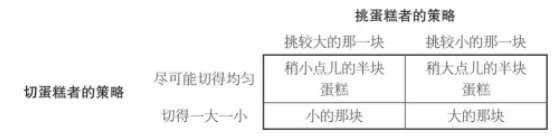
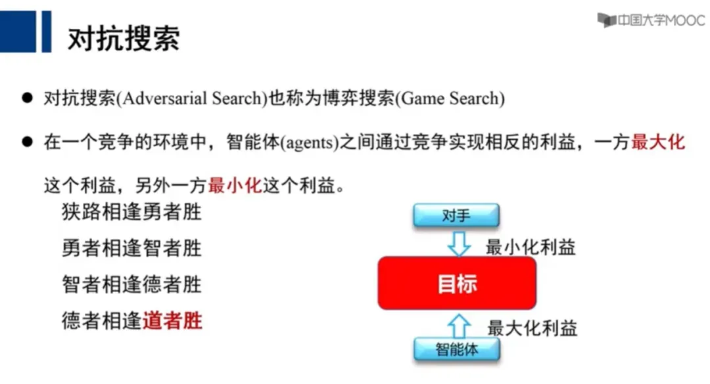
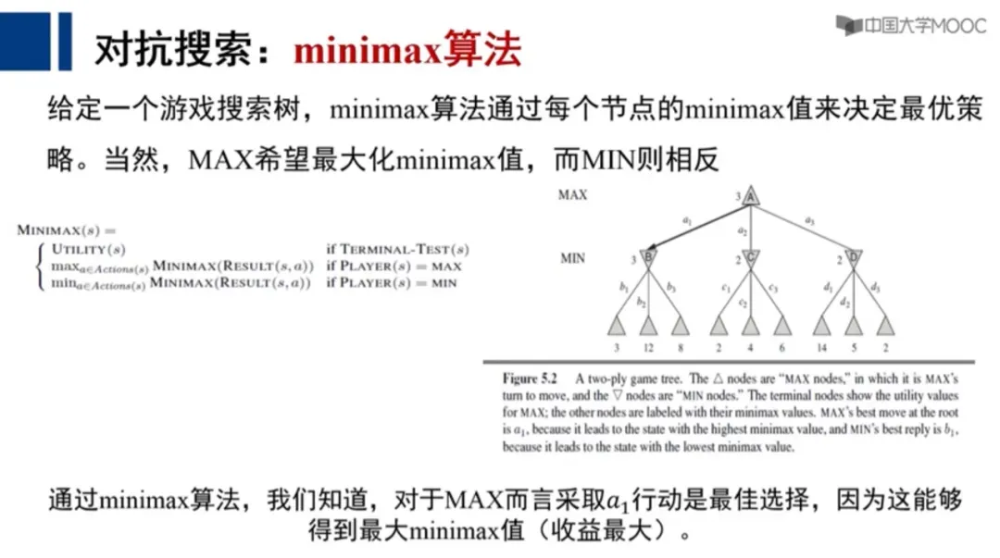

# 极大极小原理：假如遭遇绑架，要怎么办？

在本性上，人都是趋利避害的。

但是在理性上，我们却很少去思考「趋利避害」到底是什么？做到这一点到底需要怎样的思维和能力？

甚至，我们到底要怎么才能看到「利与害」、「好与坏」、「多与少」之间的关系？

本文作者，通过对「极大极小原理」的阐述，回答了这一问题。并且分享了他在这个原理中得到的七个启发。

作者提到，在某些博弈中，「你所能期盼的最好结果就是避免最坏情况」。这让人想到，当我们面对投资风险时，也确是如此。

文章有些艰涩，但值得一读。

祝开卷有知。

在「假设发生如下事情」之前，祝福我们此生永不发生这类事情。

假设你外出时，遭遇绑架，该怎么办？

有一位（国外的）自卫专家，给出了三个应对原则：

*1. 不要跟他去第二个地点*

如果你心怀侥幸，他可能将你带到偏僻的地方，为所欲为，甚至下毒手，然后掩藏他的罪恶痕迹。

*2. 记住，他在撒谎*

不管坏人说多好听，别相信。

这位专家的观点是：

> 从一开始，每个谋杀犯，绑架犯，强奸犯，他们都会用同一句话：「照我说的做，我就不会伤害你。」然而，一旦你照他们说的做，最后受伤最深的，还是你。

从一开始，每个谋杀犯，绑架犯，强奸犯，他们都会用同一句话：「照我说的做，我就不会伤害你。」

然而，一旦你照他们说的做，最后受伤最深的，还是你。

*3. 要在原地，用尽一切手段与之搏斗*

这一点似乎有点儿让人疑惑，万一受伤呢？

被人用刀抵住，拼命挣扎要是不幸丢了命，岂非不识时务？

然而，这位专家的洞见是：

> 如果他们想在原地杀你，你早就已经死了。

*如果他们想在原地杀你，你早就已经死了。*

所以：

* 他们不想在原地杀你，他们希望带你去其他地方，或者先干点别的事。
* 通过打乱他们的计划，你会成为他们最恐怖的噩梦。
* 如果他们不想被抓，不想把事搞得太麻烦，他们可能就会直接逃跑了。

他们不想在原地杀你，他们希望带你去其他地方，或者先干点别的事。

通过打乱他们的计划，你会成为他们最恐怖的噩梦。

如果他们不想被抓，不想把事搞得太麻烦，他们可能就会直接逃跑了。

以上三点原则的所有原因，其实只有一个：

*如果你进了他的车，或者跟着他们去了某个地方，你死定了。*

（以上经验仅供参考，不构成本文作者对遇到绑架的具体建议。）

以上是一个生动的博弈场景。

由此引出我的一句「大脑碎片」：*好的一手棋，是其令对手有不好的下一手，以及自己有好的下下一手棋。*

我们姑且不讨论，在第 1 节里，专家应对绑架的三点原则的适用范围，以及如何根据情境调整策略。

本文的焦点是：*极大极小原理*。

绑架，是一场零和博弈。

就像下棋，一个人赢，一个人输，即使和棋，也只是暂时的平静。

双方没有合作的可能。

对于这类博弈，冯·诺依曼提出了「极小极大原理」。

《囚徒的困境》一书，用我们熟悉的分蛋糕来示例。

众所周知，公平的分法是：*一个人切，一个人选。*

假如两个孩子都不是孔融，并且都想吃更多蛋糕，这其实是一个典型的零和博弈。

第一个孩子（切蛋糕那个）的两个策略是：不均分和尽可能均分。

第二个孩子（挑蛋糕那个）也有两个策略：选较大的那一块或选较小的那一块。 如下图。

（请注意，表格里的 4 个结果，都是指切蛋糕的孩子的所得收益。）

切蛋糕的孩子貌似掌握了主动权，但他决策的关键点，取决于「然后呢？」，即，对手的下一步会怎么做。

显然，挑蛋糕的孩子，会追求让自己的蛋糕最大化，也就是让对手的蛋糕最小化。

对应上面的表格，挑蛋糕的孩子总是会选左边一列，从而导致切蛋糕的得到左边一列的两个较小蛋糕的结果。

于是切蛋糕的孩子要做的事情，就是：*让挑蛋糕的孩子将要留给他的量小的那半块蛋糕极大化。*

因此，切蛋糕的孩子只能选择尽量均分蛋糕，以保证获得差不多的半块蛋糕。

这个量，是行中极小值的极大值，被称为「极大极小」。

也许有人会说，这么简单的道理，为什么要说这么啰嗦？

德谟克利特早在公元前 300 多年前，就创立了「原子论」，认为每一种事物都是由原子所组成的。

然而，这只是一种想法。

对比而言，爱因斯坦对原子的理解，才算是科学。

二者之间的区别在于：后者可实验，可计算，可运用。

作为博弈论的创始人，冯·诺依曼说过：没有极小极大定理，就没有博弈论。

《囚徒的困境》一书对极小极大定理总结道：

* 在两个利益完全相反的人之间出现的有精确定义的冲突，总存在一种理性的解；
* 所谓理性的解，就是在给定冲突性质的前提下，双方都确信他们不可能期望有更好的结果了。

**在两个利益完全相反的人之间出现的有精确定义的冲突，总存在一种理性的解；**

**所谓理性的解，就是在给定冲突性质的前提下，双方都确信他们不可能期望有更好的结果了。**

让我们回到绑架现场。

即使被绑架者非常被动，但这仍然是一场博弈。

要理解这一点，我们需要强调三个名词：**1. 回合；2. 节点；3. 选择权**

*回合*

许多事情，都是连续决策的结果。

而零和博弈，是敌我双方轮流决策，由一个一个的回合叠加起来。

*节点*

上述每个回合，你都有一个属于自己的决策节点。

然而，很多人要么忽视了节点，要么放弃了节点。

*选择权*

在每个回合的决策节点，你其实是在做一个选择。

你有选择权，对手也有选择权。

敌我双方都试图让自己的选择收益最大化，让对方的收益最小化。

当你被绑架的时候，对手已经出招，现在轮到你走棋了。

（再次强调，本文不构成对绑架情境的具体实战建议。）

你仍然有选择权：

1. 放弃抵抗，上对方的车；
1. 大声呼救，拼命反抗。

放弃抵抗，上对方的车；

大声呼救，拼命反抗。

这个时候，大多数人会想，我抵抗的话，会有什么后果：

* 会受伤吗？
* 会激怒对方导致生命危险吗？

会受伤吗？

会激怒对方导致生命危险吗？

然而，从博弈思维来看，你仅仅纠结于当下的一步棋去想，毫无意义。

你应该去想：*我如果这样做，对手会如何回应呢？再然后我又该如何应对他的回应呢？*

也就是说：*你要计算下一步，以及下下一步。然后，再由此倒推，你现在这一步该如何做选择。*

我将本文开头那个专家描述的场景图示如下：

如果「你」乖乖上了绑匪的车，如上图左分支（选择 1）所示，可能导致如下结果：

1. 在第四个回合，你已经失去了选择权；
1. 对手可以自由选择让自己利益最大化的做法；
1. 绑架的许多目的是为了钱财，有些歹徒会先撕票再要钱；
1. 未经核实的数据是，撕票比例高达 10%；
1. 据某地警方的经验，越是熟人绑架，撕票的可能性越高。

在第四个回合，你已经失去了选择权；

对手可以自由选择让自己利益最大化的做法；

绑架的许多目的是为了钱财，有些歹徒会先撕票再要钱；

未经核实的数据是，撕票比例高达 10%；

据某地警方的经验，越是熟人绑架，撕票的可能性越高。

所以，处在第二回合的「我」，要考虑的是，第三回合的对手会怎么做，以及自己会有怎样的第四回合。

《囚徒的困境》引用了卡尔维诺在《寒冬夜行人》一书中的一句话：

> 你知道，你所能期盼的最好结果就是避免最坏情况。

*你知道，你所能期盼的最好结果就是避免最坏情况。*

这句话，很好地说明了极小极大原理。

还记得，本文开头专家的第二条建议吗？——*记住，他在撒谎*。

从一开始，每个谋杀犯，绑架犯，强奸犯，他们都会用同一句话：照我说的做，我就不会伤害你。

可是，如果罪犯真的不会伤害你，那么你反抗的时候他也不会伤害你。

而且，即使起初罪犯没有太想伤害你，但是当你失去选择权的时候，他可能会萌发伤害的念头。

回到博弈思维：

游戏者决不会从他的最佳策略上偏离到对自己造成威胁的策略上去。

尤其是在零和博弈中，对你有利，对绑匪就不利。

请看上面的图，在第三回合，绑匪会极力让你的收益最小化。

所以，你在第二回合要做的，是「极大化」这些自己可选的「极小值」，尤其是要避免最坏结果。

同时，你要「极小化」对手可选的有利于他的「极大值」。

由此倒推，你就会发现，如专家所言，在第二个回合，你应该做的是：

*要在原地，用尽一切手段与之搏斗。*

仅仅明白道理并不够，我们需要定理。

为什么需要定理？

因为定理可以形成算法。

冯·诺伊曼对极小极大值定理的证明是复杂的，「它以一种读者难以理解的方式结合了基本概念和拓扑概念」。

约 20 年后，香农利用 Minimax（极小化极大）算法，提出了解决国际象棋问题的设想。

随后，在 AI 攻克国际象棋和围棋的过程中，Minimax（极小化极大）算法扮演着基础而重要的角色。

极小化极大算法（Minimax）可被概括为：

* 对于两个玩家的对抗游戏，其中任何一个玩家的决策会依赖于另外一个玩家之前的决策，且另外一个玩家总是竭尽所能地想要获得胜利。
* 因此，一方会在所有选项中选择令其自身优势最大的一个，而另一方则会选择令对手优势最小的一个。
* 通过穷举不同玩家之间的策略，该算法可以构建一棵搜索树，并通过穷举不同的可能，选择其中能得到最佳结果的路径。

对于两个玩家的对抗游戏，其中任何一个玩家的决策会依赖于另外一个玩家之前的决策，且另外一个玩家总是竭尽所能地想要获得胜利。

因此，一方会在所有选项中选择令其自身优势最大的一个，而另一方则会选择令对手优势最小的一个。

通过穷举不同玩家之间的策略，该算法可以构建一棵搜索树，并通过穷举不同的可能，选择其中能得到最佳结果的路径。

请点击放大，看下图右边的搜索树的最下面一行，3、12、8 这一组数字，是「我」期望获得的可能的利益。

* 对于对手而言，当然会选择让「我」利益最小的走法，所以，在 MIN 那一行的 B 节点，对手会选择 3、12、8 中的最小值 3。
* 同理，在 C 节点，对手选最小的 2；在 D 节点，选最小的 2。
* 而在 MAX 行，「我」要选择「3、2、2」这一行极小值当中的极大值「3」。

对于对手而言，当然会选择让「我」利益最小的走法，所以，在 MIN 那一行的 B 节点，对手会选择 3、12、8 中的最小值 3。

同理，在 C 节点，对手选最小的 2；在 D 节点，选最小的 2。

而在 MAX 行，「我」要选择「3、2、2」这一行极小值当中的极大值「3」。

这就是 Minimax（极小化极大）算法。

但是，即使是对于棋类这种完美博弈，该算法的计算复杂度也会呈指数级增长。

因此往往需要引入剪枝策略来简化搜索的复杂度。

以及，通过多次采样的蒙特卡洛树搜索，以减少计算量。

再往后， UCT 算法将蒙特卡洛树搜索方法与 UCB 公式结合，有效解决了围棋上的问题。

进而，基于深度强化学习， AlphaGo 诞生，惊人地击败了人类，完成了以往被认为还需要 20-50 年才能实现的任务。

德谟克利特对原子的理解令人赞叹，然而只有基于爱因斯坦的公式，人类才能造出原子弹，以及安全地利用核能。

极大极小原理，给我以下七点启发：

**启发一：站在对方的角度想问题，然后倒推自己的策略**

我们可以广义地来想这个问题，即使不是在零和博弈的环境下。

例如说起某某产品经理很厉害，可以瞬间将自己变成小白，其实就是能彻底地站在对方的角度。

几乎所有厉害的商业公司，核心原则就是「经营顾客」。

先想着让顾客价值最大化，然后再从中找寻让自己最大化的策略。

所以芒格说：*要诉诸利益，而不是讲道理。*

我经营春藤，有时候也会和小伙伴们在一线谈业务。

我不是很好的销售，口才也很一般，但每次谈合作效果还不错。

我的方法是：

* 请问你现在最想要的是什么？
* 我们可以如何帮助你实现你最想要的？
* 我们立即可以做的最小化合作是什么？

请问你现在最想要的是什么？

我们可以如何帮助你实现你最想要的？

我们立即可以做的最小化合作是什么？

**启发二：不占别人便宜，自己的也要据理力争，不当烂好人**

段永平早年经营企业，既不占供应商的便宜，也不给批发商赊货。

不管多好的买家，必须现款现货。

何谓烂好人？就是彻底放弃自己的选择权，试图讨好对方，感动对方。

然而，人性是经不起考验的。

所以，很多时候，烂好人不仅招恶人，甚至催生恶人。

**启发三：将对手想成一个势均力敌的对手**

以我下围棋为例，切忌低估对手。

所谓低估对手，就是对他人抱有幻想。

例如，你发现一手棋，能够让自己的利益最大化。但是如果被对手识破，那么结果就会很糟糕。

有时候，棋手会心存侥幸：要是他看不到，那我就赚了。

然而，这是不对的。

你就该假设对方是一个势均力敌的对手，你能看到，对手也能看到。

当然，如果下让子棋的时候，要适当调整。

以及，在德州扑克等博弈中，或是像剪刀石头布这类首尾相连的游戏，也需要虚张声势。

总之：

* 别欺负别人，别想着占便宜；
* 也别因为暂时领先而得意忘形，别耍过头。

别欺负别人，别想着占便宜；

也别因为暂时领先而得意忘形，别耍过头。

**启发四：将街上的每个司机都当作潜在凶手**

这个想法似乎有些极端。

几乎没司机有动机要撞你。

但是，理论上，每个司机都有撞你的「可能性」。

对你而言，这个最坏的结果可能性很小，后果很严重。

这正是极大极小原理的灵魂：

*「你知道，你所能期盼的最好结果就是避免最坏情况。」*

**启发五：珍惜每一个选择权，并为你的下一个、下下个选择权做好铺垫**

人生是一连串决策的总和。

所谓全局观，是指你的每个决策点既是相对独立的，又和过去和未来相关联。

有些人只管当下舒服，而不顾自己的下一手该如何。

如果你在一个球队里，队友总是给你传烂球，或者不给你传球，你一定会骂他烂人。

可是在现实中，现在的「你」，可能经常不顾及未来的「你」，不管未来的「你」是否有好的选择权。

*一连串有算法的选择权，就是一个人的「人生算法」。*

**启发六：所谓仁慈的狮子，是指你要当好人，但保留惩罚坏蛋的权利**

如题，这一条启发，反过来也是适用的。

例如，你彻底放弃惩罚对方的权利，以换取对方彻底的信任。

前提是你相信对方是一个珍惜荣誉的人。

**启发七：彻底远离损人不利已的人**

博弈论的假设是：双方都是理性的。

> 博弈论只研究对赢感兴趣的、有完善的逻辑思维能力的游戏者参与的博弈。只有你相信你的对手（一个或几个）既是理性的，又是希望赢的，而你自己在玩的时候也始终憋着一股劲儿，要力争为自己取得最好的结果，这样的博弈才是博弈论分析的对象。

博弈论只研究对赢感兴趣的、有完善的逻辑思维能力的游戏者参与的博弈。只有你相信你的对手（一个或几个）既是理性的，又是希望赢的，而你自己在玩的时候也始终憋着一股劲儿，要力争为自己取得最好的结果，这样的博弈才是博弈论分析的对象。

对博弈论而言，*自私的人并不可怕，可怕的是不理性的人*。

为什么呢？

* 一个自私的人可能做损人利己的事，一个合作的人可能做利人利己的事情。
* 但是，一个不理性的人可能做损人不利己的事情。
* 博弈论很强大，但是如果你是在和一个非理性的人「交手」，就很难得出一个解答。

一个自私的人可能做损人利己的事，一个合作的人可能做利人利己的事情。

但是，一个不理性的人可能做损人不利己的事情。

博弈论很强大，但是如果你是在和一个非理性的人「交手」，就很难得出一个解答。

你的最佳选择是：*远离这类人。*

举例说吧，经济较发达区域的特点之一是：民众只算自己的账，而不去算别人赚多赚少。

倘若不如此，就会出现如下局面：我才赚十块，你居然赚一千块，我宁可牺牲自己的十块毁掉你的一千块。

这就是损人不利已。

如此一来，博弈论的均衡就无法出现。因为非对弈情况下的「损人不利己」，也就是理性的失去，会摧毁整个游戏。

（当然，经济是否发达有多方面因素，不发达地区也经常有「只算自己账」的传统。）

记得中学有个同学的哥哥当年混社会，他说他们那群 20 岁上下的青年谁都不怕，最怕十四、五岁的孩子，因为这类混小子可能毫无目的不顾后果地冲上来给他们一刀。

博弈论因为这类人而失效。

本文开篇对于绑架者的分析，也是假设他们是理性的。

但是，如果绑架者不是理性的人呢？

那么，不理性的凶手可能会不顾受害人呼救招来人，在没有利益的情况下下毒手。

归根结底，*一切在于「对的人」*。

不管是零和博弈，还是双赢博弈，你都要努力令对方是一个理性的人。

既要选择对的队友，更要选择对的对手。

关于极大极小原理，我们还可以将其智慧拓展为：

*狭路相逢勇者胜，勇者相逢智者胜，智者相逢德者胜，德者相逢道者胜。*

最后，祝福你我此生一早避开，不必在狭路上遭遇那些损人不利己的混蛋。

> 来源：公众号「孤独大脑」原标题：极大极小原理转载文章发表的所有信息仅代表作者个人观点，不对您构成任何投资建议，详见[《文章免责声明》](https://youzhiyouxing.cn/agreements/ARTICLE_DISCLAIMER)
