# 聊聊A股历史上的机构抱团事件

这两年机构投资者抱团白酒、医药等板块，导致这些板块不断创出新高，逐渐营造出这些板块会一直涨的幻觉。事实上，机构抱团不是这两年才有的，A股历史上出现过好几次。

招商证券策略研究部门在 2019 年发表过一篇文章，专门针对机构抱团进行了详细说明，包括什么是机构抱团、为什么会出现机构抱团、机构偏好哪些板块、什么时候抱团会瓦解等。通过这篇文章，大家可以对机构抱团行为有全面的了解，同时也能感受到，机构抱团对股市周期的影响。

以史为镜，期望大家通过这篇文章能对自己的投资有所帮助。

友情提示，这篇文章很长，需要花费你一些时间。

按照我们的定义，持续加仓并持有一个板块接近至超过 30%，视为「抱团」。类似的情况发生过四次，分别是：2007Q1-2010Q1 抱团金融，持续 13 个季度；2009Q3-2012Q3 第一次消费抱团，持续 13 个季度；2013Q1-2016Q1 抱团信息科技，持续 13 个季度；2016Q1-当前第二次消费抱团，已经持续了 13 个季度；但如果从 2017Q1 算正式开始抱团，目前只持续了 10 个季度。

*由于机构投资者具有定期业绩考核机制、排名压力、产品发行运作机制以及相似的真·价值投资理念，*导致机构投资者总是会识别发现业绩增速最高的板块并逐渐调整到集中持股，是「抱团」出现的主要原因。

*每个板块的业绩推动自有其原因和逻辑，*货币超发和信贷放量时金融板块业绩改善并大幅回升的动力；通胀升温是消费板块业绩大幅改善的动力；新技术和并购趋势是信息科技板块业绩大幅改善的动力。

*每次抱团真正瓦解前，会有 1-2 次假摔，*但之后评估了业绩趋势后又会重新抱团，并比上一次更加坚定，因此，抱团板块的超额收益每一次假摔后都是加速上行的。

*抱团到了后期，给了很多投资者以「该板块永远会涨，永远会跑赢」的信念。*这种信念，会以在后面不同的简单明了上口的概念体现。每当基于信念的投资理念超出了业绩的范畴，很容易让投资者麻木而对出现的变化视而不见。「躺着赚钱这么简单为什么要调仓？」这种理念也会让在抱团最后减持的投资者痛苦不已，如果跑会不会又会重新抱回来？如果不跑大家都在跑怎么办。

*抱团问题成为投资者永远面对的难题。*对于率先重仓抱团板块而成功的基金产品管理人而言，这种两难体现在，要不要减仓不减仓？会不会前功尽弃？当然这是快乐的烦恼，但更麻烦一点的我们称之为「明星两难」，简而言之，越想要业绩好，就越要重仓那个抱团板块，而且必须最坚定最持久，但是越坚定也就越难在风格和行业发生变化时，进行适时的调整。

*抱团过程中会出现经典的「抱团-申购-买入抱团板块-抱团板块继续跑赢-吸引更多存量资金加入抱团」这个正反馈，*这种经典正反馈总会引发估值溢价，但往往溢价出现这一波行情是最精彩的一波。

*每次抱团瓦解的根本原因是因为出现了业绩更好的板块，*不要被虚妄的概念所蒙蔽，找到那个最强业绩板块，并重仓它。而比找到业绩更好的板块更重要的是——找到驱动业绩变化的中观和宏观变量。

*风险提示：抱团瓦解时可能会大幅跑输市场；抱团板块估值溢价导致踏空。*

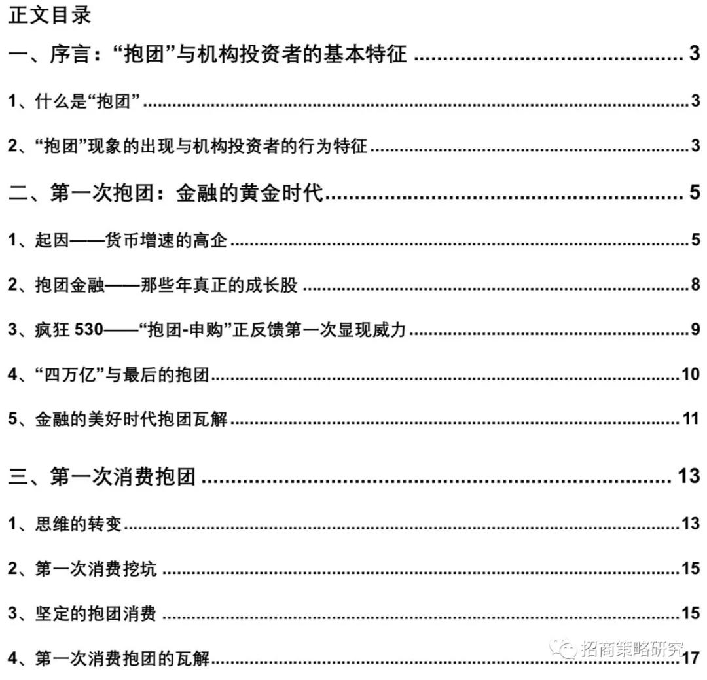

由于中国经济的发展的特殊阶段，使得中国经济中，传统基建、消费升级、科技发展、金融扩张同时存在，而且在未来的一段时间内还是并存的格局。因此，映射到A股，四大板块——周期、金融地产、消费、科技（主要是 TMT），所体现出的机会是轮动的。除了周期板块往往股价波动比较快，投资者很难较长期限内持有，而金融地产、消费、科技是机构投资者愿意持股的主要板块。因此，A股出现了抱团轮动的特征。本文就「抱团现象」进行了回顾和总结，以期对未来的投资有一定的启示。

## 1. 什么是「抱团」

何为「抱团」？抱团是抱团取暖的简称，意思是所有参与者不断加仓某一个板块，到后来集中持有某一个板块，不轻易进行调仓换仓。本文中，以主动偏股公募基金作为代表描述，以持续加仓某一个板块至接近或超过 30%，并持续持有超过两个季度以上，称为「抱团」。由于机构分散投资的要求，持有一个板块超过 30% 算是比较高的集中度。

2006 年，随着公募基金和保险机构的不断壮大，机构投资者对市场的影响越来越大。2006 年以后，大概出现了四波非常著名的抱团。分别是：

* 2007-2009 年加仓并抱团金融地产，我们称之为「金融的黄金年代」
* 2010-2012 年加仓并抱团消费「第一次消费抱团」
* 2013-2015 年加仓并抱团信息科技「移动互联网浪潮」
* 2016 至今，持续加仓并抱团消费「第二次消费抱团」

2007-2009 年加仓并抱团金融地产，我们称之为「金融的黄金年代」

2010-2012 年加仓并抱团消费「第一次消费抱团」

2013-2015 年加仓并抱团信息科技「移动互联网浪潮」

2016 至今，持续加仓并抱团消费「第二次消费抱团」

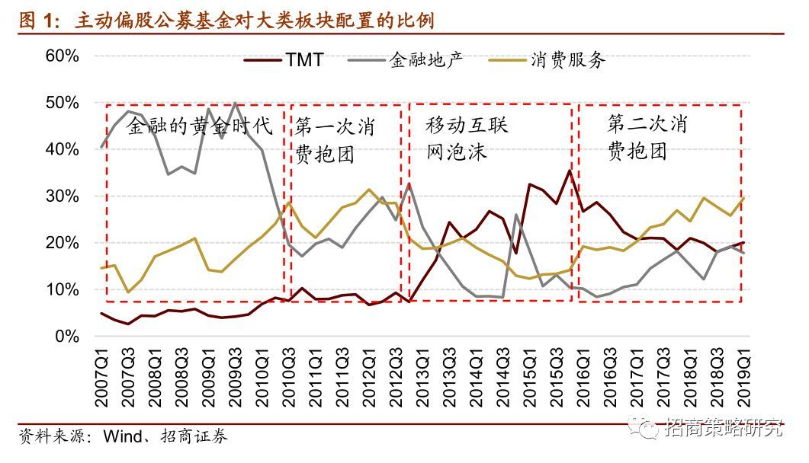

## 2. 「抱团」现象的出现与机构投资者的行为特征

在A股市场上，基本有两大类投资者，一类是以个人投资者的散户群体，做出买入卖出的决策理由五花八门；另一类是以公募、保险、私募机构为主的机构投资者，这些机构投资者有着相似的投资决策框架和相似的特征，这些特征包括：

1）定期考核机制

国内的基金产品管理人都有定期的考核机制，无论是绝对收益（和一个固定的业绩基准比较）或者是相对收益（对市场指数进行比较）。而且，国内基金管理人面临的投资环境比巴菲特困难太多——最短的三个月，最长三年就必须交出一份答卷。这种定期考核机制，是我们分析抱团机制非常重要的一个因素。

那么如果一个行业表现持续好，你没有买入这个行业，在定期的考核的时候，就会遭遇灵魂之问——「你为什么没有」「你为什么没重仓」，*到最后，表现最好的那个行业被持仓越来越重，直到有外部因素让部分投资者坚决的放弃这个行业。*

2）真·价值投资

巴菲特被封为「价值投资」的典范，但是巴菲特的「价值投资」与本文所指的价值投资大相径庭，巴菲特由于其公司无短期业绩考核，极低的融资成本，所以可以长期持有高 ROE 高分红的股票，本质上更类似套利。不过很遗憾的是，这种「价值投资」对于国内机构投资者只是理论是上的存在。

为什么要加一个「真」，因为国内机构投资者整体是最看重业绩的，对业绩和价值的看重可能要远超巴菲特。通常要算清楚每一个季度的业绩，一个上市公司一个季度业绩稍微低预期，都要考虑减持。因为就算你相信这只是短期的，但是你仍然要担心别的投资者会无情的抛弃，导致股价出现明显的回调，为本季度的考核蒙上阴影。

在这样的决策框架下，就哪怕没有定期考核，机构投资者也会要选择业绩持续性最好的板块。因此，在真·价值投资的思路下，*业绩持续表现优秀的板块必然会被集中持有。*

3）排名机制

不管你是公募还是私募还是保险，不管你是相对还是绝对，只要你有公开业绩，那么就一定会有人给你每年排名，甚至季度排名，每月排名。而渠道在进行营销和推广时，毫不犹豫的把资源倾向给排名最高的产品和管理人。而规模又是机构投资者的最重要的考核指标之一。这种排名机制和高考类似，做最好的自己并不足够，必须要在争取行业内尽可能高的排名。

这种排名机制之下，你必须争取买的每一个股票都要比其他股票尽可能的好。当然，股价背后最重要的是业绩。*因此，在相同的机制下，大家买入的就是业绩增速最高的行业。*

4）产品发行（分配）机制

当一类型的基金产品能够连续两年排名靠前，那么第三年第四年，这个基金管理人可以被作为重点营销的对象，发行新产品或者管理更大规模的存量产品。那么这里就有一个非常有意思的机制，为了保持持仓风格的稳定性以及路径依赖，新产品、新申购以及新管理的资金最佳选择就是——买入原来产品的持仓。那么就会形成正反馈：

业绩好——认购新产品、老产品净申购——买入原持仓——业绩更好——发行更多的产品

*这种机制后面简称为「抱团-申购」正反馈，这种机制导致抱团的板块的最后一波多数情况下会出现估值溢价，而这一波往往就是抱团中策略涨幅最大的一波。*

以上四个特点，凡是机构投资者或多或少都有的特征，而其中，公募基金的约束最为强烈。因此本报告中，对于机构持仓的分析，主要是以主动偏股公募基金的持仓作为展示。

## 1. 起因——货币增速的高企

金融行业货币增速高以及信贷增速高的阶段往往业绩比较好，回顾中国的货币投放历史，最让人惊心动魄莫过于 2006 年开始的「热钱」涌入和 2009 年的「四万亿」。

近些年来，信用和货币的派生需要经过多重复杂的机制。不过这不是本文需要讨论的，我们需要回到那个最简单的年代。

2005 年 7 月 21 日,中国人民银行宣布,自即日起,我国开始实行以市场供求为基础、参考一篮子货币进行调节、有管理的浮动汇率制度，人民币开启了近 10 年的升值历程，热钱开始大量涌入中国。

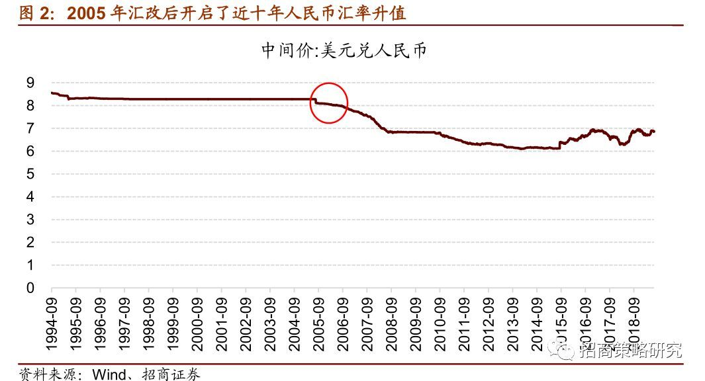

另外一方面，随着中国加入 WTO，全球制造业产业链加速向中国转移，带来大量的国外投资。而彼时，中国实施结售汇制度，因此每一美元外汇流入，最后都变成央行的储备资产，央行对等投放相应的基础货币。因此，流入多少美元，最后就派生出了汇率 × 外汇占款数量规模的基础货币。

2005-2008 年，是有数据以来央行资产负债表扩张速度最快的阶段。

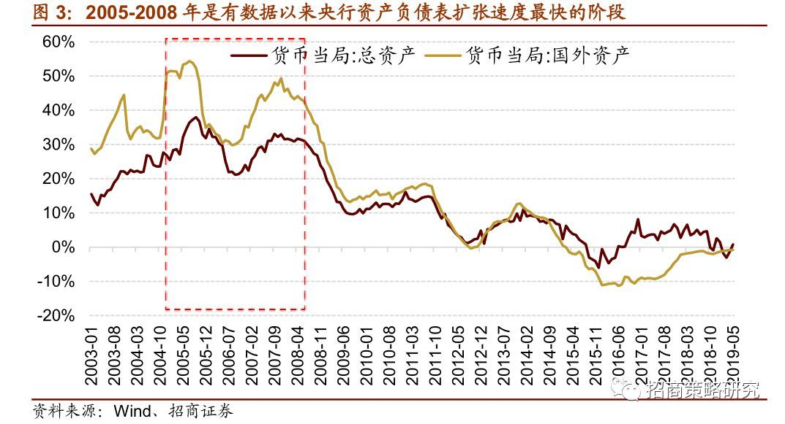

相应的，由于投资需求旺盛，在基础货币基础上，信贷和广义货币被以更高的速度派生出来。

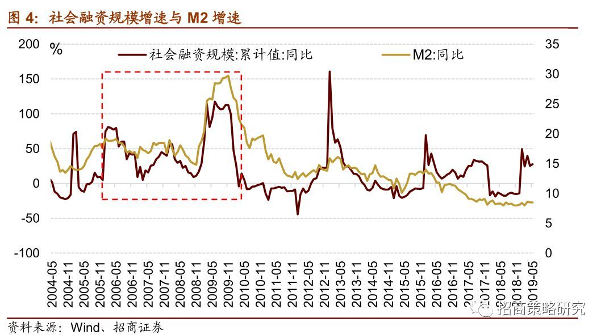

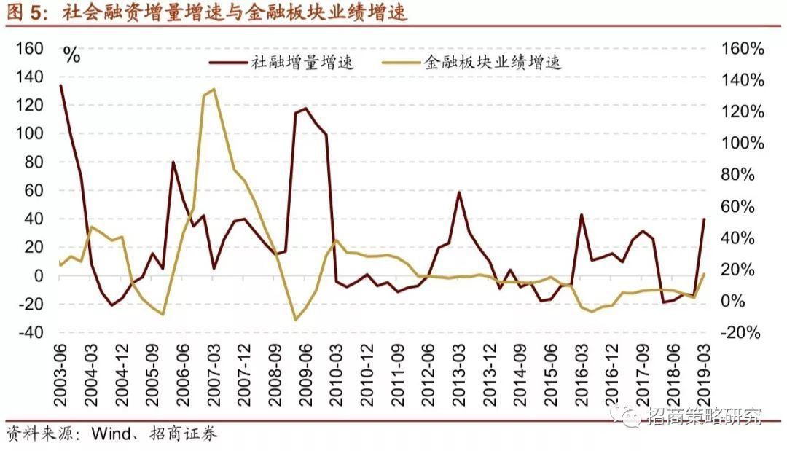

伴随着信贷扩张，以及股票市场的大牛市，金融板块业绩增速在 2006-2007 年实现了翻倍增长， 2006-2008 年，金融板块业绩要明显好于上市公司整体。

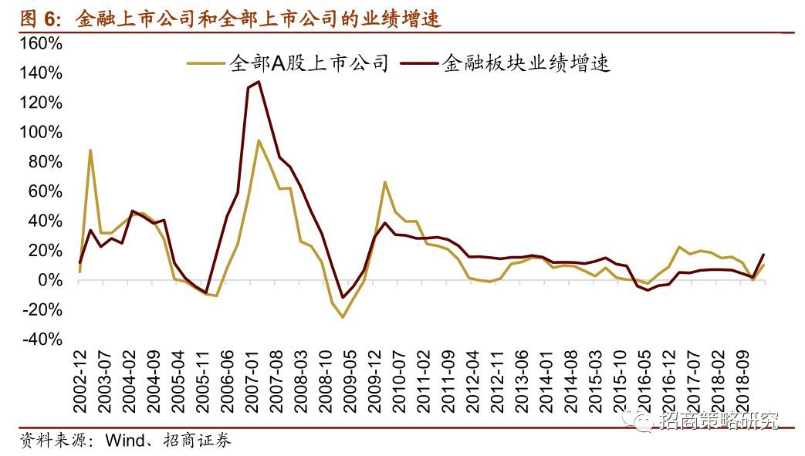

后来，投资者逐渐总结出规律，就是金融宽松先买金融，我们进行了总结，*从十年期国债利率从上往下击穿 3.5%，至社融增速回升，也就是我们称之为金融宽松周期阶段，金融板块相对大盘有超额收益。*我们在上一篇启示录《经济、金融、科技与资本市场政策周期与框架》详细讨论了这个问题。

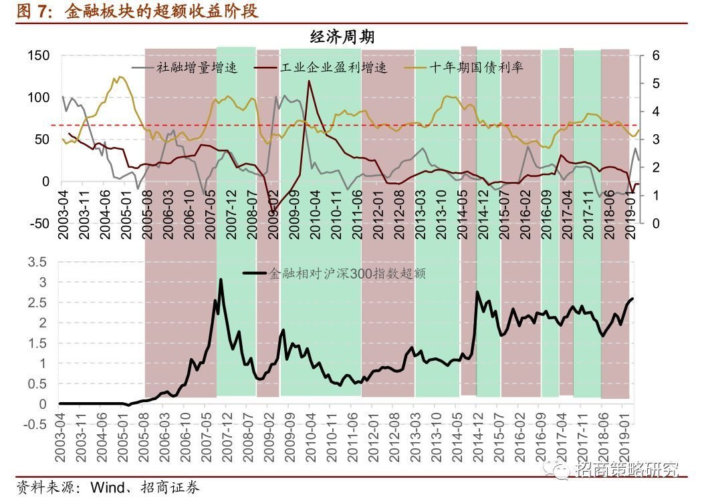

## 2. 抱团金融——那些年真正的成长股

2006 年，随着金融大幅扩张，非银金融以 300% 的涨幅领涨所有板块，其次是银行，那些年，银行和券商都是炙手可热的成长股。金融板块在 2006 年的大涨坚定了机构持仓的信念，公募基金在 2006 年年底对金融板块的持仓高达 40%。

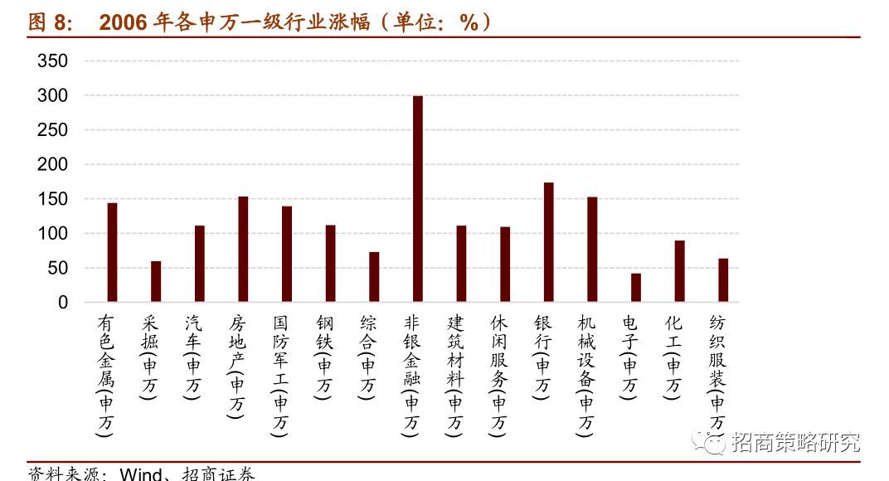

业绩高增长让公募基金坚定的持有金融板块，2007 年持续保持在 40% 以上，到 2007 年三季度，也就是上证指数冲 6000 点的那个季度，公募基金对金融板块配置最高达到 48%。

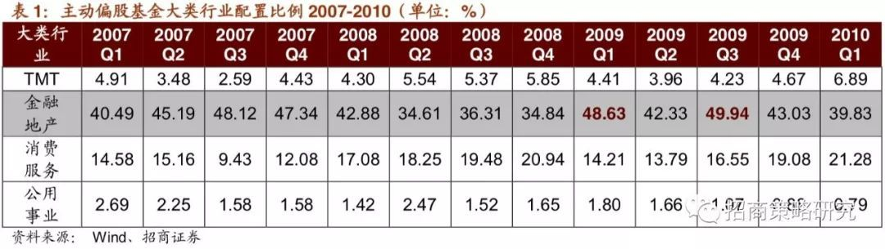

2006 年指数的大涨也让投资者对公募基金的关注度大幅提升，前文中提到的正反馈开始第一次发挥威力。2006 年 12 月，单只主动偏股基金发行募集规模达到 419 亿，也创下了主动偏股型公募基金发行的历史记录，这个规模在同类型产品里到现在也没有被打破。2007 年公募基金迎来了大爆发，2007 年股票和混合基金的规模达到近两万亿份，是 2006 年底的近四倍。

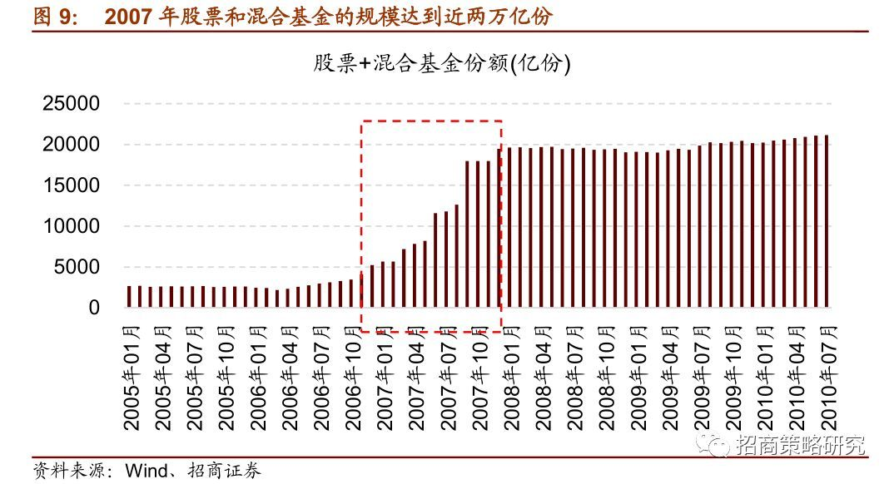

## 3. 疯狂 530——「抱团-申购」正反馈第一次显现威力

到 2007 年 5 月 29 日，上证指数已经从 2005 年 6 月的 998 点，持续上涨两年至 4335 点，涨了近 4 倍，已经有些泡沫化的迹象；

虽然 2007 年上半年市场大涨， 但对于相对排名的公募基金来说，并不是特别如意，因为上半年重仓的银行排名倒数第一，非银倒数第四。和后来的多次抱团出现的情况类似，有很多人认为抱团是不是该终结了。*但是和每一次抱团一样，前几次犹疑总是更好的加仓机会，开始的动摇是为了更紧的抱团，一次又一次下车、后悔、又上车，不断坚定持股信念，形成最坚定的抱团，并迎来最后的泡沫化。*

2007 年 5 月 30 日，A股历史上著名的 530 事件发生。2007 年 5 月 30 日财政部决定将股票交易印花税税率由现行 1‰ 调整为 3‰。从 5 月 30 日开始，指数跳空低开，连跌 4 天半，从 4335 点最低跌到 3404 点，4 天半时间跌去了近 1000 点，相当于一次小型股灾了。

对于大部分投资者来说，那是一次痛苦的调整，但是，对于 2007 年上半年发行的 6000 亿偏股型基金来说，提供了一个绝佳的建仓机会。

从 2007 年 6 月 5 日中午开始，市场开始反弹，新增资金继续加仓金融，金融板块一改颓势，携手周期加速上攻，最终，到 2007 年 10 月见顶之时，排名分列第三第四。而存量资金也继续转战金融，对金融地产板块的配置一度高达 48%。于是 530 之后，很多行业已经不怎么涨了。出现金融周期独秀的局面。至 2007 年 10 月 16 日，在金融板块带领下上涨指数定格在 6124 点。

而 2007 年，一个概念横空出世——A股「黄金十年」，称为当时泡沫化估值的一个注脚。

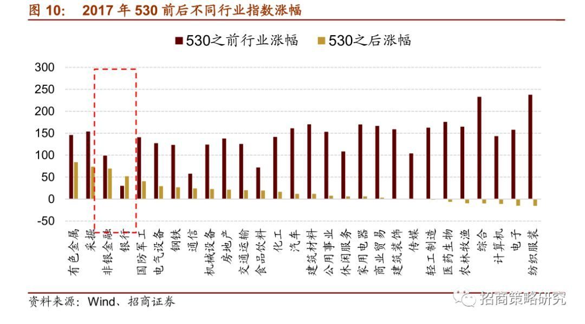

## 4. 「四万亿」与最后的抱团

2008 年金融危机，所谓金融危机，当然金融板块受到的冲击比较大，非银金融全年下跌 68%，实现了「膝盖斩」，不可谓不惨，而万万没想到，七年后，传媒指数从 2647 下跌到 528 点，四年时间持续下跌一共下跌了 77%。

下跌过程中，自然有投资者要动了减仓的念头，到 2008 年底，公募基金对金融板块的配置较 2007 年最高点下降了 14 个百分点。

正当对金融板块的抱团要全面瓦解时，2008 年 11 月，「四万亿」投资计划横空出世；这么多项目要投，那必然是金融和信贷的再一次扩张。

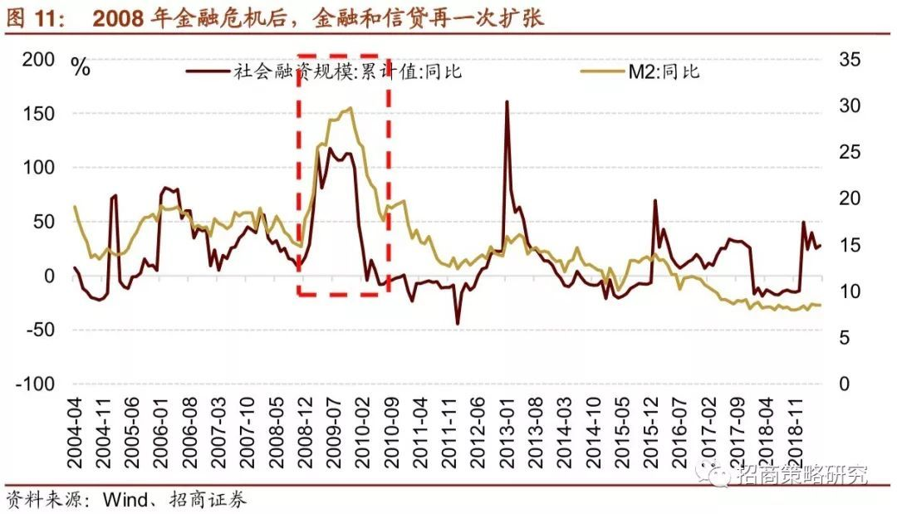

2009 年一季度开始，社融和 M2 增速再一次井喷，到 2009 年 7 月，M2 增速达到 29.7%，可谓是后无来者。「社融起，金融兴」，将要瓦解的金融抱团再一次迅速集结，到 2009 年一季度，对金融板块的配置再次回到 48%，并到 2009 年三季度达到创纪录的 49%。非银金融和银行在自 2009 年初至 8 月上证指数见顶，分别上涨 131% 和 114% 行业涨幅榜分别排名第 8 和第 11，再次跑赢了指数。2009 年三季度，公募基金重仓持有的前十大重仓股中，有六只银行、一只保险，其他三个非金融股分别是中兴通讯、贵州茅台和中国建筑。

从 2005 年开始的信贷货币放量，金融领涨，到2009年信贷放量后机构投资者加仓金融，体现了投资者对于相似变量的相似选择，*这种印射关系使得股票市场存在一定的可预测性，而是我们能够对宏观变量发生后的市场走势做出一定方向和结构预判，也使得策略分析师这份职业有其存在的价值和意义。*但是这种可预测性不是说分析师能够今天拍 2200，明天拍 3200，*这种拍点位长期来看也并不会有高于 50% 的准确率。*

## 5. 金融的美好时代抱团瓦解

2009 年三季度是公募基金对金融板块持仓坚定不移，并使得当时有很多投资者相信，为什么要研究股票，买银行券商就好了啊。但是，这种坚定的信念背后，一股新生的力量开始崛起。并对后来十年的投资产生了深远的影响——*那就是以白酒家电为代表的消费。*

我们前面提到了，机构投资者有一个重要特征，就是永远要寻找业绩增速最快的板块，2006-2009 信贷和货币飙涨的年代，金融板块毫无疑问就是业绩整体最优秀的板块。虽然周期也可以相抗衡，但是确定是波动太大。

2006-2008 年的白酒，虽然已经开始显露峥嵘，但算不上特别起眼的板块，那时候的除了茅台外，其他消费股远远没有现在这么万众瞩目受到机构投资者的青睐。

但是，2009 年意外发生了，2010 年一季度发布 2009 年年报的时候，投资者惊讶的发现，消费板块中食品饮料业绩增速达到 88%，远高于金融板块的业绩增速。虽然全年中证金融和食品饮料涨幅差不多，但是显然，金融板块主要靠估值提升，而食品饮料则是实打实的业绩。

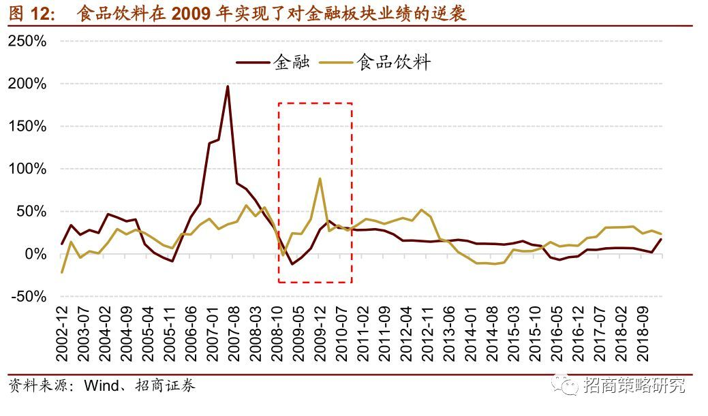

前面我们写道，机构投资者一定要买入业绩增速最高的那个板块，2010 年一季度，投资者开始意识到事情已经起变化。金融板块尤其是银行已经没有业绩弹性了。这种认识一直持续到今天，导致金融板块的估值中枢一直震荡下行，大家再不愿意太重仓持有金融板块，而是赚一波估值的钱就跑。

2010 年 4 月份，还有一个非常重要情况发生，那就是 4 月中旬公布的前三月新增社融增速为 -4.3%，为 2005 年三季度之后首次转负。「社融起，金融兴」的后半句是「社融落，金融挫」，后半句话成为金融抱团瓦解的另外一个原因。

2010 年二季度开始，金融的抱团瓦解，接下来一年半，让我们见识了抱团崩坍的结果，到自 2010 年 4 月中旬开始，到 2011 年 7 月中旬，金融指数整体下跌了 20%，而同期剔除金融的指数居然还上涨了 2%。到 11 年 9 月底，金融指数跌幅已经超过了 30%。

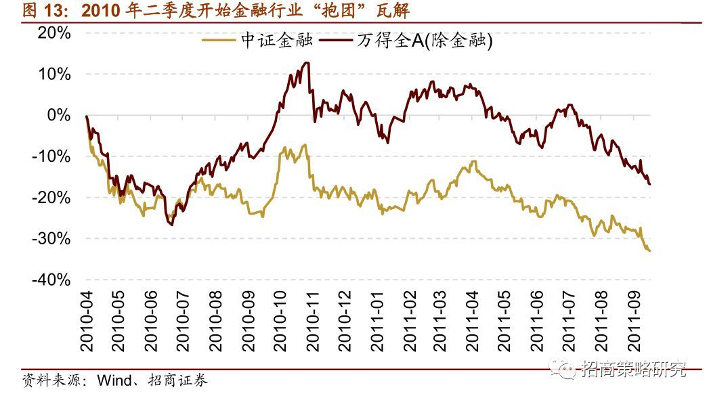

这个例子告诉我们，*虽然人多的地方不要去，但与人群方向逆向而行更要三思。*

## 1. 思维的转变

上文说到，消费板块在 2006-2007 年大牛市过程中并不为投资者所特别重视，2006-2007 年食品饮料板块作为消费的典型代表，业绩增速最高也不过 50%，远低于金融板块，因此，金融成为当年的宠儿。

但是，2009 年开始情况开始起变化，虽然信贷出现天量，让大家习惯性的去加仓金融，但是一个季度一个季度过去了，这一次好像情况有些变化，而金融板块业绩却未如预期大涨，反而是消费板块业绩迅速回暖，成为为 2009 年之后业绩增速最快的板块。

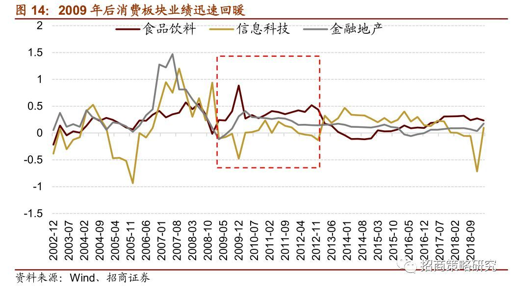

2009 年 Q3 公布了 2009 年的二季度报，这个时候消费板块并没有表现出特别好的业绩，公募基金加仓的贵州茅台、泸州老窖、美的电器等，普遍也只有 10-20% 的增长。但由于经济危机刚过，大部分板块在 2009 年上半年还是负增长，而稳健的食品饮料和家电板块已经交出了 24% 和 18.4% 的业绩增长，当大部分人仍然还沉浸在抱团金融，等待金融板块像 2006-2007 年一样业绩爆发式增长时。少部分投资者已经嗅到一丝不一样的地方。开始提前布局。

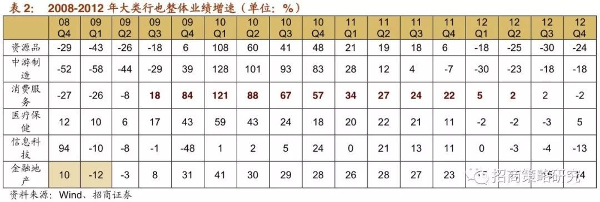

随后的事态发展超出了大家的预期，消费板块不仅是业绩最早复苏，而且在 2009-2012 年长达四年左右的时间，企业排名始终是前二的板块，大家期待的金融板块业绩爆发也只是昙花一现。消费还是那个增速的消费，但是金融已经不再那个高增长的金融了。因此，回过头来看，2009 年三季度成为消费板块超额收益的起点。

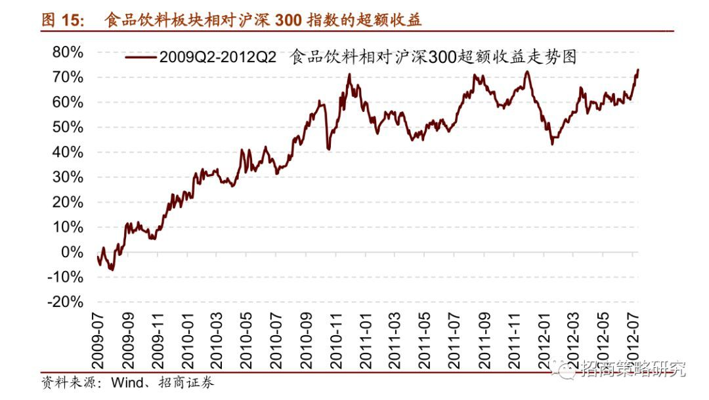

在人们心目中，食品饮料这样的消费需求应该是稳定的，但是为什么会有这么大业绩弹性？当我们事后来看，食品饮料板块最重要的业绩催化，就是涨价。如果我们将 CPI+PPI 与国家统计局公布的酒、饮料的利润增速画在一张图上，这种相关性就非常明显。无论是 PPI 上涨（原材料涨价）、还是 CPI 上涨（消费涨价）都会使得以白酒为代表的消费品有提价的动力，而且高通胀环境下，提价会比较顺利。因此，食品饮料板块的业绩高点均是出现在 CPI+PPI 比较高的时候。这个投资逻辑现在已经为投资者所熟知，但是站在 2009 年，大家仍然需要有一个接受的过程。

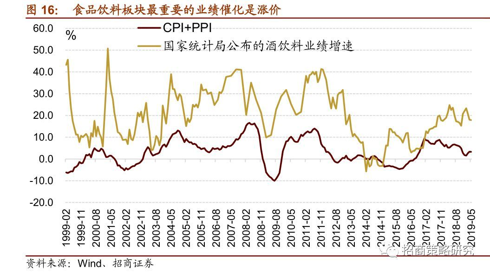

随着通胀不断回升，消费业绩始终保持高增长，2009 年三季度开始，公募不断加仓消费，到 2010 年三季度配置已经达到 28%，超过金融成为第一大重仓板块。

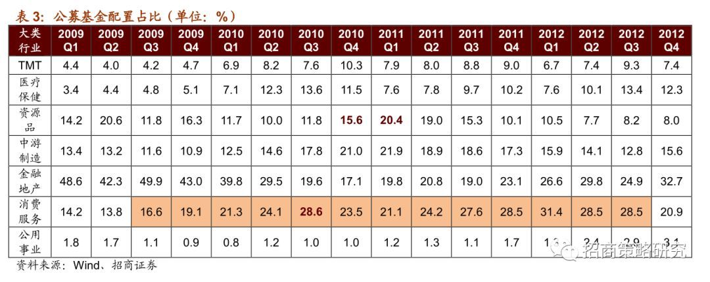

## 2. 第一次消费挖坑

2010 年 10 月，美国宣布 QE2，全球大宗商品暴涨，面对每天大涨的周期股，很多重仓消费的人坐不住了，忍不住卖没有什么弹性的消费去追了周期。2010 年 10 月开始的周期股大涨，一方面让资源品板块迎来了最高光时刻——公募基金配置比例达到 20.4%，仅次于 2009 年 Q2 四万亿推出之后。但是，这也成为资源品板块最后的繁荣时刻，自此之后，公募基金便无情的抛弃了资源品板块，此后最高也没有超过 12%。

然而好景不长，到 2011 年一季度，刺激效应逐渐衰退，经济继续下行，期待周期复苏成为泡影。到了 2011 年结算 2010 年全年业绩时，就算大宗商品在 2010 年大涨，但是资源品板块整体业绩仍然没有跑过消费板块。自此，一个坚定的信念开始出现——*「刺激经济买白酒」，*然而这并不是一句玩笑话。2017 年，也就是七年后，当资源品价格再一次大幅上涨时，机构投资者面对每天大涨的螺纹锌和稀土，选择了淡定的加仓消费。

## 3. 坚定的抱团消费

因此，2011 年二季度开始，投资者终于决定重新买回将原来抛弃的消费股，并在 2012 年一季度对消费的配置比例达到 31%，创下了历史新高，再次超过可能要等到今年的二季度了。

2011-2012 年上半年基本是消费一枝独秀，下面这张图可以让读者感受一下什么叫做「抱团」的温暖。2011 年 4 月 30 日至 2012 年 7 月 12 日指数涨幅，只有一个申万一季行业是涨的那就是——食品饮料。其他行业都感受到了周期下行的痛苦。2011-2012 年也是 2005 年牛市开启以来，分化最大的时候之一。

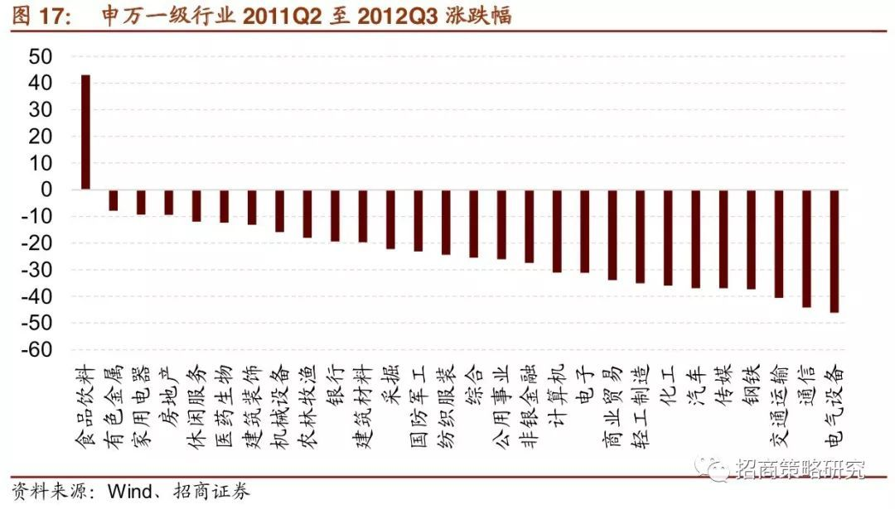

产品提价，业绩超预期，2012 年二季度是以白酒为代表的消费板块最舒服的一段时光，在 2012 年春季攻势过后，很多板块都开始持续下跌，但是只有消费继续上涨，一季度抛弃白酒等消费的板块的投资者再次被狠狠的教训了一把。2012 年上半年，白酒板块逆势上涨 32%。在那个时候已经是让人惊叹的成绩。但是没想到，七年后的 2019 年上半年，白酒板块涨幅竟然超过 70%。现在一比，2012 年的白酒指数真是小巫见大巫了。

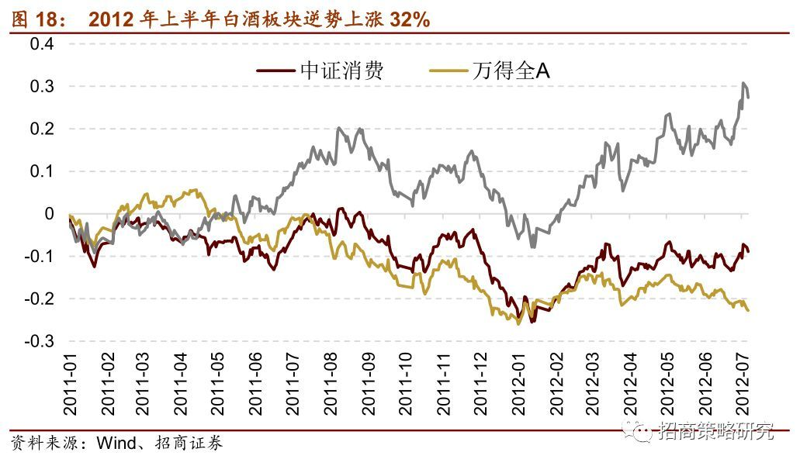

除了消费外，2012 年年初开始，已经逐渐传来货币放松的信号，2 月份开始降准，5 月再降准一次，6 月和 7 月降息，宽松再度来临，货币宽松买金融，这个规律仍然存在，金融成为另外一个加仓方向，但是和 2006-2007 年以及 2009 年不同，吸引了教训的机构投资者并没有像之前以前对金融板块那么热烈，市场普遍对「放水」的对经济的拉动是否还那么大的作用表示怀疑。

2012 年，抱团「金融+消费」成为当仁不二的选择。七年之后的今天，投资者还是做出了类似的选择。

2012 年 7 月 12 日是一个非常普通的日子，似乎什么事情都没有发生。贵州茅台刚刚分了红，每股分四块钱，正好美滋滋的分红再加仓。别的板块仍然跌跌不休。食品板块仍然还是那个最平静稳定的港湾。「只要拿着消费和金融，就可以躺着赚钱，为什么要研究股票呢」。周期已经消失了，价值投资的终于主宰市场。虽然偶尔传来一些白酒降价的消息，偶尔也会传来限制三公消费的声音，但是很多投资者都认为并不会影响大局。

我们找到一篇 2012 年 2 季度的一篇媒体报道：

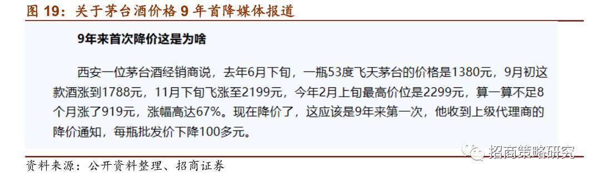

然而 2012 年 7 月 12 日却是消费指数的高点，当中证消费指数再一次突破这个高点，已经要到2015年牛市最快速上涨的一个阶段了。

其实事后从估值上看，这个位置消费并不贵，2012 年 7 月 12 日，中证消费指数估值为26倍。由于业绩优秀，即便股价在持续上涨，但是估值并没有进一步的提升。但是，由于 2011-2012 年整体是个熊市，因此，公募基金的发行并没有出现像之前类似的爆发，因此，这一次抱团没有出现我们前面提到的「抱团-申购」的正反馈，所以，没有出现估值溢价。

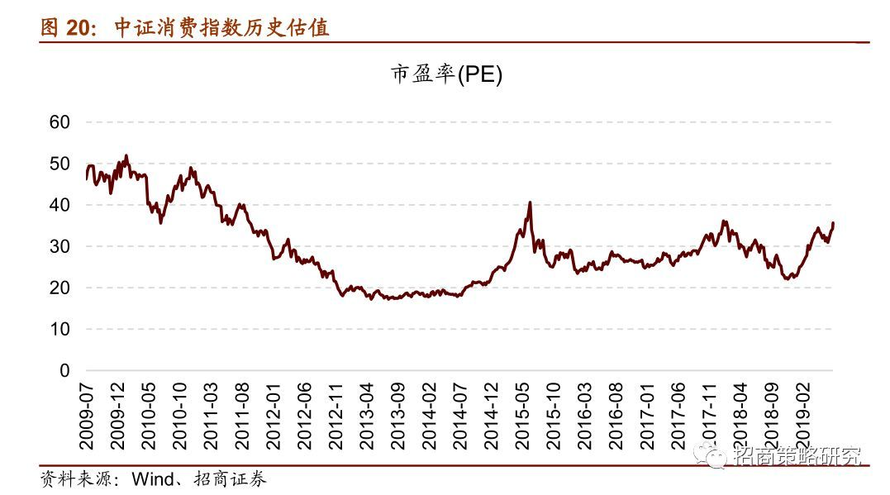

有时候周期的运行规律有其必然性，但触发周期运行的却是一些偶然的因素。2012 年 11 月，白酒的「塑化剂事件」爆发，从历史来看，出现食品安全问题反而倒逼行业更加规范，对于优秀上市公司应该直接影响不大。塑化剂事件爆发后，优秀白酒股反应不大。但是，2012 年 12 月 4 日，中共中央政治局召开会议，审议通过了中央政治局关于改进工作作风、密切联系群众的「八项规定」。三公消费受到抑制，对白酒行业的需求形成另外的冲击。2012 年四季度开始，投资者终于意识到情况不妙，开始减持食品饮料的股票。第一次对消费股的抱团开始瓦解。

和前面提到的金融板块抱团瓦解一样，消费的抱团瓦解也对消费股造成了巨量的伤害，导致消费股在随后一年大幅跑输了市场指数。到 2014 年二季度的，当年抱团的小甜甜消费和金融板块的蓝筹，已经有了新的绰号——「大烂臭」。当这个绰号诞生的时候，也似乎标志着另外一种极端情绪的降临——正好是金融蓝筹惊天爆发的前夜。

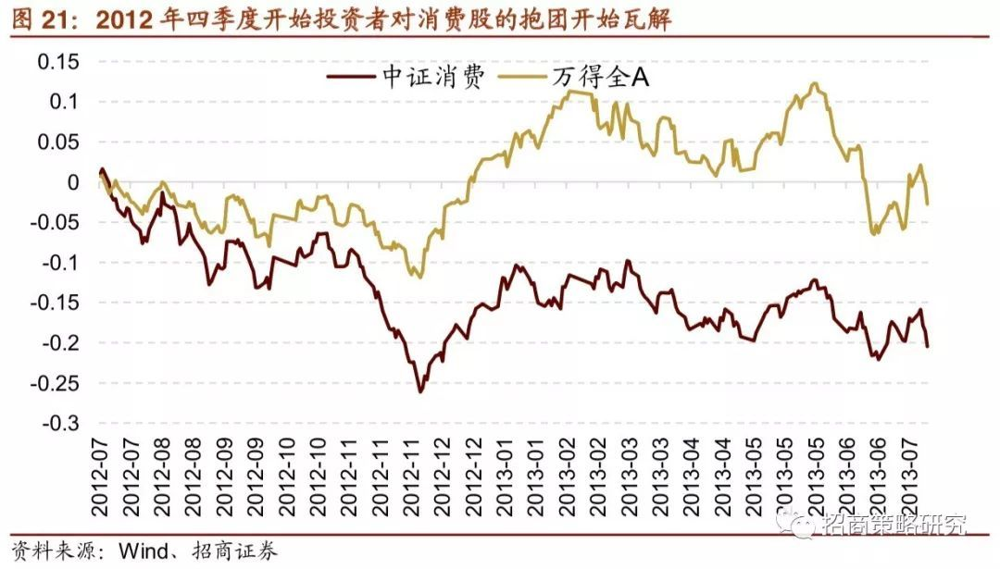

从下图我们看的非常清楚，2012 年四季度成为食品饮料为代表的消费板块的业绩拐点，自 2009 年到 2012 年长达四年的业绩优势消失。这时，信息科技板块开始崛起了。

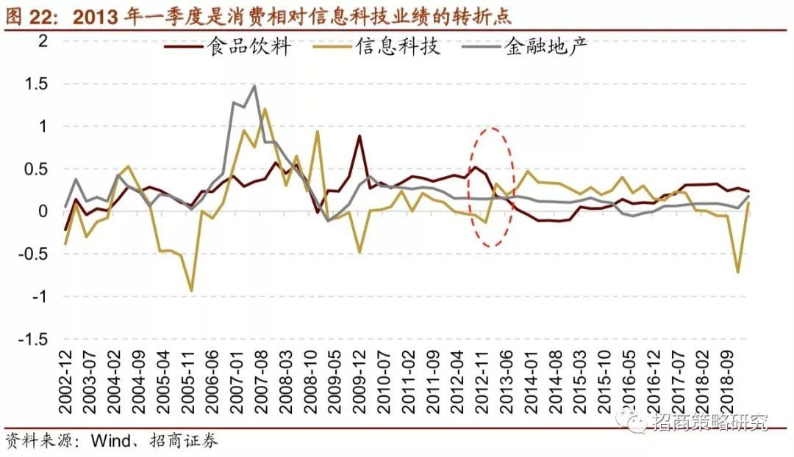

## 1. 信息科技板块的崛起

到 2012 年年底的时候，公募基金对信息科技板块的配置只有 7.4%，甚至还不如资源板块，这个时候距离 2009 年开通创业板已经三年了，信息科技板块增加了很多新的标的。但是三年这个时间非常关键，意味着 2009 年创业板开板以及 2010 年的 IPO 高峰的大股东要解禁了。一方面是业绩持续下滑，另外一方面解禁不断来袭，创业板从 2010 年最高 1219 点，到 2012 年 11 月底，跌至 585 点，跌幅超过 50%。中证信息指数更惨，跌了 53%。

2013年一季度，情况突然逆转，大家都认为信息科技板块一点希望都没有的时候，2013 年一季度信息科技板块整体业绩突然从负转正，达到 32%。

其实，如果有对电子行业跟踪紧密的投资者知道，2012 年下半年是智能手机非常重要的拐点，iPhone革命性产品 iPhone 3Gs 在 2008 发布后，已经带领着智能手机的渗透率不断提升，国内方面，模仿者和新进入者不断增多，2012 年下半年，竟然有高达 1400 款产品发布，智能手机迎来了春天。智能手机的销量爆发使得零部件厂商业业绩飞涨。智能手机销量爆发，3G 网络的普及，以及随后 2013 年 11 月发布 4G 牌照，正式进入 4G 时代。也有人把 2013 年看成是移动互联网的元年。除此之外，国内安防建设开始加速。安防、消费电子和通讯设备，成为一季报的电子行业的三驾马车。也构成了 2013-2015 年TMT板块的牛市基础。

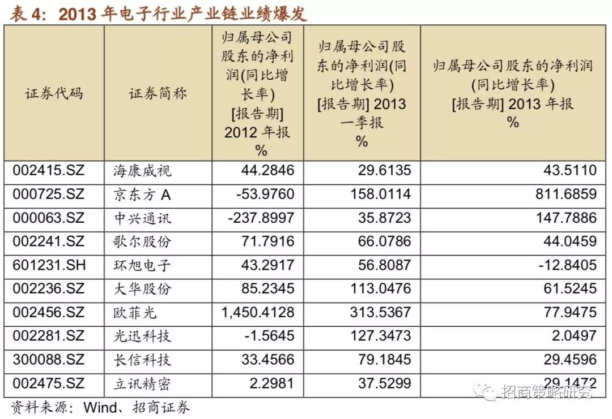

硬件建设的另外一个主线就是互联网和移动互联网，2013 年初开始，网宿科技开启了他的二十倍之旅。网宿科技作为国内 CDN 龙头，成为互联网和移动互联网爆发的最大赢家之一，在投资者纷纷对创业板业绩怀疑之际，网宿科技在继 2012 年实现扣非净利润 89% 的基础上，在 2013 年继续加速，实现了 128% 的业绩增长。也使得网宿科技在 2013 年涨了 505%。

硬件之外的应用成为另外的大牛股孕育集中地，2013 年开始随着智能手机渗透率提升，手游也开始爆发，2013 年《愤怒的小鸟》《水果忍者》等一系列游戏成为爆款，满世界都在玩。手游的爆发也催生的腾讯和网易这两家大型互联网公司找到了最大的利润增长点，智能手机销量的爆发，最大收益群体之一是手游，这种简明易懂的逻辑时候看来非常简单，但是在当时并不是所有投资者都能够那么笃定。

A股方面，手游新星掌趣科技，掌趣科技凭借手游和并购，2013 年一季度实现了 44% 的业绩增长，全年业绩增长达到 80%。

前文提到，周期的结束有很多偶然因素，周期的开始也不例外，2013 年开始已经有了很多新产业趋势开启。而 2012 年春节档《泰囧》突然爆发，以 12.67 亿人民币最终票房问鼎当年春节档票房冠军。也让发行方光线传媒业绩和股价坐上了火箭。投资者突然又发现了影视传媒这个炙手可热的新增长点。

2013 年的一季度，从基本面的角度，信息科技产业迎来了百花齐放，成为信息科技行业周期爆发的起点。

*这一切，都要归于技术进步和居民消费习惯的变化。*

而蓝色光标则另辟蹊径，开创了另外一种利润获得模式——并购，2012 年下半年开始，蓝色光标的并购大业开始突飞猛进，2012 年一季度，公司报表上商誉仅有 2.8 亿，到了 2015 年底，达到了 46 亿，并购并表使得公司业绩连年增长。2013 年一季报和年报分别录得了 42% 和 86% 的增长。

蓝色光标的成功对投资界带来一个新的气象，那就是接下来三年，去上市公司调研必问的问题是*「公司有外延式增长计划吗」？*

而跨界并购、并购转型也是从 2013 年迎来新的开始。其中有一些转型成功的案例，例如东方财富从互联网公司转型券商服务和财富管理服务，但大部分并购的结果都不甚理想，尤其是 2015-2016 年发生的并购。而大量并购又带来了大量商誉减值压力和减持压力，给也是造成创业板从 2015-2018 年连跌四年的重要原因，此为后话。

我们可以总结一下，2013年一季度信息科技产业迎来了多重爆发点：

* 智能手机——代表 欧菲光、歌尔股份
* 安防建设——代表 海康、大华
* 3G-4G网络建设——代表 光迅科技、中兴通讯
* 互联网基础设施建设——代表 网速科技
* 手游——代表 掌趣科技
* 影视——代表 光线传媒

智能手机——代表 欧菲光、歌尔股份

安防建设——代表 海康、大华

3G-4G网络建设——代表 光迅科技、中兴通讯

互联网基础设施建设——代表 网速科技

手游——代表 掌趣科技

影视——代表 光线传媒

其他不一一列示，这些有业绩的行业龙头带领着信息科技板块业绩出现爆发，终于，信息板块成为业绩增速最快的板块。

按照我们前面提出了，机构投资者总是买入业绩增速最高的板块，那么当然，抱团信息科技板块的大幕开启。

## 2. 拥抱新产业趋势和并购

从 2013 年一季度开始，机构投资者开始快速加仓 TMT 板块，持仓比重迅速提升至 2013 年三季度 24.4%，信息科技板块在 2013 年实现了一枝独秀。

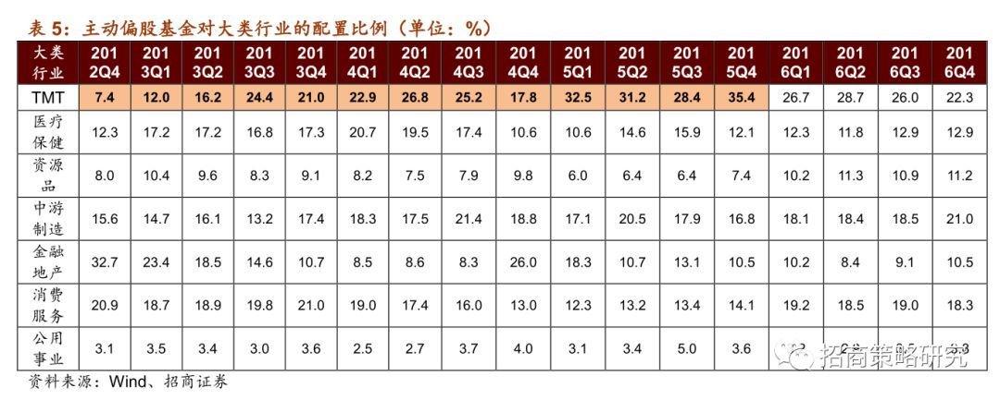

到了 2013 年三季度，信息科技板块龙头涨幅巨大，翻倍的股票比比皆是。这个时候，问题来了。中证信息指数已经从最底部的 26 倍，攀升至近 60 倍，创业板指从最低 29 倍，攀升到 60 倍。涨幅巨大且估值较贵。这让很多投资者开始打退堂鼓。到 2013 年底，对信息科技板块持仓下降到 20.9%。中证信息指数也陷入了两个季度的调整。2014 年一季度，2013 年年报陆续披露，业绩依然优秀，震荡调整到 2014 年 6 月，估值水平得到消化，中证信息指数估值回到 36 倍左右。

正当机构投资者开始对信息科技板块进行第二次加仓，并在在心情忐忑的开始等待大涨。但万万没想到，2014 年四季度大涨的居然是大家早就丢在一边的金融地产板块。到 2014 三季度，对金融地产配置创纪录低至 8.35%。就在所有投资者都对金融板块绝望之际，希望就这样扑面而来。从 2014 年 7 月中旬开始，券商板块带领金融板块出现爆发式增长。券商指数从最低到最高涨幅超过 4 倍。

金融板块大涨的原因也非常简单——货币宽松。2014 年三季度央行开始通过 MLF、PSL投放基础货币，2014 年 10 月降息，均被理解为力度强劲的宽松工具。货币宽松买金融这个诀窍是屡试不爽的策略，因此和此前消费抱团中的周期大涨非常类似，还是有大批投资者弃信息科技去追金融板块。买的早的就赚到了，买的晚的，或者不坚定的可能在这一波大涨中也没有占到太多便宜。

在休息了一年之后的信息产业和创业板，自 2015 年一季度再度迎来了爆发，站在 2015 年一季度看全部行业业绩，除了券商收益率市场持续上涨业绩改善之外，其他板块都在经济下行中面临很大的业绩压力。此时，此前风光无限的消费板块，业绩变为负增长。2014-2015 年信息科技板块相对消费服务的相对业绩差距之大，就好像 2017-2018 年的消费相对信息科技板块的相对业绩差。所以说，机构投资者永远真正爱的是业绩，而不是某一个板块。

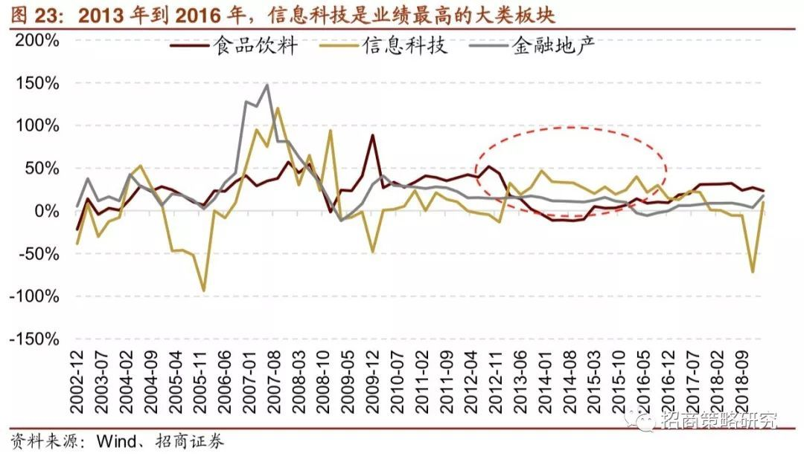

2014 年开始，并购并表逐渐成为另一重的业绩贡献力量，抵御了宏观经济的下行，而且，2014 年 4G 建设提速，2015 年，新产业趋势越来越明朗，而国家也将互联网+，工业 4.0 提到比较高的国家战略上来，给予了大量的资源支持。

## 3. 「抱团-申购正反馈」与信息科技估值溢价

2015 年开始，非常经典的「抱团-申购」的正反馈再次上演，但这一次的主角，成为 TMT 类型产品。混合型和股票型基金的规模自 2009 年以来再度迎来小爆发，到 2015 年 6 月，相比一年前的规模扩张了近一倍，达到 3.3 万亿份。

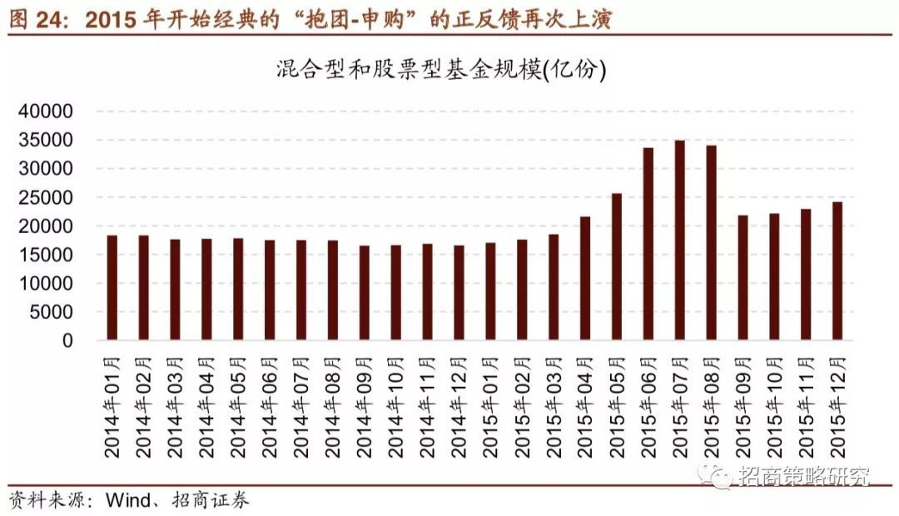

2015 年爆款基金频发，50 亿以上规模的偏股型基金发了 50 只，100 亿以上了发了 10 只，基金公司的销售从来没有这么幸福过，因为客户都是在抢而不是在买。管理这些产品的都是过去两年重仓信息科技板块的赢家。自然毫不犹豫的加仓信息科技。

公募基金、私募基金、融资余额在 2015 年上半年实现了共振，疯狂买入各种信息科技股票，有申购认购就加仓原来的重仓股，中证信息指数在 2015 年的上半年，涨幅高达 147%，创业板指更是从 1000 点左右，涨到 4000 点，涨幅达到 4 倍。而估值双双突破了 100 倍。

这种级别的行情，只有 1999 年 519 行情和纳斯达克指数在 1998 年 5 月之后的纳斯达克互联网泡沫能够相提并论。

这个阶段，有一句非常著名的俗语「看基本面就输在起跑线了」或者「看估值就输在起跑线上了」。

笔者有幸在 2015 年参加了一家上市公司调研，左边一排是台湾来的投资者，右边一排是内地投资者，调研开始后左边都在问着笔者听不懂的一些专业术语以及各种产品的市场空间，产能利用率，毛利率，而右边问的全都是「公司要搞员工持股吗」「公司要进行外延式并购吗」「公司那个新业务（还在概念阶段）有什么计划」，最后，有一个调研人员干脆问了一句，「公司对股价有诉求吗」，此问一出，技惊四座。

和 2007 年一样，估值已经给脱离了地心引力，只要估值能够突破原来的区间限制，再给多少倍已经不重要了。所以，当时的中证信息指数和创业板指估值都是夸张的 100 倍以上。不过奇怪的时，2014 年还有人讨论创业板是不是贵了，2015 年就没人讨论了。但是，还是得给估值啊，因此，这个时候，最受欢迎的估值方法是对标估值法，就是美国同行业的公司市值是多少，那么这家A股市值只能高不能低。而且当时也是卖方分析师最高光时刻了，推啥涨啥。

总之，2015 年是非常奇怪的一年，各种现象光怪陆离但是身处其中的人们并没有人觉得奇怪。因此，作为投资者时刻都要问自己问题，有没有对于本来应该奇怪的现象反而麻木了？如果有的话，很可能意味着某种风险正在聚集。

2015 年 7 月开始，A股出现了明显调整并触发了一些风险，政府部门采取了一些稳定措施，调整持续了一个季度，一直到 9 月底，由于跌幅快速并且巨大，大部分机构投资者都来不及减仓，到了 9 月底，当市场终于企稳时，大家的第一反应当然是加仓跌幅巨大的信息科技，到 2015 年四季度，前面还在犹豫不决的投资者抓住了最后的机会，赶紧加仓，公募基金对信息科技板块持仓达到 35.43%，创下了历史新高。回过头来看，四季度这个选择依然是最优且符合我们前面提到的真·价值投资理念的。因为 2015 年全年，信息科技又是业绩增速最稳健且高的。

## 4. 抱团瓦解：又一次意外的触发

2016 年 1 月，市场意外的再度明显调整。站在 2016 年一季度，由于 2015 年并购的并表，2016 年一季度创业板也及增速仍然高达 40%，而信息科技板块业绩也有 40%，仍然是所有板块里面更高的，因此，大部分投资者都仍然选择继续抱团信息科技，但是，事情起了一些变化，2014-2015 年持续萎靡不振的社融增速，到 2016 年 1 月竟然达到了 40%，「货币政策又宽松了？」岂不是要加仓金融？但是 2009 年和 2012 年的教训告诉我们，社融增速回升过后并不意味着金融板块就会是最强板块，2009 年之后是消费，2012 年下半年之后是信息科技。而 2016 年一季度，消费板块整体业绩增速已经从个位数回升至 14%。

2016 年 3 月开始并购重组政策开始传出收紧的信号。我们在 2016 年 5 月写了一篇报告《创业板兼并重组深度分析》，里面拆解了创业板的业绩增速贡献，14/15 年被并购的标的在 2015 年为上市公司合计贡献了 52.1 亿的净利润增量，占 2015 年净利润增量了 60%。因此，只要并购不继续保持增长，这部分贡献将会逐渐降为 0，拖累业绩则增速；而三年业绩承诺期过后，商誉问题将会显现，商誉减值将会产生负贡献。这个逻辑之前，之前依靠并购实现了业绩高增长的公司，将会出现业绩大幅下滑。2017 年 4 月我们写了另外一篇报告《壳价值的覆灭》，写到 「我们担心 17 年开始 18 年，将会是商誉减值集中爆发的两年。」2018 年出现了商誉减值集中爆发。

并购逻辑的破灭，加上移动互联网红利逐渐消退，信息科技指数业绩增速进入下行趋势。从 2016 年一季度开始，机构开始持续减仓信息科技板块，抱团开始瓦解。机构开始寻找新的方向。当然，没有意外的，抱团瓦解开始后，信息科技和创业板迎来了失落的3年。中证信息指数从 2016-2018 年三年下跌 44%，创业板指连跌 3 年，下跌 54%。那些曾经辉煌的十倍股们，很多股价都是「脚踝斩」，跌幅超过 70% 的比比皆是。

## 1. 七年后的镜像

我们在多篇报告中讨论过，中国经济有三年半的信贷周期，两个三年半就是七年。七年是A股重要的周期运行规律。而 2009-2012 年经济的上行和下行周期，与 2016 年到 2019 年的上行和下行周期，有着非常相似之处，因此，股票市场也是非常类似镜像表现。而这中间最相似的，莫过于消费板块的表现。

2019 年一季度和 2016 年一季度同样都是社融增速大幅放量，信贷的放量意味着经济要起来，但是经过了若干轮刺激之后，大家对于信贷放量对金融板块业绩的推动已经不抱太高的预期了。因此，投资者的学习效应，使得投资者直接跳过金融板块，加仓消费，除了家电板块业绩逐季度提升外，其他消费板块仍然保持稳定，2016 年随后几个季度，机构进行了观望。

2016 年的不速之客是沪股通，沪股通自 2014 年开通以来，由于相对 2015-2016 年的资金波动太小，几乎没有什么存在感，2015 年底累计买入金额余额只有 870 亿。从 2016 年开始，北上资金开始持续增仓A股。不过 2016 年大家几乎没有怎么注意到，因为到年底北上资金只买了 450 亿。

2016年的除了信息科技板块遭遇明显减仓，其他行业或多或少都有一些增加，但是方向并不明确。自熔断反弹以来，建筑建材受基建扩张受益领涨外，食品饮料排名第二，家电涨幅也不错。

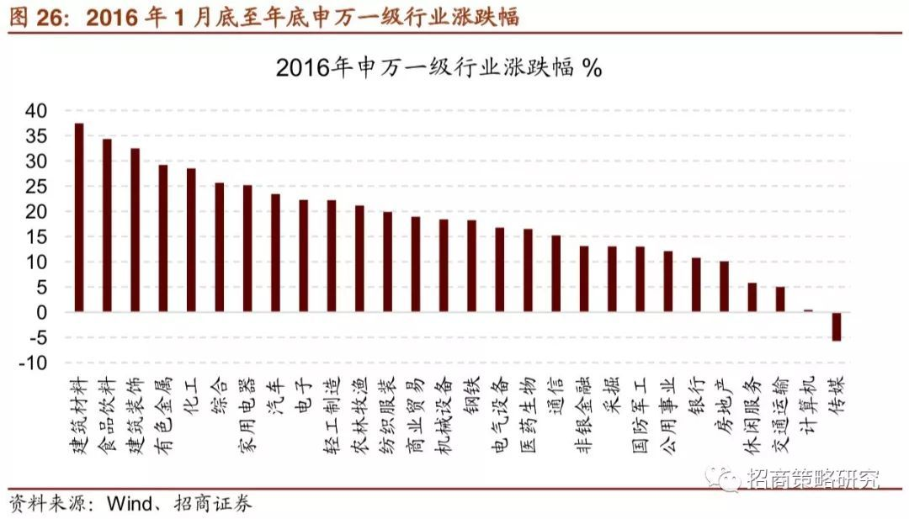

2017 年开始，沉寂已久的食品饮料在七年之后终于开始受到投资者重点关注。但是，有几个问题必须要回答。第一，怎么解决三公消费受到抑制后白酒需求问题呢?第二，怎么解决家电所面临的天花板问题呢？第三，怎么解决必须消费品需求稳定而没有业绩弹性的问题呢？终于，一个崭新的概念再度流行——「消费升级」。

笔者使用慧博历史搜索「消费升级」，发现一个有趣的现象，2015 年以「消费升级」作为标题的卖方报告只有 2 页 60 篇，到 2016 年，这个数量增加到 9 页 270 篇，而到了 2017 年增加到 15 页，450 篇。一方面，反映了消费板块复苏后，卖方研究员也开始明显活跃，而另外一方面，不管是推行业还是推个股，少不了把「消费升级」作为核心理由。

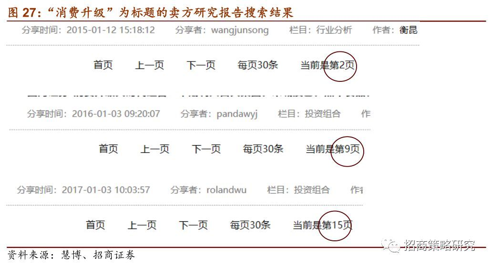

但是，2015 年和 16 年就相隔了一年，居民收入有增加也不会增加太多，怎么就升级这么快呢？打开我们熟悉的 excel 报表，拉一下 CPI+PPI 数据发现，从 2011 年 12 月之后这个指标持续下行并持续保持在 1% 以下。到了 2016 年 7 月开始负转正并持续攀升。PPI 回升，原材料价格上涨，得涨价吧？经济改善收入改善，需求增加，得涨价吧。但是，「涨价」总归不如「消费升级」说的文雅，因此，消费业绩回升的背后，和往常一样，依然是通胀。

供给侧结构性改革在其中扮演着重要的作用，通过环保和供给侧改革，困扰中国多年的产能过剩得到了有效的解决，大宗商品价格在 2016-2017 年也拔地而起。当我们都认为最受益的应该是钢铁煤炭有色吧？但是，榨菜瓜子二锅头并不这样想。

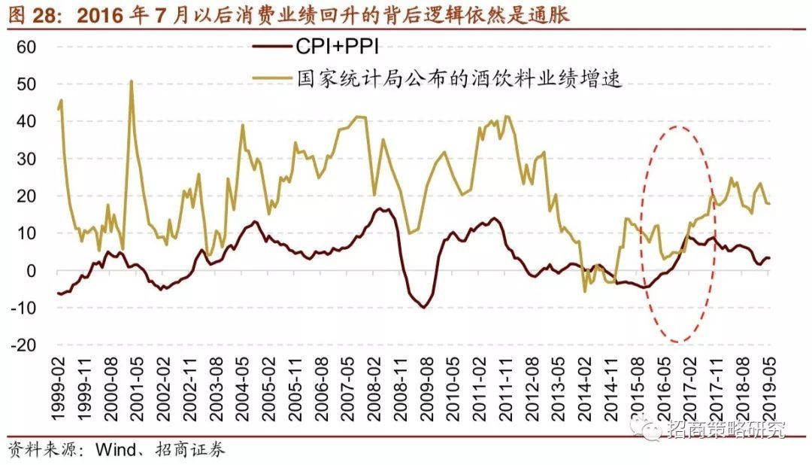

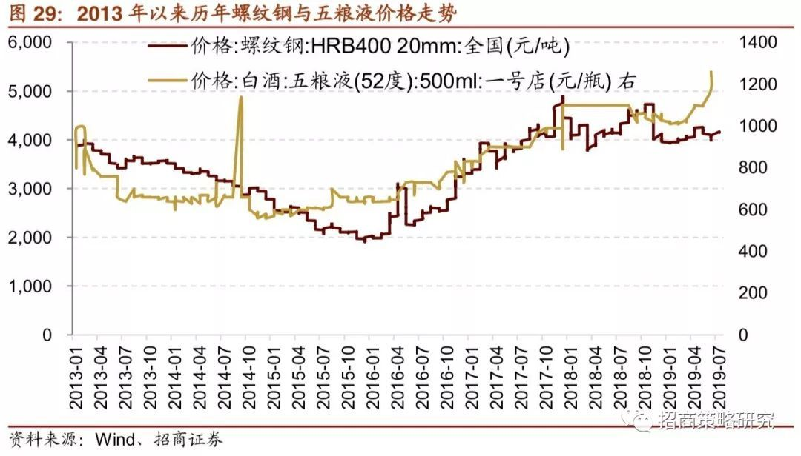

2017 年开始，机构终于就消费达成了一致开始大幅加仓食品饮料，从 2016 年 18.3% 到 2018 年二季度接近 30%。再加仓上加仓的医药中也有大量消费属性的标的，对消费抱团基本形成。

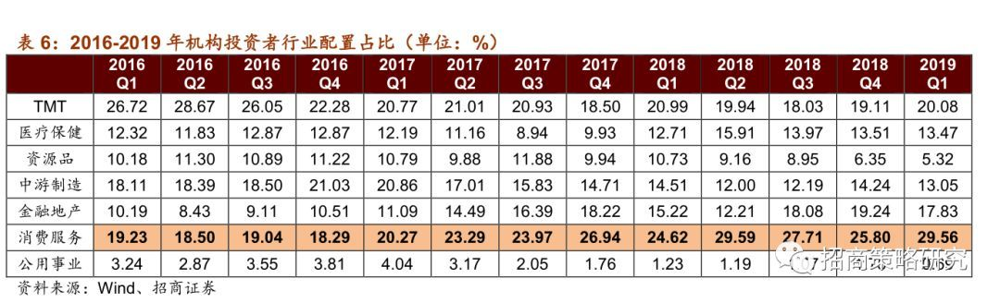

## 2. 两次错过消费的「假摔」

和 2010 年开始的那波消费抱团类似，在 2017 年到 2018 年也有有两次「假摔」，第一次发生在 2017 年 2 季度，消费板块在持续上涨之后开始滞涨，2017 年三季度开始，大宗商品触底反弹，非常像 2010 年三季度的反弹，要不怎么说是七年镜像呢。以钢铁、锌、水泥和稀土为代表的大宗商品开始大幅上涨，很多周期个股在短短一个多月内翻倍。但是，七年前的教训还在眼前，大部分机构投资者都克制的不去追周期品个股，仍然选择了等待。

不过，事实证明，对于机构投资来说，周期股不是长久之计，消费才是最佳选择，经历了一段时间喧嚣后，2017 年三季度开始国内机构携手北上资金，到 2018 年 1 月底将消费板块估值打到了一个新的高度。

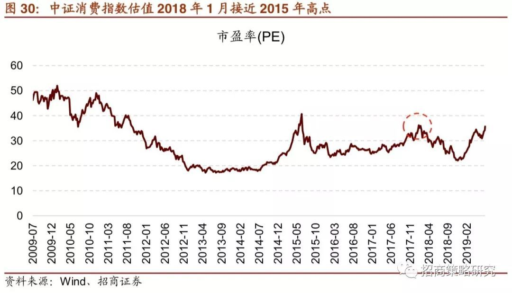

第二次「假摔」从 2018 年 6 月开始，上半年资管新规开始实施，去杠杆加大力度，信用收紧信号预发明显，新增社融负增长，而去杠杆对民营企业的冲击更大，导致大家对就业开始担心；而此时，中美贸易摩擦开始升温，出口企业雪上加霜；到了 7 月 20 日，中共中央办公厅、国务院办公厅印发了《国税地税征管体制改革方案》,明确自 2019 年 1 月 1 日起社会保险费由税务部门统一征收。被分析师认为对消费产生不利影响。以上事件共同作用，突然使得市场对消费需求产生怀疑。

而此时，酒饮料的业绩增速确实从高位开始有所回落。

三重利空齐发力之下 2018 年 6 月开始，消费板块开始大幅调整。此时，很多坚定的消费板块的投资者都选择了放弃，到 2018 年底，对消费板块的配置明显降低。

这一次调整幅度这么大，但没想到仍然不是消费景气周期的结束——就和 2011 年一样。2018 年公布完三季报的单季度只有个位数增长的贵州茅台竟然在次日跌停。有媒体报道的标题是——《 「今天『股王』贵州茅台跌停 一个时代的结束？」 》。万万没想到，这不仅不是一个时代的结束，而是一个时代的开始……所以，笔者总结对于那些特别吸引人眼球的看多和看空报告一定要小心谨慎类似的标题包括「黄金时代」「黄金十年」「一个时代的结束」「xxx典范」「中国版xxx」，比如下面这样。

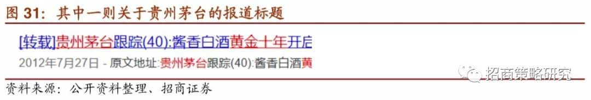

当茅台从坑中爬起来，完成了从 500 块到 1000 块的上涨只用了半年。而白酒带领着消费板块成为2019年上半年最靓丽的风景。

最近一段时间，开始流行几个段子，第一个段子说的是，关于优秀和普通研究员，大概意思就是，无论发生了什么，普通研究员都会从逻辑的角度推荐相应版块，但是优秀研究员都会推荐消费或者白酒。

当前大家耳熟能详的概念和信念就是—— 「核心资产」，究竟什么是核心资产？这是非常好的一个概念，描述了一组市值大行业龙头、外资重仓、ROE 高的股票组合，但是核心资产真正隐含的概念一定是那些涨的好的龙头标的，外资重仓的有暴跌的，市值大的有跌的，ROE 高在 2018 有暴跌的，这些都会在潜意识里被剔除核心资产的概念，「核心资产」本质上还是一个选股问题。

举个简单的例子——同样是高 ROE、外资重仓、行业龙头，在人们提起核心资产的时候，TMT 板块里面几乎都会列上立讯精密，但是会刻意的把海康威视、大族激光这些过去调整的比较多标的可能就会选择性忽视。而老牌的消费白马老板电器、索菲亚，遭遇阶段性的低谷，可能就会被剔除核心资产概念。

哪家公司又能永远保证业绩能永远最优秀，股价永远涨？

## 3. 抱团什么时候会瓦解？

但是前面三次抱团的瓦解的案例，给了我们一个很好的借鉴思路？我们需要回到几个问题。

*第一，业绩差出现转折了吗？*

从高频数据来看，如果用国家统计公布酒、饮料和茶的利润增速减去计算机通信和其他电子设备制造业的增速来看，目前这个差值和 2011-2012 年类似，仍然处在相对高位，未来是否有收窄的迹象？有待进一步的观察，虽然笔者从科技周期角度去推导，三季度可能是信息科技板块的业绩底部，但是这个底部持续到多长时间，仍然很难判断。因此，客观上讲，现在投资者选择抱团消费似乎仍然是当下非常合理的选择。

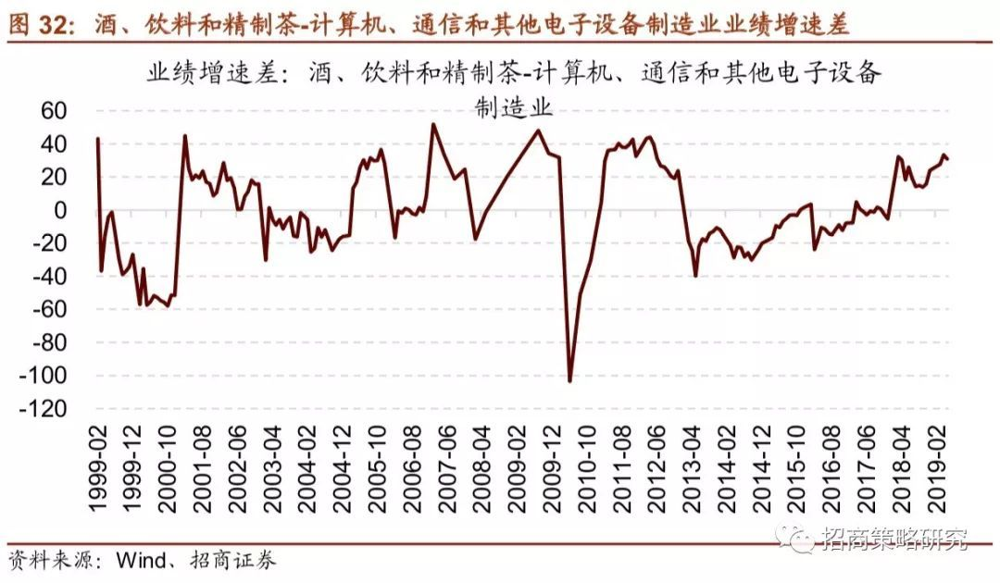

从过去几个季度消费（以食品饮料为代表），信息科技和金融地产相对业绩比较来看，食品饮料板块依然是最高的，金融板块在一季度市场大涨背景下，业绩有所改善，而信息科技板块同比业绩也有所改善。消费相对金融和信息科技的业绩差已经开始缩窄。

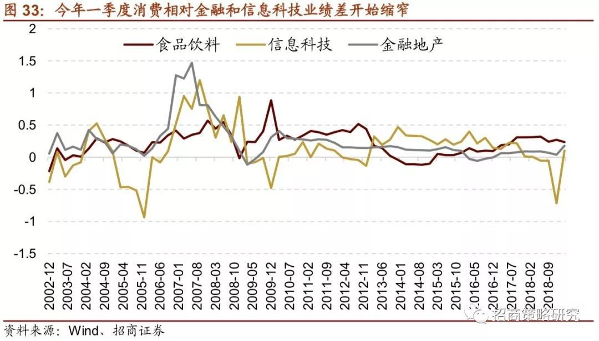

所以，二季报和三季报非常关键，*如果这种业绩差仍然保持，消费仍然可能持续抱团，但是无论是食品饮料业绩增速下行，还是信息科技或者金融突然业绩上行，都可能会给投资者放弃抱团消费，拥抱新的板块的理由。*

而回到三大板块的催化因素，对于消费是通胀预期，目前仍然维持在比较高的水平，但存在下行的可能；金融是货币政策松紧，目前是偏宽松；而信息科技则是新的技术趋势，目前 5G 已经加速建设，但是新的技术趋势和爆款产品，并没有像 2013 年那样明显出现。但是根据通信技术进步拉动新产品新应用的规律，三季度也许就是本轮信息科技板块的业绩底部。

从七月中旬开始，上市公司陆陆续续会公布半年报，这给了我们一个非常重要的观察窗口。

*第二，「抱团-申购」已经发生了吗？*

目前数据并不太支持这一点，我们看到的数据是，今年以来，主动偏股公募基金发行了 1100 亿，而总份额只增加了 540 亿份，存量的规模竟然还是缩水的，基民面对这种今年市场的大涨，表现出了出乎寻常的冷静。可能仍然没有从 2018 年大跌的阴影中走出来吧。不过，能够发行新产品或者有净申购的产品大部分都是过去两三年业绩比较好。所以，这一次「抱团-申购」可能更多是结构性的，「消费型」产品和管理人可能有更多的申购。所以，这种结构性的赎回其他产品申购绩优基金产品的举动，可能是消费板块目前估值提升的动力之一。

*第三，估值到顶了吗？*

首先需要说明的是，估值永远不是股价决定的最重要的因素，前面我们已经见识过 2007 年的金融股泡沫，2015 年的信息科技泡沫，*如果触发了「抱团-申购」正反馈，只要突破了合理估值区间，估值将会变得不重要。如果消费股继续上涨，个人投资者开始大规模申购公募基金，真正触发了「抱团-申购」正反馈，中国消费板块出现美国 70 年代「漂亮50」也不是没有可能。*但是，如果投资者冷静下来，去看看当前的消费板块的估值，客观的说，*现在已经是 2012 年以来比较高的水平了。*

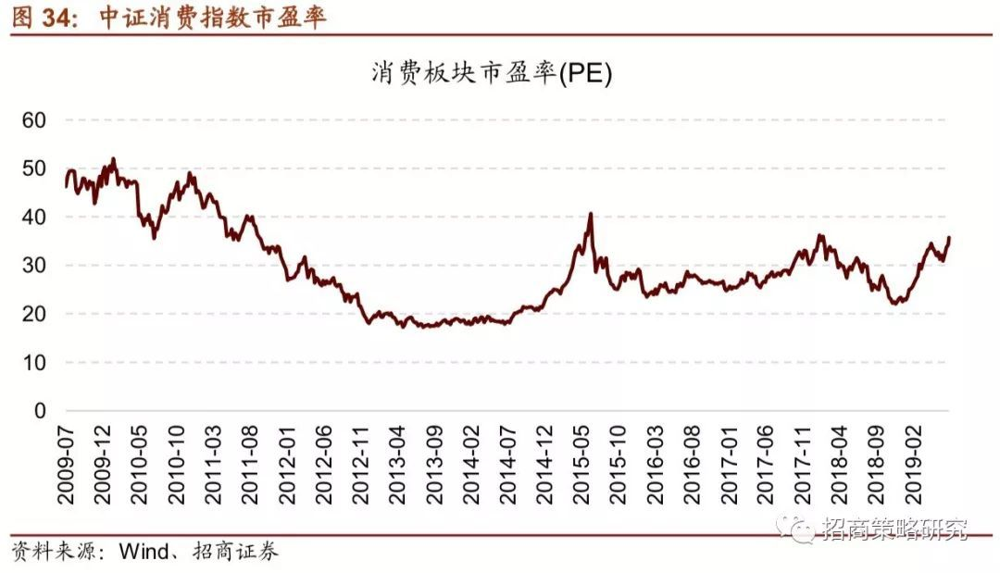

最后，奉上一张图，黄色线是 2009 年 7 月至 2012 年 7 月四年，消费指数相对沪深300指数的超额收益，红色线是 2016 年 5 月至今，消费指数相对沪深300指数超额收益率。*诠释了什么叫做相似的宏观环境出现相似的配置选择。*

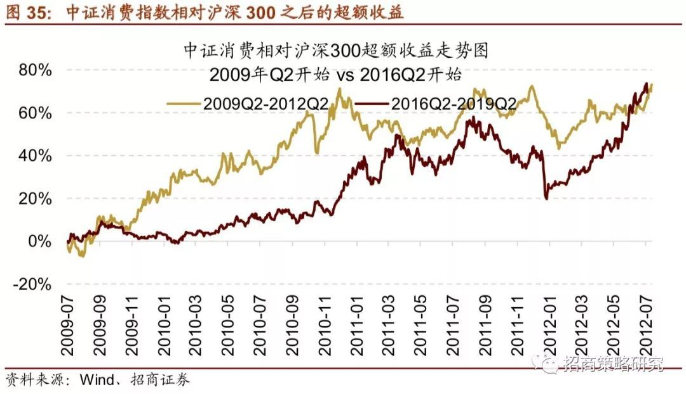

## 1. 抱团的历史总结

按照我们的定义，持续加仓并持有一个板块接近至超过 30%，视为抱团。2006 年至今的 13 个年头中，类似的情况发生过四次，分别是：

* 2007Q1-2010Q1，抱团金融，持续 13 个季度
* 2009Q3-2012Q3，第一次消费抱团，持续 13 个季度
* 2013Q1-2016Q1，抱团信息科技，持续 13 个季度
* 2016Q1-当前，第二次消费抱团，已经持续了 13 个季度

2007Q1-2010Q1，抱团金融，持续 13 个季度

2009Q3-2012Q3，第一次消费抱团，持续 13 个季度

2013Q1-2016Q1，抱团信息科技，持续 13 个季度

2016Q1-当前，第二次消费抱团，已经持续了 13 个季度

*但如果从 2017Q1 算正式开始抱团，目前只持续了 10 个季度。*

抱团出现的原因与机构投资的行为特征有一定的关系，每一次抱团特征以及对股价的影响，我们总结如下：

*第一，由于机构投资者具有定期业绩考核机制、排名压力、产品发行运作机制以及相似的真·价值投资理念，导致机构投资者总是会识别发现业绩增速最高的板块并逐渐调整到集中持股，是「抱团」出现的根本原因。*

*第二，每个板块的业绩推动模式自有其原因和逻辑：*

* 货币超发和信贷放量是金融板块业绩改善并大幅回升的动力；
* 通胀升温是消费板块业绩大幅改善的动力；
* 新技术和并购趋势是信息科技板块业绩大幅改善的动力。

货币超发和信贷放量是金融板块业绩改善并大幅回升的动力；

通胀升温是消费板块业绩大幅改善的动力；

新技术和并购趋势是信息科技板块业绩大幅改善的动力。

*第三，每次抱团真正瓦解前，会有1-2次假摔，*但之后评估了业绩趋势后又会重新抱团，并比上一次更加坚定，因此，抱团板块的超额收益每一次假摔后都是加速上行的。

*第四，抱团到了后期，*给了很多投资者以「该板块永远会涨，永远会跑赢」的信念。这种信念，会以在后面不同的简单明了上口的概念体现，每当识别度非常高的概念被口口相传，就要特别小心，因为这种基于信念的投资理念已经超出了业绩的范畴，很容易让投资者麻木而对新的信息和变化失去敏感度。

「躺着赚钱这么简单为什么要调仓？」这种理念也会让在抱团最后减持的投资者痛苦不已，如果跑，会不会又会重新抱回来？如果不跑大家都在跑怎么办。而一些识别度高的理念，是催生估值溢价的非常重要的推手。

*第五，抱团问题成为投资者永远面对的难题。*对于率先重仓抱团板块而成功的产品管理人而言，这种两难体现在，要不要减仓不减仓？会不会前功尽弃？当然这是快乐的烦恼，但更麻烦一点的我们称之为「明星两难」，简而言之，越想要业绩好，就越要重仓那个抱团板块，而且必须最坚定最持久，但是越坚定也就越难在风格和行业发生变化时，进行适时的调整。

而对于未能及时重仓抱团板块的投资者，这个问题永远是——要不要追，要不要再追多一点？然后，最后总是后悔追少了。

*第六，抱团过程中会出现经典的「抱团-申购-买入抱团板块-抱团板块继续跑赢-吸引更多存量资金加入抱团」这个正反馈，这种经典正反馈会总引发估值溢价，*但往往估值溢价的出现这一波行情是最精彩的一波。

第七，每次抱团瓦解的根本原因是因为出现了业绩更好的板块，*所以，不要被虚妄的概念所蒙蔽，找到那个最强业绩板块，并重仓它。而比找到业绩更好的板块更重要的找到驱动业绩变化的中观和宏观变量。*

## 2. 九点启示

简化一下，从机构抱团的历史，我们可以总结出为九个启示：

1）机构投资者永远青睐业绩增速最快的板块而不是某一个特定板块。

2）及时识别最强业绩板块并最快速参与抱团是机构投资者最佳投资选择。

3）「抱团」往往会经历一到两次假摔，但是放弃之前需进行灵魂之问，「业绩趋势破坏了吗」？

4）每一次抱团假摔使得抱团更加坚定，因此，抱团过程中的超额收益率是不断加速的。

5）从过去四次抱团的历史看，一般一轮趋势能够持续 13 个季度甚至更长，因此拉长对基金管理人的考核期限，有助于提高基金业绩而不是相反。

6）估值是抱团投资中不是那么关键因素，试图通过高估和低估来判断拐点多半是徒劳的，核心在于有「抱团-申购」机制的奖励存在，抱团板块的估值可以给到很高。

7）不要左侧逆风买入抱团瓦解的板块，评估一个板块是不是机构投资者彻底抛弃的标准不是大家「不看好」，而是根本没人看。

8）当一些炙手可热、朗朗上口、完美无缺的概念取代「业绩-估值」的基本面投资框架开始流行时，就需要特别小心了。当一个板块已经不需要研究就能赚到钱的时候，恰恰要打起十二分精神。

9）趋势拐点出现的时候，会出现一些从来没有发生过的事情和现象，可能是正向的也可能是反向的。因此，当一件从来没有听说过的事物出现的时候，很可能成为趋势决定的关键变量。

> 来源：公众号「招商策略研究」转载文章发表的所有信息仅代表作者个人观点，不对您构成任何投资建议，详见[《文章免责声明》](https://youzhiyouxing.cn/agreements/ARTICLE_DISCLAIMER)。
