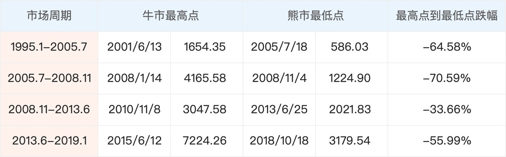
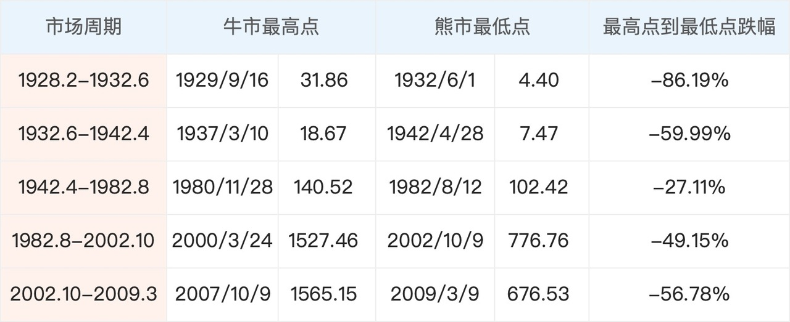

# 股市的风险究竟有多大？

俗话说股市「七亏二平一赚」，很多人对股市的直观印象是风险很大，赚钱的人少，亏钱的人多。

我们偶尔会听到一些人拿了多少钱投资股市血本无归的股市，也会听到有些人 All in 一只股票翻倍的传奇。这些故事会让我们认识到股市赚钱的人是少数，但是股市的风险到底有多大，投资股票究竟有可能面临多大的亏损，我们对这些事情的感知往往是模糊的。

今天这篇文章，我们就从历史案例中窥探一下，在股市里，一次投资带来的亏损究竟能有多大。

假如是一次性投资单只股票，也不加杠杆，理论上，股票最大能亏损的幅度是接近 100%。

在A股里最常见的例子就是那些退市股票了。

A股现行的退市条件其实是比较松的。如果一只A股面临退市，那么只能是重大违法、财务状态过差、股价过低、财报造假之中的一项。无论是哪一项，都说明它的价值已经非常非常低了，所以这些股票在退市前都会经历大跌。

以退市时声名狼藉的乐视网为例，自 2015 年 5 月 13 日最高价 44.70 元，到 2020 年 7 月 21 日退市正式实施时的 0.17 元，乐视网股价下跌幅度高约 99.62%。也就是假如我们在乐视网股价最高时买入 10 万元，到退市时，我们只剩下约 380 元。

有的人可能会说：我运气才没有那么差，不会买到乐视这种股票。但是要知道，在乐视退市的时候，它尚有 280789 户股东，户均持股数为 14.208 股。这里面的很多股东，都是在乐视急剧下跌地时候进来的。

而乐视网如此高的跌幅，在A股历史的最大跌幅榜单中目前只能暂居第四。排名第一的的是同样已经退市的暴风集团，跌幅约99.78%。

在其他国家股市，情况也是类似的。像美股，经常因为退市制度严格而受到表扬，但也造成了大量的股票被动退市。美股每年约有几百家上市公司会被被动退市，大部分在退市前也会经历大幅度的下跌。

讲完了单只股票的最大跌幅，那如果投资股票指数，情况会不会好一些？

如果投资的是股票指数，亏损幅度最大的情况，是刚好买在牛市顶点，卖在熊市低点。

这也是多数投资者可能面临的最糟情况：牛市高点一股脑买入，没想到接了最后一波盘。下跌的时候又舍不得割肉，最后实在在熊市里抗不住，卖在了「黎明前」。

接下来，我们分别来看看A股和美股市场的过往情况。

## 1.A股市场

我们先来看时间比较短的A股市场。

参考海通证券对牛熊周期的划分，1995 年以来 A 股经历了四轮完整的牛熊周期，目前处于第五轮中。我们来看一下前四轮完整周期指数的表现如何。以万得全A指数为例，从牛市最高点到熊市最低点，跌幅最大的是 2005～2008 年那一轮牛熊市。从 2008 年 1 月 14 日收盘价 4165.58 点，到 2008 年 11 月 4 日的 1224.90 点，万得全A跌幅是 70.59%。

该轮下跌，就是我们耳熟能详的的金融危机、次贷危机。这次危机首先由美国多年的房地产泡沫破灭开始。房价下跌后，很多人无法偿还房贷，导致房地产贷款所衍生出来的次级抵押贷款出现违约、拖欠，并逐渐波及到相关金融机构与整个信用市场。

信用危机出现后，银行收缩信贷，中小企业与个人贷款变得更加困难，于是实体经济也受到波及，最终造成了全球权益市场的负面影响。

对一般人来说，最初应该很难想象，美国房地产的泡沫破灭，最后导致了A股大跌，这体现了股市风险之大与不可预测性。

## 2. 美股市场

我们再来看看美股，它的可观察时间非常的长，也是我们观察股市风险的一个绝佳样本。

我们以现在最具代表性的标普500指数为例。标普500是从 1928 年开始的，涨涨跌跌到现在，出现了 5 轮可以确认的完整牛熊市。

其中，跌幅最大的是 1900～1929 年之间。因为 1929 年大萧条，经济严重衰退带来了股市下跌，导致标普500指数跌幅高达 86.19%。

在这次大萧条带来的股市下跌中，许多知名的专业人士也未能幸免，同样说明了股市风险之大和不可预测性。

比如以「费雪效应」、「费雪方程」闻名世界的经济学家欧文·费雪。在此次危机前夕，他一度因为投资股市而成为世界上最富有的经济学家。并且他宣称，股市已经到了「永久性的高地」。

危机爆发后，因为加入了杠杆，费雪最后倾家荡产，负债累累，直到 1947 年去世时也没能偿还完债务。

我们通过观察过去尽量多的历史，试图拼凑出来接近真实的风险：

*股市风险真的很大，同时又难以预测。*

在投资股市之前，很多人都没有对股市风险的了解，轻则亏损出场，再也不碰股市，重的倾家荡产，这都是事实存在的案例。

希望大家能通过这篇文章对股市的风险有所了解，在未来的投资中有所敬畏。

但股市风险大，却也并不是触不可及。在接下来的几个节点中，我们将会介绍如何与识别、定义风险，并最后控制风险，在可承受的范围内进行股市投资。

> 本文章所载信息仅供参考，不构成任何投资建议。如转载使用，请参考 [《文章转载声明》](https://youzhiyouxing.cn/agreements/ARTICLE_REPRINTED)。
