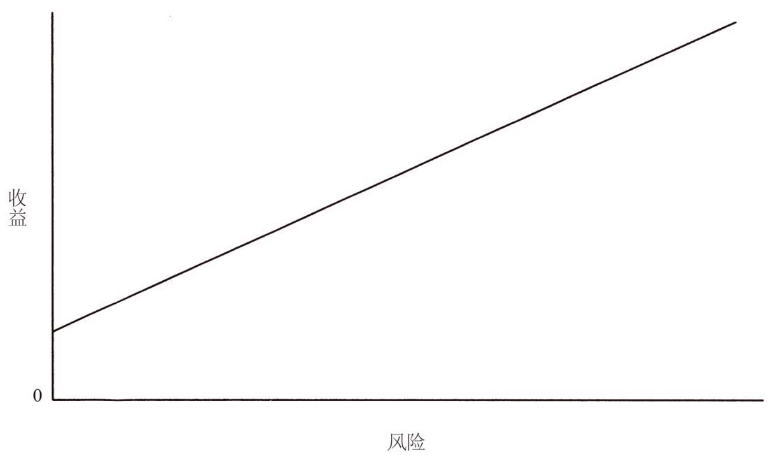
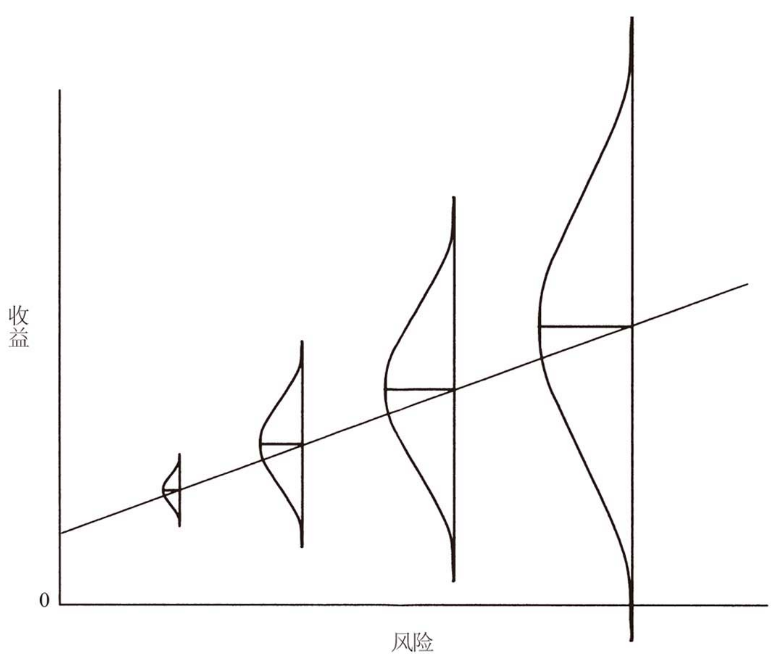

# 风险与收益的概率分布

教科书上经常说「高风险高收益」，但投资大师和高手也告诉我们「低风险才能获得高收益」，这两句话矛盾吗？

其实不矛盾。

「高风险高收益」讲的并不是高风险一定带来高收益，而是高风险会导致更加不确定的结果——也许收益更高，也许更低，甚至亏损。我们需要利用自己的知识去判断各种情况的可能性，做出是否投资、投资多少的决定。

而巴菲特等大师说的「低风险才能获得高收益」，是从安全边际的角度告诉我们需要控制买入成本。如果买的太贵，是一定不可能获得高收益的。

你看，短短的几个字，背后包含了很多对风险的认知。唯有真正理解「风险」二字，我们才能区分这两句话的不同，不会感到迷惑。

这篇内容摘自《投资最重要的事》，霍华德·马克斯详细解释了什么是风险。理解了风险，才能识别风险、控制风险。

祝开卷有知。

投资只关乎一件事：应对未来。没有人能够确切地预知未来，所以风险是不可避免的。因此，应对风险是投资中一个必不可少的（我认为是根本的）要素。找到有潜力上涨的投资并不难。如果你能找到足够多，那么你可能已经在朝着正确的方向前进了。但是，如果不能正确地应对风险，那么你的成功是不可能长久的。第一步是理解风险。第二步是识别风险。最后的关键性一步，是控制风险。

为什么说风险评估是投资过程中必不可少的要素呢？有三个有力的理由。

**第一，风险是一件坏事，大多数头脑清醒的人都希望避免风险或使其最小化。**金融理论中的一个基本假设是，人的本性是规避风险的，意即他们愿意承受更低的风险而不是更高。因此，投资者在考虑某项投资时，首先必须判断投资的风险性以及自己对于绝对风险的容忍度。

**第二，在考虑某项投资时，投资决策应将风险以及潜在收益考虑在内。**出于对风险的厌恶，投资者必须被诱以更高的预期收益才会承担新增风险。简而言之，如果美国政府的中期债券和小企业的股票都有可能达到 7% 的年收益率，那么人人都会抢购前者（从而抬高价格并降低预期收益）而抛售后者（从而拉低价格并提高收益）。这一相对价格的调整过程被经济学家称为「均衡」，使得预期收益与风险相匹配。

因此，除了确定自己是否能够容忍伴随投资而产生的绝对风险，投资者的第二项工作是确定投资收益是否与所承担的风险相称。显然，收益只是投资时需要考虑的一个方面，而风险评估则是必不可少的另一个方面。

**第三，在考虑投资结果时，收益仅仅代表收益，评估所承担的风险是必需的。**收益是通过安全的还是有风险的投资工具得到的？是通过固定收益证券还是股票得到的？是通过投资大型、成熟的企业得到的，还是通过投资小型、不稳定的企业得到的？是通过投资流动性股票和债券还是流动性欠佳的私募股权得到的？是利用杠杆还是没有利用杠杆得到的？是通过集中化投资组合还是多元化投资组合得到的？

投资者拿到报表，发现自己的账户当年赚到 10% 的收益时，想必无从判断投资经理的业绩是好是坏。为了做出判断，他们必须对投资经理所承担的风险有一定的了解。换句话说，他们必须清楚「风险调整后收益」的概念。

关于风险与收益之间的关系，在投资界有一个广泛应用的图示（见图 1）。它是一条倾斜向上的「资本市场线」，表明了风险与收益之间的正相关关系。市场努力使风险更高的资产看起来能够提供更高的收益。不然的话，谁会买呢？

图 1：风险-收益关系图

我们所熟知的风险–收益关系图是简约而优雅的。遗憾的是，许多人从中得出一个错误的结论，并因此而身陷困境。

尤其是在经济繁荣时期，你会听到太多的人在说：「高风险投资带来高收益。要想多赚钱，就去承担更高的风险吧。」然而，靠更高风险的投资来获得更高的收益是绝对不可能的。原因何在？很简单：如果更高风险的投资确实能够可靠地产生更高的收益，那么它就不是真的高风险了！

正确的表述是：为了吸引资本，风险更高的投资必须提供更好的收益前景、更高的承诺收益或预期收益，但绝不表示这些更高的预期收益必须实现。

我对资本市场线的认知方式使我较为容易地将其背后涉及到的所有关系联系起来（见图 2）。

图 2：风险-收益概率关系图

更高的投资风险导致更加不确定的结果。也就是说，收益的概率分布更广。当定价公平时，风险较高的投资意味着：

* 更高的预期收益；
* 获得较低收益的可能；
* 在某些情况下，可能会损失。

更高的预期收益；

获得较低收益的可能；

在某些情况下，可能会损失。

传统的风险–收益曲线图（图 1）具有误导性，它虽然表现了风险与收益之间的正相关关系，却没有表现出其中所涉及到的不确定性。它对承担更高的风险便能赚更多钱的坚定暗示，已经给许多人造成了极大的痛苦。

我希望我的曲线图更有帮助。它既表明风险和预期收益之间的正相关关系，又表明收益的不确定性以及随着风险的增加而加大的损失概率。

《风险》，2006 年 1 月 19 日

接下来，我们的主要任务是定义风险。风险究竟是什么？我们可以通过它的近义词——危险、冒险、危害、极大危险来了解。它们听起来似乎都是风险的近义词，并且相当不受欢迎。

然而，金融理论（提出图 1 所示的风险—收益曲线图及风险调整概念的同一理论）却将风险明确地定义为波动性（或易变性、偏差）。这些词当中没有一个能够表达出「危险」的必然含义。

在学者看来，风险等于波动性，因为波动性表明了投资的不可靠性。我对这一定义不敢苟同。

我认为，学者们（自觉或不自觉地）出于方便起见，才选择了以波动性指代风险。他们需要一个可计算的、客观的、能够查明来龙去脉的数字。波动性符合他们的要求，而大多数风险类型不符合。这一切的问题在于，我并不认为波动性就是大多数投资者所关心的风险。

风险有许多种……而波动性可能是与之最无关的一个。理论认为，投资者会从波动性更大的投资中要求更高的收益。但是，如果波动性更高的投资有可能产生更高的收益，那么在市场设定投资价格时，一定会有人对这种关系有需求，但我却从未遇到过这样的人。我从未听到任何人在橡树资本管理公司（或在其他地方）说过「我不会买进它，因为它的价格可能出现巨大波动」，或「我不会买进它，因为它有可能出现季度性下跌」。因此，我很难相信波动性就是投资者在设定价格和预期收益时需要考虑的风险。

我认为，人们拒绝投资的主要原因是他们担心亏本或收益过低，而不是波动性。在我看来，「我需要更多的上涨潜力，因为我怕赔钱」比「我需要更多的上涨潜力，因为我怕价格会出现波动」要合理得多。是的，我确信「风险」就是——首要的是——损失的可能性。

《风险》，2006 年 1 月 19 日

永久性损失的概率是我、橡树资本管理公司以及我所认识的每一位实际投资者所担心的风险。

[书摘一：你不可以预测，但你可以准备](https://youzhiyouxing.cn/n/materials/30)

> 来源：《投资最重要的事》转载文章发表的所有信息仅代表作者个人观点，不对您构成任何投资建议，详见[《文章免责声明》](https://youzhiyouxing.cn/agreements/ARTICLE_DISCLAIMER)
