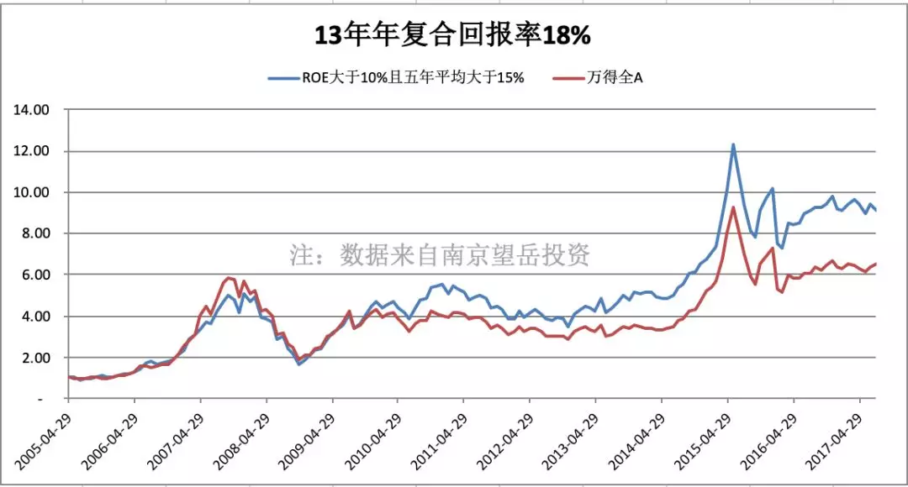
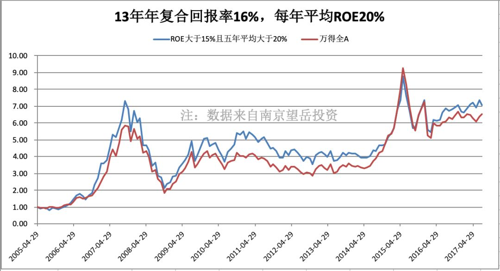
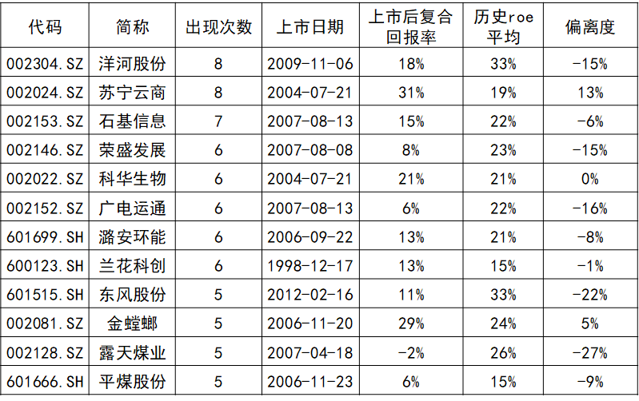
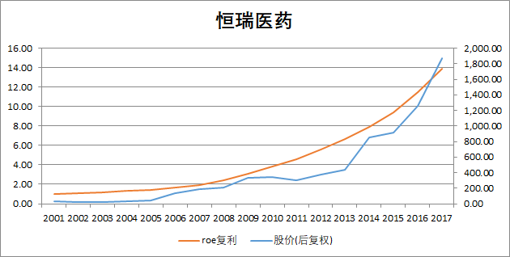
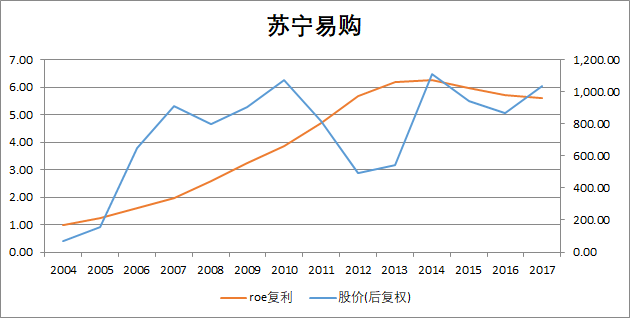
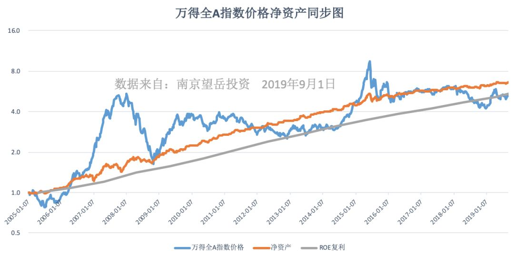
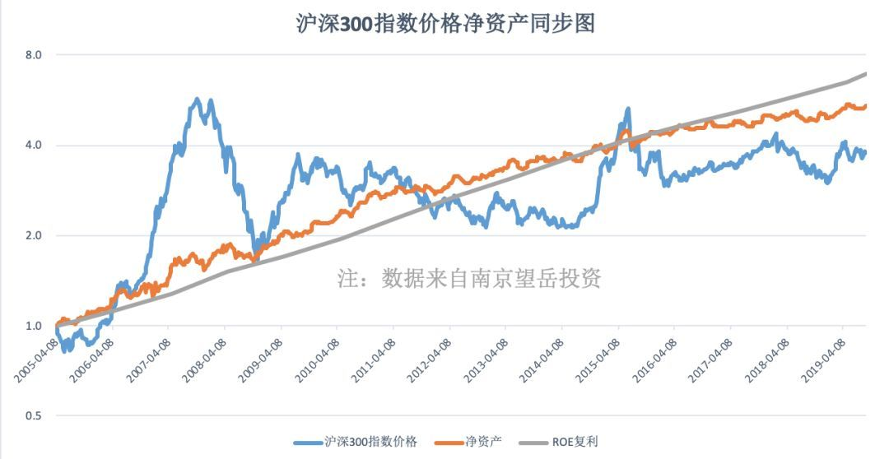

# 听过了很多道理，却还搞不好投资

我们常听到一些话，比如：「长期来看，价格始终围绕着价值上下波动」、「买指数就是买国运」、「买个股太难了，普通投资者买指数基金是更好的选择」。

这些话听起来很对，甚至成了投资者的常识，但它为什么是对的？又或者听过了很多道理，却还是搞不好投资？

且看罗马大道青训营的南添老师，通过一个「长期投资三段论」的实验，向我们揭示了长期投资收益来源的本质。知其然，知其所以然，才能坚定地 Buy China。

祝开卷有知。

大概是 1992 年，巴菲特在致股东信中说到：「在过去的十几年当中，我们发现在标准普尔 500 指数中，有 25 家企业经营业绩良好并且稳定，有趣的是，其中的 24 家企业股票表现也优于指数。」

就是这样一句大约会被 99.62% 的读者一掠而过的话，引起了南添老师的兴趣，如果这是科学现象，那么通过实验，应该是可以复现的。

于是，自己动手做实验。

首先，股价的数据很好找，通过商业数据提供商就可以获取，比如 Wind。接下来，如何定义「经营业绩良好并稳定」呢？南添老师用了 ROE 这个指标。

插一句概念复习，ROE，即净资产收益率，是企业盈利能力的衡量指标。白话理解：假设 A 同学和 B 同学都有 100 万的商业本金，一年经营下来，A 同学赚了 20 万利润，B 同学赚了 15 万利润，那么A同学的 ROE 是 20%，B 同学是 15%，通过这个指标可以揭示出 A 同学的经营能力比 B 同学好。

继续说实验，在中国 A 股，以「ROE 五年平均值大于 15% 且最低年份不低于 10%」为标准，选出一组股票进行持有，可以得到这样一个结果，从 2005～2017 年，该股票组合十三年年复合回报率 18%，基本与 15% 的 ROE 同步，并且超越同期市场平均——全 A 指数。

哇，亲测有效耶，持续拥有市场上的好公司，你的投资业绩将跑赢大盘，巴菲特说的是真的～

接着，我贪婪的欲望涌上心头，如果企业选的再好一些，业绩会不会更好？

把指标调高，「ROE 五年平均值大于 20%，最低值大于 15% 」走一波。

结果却出乎意料，复合回报率跌落到 16%，低于上一组的 18%，南添老师对组合复盘后发现：

由于技术性、周期性的存在，企业的高 ROE 往往不可持续，很少有企业能保持常年 20% 以上的 ROE 水平，在之前高 ROE 的时候市场已经给出了较高的估值，在业绩下滑时，会迎来一波双杀，使得组合大幅度亏损，拉低了复合回报率。

我在巴菲特 1992 年的信中读到这样一句话：「大家一定要记得我们的终极目标是希望能让公司每年以 15% 稳定的速度来增加每股的实质价值。」

虽然不知道巴菲特定这个 15% 的缘由，但结合南添老师的实验数据，以及基本常识来看，过高的增长率，比如 30%+ 或者更高，很难长期维系，一个生意，合法又很赚钱，必将吸引更多的人踏入，或者很快增长到天花板。

这个实验结果可以向我们说明：长期持有业绩好且经营稳定的公司，投资回报会优于指数。

在中国，会不会有一群人能够识别优秀的公司，并且能长期持有，从而获得超越指数的回报？我相信会有，但也认为，不会很多。

如果一家企业，经营稳定，并且保持一个良好的 ROE，那么我们投资买入，所能获得的复合回报率是否接近 ROE？

从前面的实验数据中，根据 ROE 的波动率和入选的频率，分为两个组「经营稳定组」和「经营不稳定组」

**经营稳定组：**

**经营不稳定组：**

可以看出，稳定组中复合回报率与历史 ROE 平均的偏离度整体要低于不稳定组。

也就是说，长期投资稳定组企业的股票，根本不需要择时，选对企业，拿得住，就可获得不错的收益回报，而且这个收益回报接近于企业本身的增长。

而投资不稳定组中的股票，则需要承受更大的波动，要么用择时来规避，要么用更长期的持有来熨平波动。

不拿被说烂的茅台格力举例，我们以稳定组的「恒瑞医药」和非稳定组的「苏宁云商」来看看个股的实际情况，为什么选它俩？哈，因为我曾经都买过，会更有感觉一些。

**恒瑞医药：**

**苏宁云商：**

我与这两只股票的交集只在 2013～2015 年，选择它俩的理由没有逃出中国股民的平均范围。

选恒瑞是因为小学同学的推荐，据说当时她混迹比较高端的投资圈，虽然多年未见，但凭借着曾经的共同经历也觉得不至于骗我，于是买了，回过头来看，人家真的没骗我啊，对不对。

选苏宁是因为老妈的推荐，也不知道她是听谁的推荐，大概率是券商营业部的某个老师吧，但站在当时的视角来看，苏宁的业绩的确也是杠杠的，对吧，然而这些年 ROE 就下滑的比较厉害了。

站在如今看历史，似乎一切清晰到触手可及，站在如今看未来，你又如何能知道他俩各自的业绩会怎样，想做择时？现在稳定组里的股票会不会在未来的日子里不再优秀，甚至不复存在？现在业绩下滑的苏宁云商会不会因为某个商业决策的成功，在未来又迎来一波高速增长？这一切都是未知。

对于个人炒股来说，你如何能够保证自己及时发现，现在看似优秀的企业是否正在慢慢的走向衰落？如何在受多因子影响的股价波动中顺利完成择时呢？

难，真的难。

按照那句常听的话：「买个股太难了，普通投资者买指数基金是更好的选择」，如果放弃个股，选择指数真的会容易吗？到底容易在哪里？

首先，把视野范围扩大至整个 A 股，采用万德全 A 指数，以 2005 年 1 月 7 日为始点，以 2019 年 6 月 30 日为终点，将指数价格，净资产进行归一化处理，同时计算年度 ROE 复利累计值，将他们画在一张图上。

插播复利计算概念，白话理解，如果你有 100 万本金，每年都能按照 15% 的速度增加，那么十年后，你赚到的钱不是十个 15 万，而是 304.56 万。复利公式：100 * (1 + 15%)^10 = 404.56。

这可以说是一张价值百万的图了。

不过按照常理，企业赚到的钱减去分出去的钱，剩下的才能归到净资产中，所以橙色的线应该低于灰色的线才对，为什么数据展现给我们的却不是这样？

这里隐藏了一条重要的知识点：在中国市场，净资产的增长有两台发动机，第一台是企业赚钱，第二台是溢价再融资。造成上面的现象的主要原因就是第二台发动机的存在。

最精彩的内容要来了，这张图向我们揭示出投资 A 股赚钱的最基本的原理：「在中国这样一个高速发展的市场，价格一定是围绕着一个企业的盈利能力，一个企业奋斗积攒下来的家产来波动的，说一千道一万，A 股市场，表面是灰线说了算，内在是橙色线说了算，蓝线说了根本不算」。

有太多太多的人，每天花了大量的精力围绕着蓝线在做研究！

说回到个人投资，这万德全 A 有点高级，咱也不敢问，咱也没法买不是？那我是不是还得回去买股票？当然不是了，万德全 A 没得买，沪深 300，中证 500 总是可以的买的，这俩加起来等于中证 800，也相当能反应中国股市的整体水平了，再配点行业指数，比如医药券商，基本就齐活了。

看一下沪深 300 和中证 500 的指数价格与净资产同步图。

**沪深 300：**

蓝线远远低于灰色线和橙色线，说明什么呢？

**中证 500：**

注意，这里又有一个隐藏知识点：相较于沪深 300 的净资产，中证 500 净资产中中包含了不少来自于并购形成的，泡沫式的，商誉，无形资产，许多互联网公司，创业板公司的净资产其实并没有那么多。

这个隐藏知识点就是这组统计数据无法向我们揭示的商业常识，支撑整个金融世界的是一个更真实的商业世界。

说实在的，当时听完分享后是满满的扑面而来的知识，接都接不住的感觉。通过这次整理回顾，也让自己重新串了一遍思路，更细致的观察了细节，更深刻的理解了内涵，我觉得用另外一句话描述更准确：将这些东西内化成了自己的一部分。

最后，再来一起总结一遍：

* 长期来看，股票价格的涨速与净资产增速同步
* 公司的长期盈利能力非常重要
* 公司的长期盈利稳定性最重要
* 长期持有一组盈利能力好，并且盈利稳定的股票，可以获得超越市场平均的收益回报
* 何谓买指数就是买国运？只有国运昌盛，橙色线和蓝色线才会保持增长，我们投资的钱才有利润的来源
* 商业世界是金融世界的支撑
* 识别好企业，绝对不是从数据指标下手，因为那些都是「果」，产生这些「果」的「因」，是现实世界里的商业行为。

长期来看，股票价格的涨速与净资产增速同步

公司的长期盈利能力非常重要

公司的长期盈利稳定性最重要

长期持有一组盈利能力好，并且盈利稳定的股票，可以获得超越市场平均的收益回报

何谓买指数就是买国运？只有国运昌盛，橙色线和蓝色线才会保持增长，我们投资的钱才有利润的来源

商业世界是金融世界的支撑

识别好企业，绝对不是从数据指标下手，因为那些都是「果」，产生这些「果」的「因」，是现实世界里的商业行为。

> 来源：公众号「768的小院」原标题：南添老师的启发与联想（二）|U定投81转载文章发表的所有信息仅代表作者个人观点，不对您构成任何投资建议，详见[《文章免责声明》](https://youzhiyouxing.cn/agreements/ARTICLE_DISCLAIMER)。
