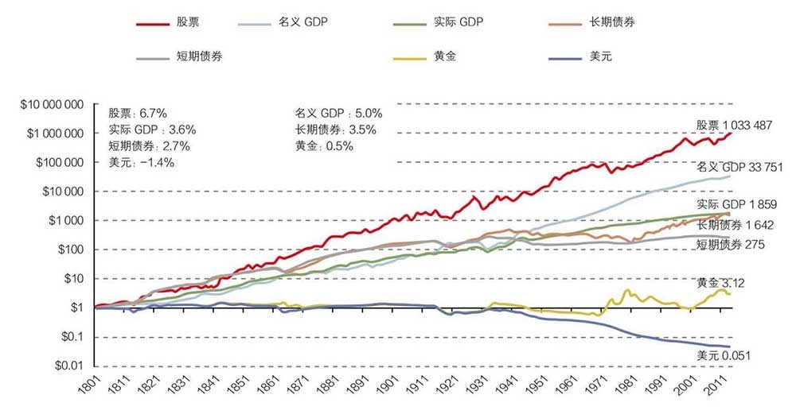
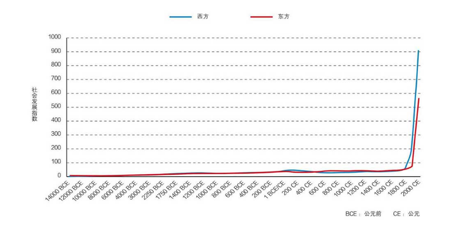
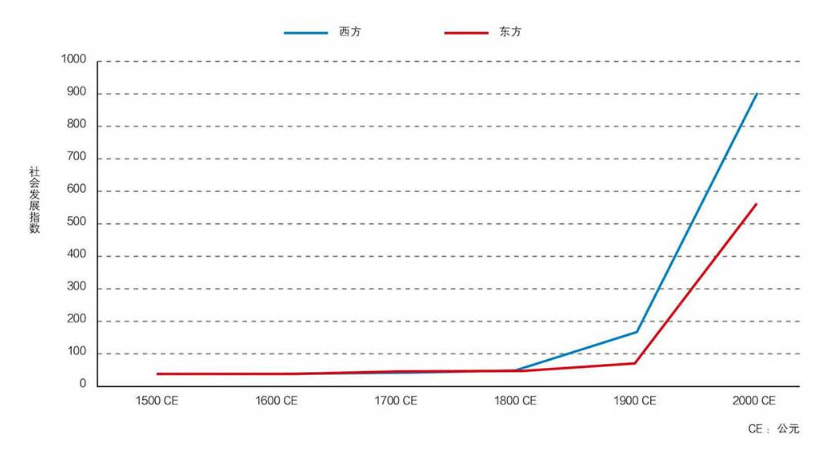

# 哪些金融资产可以持续可靠地创造收益？

这篇文章很长，也很难，但谈到的都是投资体系中最底层的、绕不过去的问题。为了避免大家「看过」而没有「看进去」，我想先总结一下这篇文章谈到的几个问题。

1. 现金、股票、黄金、债券，这四大类资产的历史表现如何？

2. 为什么通货膨胀和 GDP 增长可以解释股票的长期收益？

3. 为什么近代社会出现了 GDP 持续的复利式增长？底层的原因是什么？

你可以带着这 3 个问题阅读文章，使用划线功能在文中做出标记，检验一下自己是否真的得到了答案。

借用李录在文中的话，这是投资底层的根本问题，不想清楚、理解它们，很难在股灾的时候保持理性。我想，这也是「别人恐惧我贪婪」背后真正的勇气所在。

祝开卷有知。

从长期看，哪些金融资产真正地能够为客户、为投资人，实实在在地提供长期可靠的财富回报？我们刚经历了股灾（注：李录演讲于 2015 年 10 月），很多人觉得现金是最可靠的，甚至很多人觉得黄金也是很可靠的。

我们有没有办法衡量，过去这些资产的长期表现到底是什么样的？那么长期指的是多长时间呢？在我看来就是越长越好。我们能够找到的数据，时间越久越好，最好是长期、持续的数据。因为只有这样的数据才能真正有说服力。

在现代社会里，西方发达地区是现代经济最早的发源地，现代市场也成熟得最早。它的市场数据最大，它的经济体也最大，所以最能说明问题。这里我们选用美国的数据，因为它的时间比较长，可以把数据追溯到 200 年前。下面我们来看一下美国的表现。

宾州大学沃顿商学院的杰里米·西格尔（Jeremy Siegel），在过去几十年里兢兢业业、认真地收集了美国在过去几百年里，各个大类金融资产的表现，把它绘制成图表，给了我们非常可靠的数据来检验。这些数据可以可靠地回溯到 1802 年，今天我们就来看一下，在过去 200 多年的时间里，各类资产表现如何呢？

图 1 美国自 1801 年至今大类资产的回报表现来源：Siegel, Jeremy, Future for Investors (2005), Bureau of EconomicAnalysis, Measuring Worth.

第一大类资产是现金。最近股市的上下波动，让中国很多老百姓更加意识到现金的重要性，可能很多人认为现金应该是最保值的。我们看一看在过去 200 年里现金表现如何。

如果 1802 年你有 1 块美金，今天这 1 块美金值多少钱？它的购买力是多少？从图 1 可以看到，答案是 5 分钱。200 多年之后 1 块钱现金丢掉了 95% 的价值、购买力！原因我们大家都可以猜到，这是因为通货膨胀。下面我们再来看一下其他类的金融资产。

对传统中国人来说，黄金、白银、重金属也是一个非常好的保值方式。西方发达国家在相当长的一段时间里，一直实行金本位。黄金的价格确实增长了，但进入 20 世纪，我们看到它的价格开始不断在下降。

我们来看一看，黄金作为贵重金属里最重要的代表，在过去 200 年的表现。在 200 年前用 1 块美金购买的黄金，今天能有多少购买力？我们看到的结果是 3.12 美金。这显然确实是保值了，但是如果说在 200 年里升值了三至四倍，这个结果也是很出乎大家预料的，并没有取得太大增值。

我们再来看短期政府债券和长期债券，短期政府债券的利率相当于无风险利率，一直不太高，稍稍高过通货膨胀。短期债券 200 年涨了 275 倍；长期债券的回报率比短期债券多一些，涨了 1600 多倍。

接下来再看一看股票，它是另外一个大类资产。可能很多人认为股票更加有风险，更加不能保值，尤其是在经历了过去 3 个月股市上上下下的起伏之后。我们在短短的 8 个月里面同时经历了一轮大牛市和一轮大熊市，很多人对股票的风险有了更深的理解。股票在过去 200 年的表现如何？如果我们在 1802 年投资美国股市 1 块钱，今天它的价格是多少呢？

我们现在看到的结果是，1 块钱股票，即使除掉通货膨胀因素之后，在过去 200 年里仍然升值了 100 万倍，今天它的价值是 103 万。它的零头都大于其他大类资产。为什么会是这样惊人的结果呢？这个结果实际上具体到每一年的增长，除去通货膨胀的影响，年化回报率只有 6.7%。这就是复利的力量。爱因斯坦（Albert Einstein）把复利称之为「世界第八大奇迹」是有道理的。

上面这些数字给我们提出了一个问题：为什么现金被大家认为最保险，反而在 200 年里面丢失了 95% 的价值，而被大家认为风险最大的资产——股票则增加了将近 100 万倍？100 万倍是指扣除通货膨胀之后的增值。为什么现金和股票的回报表现在 200 年里面出现了这么巨大的差距？这是我们所有从事资产管理行业的人都必须认真思考的问题。

造成这个现象有两个原因。

一个原因是通货膨胀。通货膨胀在美国过去 200 年里，平均年化是 1.4% 左右。如果通货膨胀每年以 1.4% 的速度增长的话，你的购买力实际是每年在以 1.4% 的速度在降低。这个 1.4% 经过 200 年之后，就让 1 块钱变成了 5 分钱，丢失了 95%，现金的价值几乎消失了。所以从纯粹的数学角度，我们可以很好地理解。

另外一个原因，就是经济的增长。GDP 在过去 200 年里大约增长了 33000 多倍，年化大约 3% 多一点。如果我们能够理解经济的增长，我们就可以理解其他的现象。股票实际上是代表市场里一定规模以上的公司，GDP 的增长很大意义上是由这些公司财务报表上销售额的增长来决定的。

一般来说公司里有一些成本，但是属于相对固定的成本，不像销售额增长这么大。于是净利润的增长就会超过销售额的增长。当销售额以 4% 到 5% 的名义速度在增长时，净利润就会以差不多 6% 到 7% 的速度增长，公司本身创造现金的价值也就会以同样的速度增长。我们看到实际结果正是这样。

股票的价值核心是利润本身的增长反映到今天的价值。过去 200 年股票的平均市盈率在 15 倍左右，那么倒过来每股现金的收益就是 15 的倒数，差不多是 6.7% 左右，体现了利润率对于市值估值的反映。因此股票价格也以 6% 到 7% 左右的速度增长，最后的结果是差不多 200 年里增长了 100 万倍。所以从数学上我们就会明白，为什么当 GDP 出现长期持续增长的时候，几乎所有股票加在一起的总指数会以这样的速度来增长。

这是第一层次的结论：通货膨胀和 GDP 的增长是解释现金和股票表现差异的最根本原因。

## 1. GDP 持续的复利式增长

下面一个更重要的问题是，为什么在美国经济里出现了 200 年这样长时间的、持续的、复利性的 GDP 增长，同时通货膨胀率也一直都存在？为什么经济几乎每年都在增长？有一些年份会有一些衰退，而有一些年份增长会多一些。但在过去 200 年里，我们会看到经济是在不断向上的。

如果我们以年为单位，GDP 几乎就是每年都在增长，真正是长期、累进、复利性的增长。如何来解释这个现象呢？这个情况在过去 200 年是美国独有的？还是在历史上一直是这样？显然在中国有记载的过去三、五千年的历史中，这个情况从来没有发生过。这确实是一个现代现象，甚至对中国来说一直到 30 年以前也没有发生过。

那么我们有没有办法去计量人类在过去几千年中 GDP 增长基本的形态是什么样的？有没有持续增长的现象？

要回答这个问题，我们需要另外一张图表。我们需要弄明白在人类历史上，在文明出现以后，整体的 GDP、整体的消费、生产水平呈现出一个什么样的变化状态？如果我们把时间跨度加大，比如回归到采集狩猎时代、农耕时代、农业文明时代，这个时候人类整体的 GDP 增长是多少呢？这是一个十分有趣的问题。

我手边正好有一张这样的图表。这是由斯坦福大学一位全才教授伊恩·莫里斯（Ian Morris）带领一个团队在过去十几年里，通过现代科技的手段，对人类过去上万年历史里攫取和使用的能量进行了基本的计量做出来的。过去二三十年各项科技的发展，使得这项工作成为可能。

在人类绝大部分的历史里面，基本的经济活动仍然是攫取能量和使用能量。它的基本计量和我们今天讲的 GDP 关联度非常高。那么，在过去 16000 年里，人类社会的基本 GDP 增长情况怎么样？

图 2 代表了斯坦福团队的学术成果，最主要的一个比较就是东方文明和西方文明。从图 2 我们可以看到在过去一万多年里整个文明社会的经济表现：蓝线代表西方社会，最早是从两河流域一直到希腊、罗马，最后到西欧、美国等等；红线代表东方文明，最早是在印度河流域、中国的黄河流域，后来进入到长江流域，再后来进入到韩国、日本等等。左边是 16000 年以前，右边是现代。从这两个社会过去 16000 年的比较看，如果不采取数学手段，曲线基本一直是平的。

图 2 人类文明在过去一万多年的经济表现来源：Ian Morris, Social Development, 2010.

东方社会和西方社会有一些细小的差别，如果做一下数学处理，会看到更细小的区别，但是总的来说在过去的一万多年里面，增长几乎是平的。在 16000 年这段相当长的时间里，在农业文明里，人类社会的发展不是说没有，但是非常缓慢，而且经常呈现出波浪式的发展，有时候会进入到高峰，但总有一个玻璃顶突破不了。

于是它冲顶之后就会滑落，我们大概看到了三四次这样的冲顶，然后一直在一个比较窄的波段里面上下浮动。但是到了近代以后，我们看到在过去的 300 年间，突然之间人类文明呈现出一个完全不同的状态，出现一个巨幅的增长，大家可以看到这几乎就是一个冰球棍一样，1 块钱变成 100 万这样的一个增长。

如果我们截取图 2 其中一段再放大，把这二三百年的时间拉得更长一点，你就会发现这个图其实和图 1 非常相像（见图 3）。

图 3 人类文明在过去五百多年的经济表现来源：Ian Morris, Social Development, 2010.

200 年里的 GDP 和 200 年里的股票表现也非常非常相像。如果你再把它缩短，最后的结果是，你会发现它几乎是直上。这个从数学上讲，当然是复利的魔力。但是也就是说，一个经济能够长期持续以复利的方式来增长这种现象，在人类 16000 年的记载里从来没有发生过，是非常现代的现象。

在相当长的一段历史里，人类的 GDP 一直是平的。中国的 GDP 尤其如此。从过去 500 年的图中可以看得更清楚，在分界点上，西方突然在这时候起来了，而东方比它晚了差不多 100 年。这 100 年东方的崛起主要是以日本为代表。

要想理解股票在过去 200 年的表现以及今后 20 年的表现，必须看懂并能够解释这条线——过去人类文明的基本图谱。不理解这个，很难在每次股灾的时候保持理性。每次到 2008、2009 年这样危机的时候，都会觉得世界末日到了。

投资最核心的是对未来的预测，正如一句著名的笑话所言，「预测很难，尤其是关于未来」。为什么（人类文明在过去 200 年的经济表现）会是这样？不理解这个问题的确很难做预测。关于这个问题，我思考了差不多 30 多年。我把我长期的思考整理成了一个长篇的论文（《文明、现代化、价值投资与中国》上篇，以下简称「本书上篇」），大家如果对这个问题有兴趣可以参考。

我把人类文明分断成三大部分。

* 第一部分是最早的狩猎时代，始于 15 万年以前真正意义上的人类出现以后，我叫它 1.0 文明。人类文明在相当长的时间里，基本和其他的动物差别不是太大，其巨大的变化发生在公元前 9000 年左右，农业和畜牧业最早在两河流域出现的时候。同样的变化，在五六千年前从中国的黄河流域开始出现，带来人类文明第二次伟大的跃升。
* 这时，我们创造 GDP 的能力已经相当强，相对于狩猎时代，我叫它 2.0 文明，也就是农业和畜牧业文明。这个文明状态持续了几千年，一直到 1750 年左右，其 GDP 曲线基本相对来说是平的。
* 在此之后，突然出现了 GDP 以稳定的速度每年都在增长的情况，以至于到今天我们认为 GDP 不增长是件很反常的事，甚至于中国目前 GDP 的增长从 10% 跌到 7% 也成为一件大事。GDP 的持续增长是一个非常现代的现象，可是也已经在每个人的心里根深蒂固。要理解这个现象，也就是现代化，我就姑且把它称之为 3.0 文明。

第一部分是最早的狩猎时代，始于 15 万年以前真正意义上的人类出现以后，我叫它 1.0 文明。人类文明在相当长的时间里，基本和其他的动物差别不是太大，其巨大的变化发生在公元前 9000 年左右，农业和畜牧业最早在两河流域出现的时候。同样的变化，在五六千年前从中国的黄河流域开始出现，带来人类文明第二次伟大的跃升。

这时，我们创造 GDP 的能力已经相当强，相对于狩猎时代，我叫它 2.0 文明，也就是农业和畜牧业文明。这个文明状态持续了几千年，一直到 1750 年左右，其 GDP 曲线基本相对来说是平的。

在此之后，突然出现了 GDP 以稳定的速度每年都在增长的情况，以至于到今天我们认为 GDP 不增长是件很反常的事，甚至于中国目前 GDP 的增长从 10% 跌到 7% 也成为一件大事。GDP 的持续增长是一个非常现代的现象，可是也已经在每个人的心里根深蒂固。要理解这个现象，也就是现代化，我就姑且把它称之为 3.0 文明。

在本书上篇中，我详细地讲述了人类文明在过去一万多年里演化的过程，并用两个公式来理解自由市场经济，1 + 1 > 2 和 1 + 1 > 4。到了近代，文明演化最根本的变化是出现了自由交换。在亚当·斯密和李嘉图的分析下，经济上的自由交换实际上就是 1 + 1 > 2。当社会进行分工的时候，两个人、两个经济个体进行自由交换创造出来的价值，比原来各自所能够创造的价值要多很多，出现了附加价值。于是参加交换的人越多，创造的附加价值就越高。

这种交换在农业时代也有，但是现代科技出现以后，这种自由交换加倍地产生了更多的附加价值。原因就是知识也在互相交换，不仅仅是产品、商品和服务。知识在交换里产生的价值更多。按照我的讲法，这就是 1 + 1 > 4，指两个人在互相讨论的时候，不仅彼此获得了对方的思想，保留自己的思想，还会碰撞出一些新的火花。知识的自由分享，不需要交换，不需要大米换奶牛，结合在一起就开始出现了复利式、巨大交换增量的增长。每次交换都产生这么大的增量，社会才会迅速创造出巨大的财富来。

那么当这样一个持续的、个体之间的交换可以放大几十亿倍的时候，就形成了现代的自由市场经济，也就是 3.0 文明。只有在这样一个交换的背景下，才会出现经济整体不断地、持续地增长。这样的经济制度才能够把人的活力、真正的动力全部发挥出来。这在人类制度的创造历史上，大概是最伟大的制度创造。

只有在这种制度出现了之后，才出现了我们讲的这种独特的现象，即经济的持续发展。对这个问题有兴趣的同学可以去参考我的论文，今天在这我就不多讲了。我想说明的是：经济持续增长的表现方式就是持续的 GDP 增长。

通货膨胀实际上就是一个货币现象，当货币发行总量超过经济体中商品和服务的总量时，价格就会往上增长。为什么增长呢？当然因为经济不断增长，就需要不断地投资。在现代经济里，这要通过银行来实施。银行要想收集社会上的闲散资金，需要付出储蓄利率。这个储蓄利率必须是正的，使得它的放贷利率也必须是正数。

这样整个经济里的钱要想去增长，就要提前增量；要想实现实体经济增长，就要提前投资。这个时间差，就使得通货膨胀成为一个几乎和 GDP 持续增长伴生的现象。你首先要投资，这些投资变成存货、半成品，然后再变成成品。

在这个过程中，你需要先把钱放进去。所以你先放的这笔钱，实际上已经超过了当时这个经济里货物、服务的总量。于是，这个时间差就造成了通货膨胀和 GDP 持续增长伴生的现象。这两个现象从数学上就直接解释了，为什么现金和股票在长期里产生了这样巨大的差别。你要明白其然，就要明白其所以然。要明白为什么是这个样子。

> 来源：《文明、现代化、价值投资与中国》转载文章发表的所有信息仅代表作者个人观点，不对您构成任何投资建议，详见[《文章免责声明》](https://youzhiyouxing.cn/agreements/ARTICLE_DISCLAIMER)
