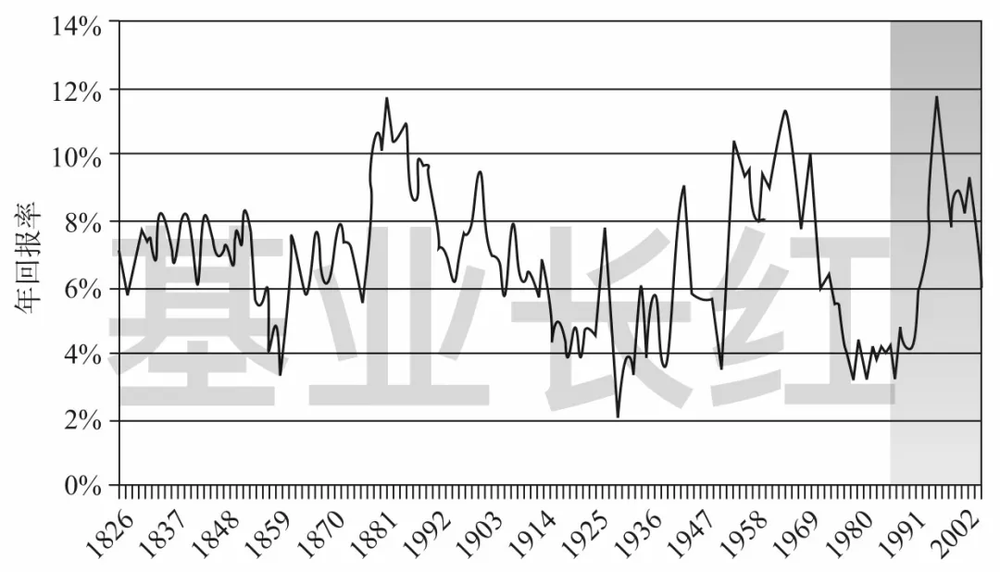
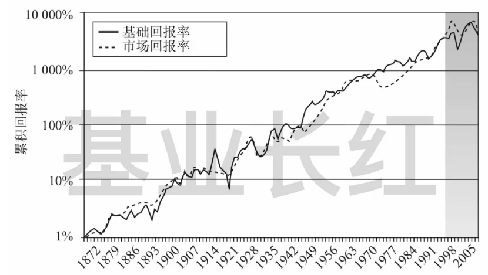
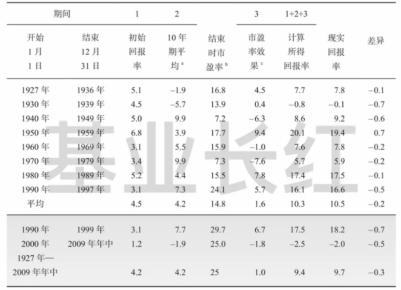

# 约翰·博格的投资回报公式

我们经常告诉大家，长期投资的目标预期收益率在 8～12%。这个值是怎么来的？

约翰·博格以严谨的分析，把股票长期回报归因为三个因子：

投资回报 = 初始股息率 + 盈利增长率 + 市盈率的变化

1）初始股息率，指的是买入时的估值水平。用 3% 的股息率买还是用 5% 的股息率买？这个值，关系到我们买入时的价格贵不贵。

2）盈利增长率，指的是企业未来的增长率快不快。盈利增长率高，意味着企业处在快速发展期，可以提供更快的发展速度。只有投资好资产，我们的长期投资才能享受企业更快发展带来的红利。

3）市盈率的变化，指的是情绪带来的估值变化。在企业的基本面不变的情况下，企业估值会受到投资者乐观或悲观的情绪影响，进而影响股价的变化。

我们日常感知的「短期价格」几乎都是来自于（3），而投资者真正能长期持续获得的回报，更多来自于（1）和（2）。

更好的做法，是用不贵的价格（1）买入好的资产（2），这样收获较高的长期收益率，如果在投资期间能赚取一些估值变化（3）的钱，则是锦上添花。

明白投资回报的根本来源，把「短期价格」和「长期价格」背后的因素分清楚，才能在长期投资中静待花开。

祝开卷有知。

投资世界，人心浮躁。大部分人关注的是证券市场那飘忽不定、不可预测的短期表象，却忽视了对规律、周期和模式的洞察。

在这浮躁之风下，约翰·博格（John Bogle，以下简称「博格」）说：「在发展一种长期投资策略时，记住过去是必要的。」

对过去投资回报的分析，可以帮助我们深刻地理解股票和债券的回报来源，更理性地探讨未来投资。

博格在《共同基金常识》中巧妙地运用「奥卡姆剃刀原则」，修剪掉分析方法中的所有旁枝末节，将长期投资回报的来源归于 3 个核心要素。

今天，屠夫带大家看看指数基金之父总结出来的投资回报公式。

14 世纪英国哲学家威廉·奥卡姆爵士（Sir William of Occam）曾提出这样的观点：「越简单的解释，越有可能正确。」

这个观点又被提炼为**「如无必要，勿增实体」**，被称为「奥卡姆剃刀原理」。

现实世界总是复杂而混乱，但是当我们运用奥卡姆剃刀，一刀一刀地削去那些不关键的部分时，事物的本质随之浮现。约翰·博格正是利用了这一原则，破开重重迷雾，一步步地找到本质。

对历史数据分析后，博格对「投资回报」得出了两个关键判断：

* 第一，单一证券的业绩无法预测；
* 第二，投资组合的短期业绩也无法预测。

第一，单一证券的业绩无法预测；

第二，投资组合的短期业绩也无法预测。

这两个观点可能令人泄气：既然无法预测，那我们回顾过往数据又有什么意义呢？

博格的回答是：「对过去回报率的细致检验，有助于投资者探讨预期回报率参数的概率取值。这为聪明的投资者提供了理性预测未来回报的基础。」

这段话可能有点晦涩，咱们直接看看他的研究结果吧。

和《股市长线法宝》一样，博格选取了近两百年的样本进行研究。

自 1802 年以来（截至《共同基金常识》成书前），股市的年实际回报率（扣除通货膨胀率后）约为 7%。但期间的波动非常大：1862 年高达 +67%，而 1931 年低至 -39%，差距达到 106 个百分点。

然而博格并不是为了解释股市回报的波动，所以他进一步调整了观察角度：**以 25 年为滚动期限，将样本转换为 172 个彼此重叠的时间窗口。**

比如，1826 年的数据，是以 1802～1826 年的股市回报，按 25 年计算其年实际回报率（年化收益率扣除通货膨胀率）；而 1827 年的数据，则是基于 1803～1827 年的股市回报计算……以此类推。

经过这样的调整，我们可以得到一个相对稳定的年实际回报数据。

25 年滚动期的年实际回报率（1826～1983）来源：约翰·博格，《共同基金常识》

可以看出，在每一个 25 年期的时间窗口里，股市的年实际回报率落在 **2%～12%** 的区间里，没有任何一个 25 年期的回报率为负——这和杰里米·西格尔（Jeremy Siege，以下简称「西格尔」）教授的「持有 17 年不会负收益」结论一致。

在三分之二的概率下，年实际回报率落在 **4.7%～8.7%** 的范围内，和基准值的偏差不超过 2 个百分点。

还记得《风险，对错和戒律》吧？上面的数据印证了同一件事：对和错，是时间的函数。

当时间窗口从 1 年扩展到 25 年后，投机行为对股票市场的短期影响力消退了。

既然不是投机决定了投资回报，那么——股票市场的投资回报，到底来自于什么呢？

不妨后退一步想一想：为什么股票提供 7% 的长期收益率？

博格给出了简洁有力的回答：因为企业的股利和盈利不断增长。

这个回答背后有数据支撑：经过通货膨胀调整后，1871～1997 年股票市场的盈利增长率和实际股息率之和，**恰好是 6.7%**。

换句话说，股票的投资回报其实与盈利增长率以及股息率密切相关，**它们几乎等同于股市本身 7% 的实际回报率了。**

当然，投资回报是有波动的，博格认为这些波动来自于估值的变化。所谓估值——以最常见的市盈率（P/E）为例——就是投资者愿意为 1 元盈利所支付的价格。而估值受投机因素的影响巨大。

一个 25 年期里，市盈率从 8 倍增加到 20 倍，会让回报率增加 4 个百分点；而从 20 倍降到 7 倍时的结果正好相反。

我们不妨把由基本面因素产生的「基础回报率」和加上估值因素后的「市场回报率」做个对比：

基础回报率与市场回报率（1872～2008）来源：约翰·博格，《共同基金常识》

上图的两条曲线分分合合，但总体还是纠缠在一起，这清晰地揭示了一个事实：**估值对投资回报有一定影响，但基本面因素起决定性作用。**

使用「奥卡姆剃刀」剪去旁枝后，博格推导出了一个简单的理论，决定股市长期回报率的 3 个变量是：

* 初始投资时刻的股息率
* 开始投资后的盈利增长率
* 投资期限内市盈率的变化

初始投资时刻的股息率

开始投资后的盈利增长率

投资期限内市盈率的变化

这 3 个因素几乎解释了持有期内所有的回报，而且是可分析的：

* 初始股息率是一个已知量
* 盈利增长率在小范围内可预测
* 市盈率的变化具有高度的投机性

初始股息率是一个已知量

盈利增长率在小范围内可预测

市盈率的变化具有高度的投机性

在博格的模型里，投资总回报率就是上述三者之和，简单直接：

**投资回报 = 初始股息率+ 盈利增长率 +市盈率的变化**

假如初始股息率是 3%，在随后 10 年内预计盈利增长率为每年 7%，在市盈率保持稳定（变化为 0）的情况下，年化投资回报将会是 10%；其他条件不变的情况下，市盈率预计会从 15 倍增加到 18 倍，那么年化投资回报将达到 12%*。 （注：10 年的市盈率增加 18 / 15 - 1 = 20%，年均变化约 2%。）

博格用历史数据上面的公式进行了验证：

10 年期股市名义回报率（1927～2009 年中）单位：%来源：约翰·博格，《共同基金常识》

（注：上图中，数据基于标准普尔综合股价指数（S&P Composite Stock Price Index）；a. 平均盈利增长率（营业收入）；b. 初始市盈率为 10.9 倍；c. 10 年期回报率由市盈率变化生成。）

如上表所示，自 1926 年至今的 6 个完整 10 年期、2 个部分 10 年期内，**初始股息率+ 盈利增长率 +市盈率变化，非常精确地接近于股票市场的名义回报率（未扣除通货膨胀率），差异不到 1 个百分点。**

比如，1960 年 1 月至 1969 年 12 月，初始股息率为 3.1%，10 年期平均盈利增长率为 5.5%，年平均市盈率变动为 -1.0%，三者之和为 7.6%，与这 10 年期股票市场 7.8% 的年化回报率仅相差 0.2%。

博格以一个极简的三因子模型，精确地直击投资回报的本质！

经济学家约翰·凯恩斯（John Keynes）定义金融市场回报率有两个来源：投资和投机。

投资是「在假定现在状态将无限期持续下去的基础上，在整个资产生命周期内，预测未来收益的一种活动」；

投机是「一种预测市场心理的活动，希望传统的估值基础发生对自己有利的变化」。

在博格的三因子模型里：

* 初始股息率和盈利增长率，都是基本面因素，属于「投资」
* 市盈率的变化，是投资者情绪变化的晴雨表，属于「投机」

初始股息率和盈利增长率，都是基本面因素，属于「投资」

市盈率的变化，是投资者情绪变化的晴雨表，属于「投机」

当投资者的预期提高时，他们愿意为公司的盈利支付更高价格，估值被推高；当他们对未来失去信心时，会支付得少一些，估值会下降。

然而，如果市盈率没有发生变化，那么股票的总回报率几乎完全依赖于初始股息率和盈利增长率。

博格旗帜鲜明地表示，投资优于投机。

博格补充道：「在足够长的周期里，投机因素对回报率的影响，已经被证明是中性的，投机不可能永远自我获益。」

在某一个时期里，投机或许确实提高了回报，但是在随后的时期里，投机却会降低回报。

如果把这看成是另一种 「均值回归」 现象，或许就不难理解了。

极端的乐观和悲观的不断交错重演，赌周期不再的人只会粉身碎骨。这和霍华德·马克斯（Howard Marks）的《周期》暗合，投资大师们确实英雄所见略同。

「指数基金之父」约翰·博格以严谨的分析，推导出决定股票长期投资回报的 3 个因子：

* 初始投资时刻的股息率
* 开始投资后的盈利增长率
* 投资期限内市盈率的变化

初始投资时刻的股息率

开始投资后的盈利增长率

投资期限内市盈率的变化

博格在书中反复强调的是：**「股利和盈利增长，才是投资的基础，估值变化这种投机因素难以持久。」**

盼望投机可以重演的侥幸心理，让许多人误入歧途。对未来进行思考和预判时，希望你能记住博格的这句话：投机，是一个错误的选择。

> 来源：公众号「基业长红」原标题：笑问收益何处来：约翰·博格的投资回报公式转载文章发表的所有信息仅代表作者个人观点，不对您构成任何投资建议，详见[《文章免责声明》](https://youzhiyouxing.cn/agreements/ARTICLE_DISCLAIMER)
