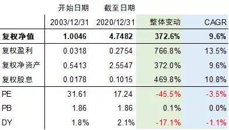
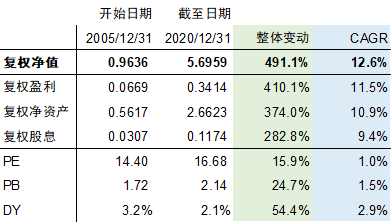
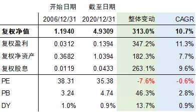
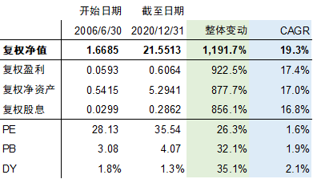
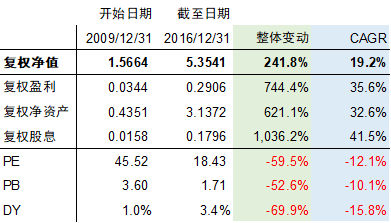
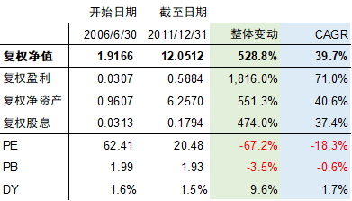
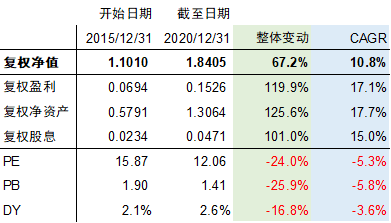

# 一个简单但又包罗万象的投资原理

我们投资指数基金、主动基金到底赚的是什么钱呢？本文作者陈嘉禾，用一个简单但又包罗万象的公式回答了这个问题。

通过对公式的推导和对投资业绩的拆解，他分析了基本面变动和估值变动带来的影响，并得出了相当多精彩的结论。比如，「对于指数基金而言，估值在长周期并不重要」、「好的投资者可以比指数带来更高的基本面增长」、「增加基本面不一定要只靠好生意」。

虽然这篇文章的理解门槛稍高，但大家不妨沉下心来看看，梳理一下自己对投资底层逻辑的认识（即使只能部分理解，那也算增长了见识吧）。

另外，值得一提的是，刚上线的「知行数据」和陈嘉禾所说的投资原理，有许多相通之处，大家不妨对照起来看看。

祝开卷有知。

在投资工作中，许多投资者都想找到投资的原理。但是，投资又是如此纷繁的一项工作，这让许多人在日复一日的辛勤探索和市场带来的重重压力中，在每天价格的涨涨跌跌和对投资组合净值波动的要求中，慢慢迷失了方向。这真所谓「磨砖做镜，积雪为粮，迷了几多年少」。

其实，正如质能互换方程定义了物理学界的原理一样，投资中也有这样一条原理。只要明白了这个原理，我们就能看穿投资世界的真相。

需要指出的是，这里说的是「投资的原理」，而不是「价值投资的原理」。这是因为，在这篇文章里所涵盖的道理，包含了一切投资的方法。不管是做价值投资也好，趋势投资也罢，或者是量化投资也行，甚至不是做资本市场，只是为自己的小家庭买个房子，做房地产投资，只要是投资，那么，投资的结果就会符合这个原理。

投资的原理说起来很简单，可以用一个公式来表达：*投资业绩变动 =基本面变动 ×估值变动。*从这个公式，我们也可以递推出两个公式：基本面变动 = 投资业绩变动 ÷ 估值变动；估值变动 = 投资业绩变动 ÷ 基本面变动。

举例来说，一个投资组合在今年上涨了 20%，那么如果投资组合所包含的所有资产的 PE（市盈率）估值，在年初是 10 倍，在年末是 11 倍，那么我们就可以知道，今年这个投资组合所包含的利润增长，是 1.2 ÷ 1.1 = 1.091。也就是说，投资组合的以净利润所表示的基本面在今年增长了 9.1%。

也许你会说，这个投资的原理有什么难，不就是一个简单的公式吗？

别急，从这个简单但又包罗万象的投资原理，我们马上就会看到一个重要的投资逻辑。

从以上的公式「投资业绩变动 = 基本面变动 × 估值变动」，我们可以推导出一个长周期公式：长期投资业绩变动 = 长期基本面变动（主要）× 长期估值变动（次要）。

从本质上来说，关于长期的投资原理公式和投资原理公式并无不同。但是，在长期的投资公式中，聪明的投资者很快就会发现，估值变动是一个非常次要的因素，基本面变动才是最主要的因素。

关于这一点，沃伦·巴菲特和查理·芒格早就说过许多遍，在长期估值变动根本不重要。这里，让我们来看一个数学模型。

假设一个投资组合，在 20 年的周期里，估值从 20 倍 PE 变成了 60 倍。一般来说，20 倍 PE 是比较合理的股票估值，而 60 倍 PE 是一个非常昂贵的估值。这样一个变动，在证券市场来说，应该算是非常剧烈的了。

那么，这个 3 倍的估值变动，会给每年的投资组合净值增长，带来多少变化呢？答案是只有 5.6%。由于 1.056 的 20 次方等于 3，因此一个整整 3 倍的估值变动，也只会给每年的净值带来 5.6% 的变化。

但是，对于不同的投资来说，每年的基本面变动可以在 0% 到 30% 之间变动。优秀投资者对长期投资回报的影响力，可以达到一个从 20 倍 PE 变到 60 倍 PE 这样巨大变化的 5、6 倍之多。看到这里，你应该就能明白，为什么长期投资业绩变动主要依靠基本面变动、不太容易依靠估值变动了。

以上所说的，是投资原理的数学理论推演。下面，就让我们以一些存续时间很长的公募基金作为参考，来看一看实际的验证究竟如何。

从 2000 到 2020 年的 20 年里，中国的公募基金行业发展壮大，一些早年成立的公募基金，已经能够给我们提供足够的数据参考，让投资者看明白在长周期里，对于投资组合的净值变动来说，基本面的作用和估值变动的作用，各占多少百分比。

这里，让我们选择股票类公募基金的年报中所列的持股，作为估算基本面和估值变动的依据。具体的计算方法，是把基金年报中所列的全部持股，其基本面（净利润、净资产、股息）做一个加总，然后加上剩下的现金和债券部分产生的基本面，就得到一个公募基金在某个时点上，相对自身复权净值的净利润、净资产和股息。

需要指出的是，这里所得到的是一个估算值而非精确值。这是因为除了股票以外，股票类公募基金的其它持仓包括各类债券、可转债、短期现金工具等。

由于在股票类公募基金中，这类资产持仓占比往往不大，而且相互之间的盈利能力等因素的差异，相对股票之间比较小。因此，在本文的计算中，对这类「非股票型持仓」，我统一采用年回报率 3%（相当于一般的现金和债券收益）、股息 3%（相当于所得盈利全部发放分红）、现金仓位的市净率等于 1 的假设条件，来把这部分资产代入到计算中。

这样做必然导致计算结果只能是实际情况的一个估算、而非精确衡量，但是却可以节省大量的工作，同时也不会对长周期的研究结果带来显著的偏差。

另一个可能带来偏差的统计因素，来自于基金在开始时点和结束时点上，持仓股票所带有的偶然性。比如，在极端状态下，如果基金突然把持仓从整体 2 倍 PB 的股票换成 0.5 倍 PB 的股票，那么就会导致持仓部分的净资产瞬间增大 4 倍。但是，由于基金的投资习惯往往具有连贯性，不会经常进行如此剧烈的调整交易，因此作为一个估算长期变化的手段，以上的方法所得到的估计值，仍然有其借鉴意义。

不过，需要指出的是，尽管上述的统计方法存在多种偏差，但是我们很难找到一个比它更好的统计方法。同时，这个统计的目的也不是得出类似精算般完美的数据，而是为了让我们了解投资的原理。因此，尽管统计数据会存在各种各样的偏差，但是其粗糙度仍然是可以接受的。

在这里，让我们首先来看一个指数基金的估算结果，万家上证180指数基金。

这支指数基金成立于 2003 年 3 月 15 日，根据 Wind 资讯的数据，从 2003 年 12 月 31 日到 2020年 12 月 31 日，在整整 17 年的时间里，万家上证180指数基金的复权净值，从 1.0046 增长到了 4.7482，累计增长 372.6%，CAGR（年复合增长速度）为 9.6%。

从净利润、净资产、股息这 3 个角度，通过前述的估算方法，我们可以算出来，这个指数基金在这17年里，净利润、净资产和股息的CAGR，分别是 13.5%、9.6%、10.8%，相对应的 PE、PB（市净率）、DY（股息率）的 CAGR 则分别为 -3.5%、0.0%、-1.1%。

而如果看整体变动，这只指数基金在这 17 年里的净值变动为 372.6%，其中净利润、净资产、股息的变动，分别为 766.8%、372.0%、469.8%，而相对应的 PE、PB、DY 的变动分别为 -45.5%、0.1%、-17.1%。

当然，由于在 2003 年年报中，万家上证180指数基金的股票仓位只有 74.1%，在 2020 年年报中则为 94.8%，因此由于前述的估算非股票部分盈利能力的原因，以上的数值仅为真实值的近似估算。但是，从这个结果中，我们可以清楚的看到，对于股票型基金来说，长期的净值变动基本取决于基本面变动，估值变动带来的影响并不大。

万家上证180指数基金长期变化估测表

让我们再来看一个著名的指数基金：华夏上证50指数基金。这个指数基金代码 510050，是A股市场上最著名的指数基金之一，其规模和影响力之大，甚至有相对应的 ETF 期权。这个指数基金成立于 2004 年 12 月 30 日，考虑到成立 1 天难以完成建仓，这里对比 2005 年到 2020 年之间的变动情况。

可以看到，在 15 年的时间里，上证50指数基金的净值增长了 491.1%，CAGR 为 12.6%。在这 12.6% 的 CAGR 里，PE、PB、DY（股息率）所带来的变动非常小，仅为 1.0%、1.5%、2.9%，而相对应的盈利、净资产、股息的变动，则达到 11.5%、10.9%、9.4%。

如果看整体变动，那么在 15 年里，上证50指数基金的复权净值增长的 491.1% 中，PE、PB、DY 的变动分别为 15.9%、24.7%、54.4%，而盈利、净资产、股息的变动，则分别达到 410.1%、374.0%、282.8%。

上证50指数基金长期变化估测表

以上的两个指数基金，是上证180指数、上证50指数的例子。有的读者也许会说，这些都是蓝筹指数，所以估值变动不大。但是，即使对于小公司指数基金，长期的净值变动也主要是由基本面变动实现的。

华夏中小企业100指数基金成立于 2006 年 6 月 8 日，在 2006 年 12 月 31 日到 2020 年 12 月 31 日的 14 年里，这个基金的净值增长了 313.0%，其中依靠盈利、净资产和股息带来的增长分别是 347.2%、182.3%、263.1%，而 PE、PB 和 DY 变动带来的变化则分别只有 -7.6%、46.3%、13.7%。放到每年的情况，这三个数值的 CAGR 只有 -0.6%、2.8%、0.9%，相对于基本面的巨大变化来说，几乎可以忽略不计。

华夏中小企业100指数基金长期变化估测表

从以上指数基金的例子中，我们可以看到，指数基金的长期变动，主要由基本面变动带来，估值带来的变动其实非常之小。

而对于优秀的主动投资型基金来说，优秀基金经理所能带来的长期增长，要远高于指数基金。在这之中，基金经理所带来的基本面变动，仍然是绝对的主要因素。而估值变动带来的变化，在优异投资回报的衬托下，相对来说就变得更小。

以A股市场上传奇的公募基金、富国天惠精选成长为例，富国天惠是一支成立于 2005 年 11 月 16 日的基金，构成它传奇色彩的是，从 2005 年开始，这只基金就由朱少醒先生管理，在 2005 年到 2020 年的 15 年里从未更换基金经理。如此稳定的基金经理构成，也就可以作为本文研究的理想对象。

由于基金成立时已经靠近 2005 年年底，考虑到基金建仓需要时间，以及无法查阅到 2005 年年报中所需的整体持仓情况（因为距离时间太近），因此这里选择 2006 年到 2020 年的数据进行研究。 数据显示，在 2006 年 6 月 30 日（基金半年报）到 2020 年 12 月 31 日的 14.5 年里，富国天惠基金净值的 CAGR 为 19.3%，其中由净利润、净资产、股息带来的 CAGR 变动分别为 17.4%、17.0%、16.8%，远超过同期的指数基金，而 PE、PB、DY 变动所带来的 CAGR 变化，分别为 1.6%、1.9%、2.1%，几乎可以忽略不计。

而从整体变动来看，在这 14.5 年里，富国天惠的净值变动为 1,191.7%（由于开始时间推迟了半年多，这个数字不等于富国天惠在 2020 年之前取得的整体回报，仅等于研究区间的区间回报）。其中，盈利、净资产和净利润带来的变动分别为 922.5%、877.7%、856.1%，PE、PB 和 DY 带来的变动则仅为 26.3%、32.1%、35.1%。

富国天惠基金长期变化估测表

对于「长期投资回报等于基本面变动（主要）乘以估值变动（次要）」这个长期投资原理，需要特别留意的是，这里所说的基本面变动，并不是单纯指的是持仓的投资标的、比如股票的本身基本面变动，而是指整个投资组合的基本面变动。

也就是说，对于投资来说，投资者大可不必拘泥于「持有好公司然后静待基本面增长」这种传统的价值投资方法。只要是能够以高确定性增加投资组合基本面的方法，都是可以利用的好方法。

这里，就让我们从「持有好生意」和「采用其它方法增加投资组合基本面增长」这两个方面，各看一个例子。

作为中国市场上价值投资的领军人物，陈光明先生在掌管东方红 4 号的近 10 年时间里，取得了优秀的投资回报。陈先生的投资理念，概括来说，主要是「找到最优秀的公司，在合理价格上长期持有」。而这一投资理念，带来了投资组合基本面的高速增长。

根据 Wind 资讯的数据，陈光明在东方红 4 号的任期从 2009 年 4 月 21 日到 2017 年 1 月 23 日。据此，这里选择 2009 年 12 月 31 日和 2016 年 12 月 31 日这两个年报公告日，作为研究的起止日期。

需要指出的是，由于 2016 年 12 月 31 日的东方红4号的股票数据仅包含了前 10 大重仓股，这 10 大股票仅包含了 63.4% 的整体仓位，而当时东方红4号有 82.8% 的股票仓位。所以，在进行模型运算时，数据的缺失必然导致模型得到的结果，是一个比前面几个例子更加模糊的数据。这个模糊的数据给我们带来的参考意义，更应当被视作是对投资原理的探究，而非精确的度量。

数据显示，在 2009 年到 2016 年的 7 年时间里，根据模型的推测，东方红 4 号的复权净值增长了 241.8%（不等于陈光明任期的整体回报，仅为观测期变化），合 CAGR 为 19.2%。同时，投资组合的净利润、净资产和股息分别上涨了 385.5%、1180.2%、957.3%，CAGR 分别为 25.1%、43.5%、39.6%。

而 PE、PB、DY 三项估值，则在这一期间分别下跌了 -26.8%、-72.2%、-66.4%，CAGR 为 -4.3%、-16.6%、-14.3%。熟悉资本市场的人都知道，2009 年是A股市场的一个估值小高峰，而 2016 年则是在 2015 年牛市之后的一个估值洼地。东方红4号在这两个时点体现出来的整体估值状态，是与大环境相吻合的。

可以看到，东方红4号产品的例子生动的告诉我们，当投资者能找到最好的生意、并且以合理估值持有时，基本面的增长可以带来多么巨大的回报。同时，东方红4号的估值下降也没有一直持续下去。在陈先生卸任后的 2017 年，东方红4号的净值大涨 66.2%，在之前7年中大幅下降的估值也得到了修复。

东方红4号长期变化估测表

在另一个例子中，在A股历史上，王亚伟先生是一位传奇的人物。在他就任华夏大盘精选基金的几年里，王亚伟创造了震惊世人的投资回报。而他所使用的投资方法，并不是传统的「买入好公司等待公司基本面增长」，而是通过寻找上市公司重组和资产注入的机会，让自己持仓的基本面发生暴涨。

不同于传统公司依靠经营赚钱，在王亚伟管理华夏大盘精选基金的那个年代里，重组类公司的基本面，往往会因为优秀资产注入而发生一次性的暴涨。这种暴涨可能高达百分之几百，一次资产注入对基本面带来的改善，就可以相当于一家优秀公司二十年的经营累积。

而这种重组股带来的基本面改善，也体现在华夏大盘精选的基本面变动里。

根据 Wind 资讯的数据，王亚伟先生在华夏大盘精选基金任职的时间是 2005 年 12 月 31 日到 2012 年 5 月 4 日。根据前述的分析方法，这里只能近似估算两个年报、或者半年报之间的基本面变动。考虑到 2005 年 12 月 31 日的上任期正好是年报截止日，因此这里比较 2006 年 6 月 30 日到 2011 年 12 月 31 日的数据。

估算的数据显示（估算可能产生的偏差详见上文），在 2006 年 6 月 30 日到 2011 年 12 月 31 日的 5.5 年中，华夏大盘精选复权净值的 CAGR 是 39.7%，其中盈利、净资产和股息带来的 CAGR 分别是 71.0%、40.6%、37.4%，同时 PE、PB、DY 带来的 CAGR 分别是 -18.3%、-0.6%、1.7%。

如果看整体的变动，那么在这段时间里（不等于王亚伟任期的整体回报，仅为截取区间回报），华夏大盘精选的复权净值变动为 528.8%，其中净利润、净资产和股息的变动分别为 1,816.0%、551.3%、474.0%，PE、PB、DY 的变动则分别为 -67.2%、-3.5%、9.6%。

可以看到，在华夏大盘精选的以上比对中，估值带来的变动相比基本面的变动，简直不值一提。王亚伟能成为当时的A股一代神话，依靠的不是好运气，而是扎扎实实增加投资组合基本面的能力。

华夏大盘精选基金长期变化估测表

其实，增加投资组合基本面的方法有很多种，投资者大可不必拘泥于某一种方法、而完全否定其它方法。

比如说，重阳投资的裘国根先生早就说过，「价值接力」是一个很好的方法。所谓价值接力，指的就是不试图找到涨很多倍的股票，而是不停地选择性价比更高的股票，通过来回交易实现基本面的高速增长。

在一次采访中，裘先生就这样描述价值接力的方法：「重阳不简单梦想在一只股票上赚八倍，但通过『接力』的方式先后在三只股票上赚一倍，同样可以达到赚八倍的效果，而且后者容易得多，现实得多，流动性也好得多。」

再比如，A股独有的新股申购政策，也让投资者有了另一个增加基本面的方法。从 2016 年到 2020 年，根据公开统计的数据，一个在上海市场有 20 万市值、深圳市场有 10 万市值的个人投资者，在假设市值不变的情况下，通过申购新股、并且在上市以后 2 到 4 周后卖出，可以轻松获得相当于市值大约 50% 的投资回报。对于投资组合来说，这种投资回报的取得，也相当于增加了投资组合的基本面：这与投资组合中企业自身取得的增长毫无关系。

尽管对于长期投资来说，基本面往往重要得多，但是在以几年为期限的中短期里，当投资者的运气足够差的时候，估值的变动也能让投资者的业绩表现不佳：尽管其间的基本面增长仍然十分稳健。

以中欧基金的曹名长先生为例，曹先生是A股历史上为数不多的、从业时间超长的公募基金经理，从 2006 年起就担任公募基金经理。根据 Wind 资讯的统计，他在 2006 年到 2021 年的时间里，通过管理不同的基金，给投资者带来了累计超过十倍的投资回报。

但是，由于曹名长坚守低估值价值投资的投资方法，而这一类股票在 2019 年和 2020 年表现不佳，他所管理的基金业绩在这个周期里也就不尽如人意。但是，透过基金净值表现不佳的迷雾，一个聪明的分析者应当看到背后仍然高速增长的基本面：这种基本面的增长，来自于一个老牌价值投资者对自己业已炉火纯青的投资方法的坚持。

以曹先生管理的中欧潜力价值基金为例，他于 2015 年 11 月 20 日就任基金经理。在 2015 年 12 月 31 日到 2020 年 12 月 31 日的 5 年里，这只基金的净值增长了 67.2%，CAGR 为 10.8%。

这个数字看似不佳，但是在同期，这只基金对应的净利净资产、股息变动分别为 119.9%、125.6%、101.0%，对应 CAGR 为 17.1%、17.7%、15.0%，仍然是一个非常优秀的数字。但是同期，这只基金的投资组合对应的 PE、PB、DY 估值则分别变动了 -24.0%、-25.9%、-16.8%，CAGR分别为 -5.3%、-5.8%、-3.6%。

由此，我们可以看到，短期的估值变动，可以让一个基本面高速增长的投资组合，其净值表现反而差强人意。但是，由于在长周期里，估值的变动并不重要，因此这种短期的估值变动，并不会困扰聪明的投资者。

中欧潜力价值基金长期变化估测表

从以上的多个例子中，我们可以看到，由于投资回报等于估值变动乘以基本面变动，而同时由于在 10 年或者 15 年以上的长周期里，估值变动很难产生巨大的区别，因此优秀的投资者只要能让投资组合的基本面高速增长，那么他们的长期业绩往往不会偏离这个增长速度太多。

但是同时，在中短周期里（5 年或者更少），估值仍然可以产生比较明显的作用，而同时基本面的增加没有得到长周期复利作用的太大帮助，因而在中短周期里，估值变动会让让基本面变动所带来的变化，显得不是那么明显。

而正是由于这种估值在中短周期里造成的扰动，让市场在分析投资组合业绩时，无法聚焦于长期基本面增长，从而错失了基本面增长这个长期业绩最重要的抓手。

中国证券市场的时间比较短，有公开业绩发布的公募基金只出现在 2000 年之后，因此很难找到太长周期的例子进行研究。而对于沃伦 · 巴菲特的伯克希尔哈撒韦公司来说，超长周期的回报率证明了一个铁律：在超长周期中，投资组合的整体估值变动，可以说根本不重要。

在我收藏的一张名为「伯克希尔哈撒韦公司 50 年历程」（50 Years of Berkshire Hathaway）的图表中，巴菲特列出了自家公司从 1965 年到 2014 年的股价与净资产的对比。在这 50 年中，这家可以看作一个「企业型基金」的公司，其每股净资产的 CAGR 为 19.4%，而股票价格（可以看作基金净值的相似品）则为 21.6%，两者几乎相差无几。

一片白云横谷口，几多归鸟尽迷巢。短期的估值扰动让投资者迷惑，让大家在关注投资组合净值波动的时候，忘记了基本面增长才是长期最重要的因素。而那些能够看清短期波动的真相，把自己的精力聚焦于长期基本面增长的投资者，自然会得到他们真正追求的东西。

> 来源：公众号「陈嘉禾的研究」转载文章发表的所有信息仅代表作者个人观点，不对您构成任何投资建议，详见[《文章免责声明》](https://youzhiyouxing.cn/agreements/ARTICLE_DISCLAIMER)。
