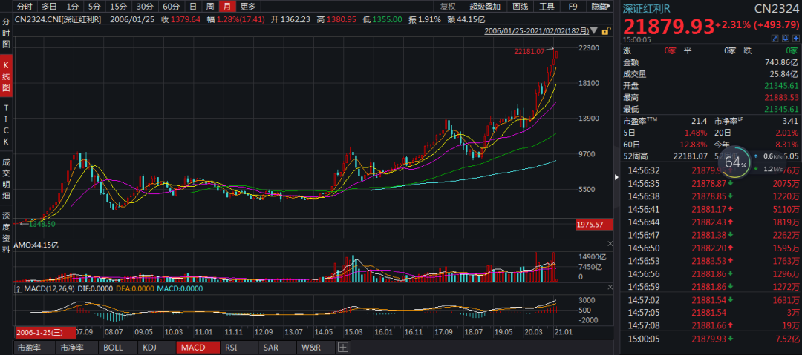
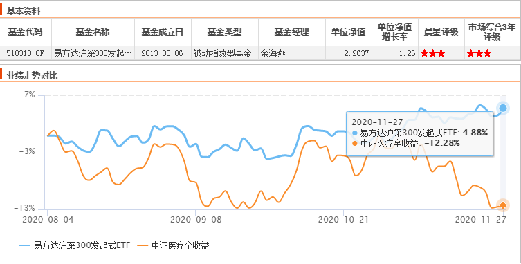
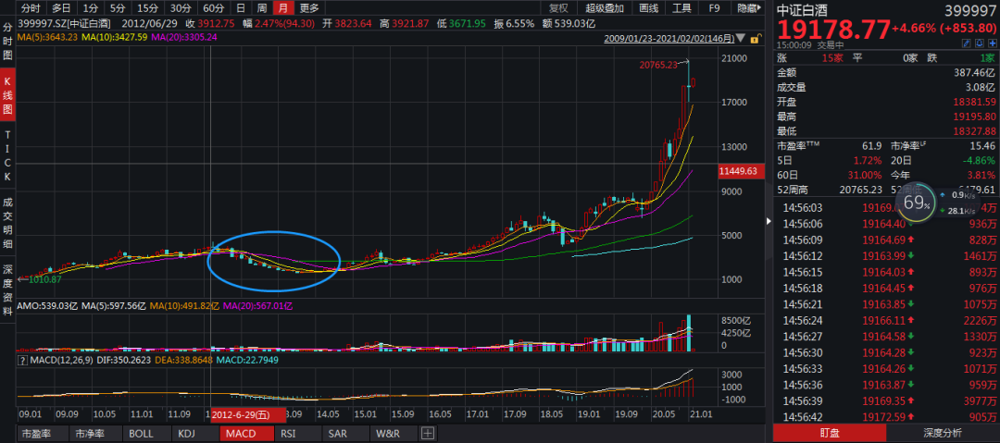
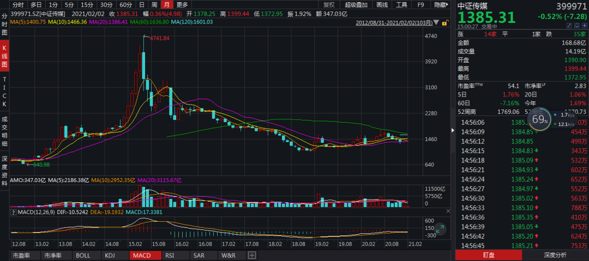
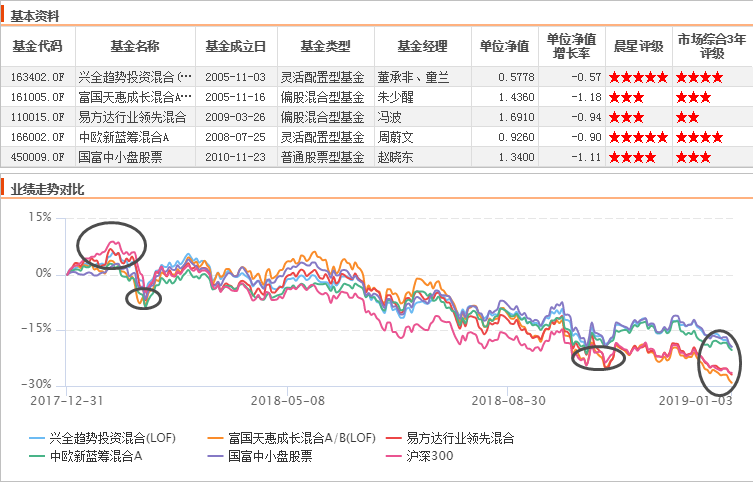
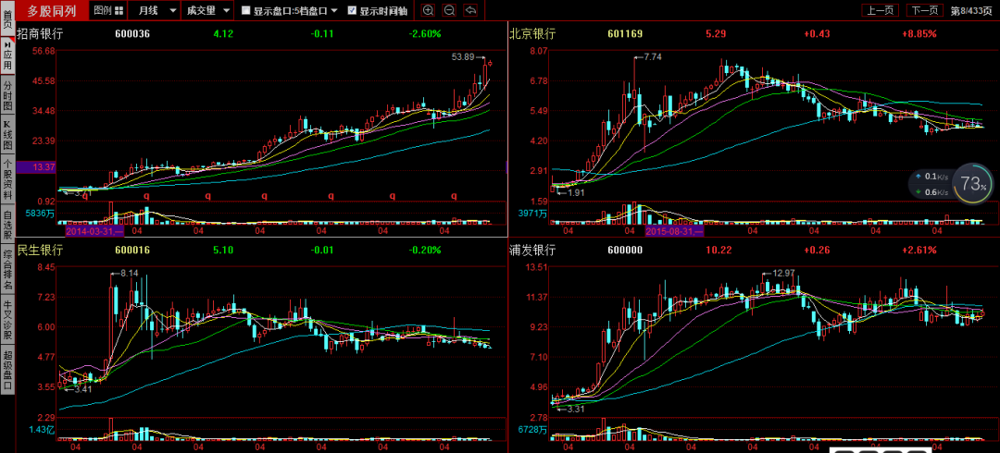
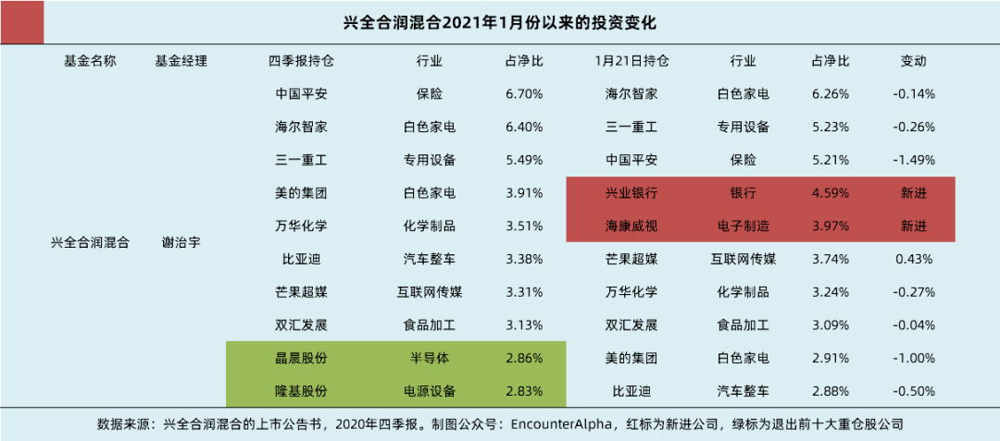
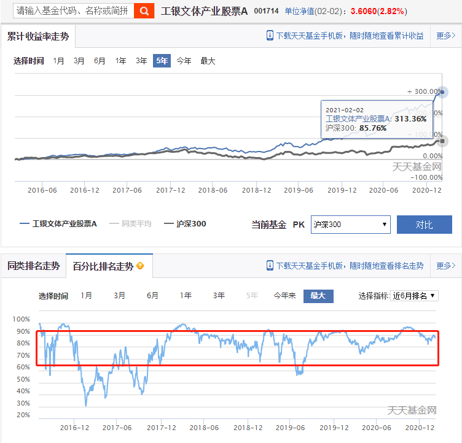
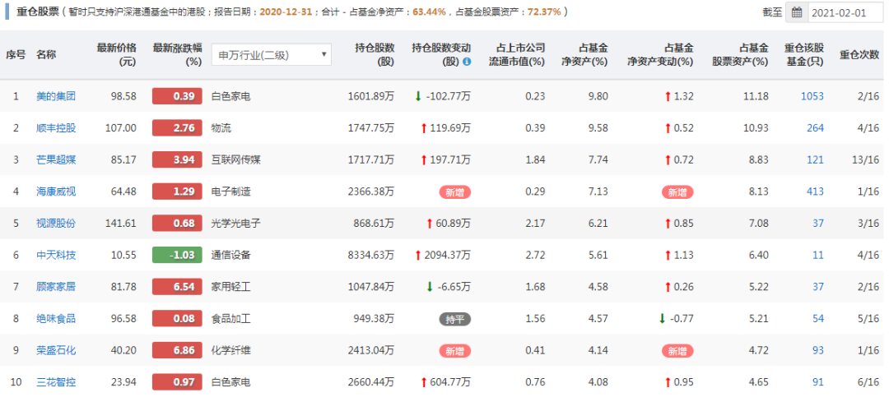
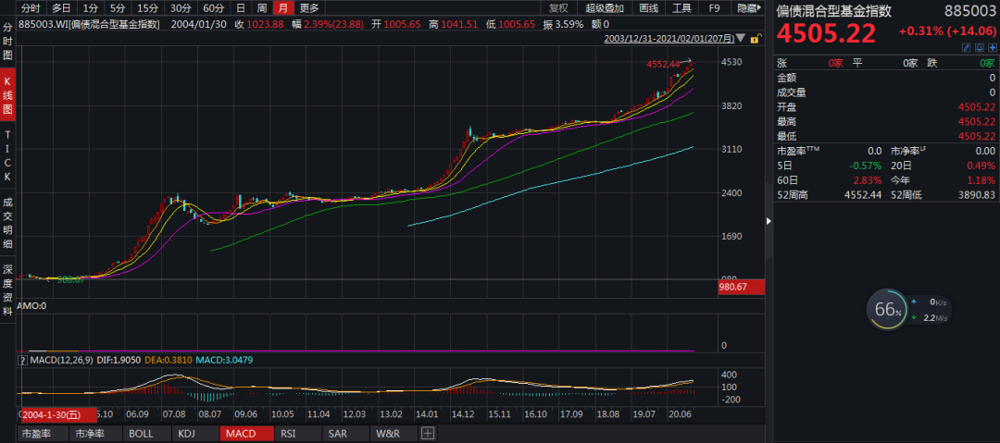

# 为何普通人应投资多行业均衡配置的基金？

最近四五年，A股市场的行业主题投资工具日益增多，而且有日益细分化的趋势。比如，之前的行业主题投资工具可能是消费、医药医疗、电子等大行业，现在已经发展到了 5G 通信、芯片、光伏等细分领域。短期火热的投资主题我们听过很多，但稍稍假以时日我们便可以发现，就基金而言，还是多行业均衡配置的主动型基金以及大的行业主题基金如医药、消费等引领风骚。

在我们耳熟能详的基金经理中，多数的基金经理也是坚持多行业均衡投资，甚至像中欧的葛兰、交银的楼慧源、工银的鄢耀，他们赖以成名的基金是行业主题基金，但*他们也在探索不那么受局限的多行业投资。*在担任基金经理职务超 10 年的老将中，像*富国的朱少醒、兴全的董承非、易方达的冯波、中欧的周蔚文、睿远的傅鹏博*等人也都是不局限于某一行，坚持多行业均衡配置的。

*大多数的基金投资者注定不是行业专家，注定不是博弈高手，大多数的基金投资者选择主动型基金是来借力的，借助的就是基金经理慧眼识别价值与获取价值的能力。*尽管大多数基金投资者的确是选择了多行业均衡配置的基金，但我还是想和大家聊聊为什么要做这样的投资选择。

要问基金投资者害怕什么，哪怕是与「市场先生」相处融洽的老基民，面对长时间、较大幅度的下跌也会心里犯嘀咕，更别说只想来市场捞钱不想承受下跌波动的新基民了。我们把上证指数、Wind全A、沪深300这样的指数下跌称为A股市场的系统性风险，*只要你投资股票型基金，只要你坚持长期投资而不是赚一票就走，你就要承受系统性风险。*

A股市场也有像深证红利这样长期震荡向上的指数

*因为盈亏同源，所以承受系统性风险并不是没有收获，你能获得相应的贝塔收益，像沪深300指数的长期收益就是一种被动的贝塔收益。下跌和上涨你都没错过，但A股长期是上涨的，*我国经济是平稳向前发展的，上市公司是国民经济中的优秀代表，它们是长期创造价值的。这些根基性的东西决定了宽基指数的长期正收益期望。

若你选择的是细分行业投资，除了承受覆巢之下无完卵的系统性风险之外，*你还得额外承受行业自身的风险，*这种行业自身的风险会表现为脱离于宽基指数之外的涨跌，有时会表现出极大的跌幅。

在器械采购与阶段性高估的背景下，中证医疗短期大幅跑输沪深300

比如，医药医疗行业受带量采购等利空的打击可以表现为脱离沪深300指数的单独下跌；

中证白酒指数从 3900 点跌至 1700 点

比如，白酒行业受到严控三公消费等政策的打击可以表现出一年内下跌50%的恐怖行情；

中证传媒指数基本面大幅恶化，近5年一直处于熊市中

比如，中证传媒指数因为行业整体的恶化可以表现为五六年的持续性萎靡不振……

以上的风险很少见于多行业均衡配置的主动型基金里，大多数多行业均衡配置的主动型基金表现出特定宽基指数的系统性风险，大致说来就是配置金融地产、传统消费、周期行业多的主动型基金，基金净值阶段性见底和见顶的时间基本与沪深300指数一致；配置中小盘个股的基金一般与中证500指数一致；配置医疗、TMT 行业多的基金则基本与创业板指保持一致。

*投资多行业均衡配置的基金，我们不必担心行业黑天鹅事件的影响。*多行业均衡配置的基金大致是看好的行业配置十几个点，次看好的行业配置 5～10%，观察性的行业与公司则配置小个位数百分比的仓位。一个行业突然遭遇黑天鹅事件，跌去 10% 甚至更多是常有的事。面对利空之后是走是留，普通投资者很难决策。选择多行业均衡配置的基金则基本无此顾虑。

多行业均衡配置的基金基本上与指数亦步亦趋，只是上涨更多，下跌更少或震荡市超额收益更多的区别

*主动型基金持仓的静态估值有时并没有那么重要，因为基金的涨跌终点基本是随着宽基指数来的，全市场见顶了，我也见顶；全市场见底了，我也见底。*选择多行业均衡配置的基金，我们不用当行业专家，根据A股市场整体的估值情况、赚钱的概率和赔率去制定投资决策就可以了。

公募基金有 10% 的投资比例限制（个别指数型基金除外），这就意味着基金经理必然要持有 10 个以上个股。这种限制对于越是细分的行业越是不利，因为*常识告诉我们一个行业里投资价值超群的公司一定是少数几个，*因为行业内部的不少公司本来就呈现出互相竞争的关系，不少成熟的大行业，一般是有两三个佼佼者，多数平庸公司以及一些绩差公司。

即便是机遇众多的新兴成长行业，机构投资者经过产业调研与基本面研究之后，共识性认可投资价值的公司也终究是数量有限的。这就导致了*行业主题基金可能面临仓位浪费的问题，即基金可能配置了一些行业内的次优解。*这些次优解在行业景气度高的时候看不出问题，往往需要等到行业困难的时候才会感到业绩拖累。

2014年以来，招行因独特的商业模式与严格的风控而与其他银行大不同

*多行业均衡配置的主动型基金，往往只选择某个行业里基本面最好的一两个公司进行布局。*比如物流行业选择顺丰控股而不用把圆通、申通、韵达选入；比如建材行业选择海螺水泥、东方雨虹而不用把小水泥公司选入；比如金融地产行业选择招行、宁波、兴业、平安、中信、东财、保利、万科而不用选择竞争力、股东回报、成长潜力较弱的公司。

良好的高质量公司选择短期看作用不明显，但拉长了时间看，相关的龙头公司很多长期表现远好于行业平均，能够为基金净值增长贡献较大的比例。*均衡分散的配置，看似是制约了短期爆发性业绩的获取但从长期看却给了基金以长跑健将的潜质。*基金经理根据他的能力圈，有限性选择行业内最好的一两家公司进行投资，从而避免了基金把仓位投向质地一般的公司，保证了长远的最大化价值。

多行业均衡配置的主动型基金，若是基金经理风格稳定，他大概率不会参与到市场热点的追逐中，但是若细究相关的公司布局，你却会发现他时常受益于热点。

A股市场的热点多呈现出*短暂性、收缩性与轮动性*的三大特征。短暂性指的是板块内所有公司齐涨的时间窗口较短。

*收缩性指的是行业内只有少量公司能受益于业绩与估值的匹配从而呈现出慢牛的特征，*比如火爆的半导体行业此前齐涨，现在只剩下韦尔股份、卓胜微等公司慢牛上涨而非震荡与下跌。

轮动性指的是*一年之内A股市场里会有多个行业轮番上涨，*很多行业的上涨都是券商年度策略所预测不到的。比如 2020 年出现了电子、医疗、食品饮料、新能源、顺周期的接力行情。

兴全合润进行了多行业的均衡配置，上述持股不少在2020年完成了价值发现

回顾 2020 年我们可以发现，开年之际，多行业均衡配置的基金，我们总觉得涨多少，看不顺眼，恨不得投入 5G 通信与半导体的怀抱，但随着时间的推移，随着市场轮动性上涨的出现，我们惊讶地发现，不少多行业均衡配置的主动型基金后来居上，而火爆一时的行业主题基金则陷入了熄火之中。*行业主题基金收益最火爆的时候追高的投资者，大多不如坚守在多行业均衡配置基金里的投资者。*

你若盛开，清风自来。基金经理预测不了短期的市场热点，但他可以在有价值的行业里选出他心目中最优秀的一两个公司进行布局，覆盖了六七个行业，*随着时间的推移必定有相关的行业与公司会受益会出现快速的价值发现行情。多行业均衡配置的基金正是在这种类似于守株待兔的等待中实现了价值，而且做到了净值波动平稳，降低了投资的难度与心理考验。*

多行业均衡配置的主动型基金，通常还具有业绩稳定，少有大起大落，投资者持有总体安心的特征。将相关的基金进行可视化的展现，那就是多年基金业绩排名优秀与良好，少有一般，没有很差。从基金近 6 个月的滚动百分比排名看，那就是多数时间排名前 50%，很少落入排名后 20% 的区间里。

短期排名虽有起伏，但袁芳长期成绩极为优秀

*具有多行业均衡配置的主动型基金，往往不容易拿到年度冠军，但它们却往往是金牛奖、晨星奖的常客。*两三年业绩良好或优秀或许我们看不出什么，但相关的基金若能连续七八年多评为良好与优秀，则基金的长期投资业绩一定十分惊人。

杨浩的交银新生活力也是多行业均衡配置，我们应当学会查询和认识基金经理的重仓股行业与特征（图片来源：基智网，网站需付费非广告）

不少坚持多行业均衡投资的老将、名将已经成为了共识性的基金投资选择，*基金投资新人选择了解他们、学习他们、信任他们是难度较低的投资方式，*但为了谋求短期的暴涨，很多基金投资新人都去选择挖掘行业主题，当前什么最热就投什么……

更快、更高、更强是全人类所共同追求的，谁不想获得更高的投资收益率呢？但是，*对于基金而言，很高的投资收益率一定是在长期的持有中等来的，*解决不了长期投资的问题，基金历史统计中再怎么高的投资回报、基金经理的各项评价参数再怎么优秀，都是与你无关的。*因为时间成就了他们，而你却做不到与时间为友。*

能耐得住寂寞，拿好偏债混合基金没什么难度

不同的基金类别，不同的基金特征带来了基金投资难度的差异，*就大类资产而言，显然稳健型二级债基、偏债混合型基金的长期持有难度最低，*只要你能克服其他上涨我上涨很少的心魔就能做到；就股票型基金内部而言，选择三五个多行业均衡配置、管理经验丰富的基金经理，是一种低难度的投资方式，你只要愿意承受市场的系统性风险，愿意信赖他们就能坚持下去，而不需要自己认知行业、观测景气度、解读信息……

进阶有一个过程，小孩子先得学会爬才能学会蹒跚而行，在此基础上才能学会正常走路、学会跑步，年龄再大一些才能学会体育运动以及骑自行车。*很多新人投资者可能快步走还不利索，就想骑自行车，这能不摔跤吗？*承认自己的局限，选择适合自己的投资方式，用漫长时间中的学习与沉淀来克服局限，提升投资能力圈的范围……*人是逐渐成长的，优秀的投资者也是这样成长起来的。*

既然人生富裕一次就够，那就把成功交给时间，放在未来。*多想一想自己的大资金怎么在未来的十年二十年里取得满意的年化回报，*从而实现自己家庭换房、子女教育、父母养老的目标，而不是赚眼前这三五个点的短期收益。人生匆匆而过，切莫白了少年头空悲切。

*在投资实践中，很多基金投资者因为错过几日的阶段性上涨而懊恼，因为错过了一个阶段的热门主题基金而遗憾，但大家却不遗憾自己错过了长期年化收益率近 20% 的长跑健将，却不遗憾自己未能享受一个优质公司的长期发展成果、未能享受长周期时段的上涨乃至更大的美好新时代……*

人生终究是由你的认知与选择的道路决定的。

> 来源：公众号「EncounterAlpha」转载文章发表的所有信息仅代表作者个人观点，不对您构成任何投资建议，详见[《文章免责声明》](https://youzhiyouxing.cn/agreements/ARTICLE_DISCLAIMER)。
