# 公募权益类基金投资者盈利洞察报告

2021 年 10 月 20 日，由景顺长城基金、富国基金、交银施罗德三家基金管理公司联合研究制作、并携手中国证券报联合出品的《公募权益类基金投资者盈利洞察报告》发布了。该报告一经发布，就在业内掀起刷屏之势。

在报告发布文章中，有几个备受基金行业与基民共同关注的问题被先抛了出来：

「买基金真的能赚钱吗？为什么基金赚钱基民不赚钱？买到顶流基金经理管理的基金是不是收益会更好？买基金赚钱的都做到了哪些事？」

你是否也有诸如此类的困惑？

面对投资者的困惑，上述三家公司联合起来开展了一次客户真实盈利数据的研究。统计分析了三家公司成立 1 年以上的 129 只主动权益类基金，以及持有上述基金的 4682 万客户共计 5.65 亿笔交易数据。

报告全文 2.6 万余字，干货满满，对于我们每一个人来说，这都是一个难得的「全景式视角」，有助于我们理解基金市场中到底都发生了什么，并进一步梳理自己的投资理念，值得花时间读一读。

祝开卷有知。

**康乐 景顺长城基金总经理**

> 「基金赚钱、基民不赚钱」的问题是整个行业长期可持续发展的痛点。为寻找这个问题的答案，在「以客为尊」的核心价值观指引下，2020 年，我们开展了一次较大规模的抽样调查，发布了《权益类基金个人投资者调研白皮书》。白皮书通过大量调研数据的呈现，反映出投资者的困惑、障碍和需求，对行业和投资者自身具有一定的启发性。白皮书数据结论在行业内得到广泛的引用，但同时，大家对数据有更高的期待，希望看到基于客户真实盈利情况的较为全面的统计分析。 事实上，客户实际盈利数据的统计工作非常复杂，多年来限于局部，全面进行梳理的难度极大。而随着基金「出圈」，持有人与日俱增，如何改善基民盈利体验的问题愈发凸显，一个全面且真实的盈利统计分析是必要且紧迫的，我们深感有责任推动行业对于客户盈利体验问题给予更多的关注。 为此，我们联合同业伙伴富国、交银，三家公司一起统计了旗下 4682 万主动权益类基金客户的账户共计 5.65 亿笔交易记录数据，去寻找影响基金投资盈亏的关键因素，并联合中国证券报形成这份《公募权益类基金投资者盈利洞察报告》。鉴往知来，我们希望通过对客户盈利数据的统计分析，找准未来提升客户盈利体验工作的重点，同时也希望能够带动行业更加关注改善客户盈利体验的问题，为基金行业生态的各个环节提供参考，共同努力帮助投资者树立正确的投资理念、引导理性的投资行为，从而力争实现「基金赚钱，基民也赚钱」，让基金成为老百姓信赖的投资工具，铸就普惠金融的典范。

「基金赚钱、基民不赚钱」的问题是整个行业长期可持续发展的痛点。为寻找这个问题的答案，在「以客为尊」的核心价值观指引下，2020 年，我们开展了一次较大规模的抽样调查，发布了《权益类基金个人投资者调研白皮书》。白皮书通过大量调研数据的呈现，反映出投资者的困惑、障碍和需求，对行业和投资者自身具有一定的启发性。白皮书数据结论在行业内得到广泛的引用，但同时，大家对数据有更高的期待，希望看到基于客户真实盈利情况的较为全面的统计分析。 事实上，客户实际盈利数据的统计工作非常复杂，多年来限于局部，全面进行梳理的难度极大。而随着基金「出圈」，持有人与日俱增，如何改善基民盈利体验的问题愈发凸显，一个全面且真实的盈利统计分析是必要且紧迫的，我们深感有责任推动行业对于客户盈利体验问题给予更多的关注。 为此，我们联合同业伙伴富国、交银，三家公司一起统计了旗下 4682 万主动权益类基金客户的账户共计 5.65 亿笔交易记录数据，去寻找影响基金投资盈亏的关键因素，并联合中国证券报形成这份《公募权益类基金投资者盈利洞察报告》。鉴往知来，我们希望通过对客户盈利数据的统计分析，找准未来提升客户盈利体验工作的重点，同时也希望能够带动行业更加关注改善客户盈利体验的问题，为基金行业生态的各个环节提供参考，共同努力帮助投资者树立正确的投资理念、引导理性的投资行为，从而力争实现「基金赚钱，基民也赚钱」，让基金成为老百姓信赖的投资工具，铸就普惠金融的典范。

**陈戈 富国基金总经理**

> 过 20 多年不断探索与实践，公募基金行业迎来了高速度、高质量发展的新时代。随着居民财富不 断积累，理财需求日益增强，基金投资群体迅猛增长。但是，我们也看到，全行业虽然花大力气进行投资者教育，「基金赚钱基民不赚钱」的现象仍然大量存在，如何提升与改变基金持有人体验，是我们亟待解决的重大课题。本期《公募权益类基金投资者盈利洞察报告》在大量数据分析的基础上，研究客户投资习惯、交易行为对收益的影响，探索基金投资规律，以期总结经验，为基金投资提供指导。希望通过我们的努力，传导正确的投资理念，造福投资者，使公募基金成为普惠金融的典范。

过 20 多年不断探索与实践，公募基金行业迎来了高速度、高质量发展的新时代。随着居民财富不 断积累，理财需求日益增强，基金投资群体迅猛增长。但是，我们也看到，全行业虽然花大力气进行投资者教育，「基金赚钱基民不赚钱」的现象仍然大量存在，如何提升与改变基金持有人体验，是我们亟待解决的重大课题。本期《公募权益类基金投资者盈利洞察报告》在大量数据分析的基础上，研究客户投资习惯、交易行为对收益的影响，探索基金投资规律，以期总结经验，为基金投资提供指导。希望通过我们的努力，传导正确的投资理念，造福投资者，使公募基金成为普惠金融的典范。

**谢卫 交银施罗德基金总经理**

> 公募基金作为资本市场的专业投资机构，汇集的是千万客户的资金与信任，我们始终要把这份信任当成一种责任，保持清醒的认识，将客户想要的稳定与安心放在首要位置，精细打磨产品，专注做好投资，用心做好陪伴，改善投资者的盈利体验，帮助客户真正收获资本市场所带来的中长期回报，实现「稳稳的幸福」。

公募基金作为资本市场的专业投资机构，汇集的是千万客户的资金与信任，我们始终要把这份信任当成一种责任，保持清醒的认识，将客户想要的稳定与安心放在首要位置，精细打磨产品，专注做好投资，用心做好陪伴，改善投资者的盈利体验，帮助客户真正收获资本市场所带来的中长期回报，实现「稳稳的幸福」。

狄更斯在《双城记》开头说，「这是一个最好的时代，也是一个最坏的时代；这是一个智慧的年代，也是一个愚蠢的年代；这是一个信任的时期，也是一个怀疑的时期。」

过去二十三年，中国公募基金行业迎来了高速的发展，规模历史性增至 24.02 万亿元。作为一种大众理财选择，公募基金愈发为大众所认可和接纳。特别是近一两年，基金开始「出圈」，「顶流」基金经理们一度成为「偶像」，基金隔三差五登上热搜，大量新基民慕名而来。对于公募基金行业而言，最好的时代或许正在来临。

但是基金出圈后，市场迎面泼了一盆冷水。牛年春节前大量投资者涌入基金市场，年后即遭遇资产的快速缩水。对于这部分投资者来说，这个公募基金「最好的时代」被抹上了些许怀疑的色彩。

「买基金真的能赚钱吗？为什么基金赚钱基民不赚钱？买到顶流基金经理管理的基金是不是收益会更好？承担了更高风险就能获得更高的收益吗？铺天盖地宣传的定投究竟有没有效果？」

面对投资者这样的困惑，我们做过抽样调查，也有过局部渠道分析，但是全面而真实的客户数据分析却仍未有过。

这一次，景顺长城基金、富国基金、交银施罗德基金三家权益类大型基金公司联合起来，携手中国证券报做了这样一件可能是具有行业开创意义的事情。

我们第一次汇总了三家公司共计 129 只主动权益类基金产品的全部 4682 万客户，处理了共计 5.65 亿笔交易记录的数据，从总体的盈利情况、客户的投资行为以及基金的风险收益特征等维度进行了系统性的梳理和分析。三家基金公司主动权益投资能力长期在业内位居前列，出色的业绩吸引了大量客户，这些客户的盈利千差万别，背后却有相似的投资行为，这些数据是观察权益类基金投资者非常好的样本。

统计分析的结果，虽是情理之中，却也有很多意料之外。*那些能够获得较好投资收益的基民， 遵循的投资原则都是相似的。但是基金投资收益不尽如人意的基民，则各有各的「不幸」。*

我们做这样的统计分析，便是试图从最客观的客户交易行为和盈利状况去发现问题，希望这些问题的讨论和研究能够揭示影响基金盈亏的关键因素是什么，希望能够帮助投资者用更好的心态和方法参与基金投资，在投资道路上获取更好的收益。

如果「基金的好收益≠基民的好收益」，那么基金的财富密码究竟是什么？我们亲身经历了这个不等式，现在我们想要寻找一个基民获得好收益的等式。

当然，我们也希望这些数据对基金行业能有帮助，帮助基金公司及销售机构在产品设计、宣传销售、客户陪伴，乃至投资运作等方面更有针对性地开展工作，共同努力提升投资者盈利状况，更好地推动公募基金行业良性健康发展。

**数据来源** ：景顺长城基金、富国基金、交银施罗德基金三家基金公司旗下成立满一年的主动权益类基金历史上所有客户的盈利及交易情况等数据。

**计算方式**：本报告的数据分析，参考中国基金业金牛奖的计算方式，数据分析结果经过金牛奖主办机构中 国证券报社专业人员复核及确认。

**样本代表性**：景顺长城基金、富国基金、交银施罗德基金为海通证券标准下 11 家权益类大型基金公司中的三家，三家基金公司成立均超过 15 年，且长期投资能力优秀。截至今年 6 月 30 日，三家公司过去 5 年的整体超额收益均排在权益类大型基金公司前五名。截至今年 3 月 31 日，三家公司符合统计标准的历史全部个人客户共计 4682 万，数据具有一定行业代表性。（权益类大型公司是按照海通证券规模排行榜，近一年主动权益的平均规模进行划分，累计平均主动权益规模占比达到全市场主动权益规模 50% 的基金公司。超额收益指主动型基金超额收益（净值增长率减去业绩比较基准后的收益）按照期间管理资产规模加权计算的平均超额收益。景顺长城基金成立于 2003 年 6 月 12 日，富国基金成立于 1999 年 4 月 13 日，交银施罗德基金成立于 2005 年 8 月 4 日）。

**历史全部个人客户**：指所有购买过景顺长城基金、富国基金、交银施罗德基金三家基金公司旗下成立满一年的主动权益类基金的个人客户，不包括机构客户。

**现持有份额客户**：指截至特定时间点仍持有上述基金中的基金份额尚未赎回的个人客户。

**主动权益类基金** ：权益类基金指投资方向主要为股票的公募基金产品。在展示此类基金业绩时，引用了银河证券基金研究中心的主动股票方向基金业绩指数。主动股票方向基金业绩指数主要包含了标准股票型、混合偏股型和灵活配置型中比较基准中股票比例值大于等于 60% 的基金。

**时间节点** ：无特殊说明，数据截至 2021 年 3 月 31 日；部分数据截至 2020 年 12 月 31 日，引用时均注明。因今年一季度基金出圈遇上市场巨震，客户盈利情况出现大幅变动，因此选取两个不同时间节点做对比分析。

**客户盈利** ：计算客户在不同渠道购买过的每一只基金获得的收益情况，通过不同渠道多只基金的总收益 金额/多只基金的总成本，计算出客户整体收益。

**平均收益率**：由客户盈利计算的算术平均收益率。人均盈利：盈利总金额/总人数。

**持仓时长**：计算客户在不同渠道购买过的每一只基金的实际持仓天数（客户可能会有清仓卖出后再买入的行为，持仓时长统计全部实际持仓天数总和，不考虑这一过程的差异）。

**交易频率**：客户在不同渠道，平均每月买卖次数。交易频率=总买卖次数/(最后一次买卖日期-首次买入日期) ×365/12。只统计非定投客户交易频率。月均交易频率更适合用于横向对比，绝对数值仅供参考。

**投资年限**：客户首次购买日期至统计截止日期的时长。

**定投**：定投即客户以一种定期定额买入的方式进行投资的行为。由于真实客户数据中缺失定投的标签，我们根据定投的定义制定如下规则以进行定投行为识别：连续两次及以上固定额度，固定日期(日/周/两周/月)买入即视为定投。

**第一章 基金投资者的变与不变**一、年前年后三个月，盈利冰火两重天 二、变：90 后与互联网走向基金舞台中央 三、不变：基金投资者的收益特征

**第二章 盈利状况背后的投资行为**一、盈利水平与持仓时长正相关 二、交易频率越高盈利水平越低 三、交易行为极易受到市场行情影响 四、过早进行止盈止损操作 五、定投改善盈利体验

**第三章 影响盈利结果的产品因素**一、波动率过高影响盈利体验 二、不同回撤区间的盈利差异不明显 三、买到明星基金未必能胜出 四、封闭期对盈利体验有正向影响

**第四章 基民投基收益等式**一、基民投基收益=基金损益+基民行为损益 二、基民的「操作」给收益带来的损耗率接近 -60% 三、警惕这些减分项 四、牢记这些加分项

**第五章 提高基金投资者盈利体验的思考**一、投资者方面 二、基金公司和基金销售机构方面

今年一季度春节前后三个月，基金出圈撞上市场「过山车」行情，戏剧化的事件碰撞让这三个月成为了观察基金投资者行为及特征的绝佳时间窗口。

## 一、年前年后三个月，盈利冰火两重天

过去两年，市场行情火热，上证指数、沪深300指数分别上涨 39.04%、77.05%，实实在在地造就了公募基金的「大丰收」，基金赚钱效应明显。过去十五年，主动股票方向基金业绩指数上涨 1100.79%，年化收益率 18.02%。

截至 2020 年 12 月 31 日，三家基金公司成立满一年的主动权益类基金历史全部个人客户累计达到 3496 万人，其中盈利人数占比 70.42%。盈利总金额达到 1842.51 亿元，人均盈利 5269.93 元，平均收益率 15.44%。同期，现持有份额客户的盈利情况更加突出，盈利人数占比高达 95.90%，人均盈利 8053.71 元，平均收益率 26.62%。

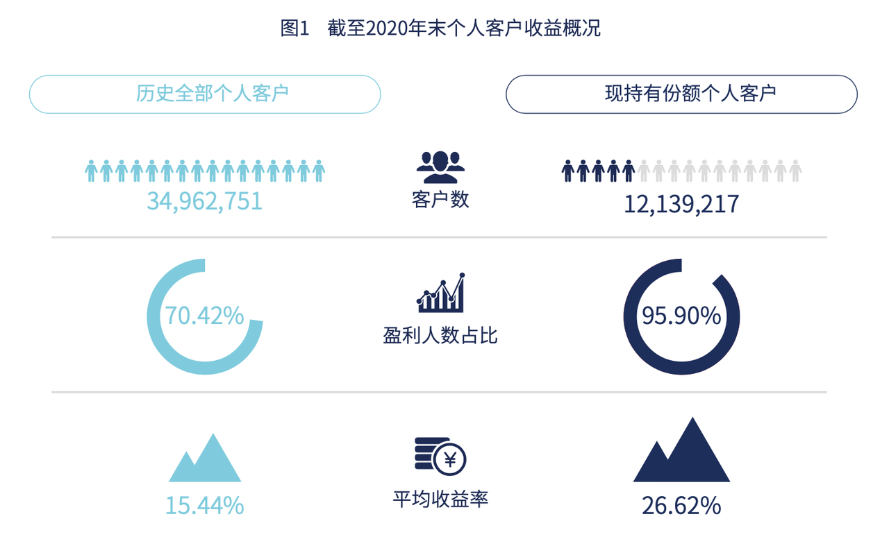

数据来源：景顺长城基金、富国基金、交银施罗德基金，统计区间为公司成立以来至 2020 年 12 月 31 日。

总体来说，在好行情的背景下，大部分基金投资者确实赚到了钱，因此基金也迅速「出圈」，吸引了大量新基民涌入。

不过，慕名而来的基金投资者很快遇到市场的考验。市场遭遇过山车行情，基金收益率也出现下滑，过去十五年，主动股票方向基金业绩指数涨幅下滑至 910.68%，年化收益率下滑至 16.67%。

一月份，核心资产带动指数快速拉升；短暂回调后，市场随即在 2 月初重拾升势，市场风格进一步极致化，持续到春节前。春节后，行情快速逆转，上证指数在 2 月 19 日后，13 个交易日急速下跌 338.43 点。核心资产持续大幅回调，经历了近一个月的急跌。

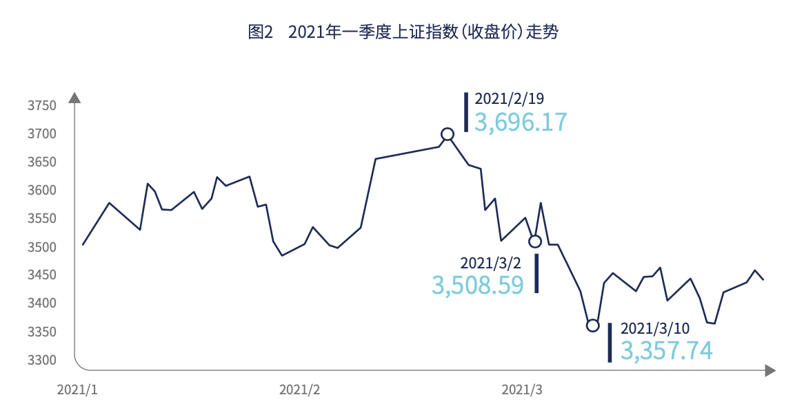

数据来源：Wind，统计区间 2021 年 1 月 1 日-2021 年 3 月 31 日。

市场的急速变化带来了客户盈利数据的大变脸。截至 2021 年 3 月 31 日，历史全部个人客户中盈利人数比例从 2020 年底的 70.42% 降至 53.28%，平均收益率由 15.44% 下滑至 8.85%。现仍持有份额客户的盈利情况下滑更加明显，盈利人数占 比从 95.90% 大幅下滑至 48.86%。

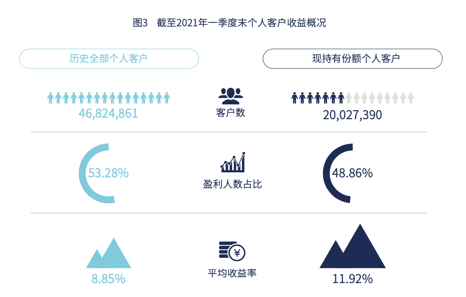

数据来源：景顺长城基金、富国基金、交银施罗德基金，统计区间为公司成立以来至 2021 年 3 月 31 日。

如果从短期视角来看，这 3 个月的市场变化确实剧烈，但是将其放置在 15 年的走势图中，却又是一段极为常见的小波折。

不过，仅仅 3 个月时间，却让三家具有代表性的权益类大型基金公司积累了 15 年以上时间的客户盈利数据波动高达数十个百分点。这样的结果，无疑是让人惊讶的。为什么三个月时间会对 15 年的数据产生如此大的冲击?

一个可能的原因是，*这三个月时间，历史全部个人客户数量由 3496 万人增至 4682 万人，激增了 1186 万人，增幅达到 33.92%。这部分投资者不理想的盈利数据会对整体数据造成较大影响*。

需要强调的是，对于基金的长期走势来说，三个月的波折不值一提，但是对于在这三个月进入市场，迅速亏损后卖出的个人投资者来说，基金带给他们的却是实打实的亏损。

剧烈的波动会影响基金收益，但波动却是市场所难以避免的东西。三个月的盈利情况差异，说明了一些事实，短期的市场波动对盈利情况造成的影响不容忽视，在市场情绪狂热时买基金可能遭受短期亏损。投资者应该如何面对波动，什么样的投资者能够在波动巨大的市场中胜出，这些内容我们将在后文中详细展开。

## 二、变：90后与互联网走向基金舞台中央

年前年后这三个月盈利数据冰火两重天的变化背后，体现基金出圈带来的一系列变化。

近几年，90 后陆续进入社会，作为互联网原住民的第一批 90 后步入而立之年，投资理财理念在互联网快速传播。随着去年底基金赚钱效应的扩散，基金愈发「出圈」，基金投资者的年龄结构和销售格局也呈现新变化。

基金出圈快速吸粉，大量经验不足或没有经验的投资者受行情吸引进入基金投资领域。2020 年底投资年限在 1 年以内的新基民占比 32.04%，2021 年 3 月底则提升到 41.96%。

数据来源：景顺长城基金、富国基金、交银施罗德基金，统计区间为公司成立以来至 2020 年 12 月 31 日以及公司成立以来至 2021 年 3 月 31 日。

基金出圈带来的变化，一方面是投资年限低的基民比例增加，另一方面则是整体年龄结构的年轻化。虽然仅仅只有三个月，但是却对 15 年以上时间积累下来的客户年龄结构产生了较大的影响。

*以 40 岁为界，截至 2021 年一季度末，40 岁以下各年龄区间的人数占比较 2020 年末均有提升，其中 22-30 岁区间（均为 90 后）人数占比提升最多，达到 3.31 个百分点。*

*而 40 岁以上各年龄区间的人数占比较之 2020 年末则均有下降，合计占比下降 4.96 个百分点。*

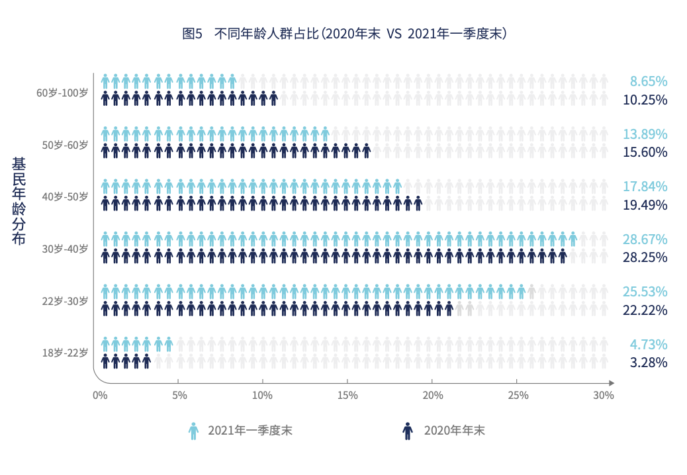

数据来源：景顺长城基金、富国基金、交银施罗德基金，统计区间为公司成立以来至 2020 年 12 月 31 日以及公司成立以来至 2021 年 3 月 31 日。

在 2015 年第三方销售机构获得基金销售牌照前，银行和券商是基金销售的绝对主力。不过，*近年来随着互联网影响力的提升，基金通过互联网平台愈发出圈，越来越多习惯使用互联网的年轻人加入到基金投资当中*。特别是在今年一季度后，以蚂蚁、天天等互联网平台为主的第三方销售机构在新增客户上的优势越来越明显。

截至 2021 年 3 月 31 日，所有客户当中，62.93% 来自于第三方销售机构，是基金最大的客户来源。相较之下，2020 年底第三方销售机构客户占比为 53.32%。可见 2021 年进入市场的新基民中，第三方贡献力度较大。

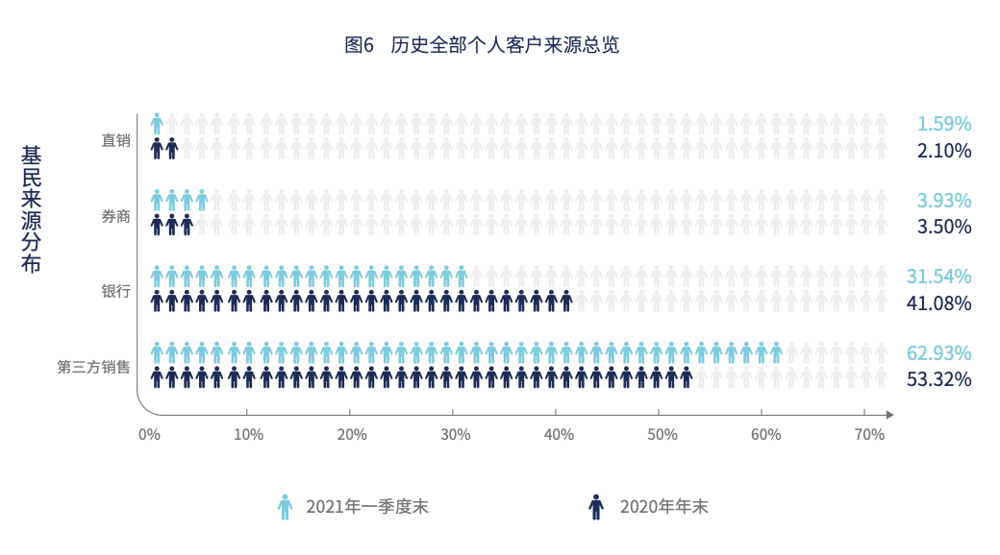

数据来源：景顺长城基金、富国基金、交银施罗德基金，统计区间为公司成立以来至 2020 年 12 月 31 日以及公司成立以来至 2021 年 3 月 31 日。

## 三、不变：基金投资者的收益特征

虽然基金出圈和新基民的涌入带来许多变化，但是总体而言，基金投资者的投资行为特征，由此带来的投资收益情 况，以及折射出的基金投资理念并没有发生大的转变。

截至 2020 年 12 月 31 日以及 2021 年 3 月 31 日，过去十五年，主动股票方向基金业绩指数累计涨幅分别高达 1100.79%、 910.68%，年化收益率分别为 18.02%、16.67%。

而对应时间节点，历史全部个人客户的平均收益率分别仅 15.44%、8.85%。尽管数据表明，截至 2020 年 12 月 31 日，历史全部个人客户中 70% 以上通过基金投资赚到了钱。*但普遍而言，投资者获得的收益不及其购买的基金业绩，也就是基金赚钱，基民确实不怎么赚钱。*

如下图数据，截至 2021 年一季度末历史全部个人客户的收益率情况类似于正态分布：61.73% 的客户盈亏集中在 ±10% 之间，只有 11.17% 的客户获得了 30% 以上的收益，能够获得翻倍以上收益的客户仅占比 2.32%。同时，亏损超过 30% 的客户也仅占 1.01%。也就是说，购买基金获得较大幅度盈利和亏损的比例均不高。现持有份额客户的盈利情况呈现类似的特征。

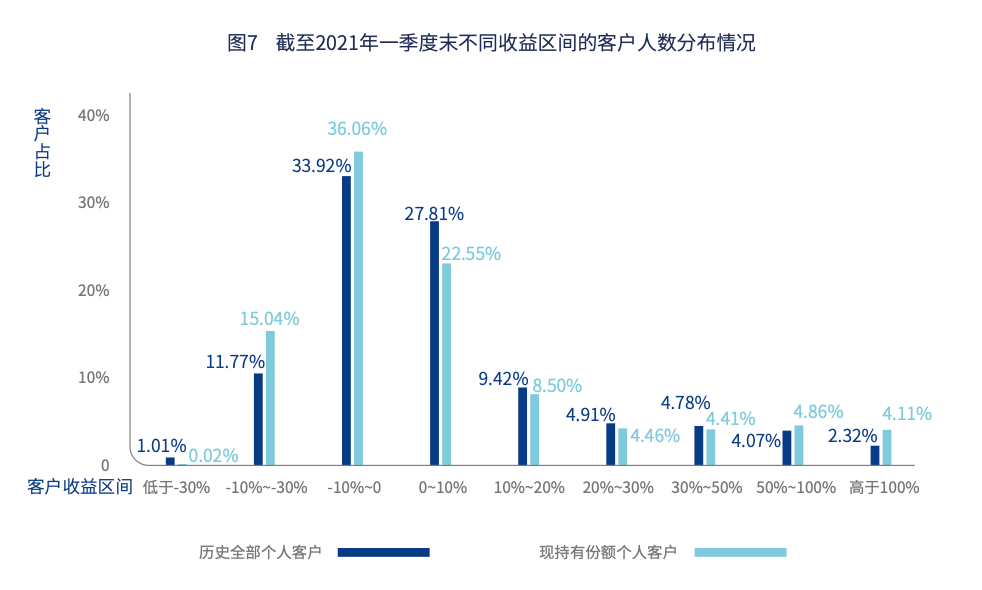

数据来源：景顺长城基金、富国基金、交银施罗德基金，统计区间为公司成立以来至 2021 年 3 月 31 日。

时间节点回到 2020 年底时，历史全部个人客户的收益率情况也呈现类似的分布情况，历史全部个人客户中有 55.87% 盈亏集中在 -10% 至 10% 之间，不过现持有份额客户亏损比例较 2021 年一季度末要小一些。

数据来源：景顺长城基金、富国基金、交银施罗德基金，统计区间为公司成立以来至 2020 年 12 月 31 日。

客户整体投资收益情况如上所述，不同性别和年龄投资者的收益是否有很大差异呢?

从投资者人数看，男女的性别占比基本是五五分，不过女性的盈利状况显著优于男性，在这戏剧性的三个月冲击后， 女性更胜一筹的情况也没有改变。

从下图可以看出，截至 2021 年 3 月 31 日，女性投资者中盈利人数占比超过 50%，高于男性投资者，平均收益率则高出男性 1.57 个百分点。同时，女性在投资上显得更舍得投入，平均投入 26711 元，比男性高出 1500 元。

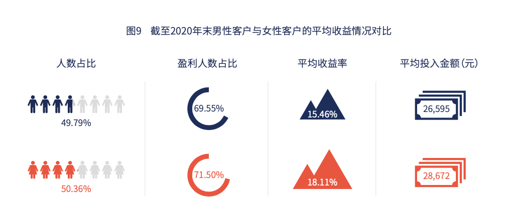

数据来源：景顺长城基金、富国基金、交银施罗德基金，统计区间为公司成立以来至 2020 年 12 月 31 日。平均收益率为客户收益率的简单算术平均。

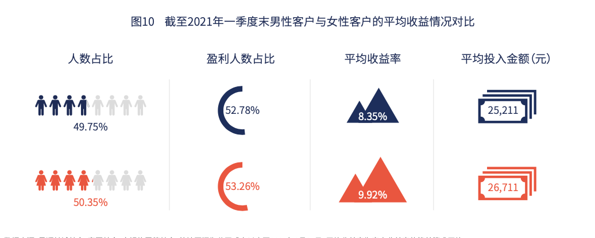

数据来源：景顺长城基金、富国基金、交银施罗德基金，统计区间为公司成立以来至 2020 年 12 月 31 日。平均收益率为客户收益率的简单算术平均。

值得注意的是，女性的平均交易频率为 2.57 次/月，低于男性的 3.08 次/月，这或许反映出女性比男性基金投资者更有耐心。

数据来源：景顺长城基金、富国基金，统计区间为公司成立以来至 2021 年 3 月 31 日。注：单客户交易频率数据计算公式为总买卖基金次数/(最后一次买卖日期-首次买入日期)×365/12。 平均交易频率为客户月度交易频率数据的简单算数平均。

与性别维度相比，年龄维度体现出的差异更加显著一些。虽说这三个月里，历史全部个人客户整体年龄结构愈发年轻化，但是盈利情况依然是年龄越大越好。与性别维度相比，年龄维度体现出的差异更加显著一些。

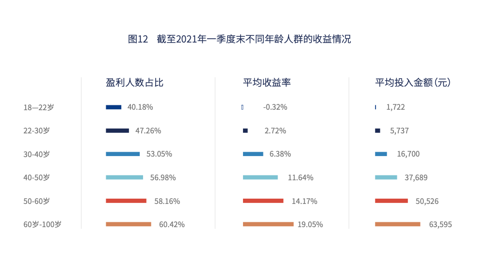

数据来源：景顺长城基金、富国基金、交银施罗德基金，统计区间为公司成立以来至 2021 年 3 月 31 日。

如上图所示，截至 2021 年一季度末，盈利人数占比、平均收益率与年龄段呈正相关，30 岁以下投资者平均收益率不到 3%，盈利人数占比不到 50%;而 60 岁以上投资者平均收益率达到 19.05%，盈利人数占比达到 60.42%。

此外，平均投入金额和年龄段同样呈正相关。18-22 岁、22-30 岁投资者平均投入金额分别仅为 1722 元、5737 元;而 60 岁以上投资者平均投入金额则达到 63595 元。

年龄维度体现出的差异，有其客观原因。年龄越大的投资者，可能因为自身投资经验和经济实力都达到了更好的状态，所以在平均收益率上取得了更好的结果。

前面描述的都是个人客户的情况，那么机构客户的盈利如何呢？我们将机构客户和个人客户的盈利情况进行了对比，发现整体来说机构客户的盈利结果胜过个人客户。

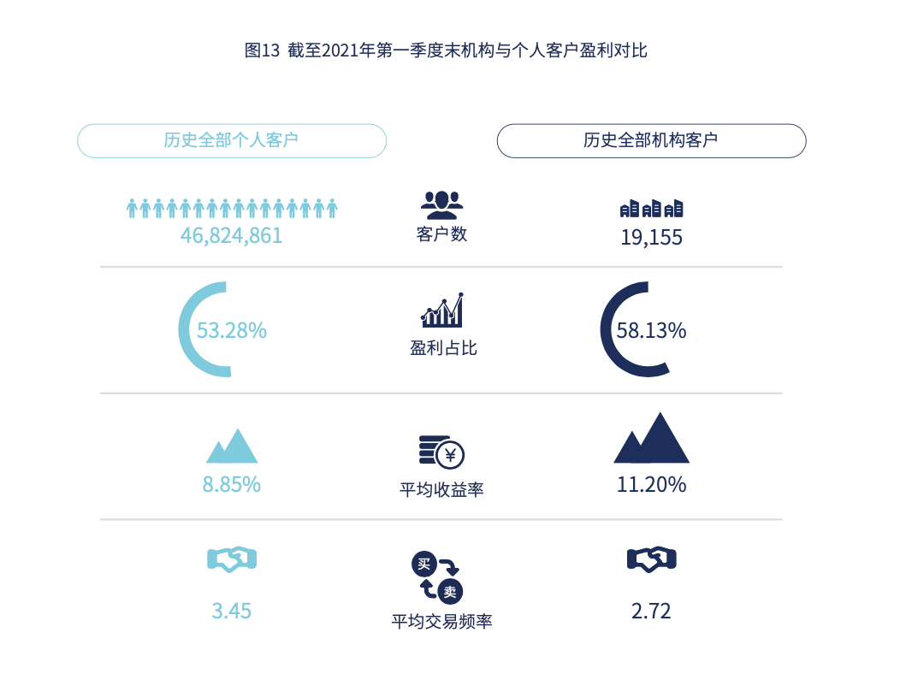

数据来源：景顺长城基金、富国基金、交银施罗德基金，统计区间为公司成立以来至 2021 年 3 月 31 日。

可以看到，机构客户的盈利户数占比高出个人客户近 5 个百分点，平均收益率则超越个人客户 2.35 个百分点。

但数据结果与普遍印象中专业的机构形象还是存在差异，盈利户数占比也没有超过六成，机构投资者买基金也不是稳赚不赔的。

戏剧化的三个月给三家权益大型公司 15 年以上的盈利数据带来了较大的冲击，市场情况、基金收益率、客户盈利情况、投资者结构等等都发生了改变，而从性别、年龄、机构与个人差异等维度反映出的基金投资者收益特征没有明显改变，「基金赚钱基民不怎么赚钱」的困境也依然存在。那么究竟是哪些因素最直接地影响到了基金投资者的收益情况？

尽管基金出圈后基民结构呈现出一些新的特征，但投资者的行为模式并没有发生本质的改变，不同盈利状况背后的行为有相似之处：持有时间过短、频繁交易、跟风追涨、过早止盈止损等行为模式依然在对投资者的盈利体验持续产生负面影响，而长期持有、坚持定投，都能帮助投资者提升盈利体验。

## 一、盈利水平与持仓时长正相关

景顺长城基金联合中国基金报和蚂蚁财富曾于 2020 年推出《权益类基金个人投资者调研白皮书》，通过大量的用户调研得出结论，基民的盈利概率和持仓时长正相关，长期投资是帮助投资者提升收益水平的重要手段。这一结论通过本次对投资者真实盈利状况的统计分析得到了充分的验证。

下图数据显示，*持仓时间越长，投资者平均收益率水平越高，其中 3 个月的持仓时间可以说是一道明显的槛*。

其中，持仓时长小于 3 个月时，平均收益率为负，盈利人数占比仅 39.10%；超过 3 个月时，盈利人数占比大幅提升到 63.72%，平均收益率也由负转正。

*当持仓时长由 3 个月继续提升时，随着时间的累积，客户的平均收益率愈发可观，客户盈利人数占比也呈现稳步抬升态势。*特别是当持仓时间超过十年时，客户平均收益率首次突破 100% 大关，达到了 117.38%，客户盈利人数占比则达到了 98.41%，即绝大部分客户都能够赚钱了。

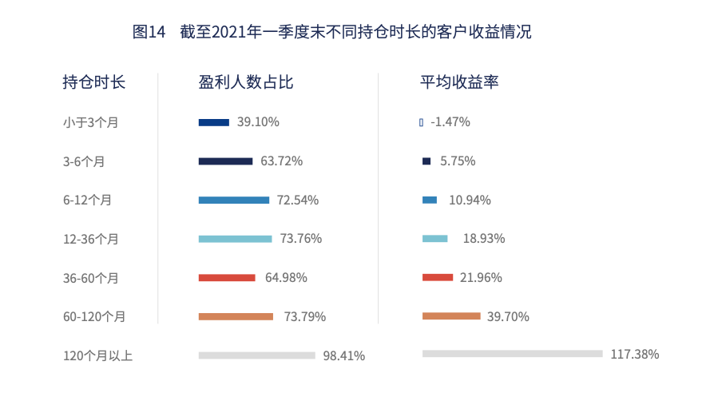

数据来源：景顺长城基金、富国基金、交银施罗德基金，统计区间为公司成立以来至 2021 年 3 月 31 日。 注:持有时长指标对应的是客户单个渠道单只基金的持有时间，故上表收益率数据表示客户在不同渠道购买过的每一只基金获得的收益情况。

不过，虽然盈利水平与持仓时长正相关，但是客户占比却与持仓时长大致呈负相关。有 45.96% 的客户持仓时长不到 3 个月，共 61.6% 的客户持仓时长都在半年以内。只有 11.46% 的客户能够持有基金超过 3 年，能够持有基金超过十年的只有 1.73%。

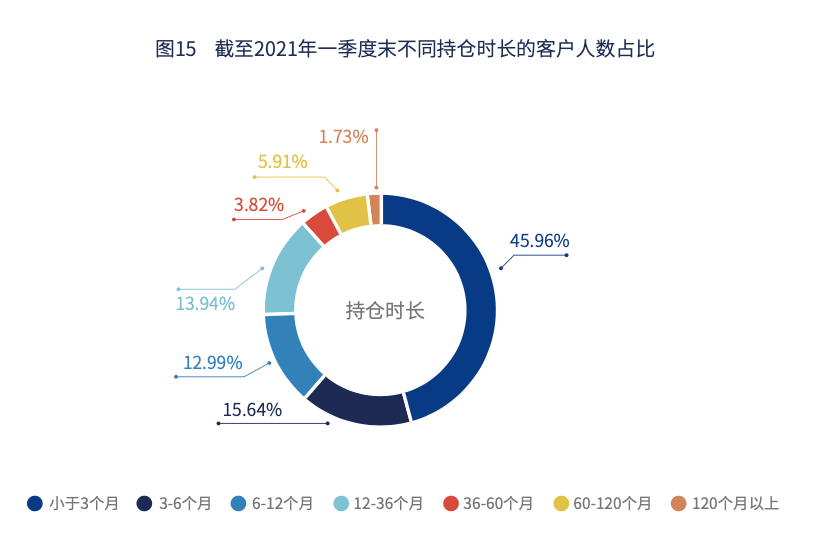

数据来源：景顺长城基金、富国基金、交银施罗德基金，统计区间为公司成立以来至 2021 年 3 月 31 日。

## 二、交易频率越高盈利水平越低

除了持仓时长，盈利也与交易频率有关。我们用客户平均每月发生的认申购、赎回和转换等行为的次数来判断其交易频率。数据显示，*交易频率也是影响盈利水平的重要因素，交易次数越多，盈利情况越差，如果能管住手减少交易次数，收益水平就能明显提升*。

如下图所示，半数以上客户平均每月发生不到1次买卖行为，其中盈利人数占比达到 55.14%，平均收益率 18.03%。但 平均每月买卖次数达到 1 次以上的，盈利人数占比与平均收益率均开始下滑。

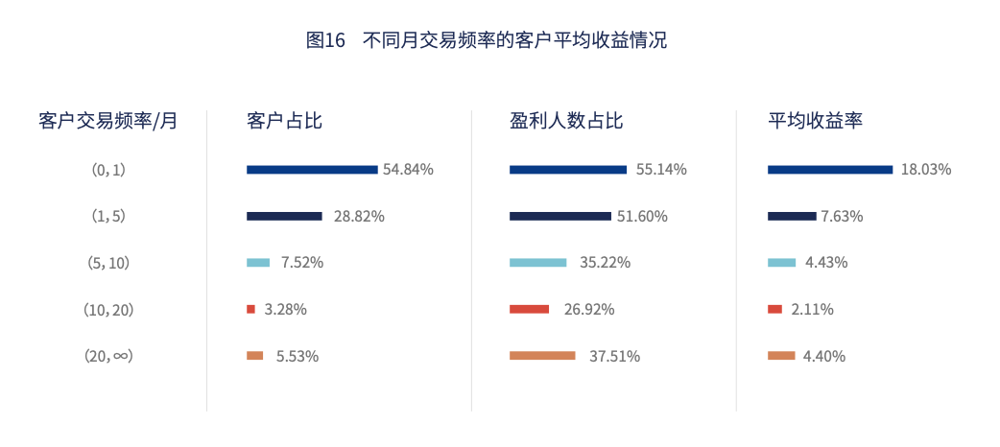

数据来源：景顺长城基金、富国基金、交银施罗德基金，统计区间为公司成立以来至 2021 年 3 月 31 日。注：单客户交易频率数据计算公式为总买卖基金次数/(最后一次买卖日期-首次买入日期)×365/12。

## 三、交易行为极易受到市场行情影响

客户不仅交易频率高，而且有看行情择时的倾向，表现出明显的「羊群效应」，这类行为极大地影响了盈利体验。

为了真实展现客户交易行为与市场行情的相关性，我们将三家公司客户的申赎数据进行了整合，结果显示，客户的交易行为与市场行情显著相关。

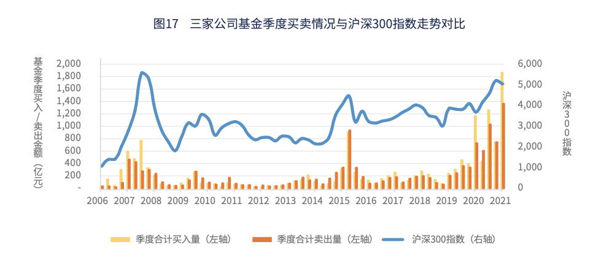

数据来源：Wind，统计近 15 年，2006 年 1 月 4 日(2006 年第一个交易日)至 2021 年一季度末沪深300指数(000300.SH)每季度末当日收盘价；景顺长城基金、富国基金、交银施罗德基金三家基金公司同期按季度合计基金买入金额(包含认购、申购、转换入、定期定额申购)及卖出金额(包含赎回、转换出)。

在 2007 年、2015 年、2020 年和 2021 年初行情的上涨阶段，三家公司季度基金买入金额大幅增加，但是一旦步入下跌阶段，季度基金买入金额锐减，与沪深300指数的起伏高度相似，这意味着*大部分投资者喜欢在上涨时进入市场，呈现出一定的追涨性质。而在漫长的市场平淡期，例如 2011-2014 年期间，季度基金买入金额同样低迷。而事实上，这可能反而是布局基金的好时机*。

季度基金卖出金额一个明显的特征是，在市场由低位开始反弹的初期便开始放大，对应着我们将在后文展开的过早止盈问题。而当市场出现较大幅度调整时，季度基金卖出金额出现一定萎缩，但是在市场持续下跌的过程中，仍旧保持较高的水平，反映出*基民整体对于风险和亏损的厌恶程度相对较高。这在一定程度上让投资者免受短期内更大幅度的潜在亏损，但是也可能因此失去获得长期超额收益的机会*。

## 四、过早进行止盈止损操作

前文我们提到，截至 2021 年 3 月 31 日，61.73% 的客户盈亏集中在 -10%~10% 之间。而与这一数据相对应的是，60.09% 的赎回客户数出现在 -10%~10% 的客户收益区间内。

其中，*在赎回的客户中，有 26.7% 的客户是收益在 -10% 以内进行了赎回；33.39% 的客户在盈利不超过 10% 时就进行了赎回，赎回比例最高*。

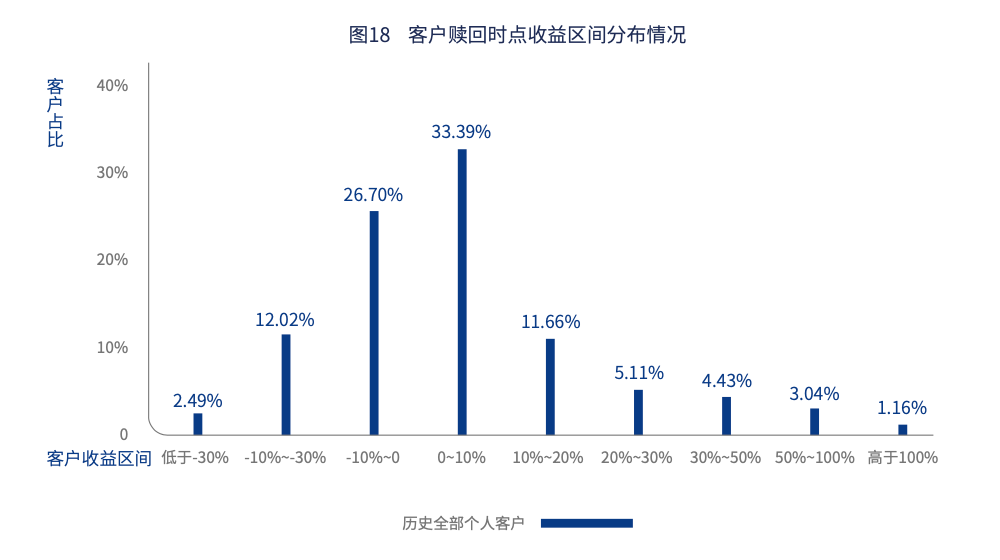

数据来源：景顺长城基金、富国基金，统计区间为公司成立以来至 2021 年 3 月 31 日。先计算单个客户每个赎回时点对应的收益率，再进行简单算术平均以衡量单客户发生赎回时的整体收益情况。

对于止损止盈操作的评价，在不同的参照系下应当是有不同的结论的。

如果客户有其严格的投资纪律，明确的盈利目标和亏损承受度，那么当基金投资收益或亏损达到其预定目标就进行相应的操作，自然是无可厚非的。

但如果客户的投资目标是希望获得权益类基金的合理回报，这六成投资者的止盈止损便可以说是有些操之过急了。事实上，过去十五年，主动股票方向基金业绩指数的年化收益率达到了 16.67%。

稍有经验的投资者对于A股市场的大幅波动都会有深刻的记忆。过去十五年，主动股票方向基金业绩指数历史最大回 撤达到了 56.50%，这或许就是他们急于「落袋为安」或是「止损出局」的原因之一。

如果投资者在购买基金前，对于基金的潜在收益和可能遭受到的回撤和亏损没有充分的预期，难免出现过于急切的止盈或止损操作，无法获取权益类基金的长期收益。

## 五、定投改善盈利体验

定投是各家基金管理公司和销售机构向投资者「安利」得最多的一种投资方式，它的实际效果如何，能否帮客户赚到钱，我们用真实数据进行了验证。

数据显示，虽然定投的方式在客户中还不算普及，但定投客户的盈利人数占比和平均收益率水平均高于非定投客户，显著提升了客户的盈利体验。

如下图所示，*目前只有 21.49% 的客户采用定投方式投资基金，但定投客户的盈利人数占比达到 59.86%，平均收益率 10.42%，均高于非定投方式*。

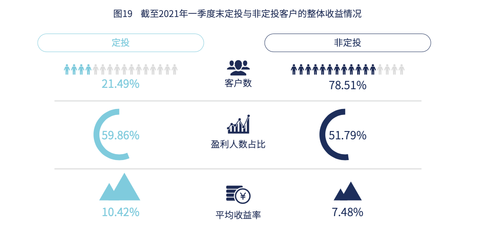

数据来源：景顺长城基金、富国基金，统计区间为公司成立以来至 2021 年 3 月 31 日。

为了更细致地展示定投效果，我们按收益区间对定投客户和非定投客户进行了比较。可以看出，定投客户中亏损 10% 以上的比例明显低于非定投客户，说明定投能一定程度帮助客户减少损失。

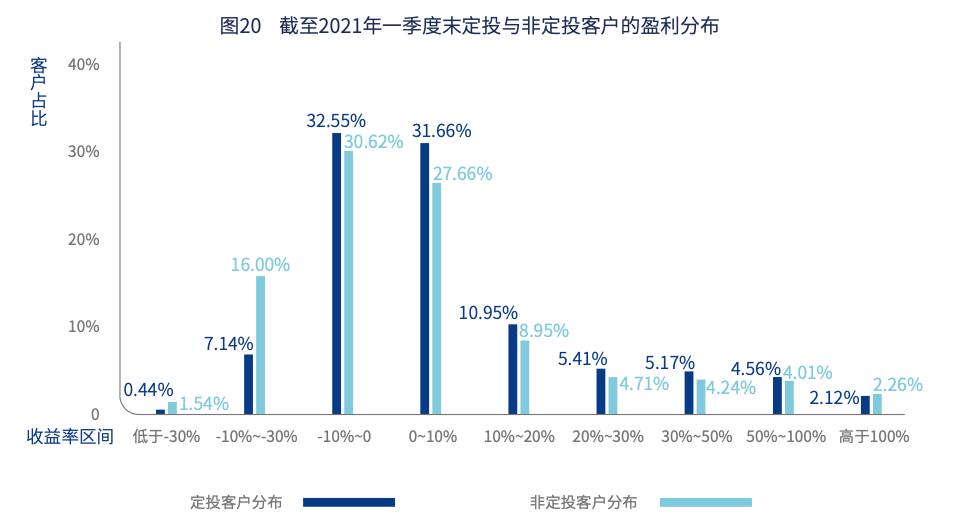

数据来源：景顺长城基金、富国基金，统计区间为公司成立以来至 2021 年 3 月 31 日。

同时，我们也观察了定投客户的持仓时长数据，发现定投有助于拉长客户的持仓时间，这应该是定投提升客户盈利水平的关键原因。如下图所示，非定投客户中仅有 20.88% 持有一年以上，而定投客户中有 39.21% 持有一年以上;非定投客户中有 53.75% 持有时间小于 3 个月，而定投客户这一占比只有 22.20%。

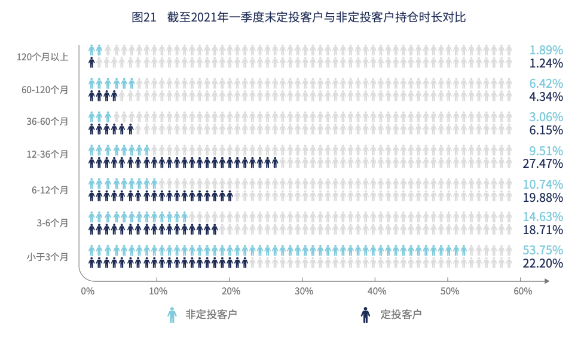

数据来源：景顺长城基金、富国基金，统计区间为公司成立以来至 2021 年 3 月 31 日。

影响基民投资行为的因素是多重的，有投资者经验和心态等主观原因，当然也有市场行情、基金产品等客观原因。本章我们尝试从基金产品的角度，来看看有哪些因素会对基民的盈利结果产生影响。

## 一、波动率过高影响盈利体验

我们的直观认知中，更高的波动意味着更大的风险，理论上来说，风险与收益呈正相关，投资者承担更高的风险自然是希望获取更高的收益。那么，客户盈利数据能否印证这样的认知呢？

由于近两年市场持续向好，近两年成立的新基金波动率普遍较小，未经完整市场周期考验。因此我们统计了成立三年以上基金的波动率情况。

出乎意料的是，数据显示，不同波动率区间的客户平均收益率与波动率本身并没有明显的线性关系。

年化波动率在 20%-30% 区间的基金，客户平均收益率最高，达到 8.94%。而波动率较小或过高，均无法获得更高的平均收益率。特别是购买波动率大于 30% 基金产品的客户，平均收益率出现了明显的下降，仅有 7.63%。

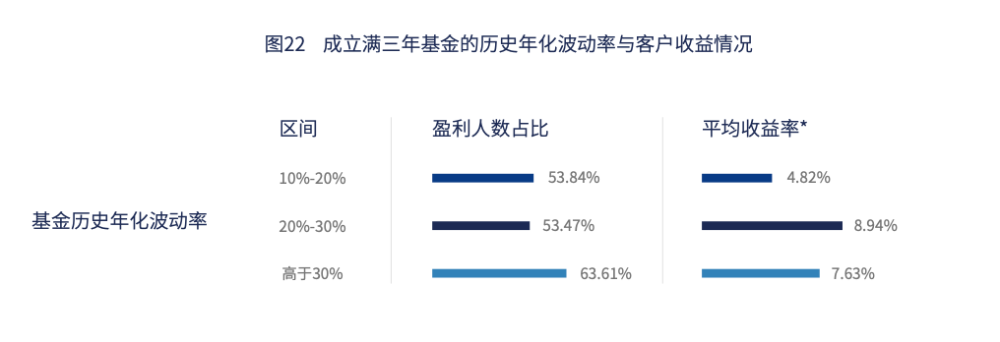

数据来源：景顺长城基金、富国基金，统计区间为公司成立以来至 2021 年 3 月 31 日。注:上表收益率数据分别统计客户不同基金的收益情况，故单个客户持有两只及以上基金，会得到多个收益率数据。基金年化波动率统计区间为基金成立以来至 2021 年 3 月 31 日，年化波动 率即收益标准差的年化值。年化波动率数值越大，代表回报远离过去平均数值，回报较不稳定故风险越高。相反，年化波动率数值越小，代表回报较为稳定，风险亦较小。未有符合条件的 10% 以内年化波动率的数据，故不列示。

投资者承担更高的波动率和风险，却没有能获得更高的收益率，问题出在哪里？

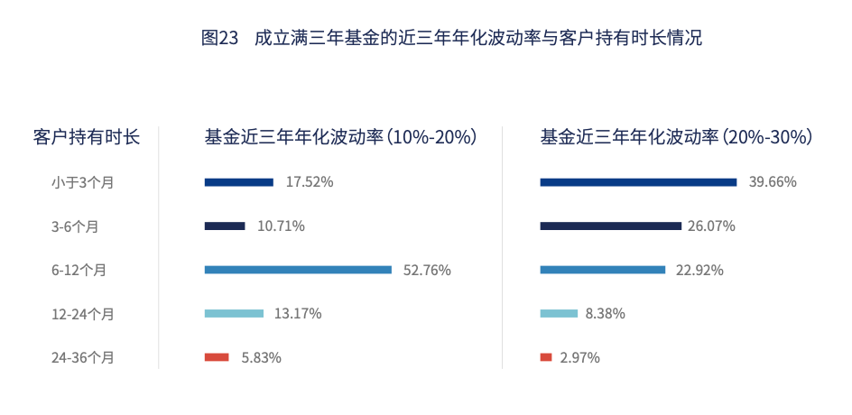

数据来源：景顺长城基金、富国基金，统计区间为公司成立以来至 2021 年 3 月 31 日。注:数据统计不同年化波动率的基金，在不同持有时长区间内客户人数的分布情况，例:如上表 17.52%，表示年化波动率 10%-20% 区间的基金，累计持有时长小于 3 个月的客户约占该区间客户总人数的 17.52%。近三年内未有符合条件的低于 10% 或高于 30% 年化波动率的数据，故不列示。为避免基金不同成立时间带来的波动率偏差，所以选取了近三年的时间区间。

从基金波动率与持仓时长的关系中，我们发现了一些端倪。在第二章的论述中，我们发现盈利水平与持仓时长正相关，持仓时长小于 3 个月时，平均收益率为负，盈利人数占比仅 39.10%。

而当基金波动率由 10%-20% 提升至 20%-30% 时，持仓时长不足 3 个月的客户占比由 17.52% 大幅提升至 39.66%；持仓时长 6 个月-12 个月的客户占比由 52.76% 大幅下降至 22.92%，持有时长超过 6 个月的客户占比由 71.76% 骤降至 34.27%。也就是，*波动率提升时，半年以内短期持有基金的人数占比提升，而半年以上持有基金的人数占比下降*。

由此可以发现，*基金的波动率与投资者的平均收益率并没有显著的线性关系，但是更高的基金波动率会对其持基体验产生负面影响，从而影响基金投资者的持仓时长，进一步影响平均收益率*。

## 二、不同回撤区间的盈利差异不明显

除了波动率外，回撤也是我们用来刻画一只基金产品风险状况的常用指标，有不少投资者对回撤是谈及色变。回撤大小是否影响客户的投资收益？答案和波动率类似。

数据显示，我们看不到基金产品的最大回撤和客户收益之间有明显的线性关系。

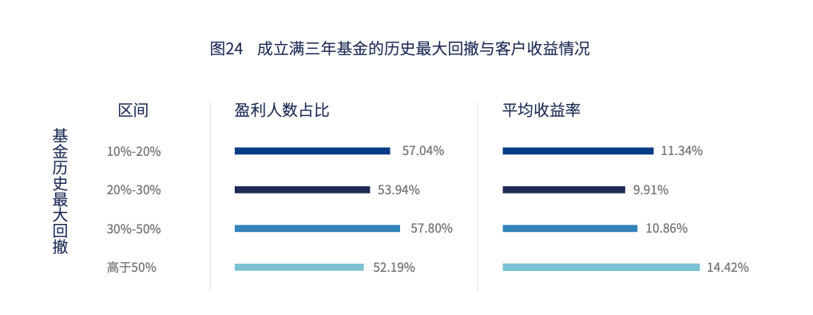

数据来源：景顺长城基金、富国基金，统计区间为公司成立以来至 2021 年 3 月 31 日。注:上表收益率数据分别统计客户不同基金的收益情况，故单个客户持有两只及以上基金，会得到多个收益率数据。基金最大回撤统计区间为基金成立以来至 2021 年 3 月 31 日，最大回撤指在选定周期内任一历史时点往后推，产品净值走到最低点时的收益率回撤幅度的最大值。

需要说明的是，当基金最大回撤高于 50% 时，客户平均收益率水平显著高于其它回撤区间。我们认为，这一组数据并不能论证投资回撤大的基金，客户能获得更高的收益。因为通过对基础数据的观察发现，回撤大的基金大多是因为经过了较长时间的投资运作，经历过更多的牛熊转换，而长时间的运作可能才是导致客户平均收益率更高的主要因素。

但回撤确实是影响持仓时长的重要因素，投资者可能因忍受不了回撤选择离场。回撤越大，持有时间低于三个月的比例越大，持有一年以上的比例越小。当最大回撤在 30%-50% 时，有超过 50% 的投资者持仓时间小于 3 个月。此处同样是统计成立三年以上完整经历过上涨下跌市的主动权益类基金，因此不存在最大回撤小于 10% 的基金。

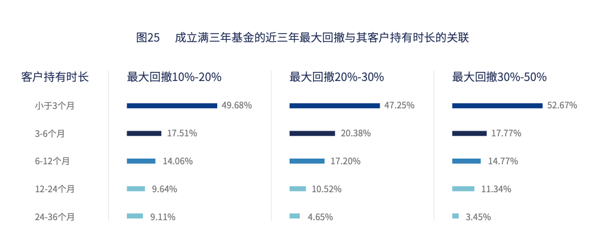

数据来源：景顺长城基金、富国基金、交银施罗德基金，统计区间2018年3月31日至2021年3月31日。注:基金最大回撤统计区间为基金成立以来至 2021 年 3 月 31 日，最大回撤指在选定周期内任一历史时点往后推，产品净值走到最低点时的收益率回撤幅度的最大值。数据计算基金持有人对于不同最大回撤基金的持有时长表现。近三年内未有符合条件的高于 50% 最大回撤的数据，故不列示。为避免基金不同成立时间带来的数据偏差，所以选取了近三年的时间区间。

## 三、买到明星基金未必能胜出

凭借出色的长期业绩，部分基金成为了所谓的「明星基金」。是否买到这些「明星基金」，客户的盈利体验就会更好？

我们挑选了三家基金公司旗下的旗舰代表产品来进行具体的分析，代表产品均具备「长期业绩出色、明星基金经理管理、规模大投资者数量众多」这几个特征。

如下图所示，从盈利情况来看，购买这三只代表产品的客户盈利人数占比确实高于全部基金的盈利人数占比，平均收益率也较之全部基金的平均收益率有所提升。但是提升的幅度似乎低于我们对于「明星基金」的预期。

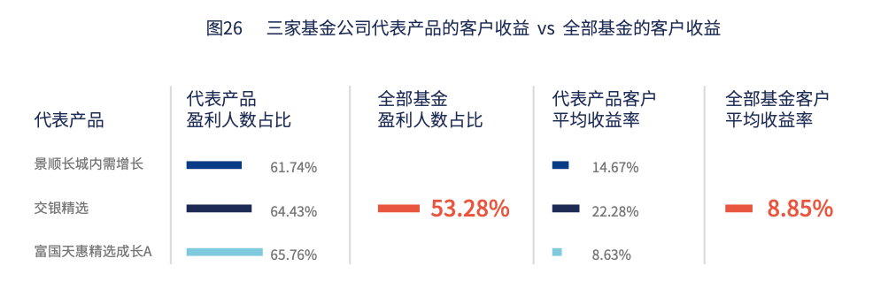

数据来源：景顺长城基金、富国基金、交银施罗德基金，统计区间为三只基金成立以来至 2021 年 3 月 31 日。代表产品盈利人数占比、客户平均收益率分别计算上表三只代表产品的历史全部持有人中盈利人数的比重和三只基金的历史全部持有人平均收益率。全部基金盈利人数占比、全部基金客户平均收益率统计三家公司成立满一年的主动权益基金历史全部个人客户的盈利数据。市场有风险，投资须谨慎。相关数据由过往真实用户数据研究得出，仅为说明投资理念使用，不作为任何收益承诺及保证。

而在并不突出的盈利数据背后，是较低的认购客户留存率。虽然买到了这些「明星基金」，但是能够从基金成立时持有至今的客户只有不到 1%。也就是说，「明星基金」并没有能让投资者更长期持有基金。

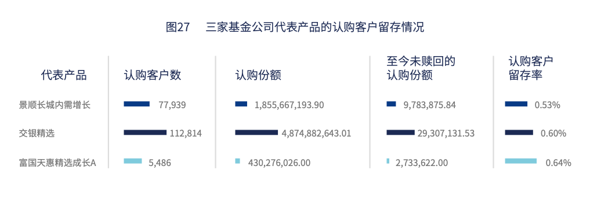

数据来源：景顺长城基金、富国基金、交银施罗德基金，统计区间为三只基金成立以来至2021年3月31日。认购客户仅统计个人客户，不包括机构客户。

上述并不突出的数据可能与「明星基金」的最大回撤数据有关。我们发现，「明星基金」虽然在较长的时间段内累计收益率颇为可观，但在其经历的多轮牛熊转换中也未能避免幅度较大的回撤。

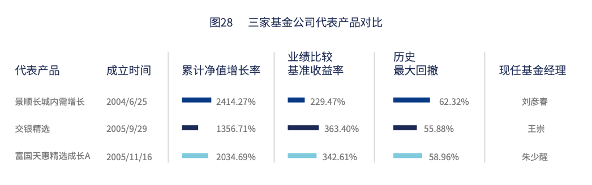

数据来源：累计净值增长率及业绩比较基准收益率取自各基金定期报告，历史最大回撤数据由景顺长城基金、富国基金、交银施罗德基金分别统计，统计区间为三只基金成立以来至 2021年 3 月 31 日。刘彦春于 2018.02.10 开始管理景顺长城内需增长基金，王崇于 2017.06.03 开始管理交银精选基金，朱少醒于 2005.11.16 开始管理富国天惠精选成长A基金。基金的过往业绩及其净值高低并不预示其未来业绩表现。本报告中提及的具体基金均仅做数据分析或举例使用，不代表任何具体的投资建议，基金投资需谨慎。

从累计净值增长率角度来说，景顺长城内需增长、交银精选、富国天惠精选成长A三只基金是公认的好基金，但在其漫长的运作过程中，也曾跟随市场历经起伏，三只基金的历史最大回撤分别为 62.32%、55.88%、58.96%。

另外，基金投资中的「二八效应」十分显著，若因无法忍受一时的回撤而放弃，则可能错失后期的上涨。明星基金的成长过程也是相似的，*大部分的收益集中在少数的上涨阶段内获得*。

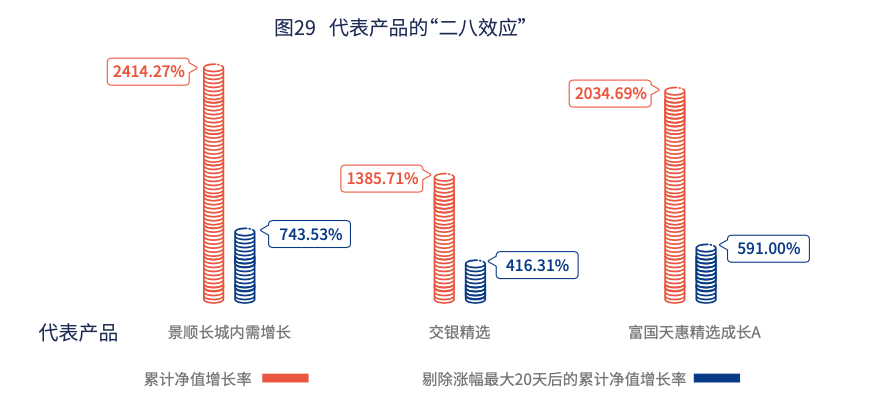

数据来源：基金定期报告、景顺长城基金、交银施罗德基金、富国基金。统计区间为三只基金成立以来至 2021 年 3 月 31 日。注：剔除涨幅最大 20 天指将复权净值增长率从高到低排序，将前 20 名假设为零增长，根据调整后的净值增长率计算得出累计净值增长率。本报告中提及的具体基金均仅做数据分析或举例使用，不代表任何具体的投资建议，基金投资需谨慎。

以景顺长城内需增长基金为例，截至 2021 年 3 月 31 日，该基金累计净值增长率 2414.27%，若剔除其历史上净值涨幅最大的 20 天，累计净值增长率仅 743.53%，差异惊人。

以上数据告诉我们，即使幸运地买到了明星基金，客户也未必能在投资中胜出。这一数据也再一次从个基角度凸显了「基金挣钱，基民不怎么挣钱」的棘手问题。

## 四、封闭期对盈利体验有正向影响

有没有什么产品因素能对客户的盈利情况产生正向影响呢？答案是产品封闭期。

基金行业近年来涌现出越来越多的封闭期或持有期产品。我们统计了三家公司有持有时间要求且成立满一年的权益类产品的客户收益情况，发现客户均获得了较好的投资回报。

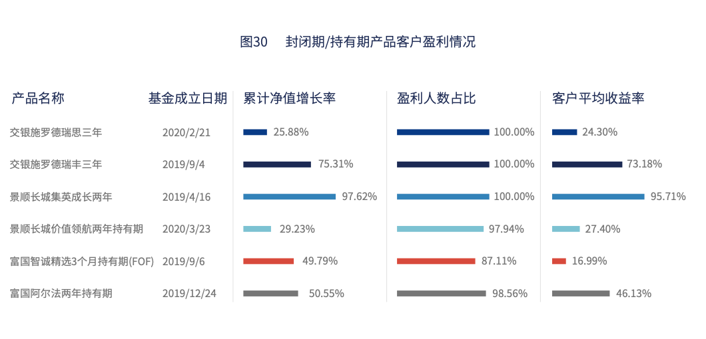

数据来源：定期报告、景顺长城基金、交银施罗德基金、富国基金，仅统计场外份额，统计区间为基金成立以来至 2021 年 3 月 31 日。基金的过往业绩及其净值高低并不预示其未来业绩表现。注：平均收益率指历史全部客户累计收益率的算术平均值。同期业绩比较基准收益率分别为：16.71%、23.99%、13.47%、29.68%、51.55%、13.52%。

对于此类有持有时间要求的产品，产品的期间净值增长率就基本上等于客户的收益率。*持有期的设定，有助于淡化短期市场波动和主动择时带来的影响，尽量避免投资者做出跟风追涨的决策，强制投资者拉长了持有时间，从而以相对高的概率获得合理收益。*

为了更好地展示此类产品与传统非封闭期或持有期产品客户投资收益的差异，我们选取了同一基金经理管理、成立时间相近的两只基金产品，对投资者的收益情况进行了对比。

截至 3 月 31 日，景顺长城集英成长两年期定期开放混合型基金与景顺长城绩优成长基金净值增长率相差无几，分别为 97.62%、95.06%。但是两只基金认购客户的收益情况却相差甚远。数据显示，景顺长城集英成长基金认购客户平均收益率 95.71%，全部实现盈利。而同一位基金经理管理的开放式基金景顺长城绩优成长基金认购客户的平均收益率仅有 15.57%，盈利人数占比仅有 58.58%。

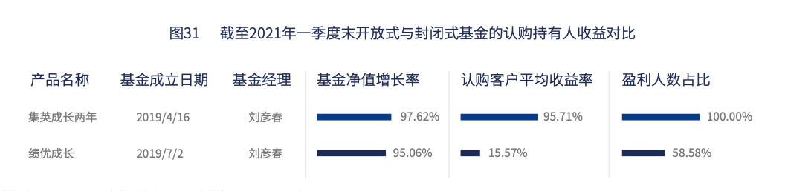

数据来源：Wind、景顺长城基金，统计区间分别为基金成立以来至2021年3月31日。 注1：集英成长两年全称景顺长城集英成长两年定期开放混合型证券投资基金，以定期开放方式运作，即采取在封闭期内封闭运作、封闭期与封闭期之间定期开放的运作方式。绩优成长全称景顺长城绩优成长混合型证券投资基金，投资人可在开放日（即正常交易日）办理基金份额的申购和赎回。注2：基金净值增长率指基金统计区间内的复权单位净值增长率；客户平均收益率数据采用了扣除认购费后的实际收益，计算了统计区间内全部基金持有人累计收益占投入金额的比例;盈利人数占比指统计区间内全部基金持有人中累计收益为正的人数比例。

显然，上述对比中的主要差异就是持有时间的不同。绩优成长基金的投资者有 43.14% 持有时长不足 3 个月。而封闭期的设置则让集英成长基金的认购持有人均至少持有了基金封闭期的时长。

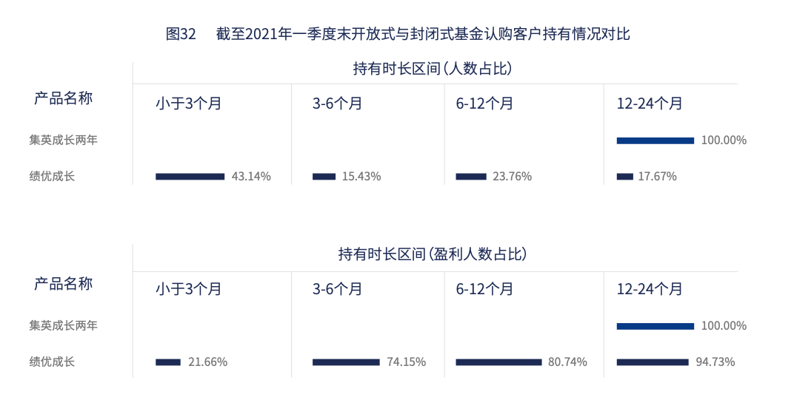

数据来源：景顺长城基金，统计区间分别为基金成立以来至 2021 年 3 月 31 日。景顺长城集英成长两年基金成立于 2019.04.16，景顺长城绩优成长成立于 2019.01.02。注：持有时长区间（人数占比）数据统计不同持有时长区间的认购客户数/持有该基金的认购总人数，此处将一个交易账号视作一人；持有时长区间（盈利人数占比）统计不同持有时长区间内盈利客户占区间认购客户总人数的百分比。

需要说明的是，以上基金业绩对比均在市场行情向好的阶段，不代表所有市场环境。在市场下行阶段，封闭期基金也 可能因客户无法赎回止损而受到客户诟病。

购买设置封闭期的基金，客户其实是牺牲了一定自由赎回的选择权的。如果在封闭期的一段时间内，基金表现不尽如人意，客户需要承受一定心理层面的「无助感」，也有可能产生一定的沉没成本。但是从基金长期收益较好的角度来看，封闭期设置的部分意义正是避免投资者在遭遇市场坎坷「过早止损」出局的操作。

从基金产品角度来说，承担更高的波动率、最大回撤，都未必能给投资者带来更好的投资收益，选择明星基金的盈利人数占比虽然更高，但客户平均收益率相比于基金累计净值增长率仍有巨大差距。而设置封闭期的基金却对投资者的盈利情况带来了显著的改善。

对于投资者而言，这样的一个结论无疑是令人感到无助的。毕竟，我们花费了主要的时间和精力在选择基金上，但是最后却发现，对于自身投资收益高低产生主要作用的竟是我们自己的投资行为。

这样的结果也与我们所熟悉的一些投资理论是不太吻合的。所谓风险与收益成正相关，投资权益类基金，想要获取更好的收益率，确实需要承担更高的波动率和回撤，而且明星基金之所以能成为「明星」，很大程度上正是得益于其过往出色的业绩。

但是为什么基金投资者购买更高波动率和最大回撤的基金，即承担了更高的风险，但是却并不一定意味着更高的收益？购买过往业绩出色的明星基金，虽然收益情况有所改善，但是相对于明星基金瞩目的累计净值增长率仍有巨大差距？

从上述数据来看，基金的高波动率和最大回撤，影响了基金投资者的投资行为，进而影响到了其投资收益。而明星基金虽然有出色的长期历史业绩表现，但是未能避免较高的波动和回撤，这也没有让投资者持有基金更加「轻松」。

至此，我们发现「基金的好收益≠基民的好收益」这个不等式真实存在。回到我们序言中的疑问，基民的好收益应该等于什么?基金产品和基金投资者本身的投资行为，对投资者最终的投资收益分别有多大的影响？下一章，我们尝试推出「基民投基收益等式」。

我们说「投资是一门艺术」，而艺术是没有标准答案的，能够获得理想收益的投资可能并不存在一个范式。但对于基金投资者而言，我们显然想要找到一个更容易胜出的方法，一个更具有指导意义和可操作性的结论。

在前文的分析中，我们提出了「基金的好收益≠基民的好收益」这个不等式，不等式的背后各种各样的投资行为可能对其收益造成了负面影响。套用一句俗语即是，「买基金能赚钱的人都是相似的，而不赚钱的人各有各的原因」。

那么，在投资这场长跑中，什么样的投资者能够最终胜出？到底哪些行为是「加分的」，哪些行为是「扣分的」？我们尝试对这个问题进行回答。

## 一、基民投基收益=基金损益+基民行为损益

通过前述数据分析，我们发现客户投资基金最终所能获得的投资收益，主要受到两方面的影响，一是投资者无法控制的基金经理投资水平等客观因素，另一方面是投资者的主观行为因素。由此，我们推出基民投基收益等式如下:

我们发现，即使投资者已经从众多的基金中，选到好的基金、好的基金经理，这也不能代表基民最终能获得满意的投资收益。*实际上，影响基民是否赚钱的另一个重要因素，是我们这里要讨论的投资者的主观行为因素，即基民的投资行为。*

为了考察客户自身的投资行为对最终投资收益的影响，我们引用了这份报告中景顺长城旗下，成立至少 5 年以上的主动权益类非封闭、非定期开放基金的数据，通过比较过去 5 年的客户年度平均收益率与对应区间的基金净值增长率，观察由于客户的行为，对实际收益带来的影响。

需要进一步说明的是，客户年度平均收益率与基金净值增长率的核心区别在于其算法的假设前提。基金净值增长率是假设客户不进行择时，完整地持有基金长达一个周期，这是目前市面上最通用的基金收益表示方法，其更准确地刻画了基金经理的投资管理水平，也能客观地比较不同基金经理的管理水平，因此该数值不受投资者投资行为影响。而客户年度平均收益率则是从投资者视角去计算投资收益，在某只基金资产中，不考虑客户的资金量，只考察客户在每只基金获取的收益情况。它反映了基金由于开放申购赎回，客户的每笔投入/赎回并不能完整地享受基金区间收益；它不仅反映了基金的投资管理能力，同时也部分体现了客户行为的损益影响，因此我们认为这个指标，相比基金净值增长率而言，与客户真实的投资体验更为接近。

## 二、基民的「操作」给收益带来的损耗率接近-60%

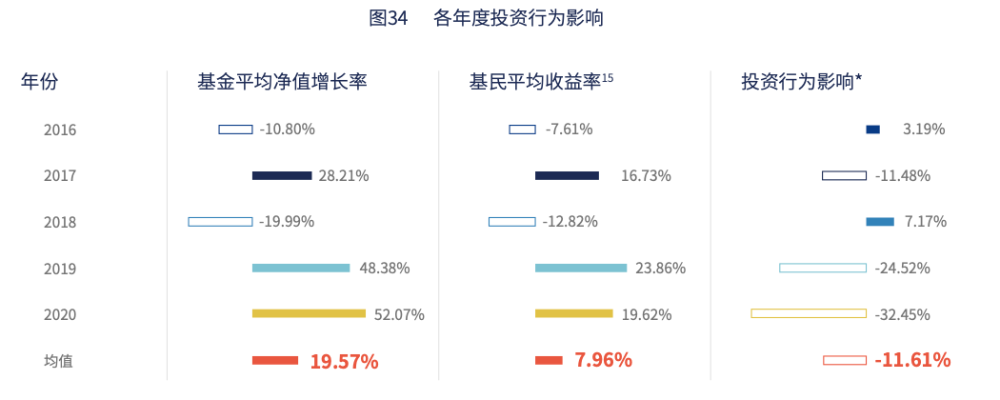

注：投资行为影响=客户年度平均收益率-基金年度净值增长率。

A股的波动性相对较高，这也让基金投资中的择时操作更显艰难。

过去5年，客户由于投资行为将最终的投资收益拉低了 11.61%，且在大部分的年份中都是负影响，相比基金经理过去 5 年为这些基金创造的平均年度净值增长率 19.57%，客户投资行为的损耗率接近 -60%。绝大部分的客户在投资基金中的行为并没有创造更好的收益，反而是拉低了最终的收益水平，印证了那句「一顿操作猛于虎，一看收益负十五」。

需要指出的是，在基金的「丰收年」，基民操作带来的负面影响更加突出。例如，在 2019、2020 这样基金整体取得高收益的年份，基民投资行为的影响分别达到 -24.52%、-32.45%。而在市场单边下跌的 2018 年，基民的投资行为一定程度上规避了市场的下行风险，带来了 7.17% 的正面影响。这与前文中所提及的基民通常过早止盈止损的数据一定程度上相互印证。

*在投资基金的过程中，投资者常常把更多的精力放在如何挑选一只优秀的基金上面，而对于自身投资行为给予的关注度却显然有所欠缺。这组数据带给我们的启示便是，基民需要更加重视自己的投资行为，充分认识到哪些行为能够对投资收益产生正负面影响。*

## 三、警惕这些减分项

从本质上来说，投资行为本身没有对错，但是投资行为的结果却有好坏。客户诸多投资行为在很大程度上，对最终的投资收益产生了负面影响。

从客户的真实数据来看，与平均每月买卖不到 1 次的客户相比，每月买卖 5 次以上的客户，其盈利比例及平均收益率都显著下降，而且，交易次数越多，盈利状况越差。

*首先，频繁买卖显著提高了客户的持基成本。*目前，在主动股票基金的费率结构中，持有时间越短，赎回费率越高。频繁交易意味着更多的申购、赎回费，虽然每次买卖的费用并不起眼，但交易次数越多，投资回报中被侵蚀的金额就越高。相反，成本越低，保留的投资收益就越多，复利效应也明显。客户虽然很难预知市场涨跌，但是可以通过控制自己的持仓交易次数来控制交易成本。

*其次，面对较为剧烈的市场波动，基民倾向于采取择时操作来追求更好的收益。*但是择时容易受到市场情绪影响，面对火热的市场，投资者容易产生害怕踏空的心理，进而诱发跟风追涨等行为。实际上，盲目的跟风追涨与频繁买卖是共生的，频繁买卖对收益的负面影响，都与跟风追涨等行为密切相关。

*第三，过早止盈止损的底层逻辑，在于投资者往往缺乏合理的盈利目标和风险预期。*当投资者缺乏合理的风险收益预期，对盈利产生「落袋为安」的心理时，容易提前兑现浮盈，损失更长时间的投资复利。

同理，投资者面对短期的市场震荡，由于没有目标容易产生恐慌心理，过早止损从而丧失了市场超跌回稳时本可收复的失地。过早止盈止损会打断基民的累计投资时长，从而影响长期收益。投资者真实盈利状况显示，持仓时间越长，投资者平均收益率水平越高；因此，从某种程度看，*守拙是基民穿越牛熊的法宝*。

## 四、牢记这些加分项

那么作为投资者，我们应该如何摆正自己的投资姿势呢？

我们通过前文的数据分析，整理出对客户收益产生正向影响的行为清单，可以看到，基金定投、长期持有、更丰富的投资经验，相比而言都能为客户最终的收益产生更加分的效果。

*定投能够提升盈利水平。*公募基金投资是门槛极低，但专业性和纪律性要求极高的领域。定投客户的平均收益率比非定投客户高 2.94%，这得益于客户通过定投实现了纪律性投资。通过定期、定额地执行投资计划，客观上实现分批进场，避免一次性高位买入的风险。更重要的是，定投可以从行为上「管住」投资者的手，淡化投资者择时的干扰，也能有效拉长投资周期。

*更长的持有时长能更好地提升客户的盈利水平。*如第二章所述，随着基金持有时间的增加，平均收益率和盈利人数占比都有显著的提升。不过，虽然说长期投资已然是老生常谈的理念了，但是在实际投资当中，投资者却面临诸多实际的、个性化的困难，包括市场的波动、产品的回撤等等都会影响到投资者的持有时间。想要真正做到长期投资其实有赖于多方的努力，这一点，我们在第五章将会具体论述。

*更长的投资年限及经验有助于获取更好的投资收益。*具体而言，伴随着投资者投资年限的增长，经历过的市场环境也更多，累积的持基经验更丰富，对市场和产品的认识也更全面。这类型投资者更容易找到适合自身投资理念的基金产品，更能了解基金的投资逻辑并长期持有。同时我们观察到，年长的投资者频繁操作的比例更低，降低了交易费用和跟风追涨等操作损耗对投资复利的侵蚀，在盈利人数占比和平均收益率上都取得了更好的结果。

以上我们所列举的投资行为清单，知易行难。毕竟，许多非理性的投资行为其实反映了我们趋利避害的本能。我们只有正确认识了它们在投资中的角色，才能更好地克服它，最终提高投资成功的概率。

如何提升投资者的盈利体验是基金行业长期思考的话题。通过前面四章对个人客户盈利体验的拆解分析，我们已经很清楚地了解到与盈利体验相关的正负面因素，针对这些影响因素开展工作或能逐步破解「基金赚钱基民不怎么赚钱」的行业难题，而这个过程涉及投资者自身、基金公司、基金销售机构、投顾机构、媒体等基金行业生态的各个环节，需要所有环节上的参与机构的共同努力。

我们尝试针对生态链上的一些环节提出具体的建议，虽然大多是老生常谈，但这些建议经过了实际数据的印证，对改善客户盈利体验是无比重要的，值得一再重复。

## 一、投资者方面

在基民投基收益等式的分析中，我们看到收益损耗的主要影响来自于投资行为，对照正负投资行为清单，避开负面加强正面，相信可以较好地改善盈利体验。以下是几点具体的建议。

权益类基金是风险最高的基金品种，建议用闲钱投资这类品种。

频繁买卖、跟风追涨、过早止盈止损这些负面投资行为本质上均指向投资期限和持基心态问题。事实上，面对巨大的波动无法坚持是人性，普通人极难克服，*只有不影响生活的闲钱，才有长期投资的可能性，才有面对涨跌相对更为从容的心态*。

主动权益类基金追求的是超额收益，有较高的波动和不可避免的回撤。投资者在购买前需要对自己的承受能力有充分的认知，设置合理的风险收益预期，理性对待波动和回撤。

风险收益预期因人而异，一般情况下什么是合理的预期？银河证券数据显示，截至 2021 年一季度末，主动股票方向基金业绩指数过去十五年的年化收益率达到 16.67%，而年度平均最大回撤达到 19.32%。作为参考，年化收益 15% 左右，平均年度回撤 20% 左右是较为合理的设定，这与实际数据中投资者在收益 10% 和亏损 10% 以内就选择赎回显然还是有不小的空间。

投资者常常被提倡要长期投资，而长期到底是多长，可能并没有清晰的概念。在第二章盈利水平与持仓时长正相关的分析中，我们已经了解到，随着持仓时间的提升，收益情况能看到显著的提升。

投资主动权益类基金的目的是追求较高的超额收益，我们鼓励更长期的投资，持有五年以上，不仅在盈利概率还是平均收益率上都有较大提升。而五年，在A股市场上能经历一个完整的牛熊周期，且有较大概率包含较长上升期。投资者若能将五年内不用的闲钱投资主动权益类基金，并坚持持有五年时间，实现好收益的概率还是比较高的。

定投的确是很适合初阶投资者采用的投资方式。A股市场长期有「牛短熊长」的特征，定期定额/不定额投资的机制回避了择时的难题，在熊市时摊低成本，在牛市时自然赚取收益，最终完成「微笑曲线」。

近两年，持有期产品因为帮助客户锁定了持仓时间，盈利情况大多比较好，客户完整地获得了封闭期的全部收益，越来越得到市场认同。对于个人投资者来说，管不住交易的手，持有期产品是比较好的选择。

基金出圈也是大众理财意识觉醒的表现，虽然我们常说「专业的事情交给专业的人来做」，但是这并不意味着基金投资者不需要学习相应的投资知识。如我们在第四章所提出的，投资行为可能是影响基金投资收益的更重要的因素。投资者加强自身的学习，也显得更为必要了。

在社交媒体发达的当下，投资者有众多渠道获取理财相关的知识和信息，但社交媒体上良莠不齐的投资信息，考验投资者的自我判断和信息处理能力。*建议投资者认准专业机构，从专业机构的陪伴中学习知识，逐渐形成自己的判断，为自己选择产品、制定投资计划、调整投资结构做出合理决策，建立更加理性的投资行为体系。*

## 二、基金公司和基金销售机构方面

权益类基金具有明显的波动性，投资者进入市场往往是被收益吸引来的，初期或许并不完全能理解风险，因此基金公司和基金销售机构在买入环节如果让投资者能够对权益类基金的特征有更加充分的了解，将有利于投资者在投资过程中做出合适的选择。

我们对于权益类基金风险和收益特征的描述需要更加简单、清晰和标准化，建议比照基金业绩宣传的规范标准，同步建立对基金风险进行描述的规范体系，从而让专业知识相对欠缺的投资者更容易理解，直观的建立对风险的认知。

相比行业发展初期，基金公司和基金销售机构在了解客户、帮助客户购买合适的产品上已经做了很多实际的工作、取得了很大的进步。但随着行业规模的快速积累、客户数的急剧膨胀、大量新客群的涌入，客户培育工作仍然任重道远，这里面一项核心的工作就是帮助投资者更好地认识自己，厘清投资目标和风险承受能力，从而购买相匹配的产品，在合理的预期下坚持投资之路。

不管来自哪个渠道，现在绝大多数的交易是通过线上方式完成的，互联网技术在给交易提供便利的同时，也容易导致环节的快速跳跃和对重要信息的忽略。如何避免销售适当性的制度和流程流于形式，这不仅是个技术问题，更是责任问题。

虽然我们希望从投资者自身的角度来优化投资行为的决策，但是在特定的市场环境和行业发展阶段，从产品的角度增 加协助投资者理性投资的机制，无疑是一个可行的选择。

数据证明持有期产品锁定基金份额，避免投资者频繁交易和不恰当择时，能够帮助持有人获取更好的长期收益。基金公司和基金销售机构可以合作，适当提升此类产品的比重，通过产品机制对持有期的限制来改善投资者的盈利体验。

要建立投资者对基金行业长期持续的信任，从而坚持理性的投资行为，归根结底需要行业能够为客户创造长期持续的回报。整个基金行业，从投资管理到产品销售的各个环节，都要塑造关注长期业绩的文化，而不只是把长期投资的责任放在投后的客户陪伴阶段。

对于基金公司来说，要通过投研文化的倡导和绩效考核机制的合理制定，来培育「宁取细水长流，不要惊涛裂岸」的价值导向；对于基金销售机构来说，在基金产品的研究和入池上，也要坚守长期标准，避免短期利益导向，注重客户的长期持续利益。

长期投资的道理知易行难，核心是因为在通往长期的过程中投资者面临着很多的挑战和考验，在复杂多变的市场环境下，单靠投资者自身的知识储备和心理建设，很难完成这个艰难而正确的事情。一方面投资者可以参与基金投资顾问业务，以付费的方式获得规范化的全流程服务，另一方面，基金公司和销售机构也可以建立更加专业化人性化的陪伴服务系统，帮助投资者以知行合一的方式践行长期投资的理念。

无论是基金投资顾问业务还是基金陪伴服务，对于基金行业来说都还处在起步摸索阶段，但只要方向是正确的，符合行业发展的长远利益，就能在实践中找到最优的发展路径。

本报告开创性地汇集了三家权益大厂 4682 万客户的 5.65 亿笔交易数据，多重维度对「基金赚钱基民不怎么赚钱」的原因进行拆解分析。我们尝试把艺术性的、难以把握的投资难题转化为更具象的问题来解答，推出具有一定实操性的「基民投基收益等式」：*基民投基收益=基金损益+基民行为损益*。

我们得出的结论是，客户投资基金最终所能获得的投资收益，主要受到两方面的影响，一是投资者无法控制的市场波动、基金经理投资水平等客观因素，另一方面是投资者的主观行为因素。前者是投资者习惯给予关注的要素，而后者是容易被忽略的问题，而投资行为是收益损耗的主要决定因素。

透过基民投基收益等式，解决「基金赚钱基民不怎么赚钱」难题的路径就清晰地拆分出两大方向。一方面，是基金产品、投资层面的努力；另一方面，也是我们需要加大关注的，帮助投资者树立正确的投资理念，引导理性的投资行为。

中国公募基金行业已发展至第 24 个年头，作为从业者，我们仰望星空也需要脚踏实地，我们回望过去是为了更好的未来。受人所托，代客理财，如何改善投资者的盈利体验，真正帮助投资者赚到钱，是资管行业始终需要研究和面对的课题。站在资管行业回归本源的高度，面对居民日益增长的资产配置需求，公募基金作为专业投资者需要不断提升投资能力，竭尽 所能为投资者赚取长期稳健回报。我们也相信，在各方的努力之下，公募基金投资者的盈利体验能逐步得到提升，公募基金 行业能够朝着正确的方向前进，迈上基业长青的征程。

> 图文来源：景顺长城基金、富国基金、交银施罗德、中国证券报联合出品《公募权益类基金投资者盈利洞察报告》作者：景顺长城基金、富国基金、交银施罗德本文章所载内容仅供参考，不构成投资建议。市场有风险，投资需谨慎，投资者应保持独立思考。详见[《文章免责声明》](https://youzhiyouxing.cn/agreements/ARTICLE_DISCLAIMER)。如转载使用，请参考[《文章转载规范》](https://youzhiyouxing.cn/agreements/ARTICLE_REPRINTED)。
