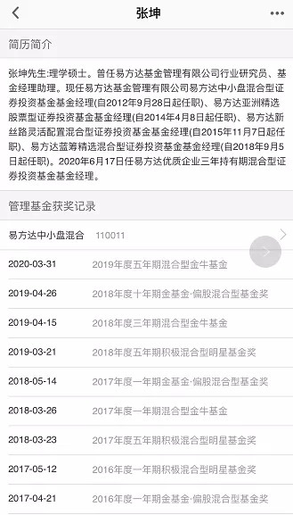
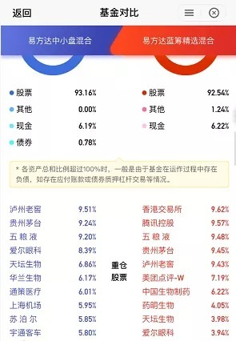
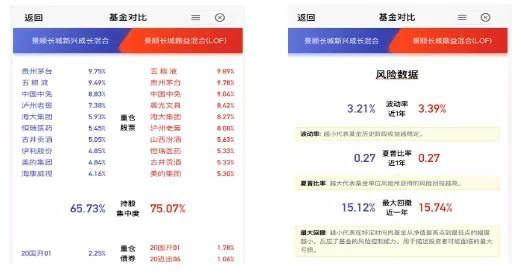
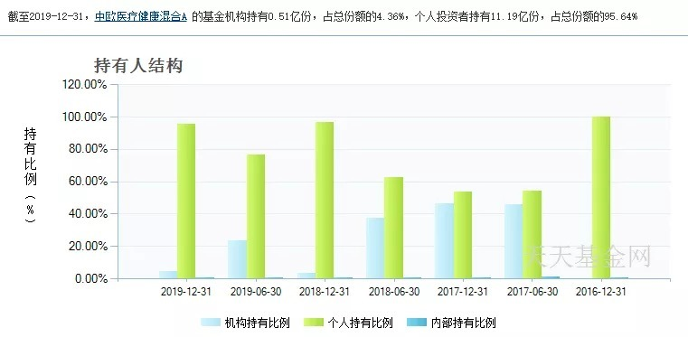
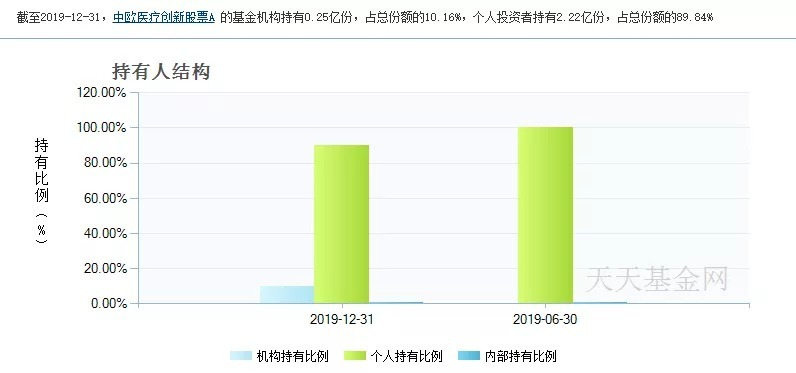
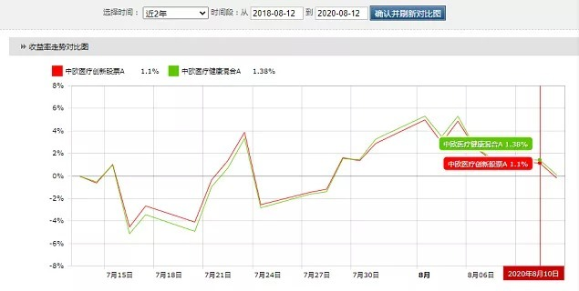

# 同一个基金经理，不同的基金，到底选哪个好？

认同一位基金经理的理念，但他管理了好几只基金，究竟该选哪个？

这是很多新基民都会遇到的难题。是选规模最大的，还是最有名的？是选老基金，还是他马上要发的新基金？

今天推荐的这篇文章，为我们提供了一些比较的维度，帮我们更好地理解这些基金的区别。下次挑选基金产品的时候，不妨翻出这篇文章看看，把这几个问题过一遍，自然就能心中有数。

祝开卷有知。

很多明星经理都管理着不止一只基金，比如谢治宇现管理基金 3 只；董承非现管理基金 2 只、葛兰现管理基金 4 只、张坤现管理基金 5 只等等。

基金经理一旦做出点业绩，成名了，就会被委以重任管理多只基金，甚至趁着行情好的时候赶紧发行一批新基金。

特别是今年，*新基金层出不穷，基金相关话题竟然多次上了热搜榜。*

关注基金的小白越来越多了，一方面，银行理财的利率越来越低，另一方面也说明全民都开始有了理财的意识。

我们之前说过：*选主动基金，实质是在选基金经理，那选好了基金经理，他们旗下同时管理着那么多只基金，应该选哪个好呢？*

懒猫会员群里有会员之前在同一个基金经理下面买了好多只，发现在同一时间买入的话，业绩回报相差不大。

其实细心的小伙伴有发现，同一基金经理管理的基金换汤不换药，区别不是太大。那每个基金经理都有一只「王牌基」，是不是选他们的代表作就可以了？

在天天基金上通过搜索基金经理，在个人资料页面，成立时间较长，得奖最多的那只就是他的代表作。

「王牌基」不一定永远是业绩最好的 TOP1，但是一定是基金经理和基金公司捧在手心里的那只基。

对基金经理来说，必须要有一只基金成为他的代表或者成名作；对于基金公司来说，*旗舰基金也是公司的「活招牌」，在人力物力上基金公司都会给予大力的支持。*

即使基金经理离职了，公司也会找一个优秀的基金经理来接手，所以选王牌基一般出错的概率比较小。

但是我们也不能单单看这个，我们需要从不同的维度再去好好比较下。

要知道，旗舰基金销量好，就会形成良性循环，越来越多的投资者去买，造成基金的规模越来越大，一只超过百亿的基金对于基金经理来说不是很好管理呢！

基金规模大小也是我们 PK 基金的一个维度，基金规模大小有利既有弊。

规模小的基金就是灵活，牛市的时候建仓快，熊市的时候跑的更快。

但是，规模太小的话，也会存在*清算的风险，*对于投资者来说，*基金一旦清算，*那就会从*浮亏变成实亏。*

*所以规模小于 5000 万的基金，最好不要碰。*

超过百亿的盘子算大规模的基金了。

根据基金行业的规定，一只基金持有一家上市公司市值不得超过基金资产净值的 10%；此外，基金持有这只股票的仓位不能超过这家公司股份的 10%。

所以*规模太大的话，就要把每只股票的仓位降低，同时也会多配更多的股票。*

对基金经理来说，选 10 只简单还是选 20 只简单？基金经理没有那么多精力去调研那么多家公司，而且市场上好公司本来就不多。

其次，基金规模太大，对于基金公司来说，规模越大管理费越多，但是对于基金经理来说，*遇到大幅震荡或者熊市需要及时调仓的时候，可能没有规模小的基金操作得快。*

如果两只基金的投资方向、持仓都差不多的话，选规模在 2 亿～50 亿左右的。

这个可能是很多人比较基金的时候，优先关注的点。

首先我们通过基金的前十大重仓股票中能够知道该只*基金的投资方向，*比如张坤的易方达中小盘和蓝筹精选。

这两只都有重仓白酒股，但是蓝筹精选这只还买了优质的港股，投资范围更广，跟中小盘的定位有一些不同，大家依据自己的偏好来选。

其次通过基金的持仓，就能看出基金经理的*持股集中度，*比如刘彦春管理的景顺新兴成长混合和鼎益混合。

这两只都是重仓白酒股，但是鼎益那只一半以上的仓位都是白酒，持股集中度达到了 75.07%。

所以从风险上来看，鼎益的波动率以及回撤幅度都要比另一只大。

通过基金的重仓股票，我们能够有个初步的判断，这只基金的投资风格以及投资的范围。

*重仓股票不同或者比例不同，肯定也会造成基金的业绩也不同。*

仓位集中的股票起伏都比较大，谨慎选择规模大，仓位集中的基金，这类基金的风险会比较大。

仓位分散的基金可能在市场震荡或者下跌的时候也分散了风险，业绩更具稳定性。

如何选择的话，这个需要根据每个人的风险喜好程度来选择。

*风险承受能力强的，可以选择风险高但是收益也高的基金，稳健投资者，建议配置仓位分散的基金。*

在基金资料页面我们可以看到持有人结构比例，一般有个人和机构两大类，机构持有者指的是企业、社会团体、事业法人等组织，个人的话就是散户。

*受机构青睐的产品说明是比较优质的，因为他们投资的不是自己的钱，而是关系到整个机构和整个团队的，投资前都会比较谨慎，会对基金公司以及基金经理做好充分的调研。*

下面的两只基金都有机构参与，分别是中欧医疗健康混合A，中欧医疗创新股票A，名字很相似，仓位分布也很接近。

健康这只机构持有比例是 4.36%，创新的机构持有比例是 10.16%，比较了两只历史业绩走势，不管是 1 年还是 2 年，*机构持有人多的那只略胜一筹，在回撤上，也更优于另一只。*

在比较持有人结构上，我建议选择机构资金占比多的。

因为遇到股灾的时候，相对机构来说，个人投资者可能更容易受情绪影响，会出现频繁申赎的情况，资金频繁的进出会影响到基金的净值波动。

但是也要*注意机构占比资金不能超过一定比例，最好是不超过 90%。*

*机构如果觉得这只业绩表现不好，投资方向也会调整，如果占比太大，资金一下子出来，很有可能造成基金被清算。*

今年发行的新基金各个都是爆款，经过基金公司的包装、打造，新基金上市第一天就被一抢而光，很多基金只好按比例配售。

新基金如此好卖，主要还是搭上了市场的这波行情，以及有明星基金经理站台。懒猫之前就深扒过，为什么 [不推荐买新基金，大家可以点开再看看](https://mp.weixin.qq.com/s/D1WJKcts08MSzASQqUKH_Q)。

我们并不建议买新基金，主要原因有三点：

## 1. 建仓可能建在高点

新基金如在牛市的时候发行，发行之后，还有一段的建仓期，有些久的甚至长达半年，所以有很大的可能会买在高点。

6、7 月买新基金的基民们，经过这个月的市场行情的距离震荡，加上手续费的扣除，可能还在亏损中。

## 2. 换汤不换药

之前有提到，基金经理的代表基金销量好的话，基金规模会越来越大，规模太大的话，运作起来不是那么容易，所以只能发行新的基金。

但是我们发现很多新发的基金和老基金非常相似，像是直接被克隆出来的。那为啥我们不买一只知根知底的老基金，而去买一只没有太多背景的新基金呢？

## 3. 手续费不打折

很多新发的基金，手续费比较贵，很多都不打折。

从古到今，师傅带徒弟的习俗一直延续着，基金公司也不例外。

一个有经验的基金经理都会管理多只基金，有些基金是独自管理的，有些多人一起管理的，这就是所谓的老带新。

基金公司要培养新人，是很正常的，每个明星经理也都是从新人过来的。只是多人管理的话，以哪个人投资理念为主，我们并不知道。

而且明星基金经理的精力毕竟有限，他们会把更多的精力放在独自管理的基金上。

封闭式基金一般有一个封闭期，6 个月～3 年不等。

*买入后不能赎回，只能等到封闭期结束后再赎回，所以在流动性上不如开放式基金。*

封闭基金在场外不能进行申赎，但是在场内可以买卖。

如果你买了一只封闭基金，但是突然急需用钱，想要把它卖掉，那可以选择在场内操作，如果想尽快卖掉，可能需要打折卖。

行情不好的时候，封闭式基金折价率可能达到 20%，甚至更高。

*一般封闭式基金在到期后，会转为开放式基金。*

所以场内如果有折价率高的封闭式基金，可以考虑买入，等到到期转为开放式基金的时候，可以选择卖出。

但是*折价的封闭式基金未必是稳赚的，还需要结合当前的市场行情以及它的到期日。*

因为到期日越久远，市场就越难判断，即使现在折价买入，但是在开放的时候，熊市来了，也有可能会发生亏损。

1. 选王牌基金；
1. 选择规模在 2 亿～50 亿左右的基金；
1. 风险承受能力强的，可以选择风险高但是收益也高的基金，稳健投资者，建议配置仓位分散的基金；
1. 选机构持有量多的基金，但是要注意持有比例，不能太高，不超过 90%;
1. 选老基金；
1. 选独自管理的基金；
1. 选开放时间较近的折价率高的封闭基金。

选王牌基金；

选择规模在 2 亿～50 亿左右的基金；

风险承受能力强的，可以选择风险高但是收益也高的基金，稳健投资者，建议配置仓位分散的基金；

选机构持有量多的基金，但是要注意持有比例，不能太高，不超过 90%;

选老基金；

选独自管理的基金；

选开放时间较近的折价率高的封闭基金。

对比同一个基金管理的不同基金，我们还是要从不同的维度来进行比较，不能单单从一个维度，需要结合*基金的过往业绩以及回撤大小、基金规模以及你投资中的其它组合*等方面来考量。

> 来源：公众号「懒猫的丰收日」转载文章发表的所有信息仅代表作者个人观点，不对您构成任何投资建议，详见[《文章免责声明》](https://youzhiyouxing.cn/agreements/ARTICLE_DISCLAIMER)。
