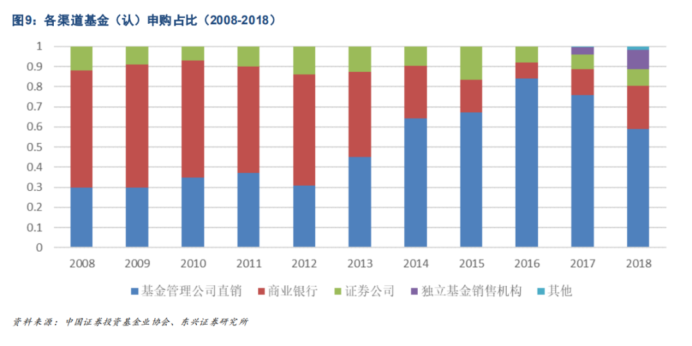
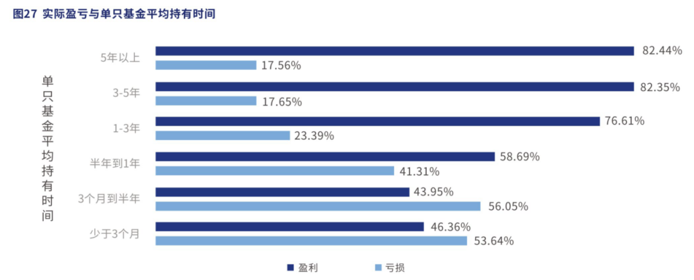
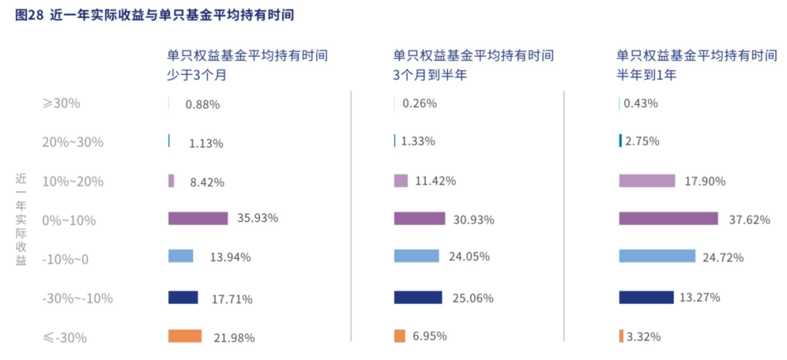
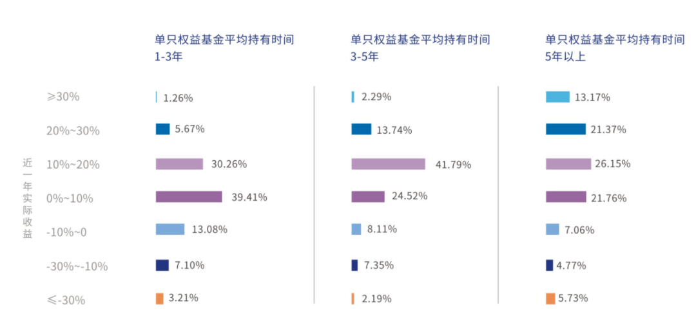
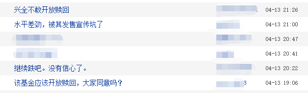
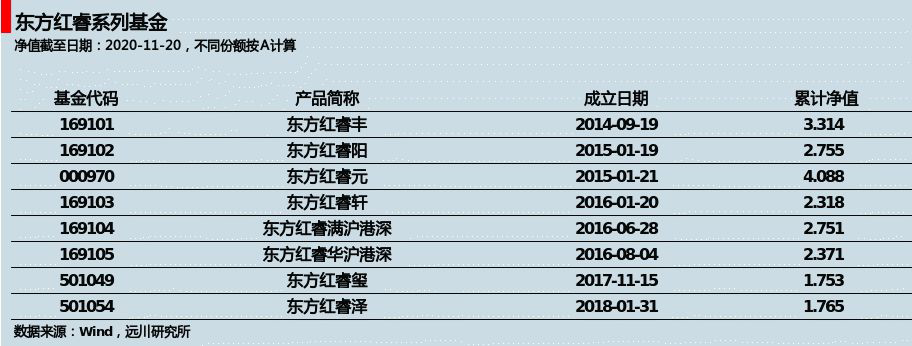
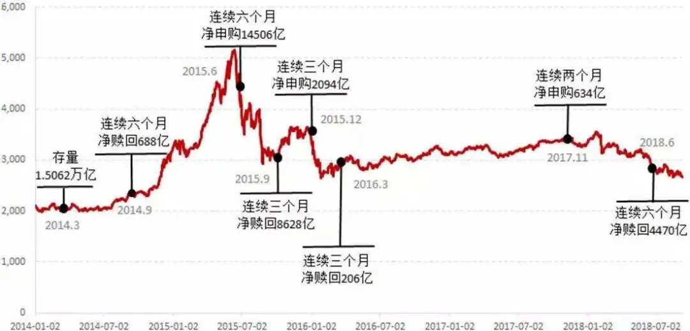

# 基金锁三年，就是价值投资了？

假如现在业绩和管理能力都非常优秀的团队，推出了一支封闭期三年的基金，我们该不该买？

尽管封闭期有可能让我们完整地享受到长周期带来的收益，但市场不可控的因素很多，谁也无法保证封闭期结束时的收益情况。

在做决策之前，不妨跟着本文作者一起探寻近两年封闭式基金重回大众视野的宏观原因，再听她从个人投资者的角度出发，结合具体案例解析它背后的获利逻辑。相信读完这篇文章，你会对如何回答开头的问题有更清晰的思路。

祝开卷有知。

如果稍稍观察得细致一些，就会发现，在今年（注：原文发表于 2020 年 11 月 23 日）这个发行火爆的基金市场上，自带封闭期的新基金显得格外多，尤其是对于头部基金公司和明星基金经理来说，短则一年长则三年的锁定期，似乎成为了一个默认选项。

而在这些长封闭期的基金中，不乏创造了一日结募盛况的爆款基金。从东方红恒阳五年期到睿远均衡价值三年期，从鹏华的王宗合再到易方达的张坤和萧楠，头部基金公司和明星基金经理的号召力并没有因为投资期限的变长而减弱。

基金为什么越来越喜欢把钱锁住了？

2019 年年中，仍在洪磊治下的中国基金业协会在半年度工作计划中，非常直接地点出了「基金赚钱，投资者亏钱」的怪圈。

作为公募基金行业二十年的老兵，洪磊一直是一个目光前瞻的远见者。他曾是世纪之交基金黑幕中的揭幕者之一，也曾在监管者的位置上为基金行业正本清源。基金投资的短视风气带来的信任危机，也一直是洪磊关注的行业核心问题之一。

就在今年，一场声势浩大的变化似乎悄然发生。拉长持有期，看起来正是基金公司和销售渠道对这个短视问题的正面回应。

不过，锁定期真的能帮到投资者吗？

截至 9 月 30 日，今年前三季度新发公募基金已达 2.34 万亿元，首募规模不断刷新历年来的新高。其中，今年以来已有至少 15 只新成立的偏股混合型基金设置了三年或以上封闭期，数量更是直接超过了历年总和。

权益市场风起云涌，背后自然也少不了销售渠道的助推，尤其是银行渠道在权益基金上的发力。

从半年报披露的数字来看，招商银行在 2020 年上半年实现非货币公募基金代销收入 2567.09 亿元，同比增长 207.03%；宁波银行在半年的时间里，将基金保有量从年初的 106 亿提升至 328 亿；交通银行半年报显示，上半年非货基金销量同比增长 207.08%；中信银行和邮储银行，上半年非货基金销量同比增长更是分别达到了 445.68% 和 742.98%。

不过，喜人的数字只是表象。在大力卖基金的背后，折射出的是低利率、净值化的时代下，银行在产品端的「焦虑」。

随着利率走低，传统的理财产品收益已不再诱人。[刚兑退潮](https://youzhiyouxing.cn/n/materials/129) 之下，非标信托也不复往日光辉。银行过往的主打产品如今逐渐式微。在居民资产配置大搬家的时代下，显而易见，公募基金成为了更具竞争力的金融产品。

只不过，这些年，银行的公募基金代销业务也随着独立销售牌照的发放，受到了来自天天基金、蚂蚁金服等互联网平台的巨大冲击。

银行渠道何以解忧？如何把居民财富管理的钱继续留在自己这里？

联手稀缺的头部基金公司、王牌基金经理，推出长锁定期的产品，在日益重要的权益市场竞争中为自身锁住客户，就是选择之一。毕竟银行卖起锁定期的产品也是毫不手软。

君不见，5 只蚂蚁打新基金，联合了 5 位明星基金经理，在铺天盖地的宣传攻势下，也未能形成此前市场预期「一日售罄」的超级爆款。倒是几个月之前，未在蚂蚁上销售的「睿远均衡价值三年持有」在发售当天引来超过千亿资金的认购，创下 4.9% 的配售比例。

对于锁定期，基金公司当然也乐见其成，毕竟基金封闭能够给公司提供稳定的管理费收入，也让基金经理能在做投资的时候能够不受到日常申赎带来的流动性影响。

那么，对于投资者来说，封闭期基金，又到底意味着什么呢？

今年年初，行业首份《权益类基金个人投资者调研白皮书》发布，得到最多讨论的，就是一项关于基金投资实际盈亏与单只基金平均持有时间的统计。这份涉及了 3 万多个人投资者的调研报告显示，随着持有时间的拉长，出现大幅亏损的人数锐减，获得高收益的概率上升。

但统计数字总是非常抽象，投资者面临的具体现实又是如何？

同样也是今年年初，300 亿规模、两年持有期的超大基金——兴全合宜迎来了自己的首个开放日。虽然基金募集过百亿在 2020 年已经不是新鲜事，但两年前，百亿基金却还是行业里饱受争议的话题。

在明星基金经理、优秀长期业绩、基金公司品牌效应和到位的渠道预热多重因素下，2018 年 1 月中旬，谢治宇的这只成立在高点的基金，一共吸收了近 35 万持有人的 300 亿资金。只是，随后市场就在去杠杆和中美摩擦之下单边大幅杀跌，兴全合宜也难以幸免。

大基金如何管理？封闭期究竟为了谁好？谢治宇会不会离开？成为当时各大基金媒体的头条选题。

三个月后，兴全合宜场内份额在交易所上市交易，重仓的中兴通讯此前刚刚遭遇美国制裁。转为 LOF（上市型开放式基金）的合宜，在上市首日盘中一度触及跌停，铺天盖地的指责直指谢治宇和兴全基金。气急败坏的投资者在公屏上打出「基金应该开放赎回」。

今年 1 月，合宜的两年封闭期到期，从 2018 年 1 月 23 日到 2020 年 1 月 23 日，兴全合宜累计盈利 16.17%，同类排名前 1/5。这看上去也许并不是一个很惊艳的数字，同期净值表现更好的基金确实也不在少数。

但对于持有人来说，更重要的一点是通过封闭期的设置，完整地收获了这笔收益。尤其对于当年那些没法割肉赎在低点的投资者来说，现实最终兑现给他们的，反而是盈利。遑论那些在场内折价买入兴全合宜的人更是享受到了丰厚的溢价。

经济周期、企业盈利往往面临很多不可控的因素，投资固然需要实力支撑，有的时候也需要一点点天时地利人和的运气。不过，就算运气并不总是叩响市场的大门，时间却总会站在价值的这一边。

兴全合宜就是一个现成的案例。

其实，如果把目光放到在一级市场，就会发现，长周期能够给股权基金带来更好的回报，已经是一件被验证的事情。一个侧面的案例就是美元基金与人民币基金的募资分野。美元基金受宠的背后，是美元 LP（出资人）通常能够忍受更长的退出周期，而不急于在政策刺激或 Pre-IPO 中套取短期的投机收益，最终能够实现更好的投资回报。

那么，线性外推到二级市场呢？

不论从全球的历史发展还是国内的实践路径来看，封闭式基金都可以称得上是基金行业的发端。1998 年，首批公募基金公司国泰和南方，分别发行了基金金泰和基金开元这两只封闭式基金。然而，在后来漫长的熊市和基金黑幕的混乱中，封闭式基金走向衰落。

2002 年最后一支老封闭式基金——基金银丰成立，几乎宣告了封闭式基金的末路，此后市场再未出现同类产品，取而代之的则是以开放式基金为主流的市场。

基金黑幕被揭开后，整个基金行业走上正本清源的道路，在后面的十多年间，价值投资逐渐在中国落地、生根、开花、结果，其中的代表之一就是涌现了陈光明、林鹏等一代价值投资者的东方红。也正是东方红，开启了封闭期基金和长期主义的新尝试。

2014 年 9 月，东方红睿丰横空出世，开创了三年封闭转 LOF 的创新型封闭式权益基金。此后，凭借着良好的主动管理能力和客户认知度，东方红打出一系列「睿」字辈的封闭式基金，长期主义和价值投资也成为伴随着东方红的最鲜明标签。

2017 年 9 月 19 日东方红睿丰运作满三年，正式打开。这三年间，沪深300上涨 58.01%，股市从 2014、2015 年的走向疯狂，到 2015、2016 年的一地鸡毛，到 2017 年迎来价值回归，大起大落，令无数投资者胆战心惊。而对于东方红睿丰的持有人来说，在什么都不能做也不用做的情况下，最终收获了同期高达 164.78%，年化超过 28% 的回报。

在业绩、口碑和良好体验的驱动下，东方红睿丰在打开申购当天获得了大量投资者的追捧，尽管有单户不得超过 10 万的限制，仍然获得了百亿资金的涌入。

而这也很难不归功于三年封闭期的设计，抚平了这三年所有的惊险一跃与情绪摇摆，基金的所有收益最终全部落入持有人囊中。

至此，东方红和它旗下的睿系列，也被市场看作封闭式基金再度被接受的标志。此后，封闭式基金逐渐回归，直到今年迎来爆发。

几天前，东方红睿玺三年定开也迎来自己的开放日，再一次展示了封闭期的制度优势。2017 年至今的这三年里，市场风云诡谲，又一次走得跌宕起伏，重配了汽车股的睿玺，一度在 2018 年的风暴中回撤超过 20%。试想如果这是一只开放基金，有多少人会在下跌途中割肉离场？更别说等到汽车如今终于周期回归的这一天。

事实上，权益市场充满各种复杂因素，均值回归虽是资本市场的万有引力，但错误的定价也需要时间来修复。借用彼得·林奇接班人乔尔·蒂林哈斯特的一句话，「价格和价值两者相等的那一刻是未知的，耐心等待是所有成熟投资者必备的素质」。

所以，投入权益市场里的钱，其实并不是因为有锁定期才变长，而是本来就应该用长钱来投资。锁定期，只是通过制度设计，帮助人们在一个不可能三全其美的选择题中做出最理性的判断。

投资中有一个不可能的三角——高收益、低风险、高流动性，三者永远不可兼得。问题是，放弃谁才是更理性的选择？

其实，这并不是一道很难的选择题。对于很多人来说，至少已经在地产周期里至少做对过一次了。

过去三年，上证指数每年是跌是涨，这个问题很好回答。

过去三年，上海房价有没有哪年是跌的？恐怕很少有人能答上来。

在大家的认知里，地产永远是涨的，不像股市总是在涨涨跌跌里收割了自己的首付款。房产自带居住属性，又有繁琐的交易流程和税费，价格波动也不会实时显示在行情软件上。这一切，既提高了频繁交易的成本，也钝化了人们对房价波动的敏感。不交易的买房人，最终完整地吃到了地产周期的红利。

而每天交易的投资人呢？上交所此前发布的《上海证券交易所统计年鉴（2019 卷）》显示，散户用 20% 的资金量贡献了 80% 的交易额，但这并没有带来更好的收益，因为平均下来，付出 5 倍交易量的个人投资者只赚了不到机构投资者的 30%。

可以想见，若不是因为封闭期所限，当东方红睿丰遭遇 2015 年股灾，或者当兴全合宜遭遇 2018 年杀跌时，会有多少人又再次做出错误的交易。

全市场基金赎回数据；数据来源：好买基金研究中心；数据区间：2014.1.1～2018.7.31

所以，封闭期最终回应的问题，其实并不是更高的同类排名、最高的同期回报，而是更好的到手收益。至少对于基金投资来说，在不可能的三角里，理性的选择，往往是舍弃对高流动性的执念

持有期，也许是一场管理人和基金公司的「共谋」，但如果我们理解了权益投资的本质，那么对于投资者来说，用更长的周期去坚守价值的兑现，未尝不是一件共赢的事情。

从这一层意义出发，基金设置一定时间的封闭期，正是对当前这个市场上「基金赚钱、基民不赚钱」问题最直接的一种回应。

而今年这场封闭期基金的盛宴，或许也仅仅只是一个开始。

毕竟，世界上本没有锁定期，锁的钱多了，相信股市长期能带来良好收益的人也就多了。

> 风险提示：市场有风险，投资需谨慎。文中观点不对市场走势构成任何保证，历史业绩不保证未来表现。提及行业不构成任何推介，境外市场及个股情况仅供参考。

风险提示：市场有风险，投资需谨慎。文中观点不对市场走势构成任何保证，历史业绩不保证未来表现。提及行业不构成任何推介，境外市场及个股情况仅供参考。

> 来源：公众号「远川投资评论」转载文章发表的所有信息仅代表作者个人观点，不对您构成任何投资建议，详见[《文章免责声明》](https://youzhiyouxing.cn/agreements/ARTICLE_DISCLAIMER)。
