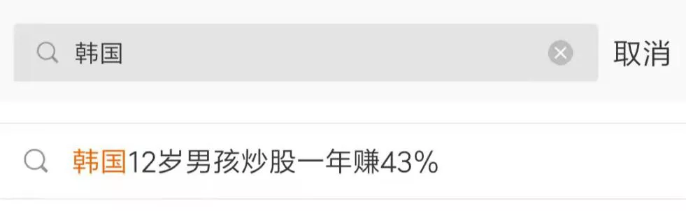
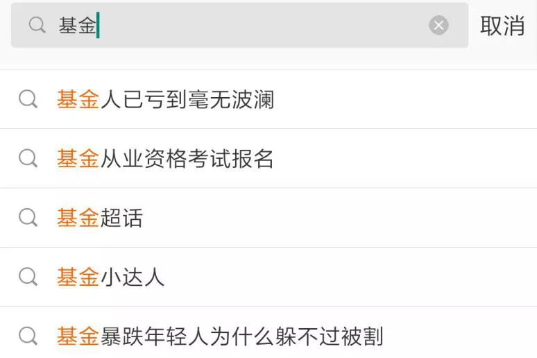
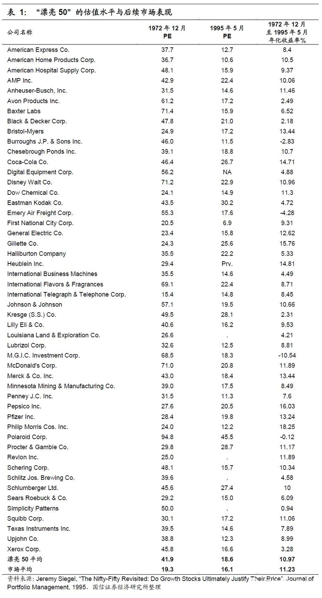
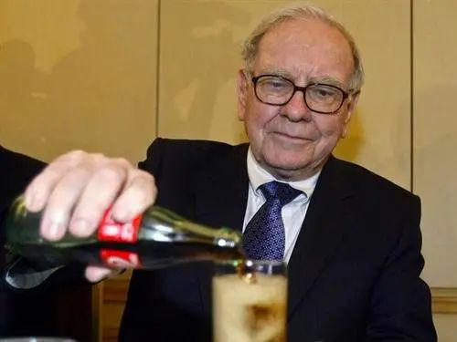
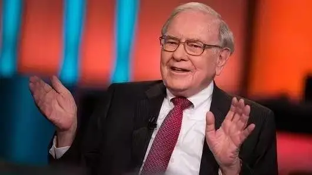
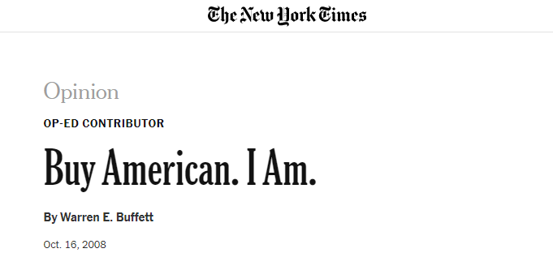

# 巴菲特如何应对回撤？

> 本文转自微信公众号聪明投资者（ID：Capital-nature）

进入牛年以来，市场连连调整，前后对比下来异常惨烈。

年前，我们在各大平台看见的是这样的热门搜索话题：

年后，在微博搜索基金是这样的：

实际上，股市大幅回调从不少见，即便是巴菲特执掌的伯克希尔，历史上也经历过几次大规模的净值回撤。

*第一次：20 世纪 70 年代开始，*美国股市出现了整体性的大幅下跌，伯克希尔·哈撒韦股价从 1973 年的*每股 90 多美元跌到 1975 年 10 月的每股 40 美元左右，跌幅达到 56%。*

*第二次：1987 年*发生全球性股灾，伯克希尔·哈撒韦股价*从每股4000美元迅速跌到每股3000美元，跌幅达到25%。*

*第三次：1990 年*海湾战争爆发，伯克希尔·哈撒韦股价*从每股 8900 美元跌到每股 5500 美元，跌幅达到 38.2%。*

*第四次：20 世纪 90 年代末，*美国出现了科网股泡沫，由于市场热捧新经济概念股票，那些非新经济概念的公司股票遭到市场抛弃，伯克希尔·哈撒韦股价从*每股 80000 多美元跌至每股 40000 美元左右，跌幅达到 50% 以上。*

*第五次：2008 年美国爆发金融危机，伯克希尔·哈撒韦股价从 2007 年 12 月每股 99800 美元跌到 2009 年 7 月 15 日的每股 44820 美元，跌幅达到 56%。*

但，这些都没有影响到伯克希尔后续的辉煌。

在2020年的股东会上，巴菲特说，「*我在历史上经历过三次、伯克希尔股票的价格下跌了 50%、三次。如果你是借钱买的股票，那你就会被清零了。*

这三次下跌发生的时候，伯克希尔本身并没有任何问题。

但如果你看了股票的价格，你会认为你必须采取行动了，因为它总会有这样或那样的原因。」

巴菲特劝投资者，*不用尝试抄底，没人能帮你选股票，要做好可能跌 50% 甚至更多的准备，能够适应这种情况、坦然自若，才适合入市。*

在他看来，有些人并不是很在意或者敏感，但有些人比其他人更容易感到恐惧。

如果你不能从心理上处理好它，那么你真的不应该持有股票，因为你会在错误的时间买卖。

伯克希尔历史上大幅回撤的这几次，巴菲特是如何应对的？

重新回顾巴菲特当年在市场极端情况下说出来的那些经典之语，以及他当初的实际操作，对于正在经历一场回调的我们，或许会有一些安慰和启发。

## 1973~1975 年跌幅 56%：「投资的时候到了」

20 世纪 70 年代开始，美国股市出现了整体性的大幅下跌，伯克希尔·哈撒韦股价从 1973 年的每股 90 多美元跌到 1975 年 10 月的每股 40 美元左右，跌幅达到 56%。

在那之前，也就是 1972 年，美国股市刚刚经历了一个大牛市，股价大幅上涨，市场全部在追捧「漂亮50股」，如施乐、柯达、宝丽来、雅芳和得克萨斯仪器等等。

投资者普遍认为这些股票是「安全的」，而且是在任何价位都是安全的。

由于大家疯狂追捧买入，1972 年这 50 只股票的平均市盈率上涨到天文数字般的 80 倍。

*当时的巴菲特，认为伯克希尔公司无法买到股价合理的股票，为此非常苦恼：「我觉得我就像一个过度好色的小伙子来到了一个荒凉的岛上。」*

到了 1973 年，「漂亮50股」的股价大幅下跌，道琼斯指数也不断回落，市场摇摇欲坠。那些 1969 年上市的公司眼睁睁地看着自己的股票市值跌了一半。

等到 1974 年，美国股市已经处于很低的价位，几乎每个公司的市盈率都是个位数，这是华尔街少有的时期：美国企业正在被抛弃，没有人想再继续持有股票，每个人都在抛售股票。

在这期间，伯克希尔自己的股价也经历了惨烈的下跌。

面对回撤，巴菲特和之前完全相反。

1974 年 10 月初道琼斯指数从 1000 点狂跌到 580 点，在市场一片悲观声中，巴菲特在接受《福布斯》的记者访问时说：

*「我觉得我就像一个非常好色的小伙子来到了女儿国。投资的时候到了。」*

巴菲特历史上著名的投资案例，华盛顿邮报，就发生在那一段时间。

1973 年，巴菲特斥资 1000 万美元，以每股 5.63 元买下华盛顿邮报的股票，在巴菲特看来，这是一个不可思议的价格，不到当时内含价值四分之一。

虽然在随后的两年时间里，市场继续下跌，连带华盛顿邮报股价继续下行，但巴菲特并不在意，他在股东信里说：

「1973 到 1974 年间华盛顿邮报表现依旧良好使得内在价值持续增加，尽管如此我们在该公司的持股市值却由原始成本的一千多万减少 25% 变成八百万美元，

本来我们觉得已经够便宜的东西，没想到在一年之后，市场又将它的标价又向下调整两成的地步。」

巴菲特在买入时，认为华盛顿邮报价格不到当时内含价值四分之一，而事后证明，这笔投资远远不止 4 倍的涨幅。

## 1987 年股灾跌幅 25%：次年买入可口可乐

1987 年发生全球性股灾，伯克希尔·哈撒韦股价从每股 4000 美元迅速跌到每股 3000 美元，跌幅达到 25%。

据当时美国媒体体报道，在暴跌那一刻，*巴菲特可能是整个美国唯一没有时时关注正在崩溃的股市的人。*

巴菲特的办公室里根本没有电脑，也没有股市行情机，他根本不看股市行情。

整整一天，他和往常一样安安静静呆在办公室里，打电话，看报纸，看上市公司的年报。

过了两天，有记者问巴菲特：这次股灾崩盘，意味着什么？

巴菲特的回答只有一句话：*也许意味着股市过去涨得太高了。*

*巴菲特没有恐慌地四处打听消息，也没有恐慌地抛售股票，*面对大跌，面对自己的财富大幅缩水，面对他持有的重仓股大幅暴跌，他非常平静。

这一年，在白宫宴会上，巴菲特遇到了可口可乐公司的总裁、奥马哈的老乡*基奥，*基奥建议巴菲特放弃百事可乐，去尝尝可口可乐新品樱桃可乐。

巴菲特尝了之后感觉不错，从此改喝可口可乐。

但巴菲特并没有立即买可口可乐，而是一直等到第二年秋天才开始大手笔买入。

*《巴菲特传》*这么记录巴菲特买入可口可乐的过程：

1988 年秋天，可口可乐公司突然发觉有人在大单买入它的股票，当时公司董事长郭思达和总裁基奥都感到很惊奇，因为这个时候可乐的股价从股市崩盘前的最高点已经下跌了 25%，但是有一位神秘来客却在大量建仓。

当基奥突然发觉是中西部的某位经纪人在买的时候，他突然想起了自己过去的邻居，他赶紧给巴菲特打了一个电话，问他是不是在大单买入可口可乐的股票？

巴菲特回答说，没错，是我。

巴菲特请基奥在自己公布持股之前，不要说出去，同时，巴菲特还在不断买进建仓。

到了第二年春天，*伯克希尔·哈撒韦已经买下了可口可乐价值 10.2 亿美元的股票，*占可乐总股本的 7%。

仅仅过了三年之后，巴菲特在可口可乐的投资*涨到了差不多 37.5 亿美元。*

巴菲特在伯克希尔 1991 年年报中高兴地说：「三年前，当我们大笔买入可口可乐股票的时候，伯克希尔公司的净值大约是 34 亿美元，但现在，光是我们持有的可口可乐股票市值就超过这个数字。」

1994 年，巴菲特继续增持可口可乐，总投资达到 12.99 亿美元。之后持股一直稳定不变。

1997 年底，巴菲特持有可口可乐股票市值上涨到 133 亿美元，不到 10 年赚了 10 倍，仅仅一只股票就为巴菲特赚取了 100 亿美元。

这是巴菲特最传奇、最成功的股票投资案例。

## 科网股泡沫跌幅达到 50% 以上：一口气完成八件购并案

20 世纪 90 年代末，美国出现了科技互联网股市泡沫，由于市场热捧新经济概念股票，那些非新经济概念的公司股票遭到市场抛弃，

巴菲特坚持不买科网股票，伯克希尔·哈撒韦股价从每股 80000 多美元跌至每股 40000 美元左右，跌幅达到 50% 以上。

1999 年夏天，《时代》周刊公然在封面羞辱巴菲特：「沃伦，究竟哪儿出了问题？」

沃伦·巴菲特是网络股最大的看空者之一，但是事实似乎证明他这次真的看错了。从1999年下半年开始，网络股好像成了唯一的热门股。

可口可乐？听起来似乎是上上个世纪的名词了。

也就是这一年，巴菲特发表了著名的太阳谷演讲。

「关于投资，只存在两个真正的问题：

一是你想得到多少回报，

二是你想什么时间得到回报。

伊索称不上是一位金融家，但是他说过『一鸟在手胜过双鸟在林』。不过，他并没有提到时间。」

巴菲特将伊索和大牛市联系到了一起，而他认为这个牛市纯属瞎闹。利润的增长远远低于前期，但林子里的鸟却变得昂贵，因为利率处于低水平。

在如此低的利率水平，想持有现金的人数在减少。因此，投资者正在向林中鸟支付闻所未闻的价格。

「只有三种手段能够保证股票市场以每年 10% 的幅度上升。」巴菲特说，

「一是利率下跌并保持在历史低位上；

二是经济增长的大部分成果都回馈给了投资者，而非雇员、政府以及其它；

或者整个经济体的增长速度超过以往。」但巴菲特把这三个假设都称之为「异想天开」。

巴菲特讲了一个石油探勘者的故事：

「一个石油勘探者死后进了天堂，圣彼得对他说：『你符合所有的条件，但这里人以群分，石油勘探者的居住区已经满了，我没有地方提供给你。』商人问：『您不介意我说五个字吧』。

『可以。』于是商人把手拢在嘴边，大声说：『地狱里有油！』

所有的石油勘探者都直往下冲，地方被腾空了。

圣彼得说好吧，现在这块地方全都是你的了。商人停了一会儿，说：『哦，不了，我还是跟着他们去地狱吧，毕竟空穴不来风。』」

「人们就是这样来感知股票的。人们很容易相信流言非虚。」

听众明白了巴菲特的话中之意——他们就跟石油勘探商一样没脑子，听信传言，跑到地狱去找石油。

巴菲特的话锋一转，回到林中鸟。以之结束了演讲。他说，根本就不存在新模式。股票市场的最终价格只反映出经济的产出。

虽然巴菲特做了这场经典演讲，然而，市场先生不给面子，科技股依然一片繁荣，1999 年标普500指数上涨 21%，纳斯达克大涨 66%。

对应的，伯克希尔每股市值下跌了近 20%，创下自 1990 年以来第二差业绩。

伯克希尔股价下跌，让巴菲特遭到分析师和媒体的口诛笔伐。

但反转来得很快，2000 年 3 月，互联网泡沫开始破裂崩盘，直至 2001 年全面消退。

在 2000 年致股东的信中，巴菲特说，*去年我们一口气完成八件购并案；*

*其中有两件从 1999 年就开始谈，这些案子的金额总计高达 80 亿美元，所有资金完全依靠自有资金支付，没有举债一分钱。*

## 2008 年金融危机跌幅达到 56%：「我正在买入美国」

2008年美国爆发金融危机，伯克希尔·哈撒韦股价从2007年12月每股99800美元跌到2009年7月15日的每股44820美元，跌幅达到56%。

当市场一片悲观时，巴菲特于*2008 年 10 月*在《纽约时报》发表了那篇著名的文章：*《我在买入美国》。*

他在文中再次重复了那句经典的「在别人贪婪时我恐惧，在别人恐惧时我贪婪」。

在文章中，巴菲特直接下结论：「未来 10 年，持有股票的投资收益率几乎可以肯定会高于持有现金，而且可能会高出很多。

那些现在手里紧紧握住现金的投资者是在打赌，他们能够十分高效地确定自己从现金转向股票的有利时机。

他们在等待能让他们感觉良好的好消息，但是他们忘了冰球明星 Wayne Gretzky 的忠告：

*『我总是滑向冰球将要去的地方，而不是冰球现在所在的地方。』*」

「我不想对股市发表什么看法，我要再次强调，我连股市未来短期是涨是跌都根本不知道。我将会遵循一家开在空空荡荡的银行大楼里的餐馆打出的广告上的建议：

『你的钱放在哪里，你的嘴就放在哪里。』

今天，我的钱和我的嘴都放在股票上。」

*在这篇文章发表前的一个月间，巴菲特先后出手 6 次，大量买入高盛、比亚迪、通用电器、星座能源、日本汽车厂商 Tungaloy 等公司股份，伯克希尔持股的富国银行又以 151 亿美元收购美联银行。*

在这篇文章发表 5 个月后，美股触底反弹，迎来了长达十年的牛市。

于是当 2008 年次贷危机过后，人们惊讶地发现，巴菲特从这次危机中赚取了超 100 亿美元，回报率 40%，远超同期美国政府救助陷入困境的企业所获得的 12% 收益。

> 来源：公众号「聪明投资者」转载文章发表的所有信息仅代表作者个人观点，不对您构成任何投资建议，详见[《文章免责声明》](https://youzhiyouxing.cn/agreements/ARTICLE_DISCLAIMER)。
