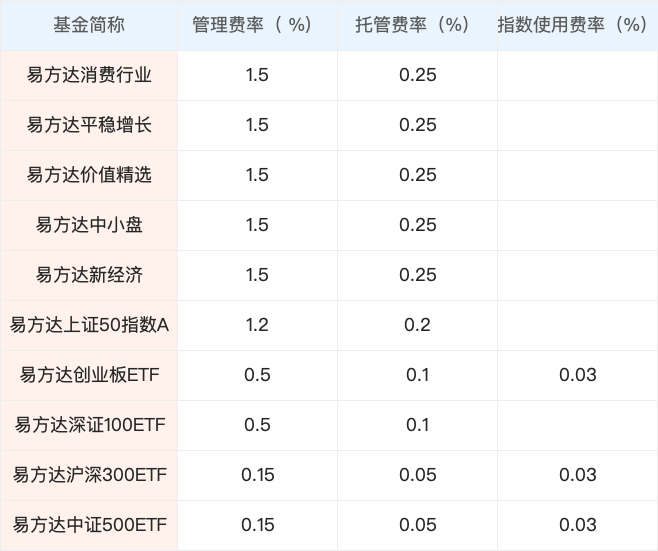
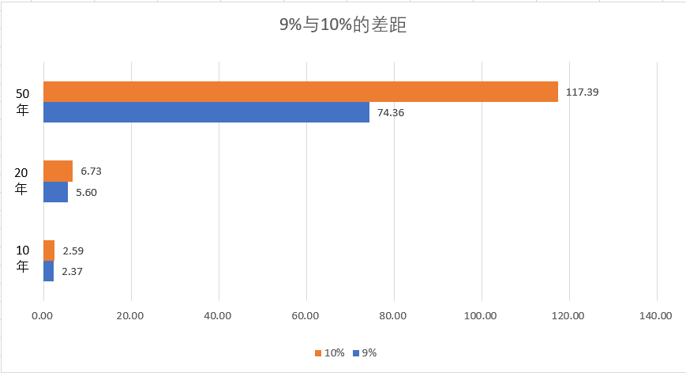

# 指数基金的五大优势

你在选择基金时，是不是经常面临一个选择：选主动管理基金还是被动管理基金（指数基金）？

主动管理基金和被动管理基金的区别还是很大的。面对主动管理基金，你必须完全交付信任，信任基金公司，基金管理团队，基金经理。

所谓的「主动」就是其选择投资标的，部分或完全由基金管理团队决定，由于基金的信息披露制度是*周期性*（基金季报）、*不完全性*（部分股票），*非及时性*的（季度过去20多天公布季报），所以*你不可能知道一只主动管理基金过去做什么（部分知道），现在在做什么，未来会做什么。*以上这些并非是制度不完善，而是为了保护投资者利益，所以我说你要完全交付信任。这很正常，别生气。

所以在选择主动管理基金时，更多考虑「历史因素」，而非「未来因素」，历史因素包括经理的过去任职期间业绩，基金历史业绩等；未来因素就是清楚地知道基金未来将如何运作、投资理念、投资方向，甚至具体的投资标的是什么。基金经理的变更会让主动管理基金发生很大改变，这也是主要原因之一。

而被动管理基金则完全不同，下面会围绕指数基金的优势进行说明，我们认为，指数基金更适合普通投资者。

公募基金经理受到业绩排名的压力，很难不受影响地按照一套恒定的投资方式去做，每年的排名可算上是业绩大考。所以，为了这种短期评比，主动管理基金就会想去追逐、猜测市场热点，很少有能够坚持住自己理念的，除非他的理念就是追热点。有部分主题基金会按照主题去投资，但还有一些主题基金会「挂羊头卖狗肉」投资大量与主题无关的上市公司。

而被动管理基金——这里说的主要是股票指数基金，任务是跟踪指数，以一定的权重（或等权重）配置指数成份股，而指数成份股由指数编制公司或机构通过一定的筛选规则编制，所以可以这么说：*指数基金过去和现在投资了什么我们一清二楚；而且指数基金将会如何投资，我们也一清二楚。*变更基金经理也不会改变指数基金的投资对象。

可预测的投资对象会带来一个巨大的优势：可估值。所以大家才会看到指数市盈率，股息率等信息，其本质就是因为指数作为一个整体，具备透明且稳定的特点，而一个可以估值的对象，我们就有办法研究他的买卖时机。我们面对主动管理的基金时是做不到的。

永续性是指数基金的一大优势，永续是永远持续。一家公司会消亡，而且大部分公司都会，道琼斯工业平均指数中的成份股已经换了多少轮，铁打的道琼斯，流水的成份股，但道琼斯指数却是越来越高，以前那里面没有苹果，没有波音，没有迪士尼，也没有可口可乐，看不到麦当劳，高盛和微软，元老级的成份股一个都没了。

*指数会有一个自动更新迭代的机制，*比如每年，或者每半年，甚至更加频繁地重新编制。大部分指数重新编制成份股时不会大动干戈，通常只改变其中的 20%，比如对于 50 只成份股的指数来说，每次大概变动就 10 只，先剔除 10 只，再纳入新的 10 只。走人的股票是不符合指数编制要求的，而请进的是那些符合的。所以一旦成份股中有公司亏损，或者甚至业绩不佳就会有可能被轰走。*在一个经济正常发展的国家里，永续的指数长期就是上涨的。*

你可以想象这样一个场景：一个年级有 6 个班级，每个班级 50 人，一共是300 个学生。其中一班叫实验班，实验班的规则是每次期末考试的前 50 名学生。在实验班中，大部分学生的学习成绩和能力都很稳定，稳坐一班中，而一班的末位几名同学会经历调换，当他们考试不理想时，很有可能被其他班的好学生顶替。

巴菲特曾经在公开场合建议普通投资者选择指数基金，这样就已经可以战胜大部分专业投资人士了。

咱们可以感受选择不同管理风格基金的注意力方向。

选择主动管理基金的投资者注意力容易放在如下方面：

1）基金经理是否称职； 2）短期基金的业绩是否和以前一样好

选择被动管理基金的投资者注意力容易放在如下方面：

1）整体市场的情况； 2）长期股市的表现

*相比选择被动管理基金，那些选择主动管理基金的投资者更容易被短期业绩影响，在买入基金之前的选择标准就喜欢考虑短期业绩。*我们的选择会反过来影响自己，在买入基金之后，相比选择被动管理基金，那些选择主动管理基金的投资者也倾向于考察基金短期表现是否让自己满意。

人都要找个理由说服自己。为什么我会选择指数基金，而不是主动管理型呢？我选择不依赖于基金经理，不依赖于基金团队的聪明才智，那我依赖于什么呢？我问过很多人，他们的答案很类似，*「我看好指数长期表现」，*不管这句话是自己想的，还是被别人影响或灌输。

而当我询问另一些人，为什么选择主动管理基金时，他们的答案往往是「这个基金经理很出名，这个基金业绩很好，排名靠前，这个基金是明星基金」。你就看出差异了。

你可能有疑问，我选择主动管理基金也是会考虑长期历史业绩的，会看 1 年、3 年、5 年，甚至更久。但是你一定要再想想，这些历史业绩有参考价值吗？在这么多年历史里，基金经理换过几次了，未来会不会换？过去优异的业绩是不是通过追逐题材和热点得来的？

公募基金有托管人监管基金公司的投资行为，但也确实很难完全避免基金管理人利用职务之便侵害投资者利益，比如老鼠仓或利益输送。现在这个情况已经很少了，证监会对公募基金的监管越来越严，而且使用的手段也越来越高级。但有一些做法确实很难界定。

比如「高位接盘」。这是什么意思？在股票市场你如果想卖出股份，需要有对手盘，股市里是撮合交易，你要卖必须有人买才行，而且你们的价格要能谈得拢。你想在 10 元的价格抛售股票，但是其他买家都想在 9 元以下买，这样僵持不下是无法成交的，既要有人买，也要有人卖，而且双方都认可价格才可以。

当你持股量很大，而且股票价格很高的时候，你的账面是大幅盈利，但是你卖不出去！因为价格很高，你的股票数量又多，如果没有人接你的股票，那么你这些盈利就是纸面的，强行大量的卖出，会导致股票价格下跌，因为相比你卖出的量，买入的那些太少了。

成交价格很容易下来。比如 10 元价格你卖出，有一些稀稀拉拉的跟你成交了，然后就没了，你发觉如果想要继续兑现，你作为卖方就要降价出售才行，比如降低到 9.98 元，可能也会成交一些，但还是太少，如此下去，你想要卖出大量股票的代价就是股票价格大幅度下滑。但如此一来，你的利润就少了。

这时如果可以有大资金在高位接我的股票就完美了。我曾经听我一些券商的朋友聊过这个事，一些基金会利用职务之便为一些庄家或机构高位接盘，这就是利益输送。但是这件事不好讲，因为基金经理可以说是经过自己分析得出的结论，这只股票具备投资价值所以才买的。

*而主动管理基金才有这种机会，*因为这些基金投资于什么股票是基金经理和基金管理团队决定的。但被动管理的指数型基金就做不到，这些基金必须买指数成份股，如果买的不是成份股，托管人首先就不干了，所以*基金压根就没机会。*而且指数基金为了跟踪指数涨跌，会把股票持仓做到很高的程度，一些还要预留5%现金应付赎回，所以根本没有多余资金干其他事，这就*保证了指数基金很难存在制度风险。*

成份股是指数编制公司或机构通过规则筛选而出的，指数基金配置指数成份股就可以了，不需要再动脑考虑应该投资于什么和投资多少的问题，这就极大的解放了基金管理团队的脑力负担。所以，*指数基金的管理费率相比主动管理类型的基金就低很多，托管费也低一些。有的指数基金，特别是ETF基金会多一个标的指数许可使用费，费率很低。*

这里仅随意挑选了易方达基金公司的一些基金，上面 5 个是主动管理的，下面 5 个是被动管理的股票指数基金，通过名称也可以看出。

如果是 10 万元买一只主动股票型基金，每年的管理费会收取 1500 元左右，而同样是投资于股票的ETF基金，管理费收取大概是 500 元左右，有的甚至更低。管理费、托管费和标的指数许可使用费都是同样收取模式，每天计算提计。

*别忘了少提取费用相当于增加了基金的价值，这部分少提取的钱，长期下依旧会发挥巨大的复利积累效应。*如一个是年复利收益率 10%，而另一个是年复利收益率 9%，假设初始投入 1 元，这每年 1% 的差距会有什么样的区别呢？

10 年后会有 0.23 元的差异；20年后会有 1.12 元的差异；50 年后会有 43.03 元的差异。

> 本文章所载信息仅供参考，不构成任何投资建议。如转载使用，请参考 [《文章转载声明》](https://youzhiyouxing.cn/agreements/ARTICLE_REPRINTED)。
