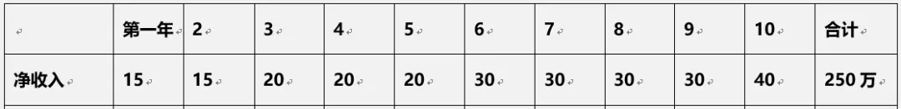
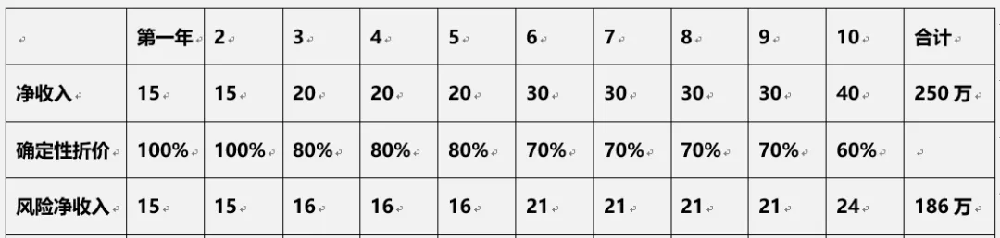
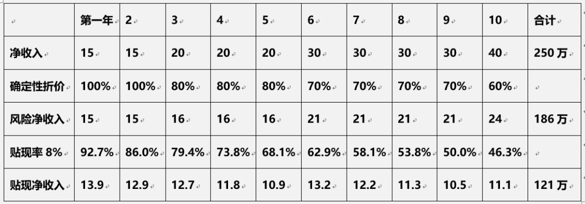
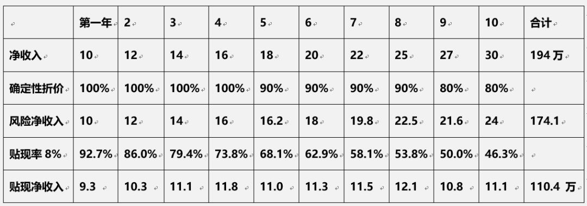
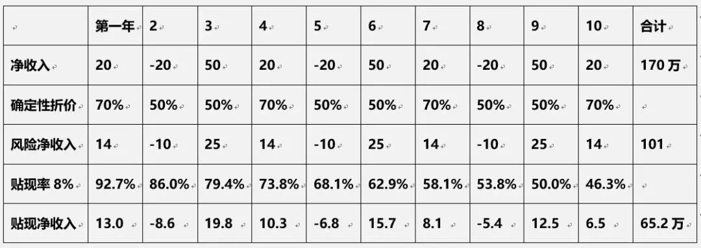

# 最直观的估值方法：会相亲，你就会估值

五粮液近一两年业绩预计将会不错，但目前已经涨了一倍，到底什么价格是合理的呢？

海天味业是个好公司，可 40 多倍市盈率到底有没有泡沫？

为什么业绩差不多的医药股，有的市盈率 50 倍，有的只有 15 倍？

很多时候，我们发现公司分析得很清楚后，还是不知道该不该买。一个犹豫，股价已经涨上去了，感受白忙活了一场。

在之前的文章评论里，我注意到一个问题，很多人在分析公司价值时缺乏一个明确的目标，只得到了一个「好公司」或「平庸公司」的结论，这就让价值分析成为空中楼阁。

分析公司的目的只有一个——*合理估值范围。*

再好的公司估值也不会涨到天上去，事实上，这类公司大部分时候都很贵不值得买；而值得我们去分析的公司，即使平庸，也不会烂到哪里去，很可能现在已经大幅低于合理估值了。

所以，今天我想来聊聊「估值」最核心的思想——自由现金流贴现理论。

## 一、三个相亲对象

自由现金流贴现是个很抽象的理论，所以，我要以「相亲」这件很具体的事来打个比方。

假如你亲戚给你安排了三个相亲对象，他们的去年的年净收入（收入减生活支出）分别为：

* 男青年 A：15 万
* 男青年 B：10 万
* 男青年 C：50 万

男青年 A：15 万

男青年 B：10 万

男青年 C：50 万

假设完全以「钱」为标准择偶，你的选择好像应该是 C 才对。

但实际上，你不会这么头脑简单，嫁人是一辈子的事情，怎么能光看钱呢？还要看看他们的钱是怎么赚来的嘛：

男青年 A，名校名企好专业，工作两年，能拿到 15 万已经算不错了，按照常理，净收入在十年内达到 40 万，应该没问题。

男青年 B，某实权机关公务员，10 万的年净收入看上去不高，但好处都是看不见的，一是体制内稳定；二是福利不错。

男青年 C，做钢材贸易的，虽然去年赚了几十万，但刚好补上过去三年的亏损。今年能赚多少，谁也不知道。

这么一来，就不好比了，但如果一定要挑一个，怎么算呢？

有一个相对科学的方法——把未来的收入都预估出来。

## 二、你的对象值多少钱？

预估未来收入还是很难的，因为都还年轻，未来也说不准。那我们就降低难度，只预测他们未来十年的收入。

第一步，按照名企员工正常的收入递增标准，得到了他未来十年的总净收入，如下表：

但天有不测风云，工作的事谁也说不准，万一遇上一个跟你八字不合的领导，压你两年是小意思，所以，*我们要按不同确定性给不同的折扣，*时间越近的确定性最高，所以前两年是 100%，因为不太可能降薪；而时间越长，给的折扣也越大。

如下表：

最后我们得到了*一个打了折的「风险净收入」，十年合计 186 万。*

这就完了吗？还有最后一步，因为*未来的钱折算到现在是要打折扣的，就是「贴现」，*假设你的投资能力不错，那么贴现率也要高于正常利率。我们假定为 8%，那贴现的计算方法就是，第一年除以 1.08，第二年除两次 1.08……第十年连除十次 1.08，得到下表每一年的净收入贴现额，最后十年总计为 121 万，如下表：

好了，这是 121 万，相当于名校名企好专业的青年 A 的估值。

具体过程我就不说了，有两点补充：

1）在净收入上，我把公务员的福利和稳定性全部折算成收入，所以看起来比一般公务员高多了； 2）确定性都是 90% 以上，金饭碗嘛。

最后的总估值为 110.4 万，公务员小 B 虽然现在比名企小 A 薪水低了三分之一，但最后估值仅略低 10%。

生意青年 C 的收入模型是三年一个周期，最高赢利 50 万，最高亏损 20 万，正常利润 20 万。但生意的确定性是最低的，只给了 50%～70%。

最终的估值结果仅 65.2 万。

*如果按照市盈率的算法，白领、公务员、生意青年的市盈率分别为 8、11、1.3 倍，差距还是相当大的。*

知道丈母娘为什么最看中公务员了吗？哪怕现在的收入低一点，未来估值高啊。

好了，我们现在可以看看这跟股票估值有什么关系了。

## 三、影响估值的三个因素

买一个股票，你得到的是什么？

*答案是：未来企业赚到的所有利润中，投资者可以得到的最大可能值，这就叫「永续现金流」*（自由现金流计算起来比较复杂，暂时可理解为利润），这就是你买一支股票，最后得到的东西。

所以，*一支股票的估值就是这个「永续现金流」的「贴现」，*计算方法就跟前面相亲对象未来净收入的计算方法差不多。

当然，虽然说是「未来」，但因为 10 年后的自由现金流经过贴现和确定性的折价，已经很小了，所以只要算未来十年就行了。

通过前面的计算过程，可以发现，对估值影响最大的，有三个因素：

白领 A 的最终估值高于公务员 B，因为白领 A 的起点是 15 万，公务员 B 的起点是 10 万。

这在股票估值中也很好理解，所有的增长都是在最近一年的净利润的基础上增长的，同样的增长率，现在利润高的，未来的估值高的可能更大。

反过来说，一家企业，如果未来合理估值已经用「现金流贴现」的方法算出来了，那么，净利润高的年份，合理市盈率反而低，利润低的年份，合理市盈率反而高。

这一点跟一般人的直觉非常不同，但股市上很常见。

比如高端设备公司大族激光，因为下游的几个产业都受经济衰退影响，2018 年和 2019 年的业绩都不好，但外资认为其有护城河，未来业绩增长空间不变，还是持续买买买，最终买到了 30% 的外资红线，也使其市盈率大幅上升。

生意青年 C 虽然现在已经能赚 50 万一年，但估值远远落后，因为他的现金流已经不再增长了，而是呈现周期性的波动。

A股中 90% 的周期性行业，就算是行业前几位的，其规模也已经基本不增长了，比如前两年的钢铁、煤炭、建材、化工等行业，未来自由现金流并不高，所以摊算到盈利好的年份时，市盈率都是个位数，会让投资者觉得估值低到离谱。

*行业市盈率基本取决于其增长率，*有实实在在技术壁垒的科技股市盈率 20 倍起步，家电行业 20 倍封顶；同样是家电，白电 15 倍，小家电 20 倍……

同样的银行股，招商银行的市净率高于四大行，也因为四大行基本不增长，而招行仍然稳定增长。

所以成长股有一个 PEG 的指标，即市盈率与增长率的比值，正常在 0.8～1.5 之间。

去年医药股带量采购一出，仿制药市盈率从 30 倍，跌到 15 倍，因为未来的增长已被医保局一剑封喉，虽然今年业绩不会有大的变化，但长期估值已经变成了化工股的逻辑。

*同样是医药板块，创新药占比高的公司，仅仅从 50 倍跌到 40 倍，因为创新药受医保影响小，未来增长逻辑没有被破坏。*

所以你看，医药股第一轮情绪性下杀之后，反而是跌幅小的恒瑞等创新药又反弹回去；真正跌幅大的仿制药板块，等大家账算清楚了，又出现第二轮杀估值，以后每次带量采购，都会狠狠地杀一波，等业绩真的下降了，还有最后一轮杀业绩的过程。

恒瑞医药与华东医药

公务员B收入没有白领A高，但估值基本与白领A持平，而市盈率大大高于白领A，仔细分析计算过程，核心在于公务员职业收入增长的确定性很强，因此折价很少。

*资本市场对风险非常敏感，控制风险最主要的标准就是看企业业绩增长的确定性，比如「护城河理论」。*

调味品板块增速也就 10～20% 之间，但市盈率可达 35～40 倍，因为这个板块属于必需消费品，行业集中度低，消费者又有口味偏好，价格敏感度低，这几个因素，决定了未来增长的确定性不是一般的高，所以板块的估值也不是一般的贵，绝对不是有人想的「里面有庄」。

乳制品伊利和蒙牛的竞争很激烈，增速也只有 10%，但行业天花板很高，双雄格局稳固，确定性也不错，所以也能给 25 倍估值。

*同一个行业中，龙头股的市盈率一般比其他股票要上浮 10～20%，也是因为确定性更强。*

*像白马股中大部分高市盈率公司，*比如爱尔眼科、晨光文具、中国国旅、永辉超市、用友网络，*都不是因为增长率高，而是确定性强。*

## 四、相对估值法

自由现金流贴现的方法，本身并不好用，因为增长率、确定性折价和贴现率，这三个都是很主观的指标，不同的人算出来差别很大。

一般合理估值并不用去算现金流。我最喜欢用的方法是根据「有效市场原则」，用前一年的实际市盈率区间，参考行业市盈率的变化，再考虑基本面的变化，推算出现在的「合理市盈率区间」，所以市盈率（包括市净率、市销率）又叫「相对估值法」。

「自由现金流贴现理论」的最大意义在于它背后的投资思想——买股票就是买企业未来的自由现金流。

所以，*增长率、确定性，就是我们研究公司要得到的两大结论，以此判断出他们的合理估值区间，最后根据这个区间，把买卖操作变成最简单的执行。*

总结：本文提到的几个具体的合理市盈率确定方法。

1）高成长行业高合理市盈率，低成长行业低合理市盈率，成长股的合理市盈率是增速的 0.8～1.5 倍；

2）未来合理估值确定后，高利润的年份合理市盈率低（波峰），低利润的年份合理市盈率高（波谷）；

3）未来合理估值确定后，增长刚刚起步，合理市盈率高（成长股），增长到了峰值，合理市盈率低（价值股）；

4）如果一家公司未来合理估值发生了的比较变化（增长率和确定性），即使不会影响这一两年的利润，也令市盈率大幅变化（这就是杀估值），这正是价值投资者一定要对一家公司保持跟踪的原因；

5）影响确定性的因素主要包括：行业增长空间、集中度、竞争格局、竞争壁垒、周期性等，建议以去年的估值区间为基准，进行动态估算。

> 来源：公众号「思想钢印」转载文章发表的所有信息仅代表作者个人观点，不对您构成任何投资建议，详见[《文章免责声明》](https://youzhiyouxing.cn/agreements/ARTICLE_DISCLAIMER)。
