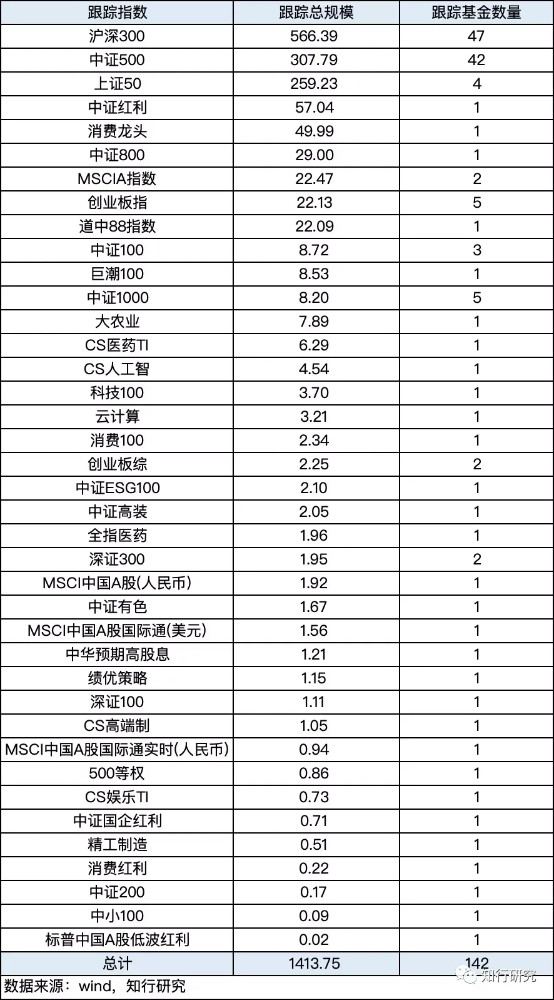
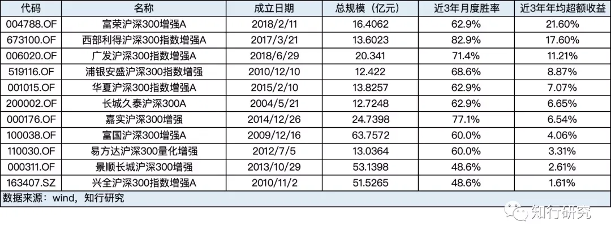
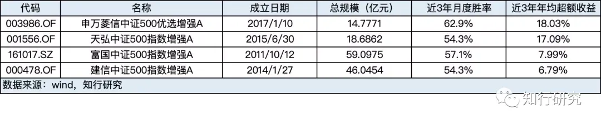

# 浅谈增强型指数基金

咱们的读者多数应该都对增强型指数基金并不陌生。

简单地说，*增强型指数基金就是在原本指数的基础上，进行了收益增强*。

因此，投资者在收获指数收益的同时，还能够享受到一部分超额收益。

不过，虽然大家听过增强型指数基金的名字，应该很少有人了解增强型指数基金的增强收益来源究竟是什么。

对于被动型指数基金来说，其策略就是*完全复制指数*，收益来源就是指数本身。

而对于增强型指数基金，*除了将资产的 80% 投资于跟踪指数的成份股外，剩余20%资金会供基金经理进行主动管理以增厚收益*。

由于有这部分主动管理的存在，增强型指数基金跟踪误差约束也比被动型指数基金要宽松一些，一般是要求年化跟踪误差不超过 7.5%。

而增强型指数基金的主动管理的部分具体是如何管理的呢？

*目前国内的策略主要有打新策略、多因子选股策略、主观选股策略等等。*

首先，我们来说一说一下*打新策略*。

大家都知道，打新股是A股独特的白送钱机会。

并且，由于指数基金持股规模较大，在打新时会被分类为 A 类账户，其单次获配比例要高于其他几类网下打新账户，更是高过网上打新的散户（心疼自己一秒钟😢…）。因此，打新策略对于增强型指数基金来说是可以获得可观收益的。

然后是*量化多因子选股策略*。

自诺贝尔奖得主 Eugene Fama 1992 年发表三因子模型以来，多因子选股模型已经成为最主流的量化策略之一。

目前，量化多因子选股策略已经是国内增强型指数基金的主要超额收益来源。

量化多因子选股听起来很高深的样子，但是我们可以把各种因子理解为影响股票价格的因素，比如估值、成长性、市场情绪等等。

就像信奉价值投资的基金经理会选择估值低、盈利高的股票。多因子选股策略会对历史数据的分析，筛选出一系列可能影响股票波动的因素，并量化成各种数据指标。最后，再利用那些能够获取超额收益的因素，构建出一揽子超越指数表现的股票组合。

说完量化多因子选股策略，相对的，市场上也有*主观的选股策略*。

量化多因子策略的优势在于解释历史，但未来总是有各种各样过去没有的变化，这就是主观策略的用武之地了。

不过当然，主观策略也有其他的局限，比如基金经理覆盖精力有限等等。

所以，目前很少看到以主观选股策略为主的增强型指数基金。

多数情况，主观策略一般是与量化多因子策略结合使用，比如兴全沪深300增强。

也有的指数增强中完全没有主观策略的存在，比如富国沪深300增强。

另外，除打新策略、量化多因子选股策略、主观的选股策略外，还有像股指期货策略、融券对冲策略等小众策略。由于市场环境的限制，这类策略目前的应用较少。

说了那么多，增强型指数基金似乎好处不少，但从我国的现状来看，仍旧处于发展的初期。

根据 wind 的统计，*目前市场上国内市场共有 142 只增强型指数型基金，总规模 1413 亿，在所有公募基金规模中占比仅 0.6%*。

从跟踪指数来看，全市场指数增强基金跟踪了 39 只不同的权益指数，规模最大的跟踪标的依然为主流宽基中的沪深300和中证500。其次是上证50、中证红利、消费龙头。

从近几年的历史数据来看，也*有相当一部分的增强型指数基金提供了稳定的超额收益*。

以沪深300为例，我们选取了成立 3 年以上最新总规模 10 亿以上的几个产品。

它们中的相当一部分的近 3 年月度胜率都超过 60%，近 3 年平均年化超额收益中位数 6.65%。

同样的，我们也选取跟踪中证500，成立 3 年以上最新总规模 10 亿以上的指数增强产品。结果是类似的，它们的近 3 年月度胜率也都接近 60%，年均超额收益率均超过 6%。

这样看，似乎增强型指数型基金是一类不错的产品。

尤其是对那些相信市场长期向上、已经选择长期持有被动型指数型基金的人来说，增强似乎是更好的选择，能够提供相当一部分的超额收益。

*但从中长期来看，增强型指数型基金的超额收益也有隐忧。*

为什么中国近几年增强型指数型基金能提供稳定的超额收益，离不开当前中国的A股机构投资者相对海外较少，股价非理性波动较多的市场特征，这使得超额收益存在空间。

但借鉴一些海外成熟市场的例子,比如美国，指数增强是很难做出超额收益的，这就是未来该类产品能否蓬勃发展的隐忧。

> 本文章所载内容仅供参考，不构成投资建议。市场有风险，投资需谨慎，投资者应保持独立思考。详见[《文章免责声明》](https://youzhiyouxing.cn/agreements/ARTICLE_DISCLAIMER)。如转载使用，请参考[《文章转载规范》](https://youzhiyouxing.cn/agreements/ARTICLE_REPRINTED)。
