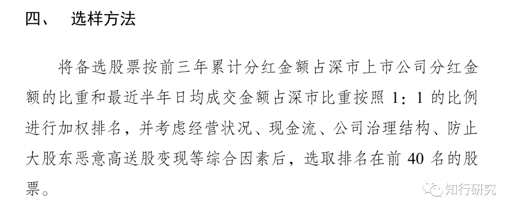
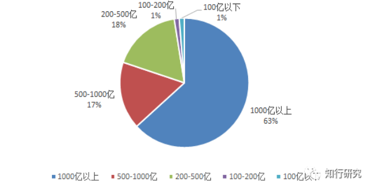
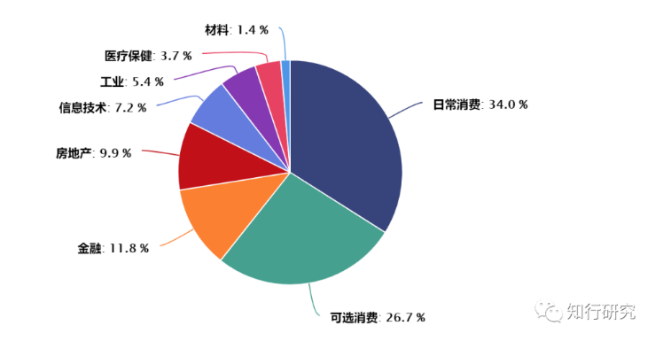

# 红利指数系列（一）：深证红利为什么风景独好？

这两年，关于红利指数的争议很多。

在 2017 年的时候，红利指数火过一阵子，我记得那时候很多渠道都在推荐红利指数。推高了预期之后，这两年红利指数整体表现不佳。很多人定投了 2、3 年，业绩平平，不期望能比得上消费、医药这种热门指数，连沪深300都没跑赢。失望之余，很多人选择了放弃，对红利策略是否有效产生了怀疑。

不过，这种失望表现却带来了一个好处，就是在当前市场，红利指数的整体估值较低。拿中证红利来举例，目前中证红利的估值百分位为 26%，属于低估的状态。在很多热门指数已经处于牛市阶段时，中证红利还处于熊市阶段。

最近（注：本文发表于 2020 年 9 月 13 日）有些朋友想投资，秉着低买高卖的原则，红利指数进入备选池子。但市场上红利指数有很多，即便是主流的红利指数，也分为上证红利、深证红利、中证红利、标普红利这 4 个。该怎么选择呢？

红利指数系列会针对这几个红利指数，详细聊聊他们的区别。毕竟只有我们独立思考过、仔细分析过的标的才能放心投、拿得住。

这一期我们先聊聊深证红利。

虽然上证红利、深证红利、中证红利、标普红利这四个指数，名称中都有「红利」二字，都将自己定位于寻找股息率高、分红稳定的股票，但其实他们四个差别很大。

*深证红利就是其中一朵奇葩，*在其他红利指数一蹶不振时，深证红利涨的很好。最近三年，深证红利上涨 48%，中证红利、标普红利、上证红利不涨反跌，分别下跌 4%、9% 和 11%，同期沪深300上涨 21%。

同样都是红利指数，为什么差距这么大呢？这就需要我们从指数编制方式入手去寻找原因。

深证红利是国证指数公司推出的，大家可以去官网查看具体说明。我只挑重点的说。

深证红利的样本空间：只从深市里面选择成分股，剔除 ST、*ST 和股票异常波动的股票，要求成分股 3 年内至少有 2 年有分红，3 年内至少有 2 年股息率要排名前 20%，近半年日均成交金额大于 500 万元。

有了大的样本池子之后，它要进行排名优选前 40 名。按照红利指数的一般逻辑，排名规则就是按照股息率从高到低进行排序，但深证红利却是与众不同。

它的排名规则是这样的：

是不是觉得有些复杂？很正常，我刚开始看的时候也是有点懵。我们仔细来看一下：

首先，*它考虑了股票过去三年累计分红金额（绝对值）占整个深市分红总金额的比例，这个比例越高，排名越靠前。*

这里需要说一下，它考虑是分红金额这个绝对值，而不是股息率。股息率 = 每股分红 / 每股价格。也就是说，深证红利更看重分红，弱化了价格 / 估值的影响。举个例子，如果一个行业龙头每年分红金额很高，但由于普遍被市场看好，股价涨的很高，股息率并不高。按照深证红利的规则，这个行业龙头会被纳入，但按照其他红利指数的规则，大概率不会。

*除了分红金额外，它还考虑了股票最近半年日均成交额占深市总成交额的比例，成交额越高，排名越靠前；*

前面两项已经能够看出，深证红利偏向于大盘股了。

不光如此，*它还考虑了这个股票的经营状况、现金流、公司治理、防止大股东恶意高送股变现等因素，*具体是用什么指标来选择的，并没有说明。很可能是人工来筛选的。

将上面的因素都进行考虑排名后，选出前 40 名股票，做成分股。

选完成分股后，该考虑每只成分股的权重了，也就是指数的加权方式。再一次出乎意料的是，它的加权方式竟然是：*自由流通市值加权。*也就是说，哪个股票的自由流通市值大，权重就高。

*深证红利作为一个红利指数，居然加权方式不是股息率加权，而是市值加权。*

也许你会说，它在选样本股时考虑了股息率啊，但那个挑选指标选出来的股票池子还是很大的。所以市值加权的作用更明显。

从各个红利指数历年的股息率和现金分红总额也能看出，深证红利的红利属性较弱。就拿 2015 年至今的数据来看，深证红利的股息率在 2.3% 左右，而其他红利指数股息率在 4% 左右。现金分红总额方面，2019 年深证红利是 949 亿元，上证红利是 4700 亿元。

*所以深证红利跟我们常规认为的红利指数有很大的不同。红利只是它筛选的指标之一，除此之外，它还要看日均成交额、经营状况、现金流等数据。所以我理解，深证红利不太像一个红利指数，更偏向于一个基本面指数，*确实也有人将它跟「深证基本面60指数」进行对比选择。

了解了深证红利的编制方式，我们来看一下依据这种方式，深证红利都选了什么风格的股票。

上面已经说过，从编制方式上，深证红利更偏向于大盘股。实际情况也是这样。

从成分股市值来看，深证红利的风格以大盘股为主。截至今年 8 月底，深证红利自由流通市值 1000 亿以上的成分股共 9 只，权重合计 63%；自由流通市值 500 亿以上的成分股共 16 只，权重合计 80%；自由流通市值不足 200 亿的 9 只成分股权重仅 2%。

*从行业分布来看，深证红利行业集中度很高，重仓消费，*日常消费和可选消费合计占比达到 60.7%。

从个股情况来看，深证红利更加偏好于消费金融行业龙头。*前十大成分股主要为消费、金融、房地产、TMT板块的龙头个股，*这些成分股均为大盘风格，近年来表现还是不错的。

看了行业分布和个股，大家是不是能明白为什么深证红利涨得好了。这几年消费涨得都让人瞠目结舌了，深证红利重仓消费，表现能不好么。再加上这两年的结构性行情，龙头股强者恒强，进一步加大了深证红利的涨幅。

深证红利不是一个典型的红利指数，如果你的目的是挑选股息率更高的股票，显然深证红利不如其他红利指数。

有人把深证红利这几年的表现归功于它采用市值加权方式。确实，市值加权让深证红利选出来很多龙头股票。但深市的行业结构也起了很大的作用。毕竟大型银行、大型国企这些主要都在上证，深市的消费、医药、信息技术的占比很高，这些行业近几年的优势还是很明显的。如果把编制方式放在全市场，估计就是另一种效果了。

*所以，对于深证红利来说，红利策略起到的作用有限，个股或者说是赛道起到了更大的作用。而目前这个赛道上的个股估值整体很高了，也会导致深证红利估值很高，还是不建议大家逢高买入。如果大家看好这个赛道，还是等它调整后再逐步介入吧。*

好啦，深证红利就介绍到这里，下一次我们聊一聊备受争议的标普红利。

> 来源：公众号「知行研究」转载文章发表的所有信息仅代表作者个人观点，不对您构成任何投资建议，详见[《文章免责声明》](https://mp.weixin.qq.com/s/6SWpyeW9Me8CG8zeUX5q4Q)。
