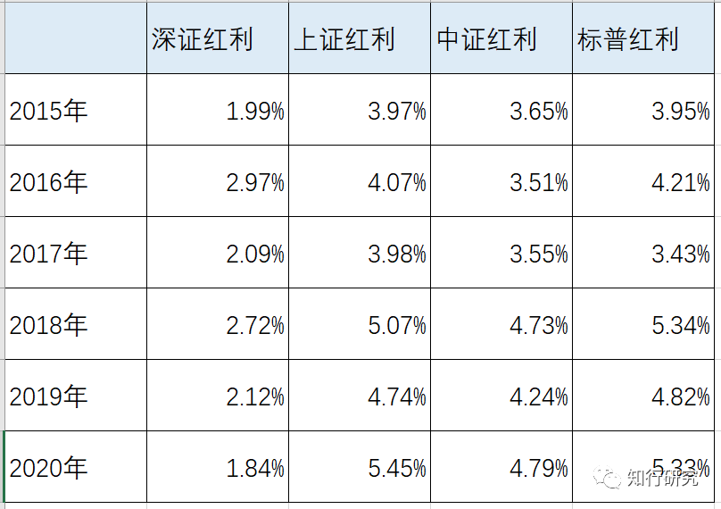
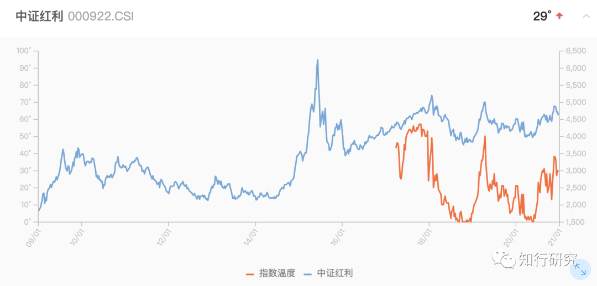
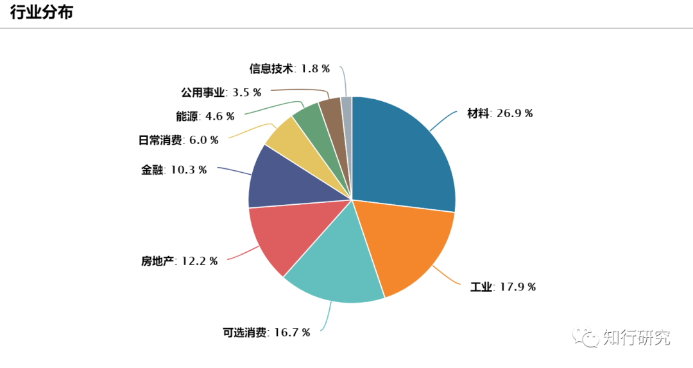
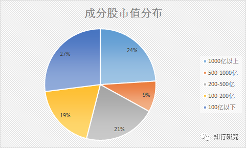
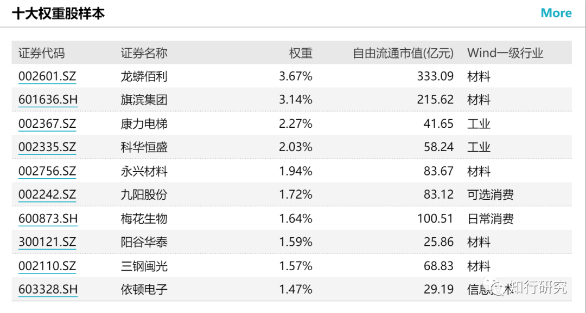

# 红利指数系列（三）：普通却实用的中证红利

> 本文发表于 2020 年 12 月 27 日。

本文发表于 2020 年 12 月 27 日。

今天来写写中证红利。先说结论：*中证红利跟其他红利指数比，很普通，但具有市场代表性，如果你想投资红利指数，请选择中证红利。*

另外，建议大家翻看一下之前关于 [深证红利](https://youzhiyouxing.cn/n/materials/795)、[标普红利](https://youzhiyouxing.cn/n/materials/824) 的文章，对比着看，效果更好。

很多文章在介绍中证红利的时候，一般都会说这个指数有多么的好。但我觉得，跟其他红利指数相比，它并不突出，估计有些朋友在挑选红利指数基金的时候也会有类似的感觉。

*首先，从历史业绩来看，中证红利不算突出。*

4 个红利指数（深证红利、标普红利、上证红利、中证红利）中，上证红利没什么悬念，一直是垫底的；标普红利在 2017 年之前是排名第一的，这几年高开低走表现很差；深证红利在 2017 年之前跟中证红利表现差不多，略好一些，这几年因为重仓消费，一骑绝尘，超越了其他所有红利指数。中证红利跟他们比，既不是垫底的，也不是拔尖的，无论谁排第一，都稳稳当当地跟住，同时不让自己掉队。

*其次，从股息率来说，属于中上等水平。*

我们选择红利指数，肯定是冲着高股息率、高现金分红的公司去的，所以这 4 个指数能不能选择股息率不错的公司是很关键的。下图是 4 个红利指数从 2015 年到 2020 年，每年的股息率数据。

能够看出，深证红利虽然业绩很好，但成分股的股息率跟其他指数比，很低，原因在之前关于深证红利的文章中介绍过了。除了深证红利，其他三个指数的股息率差别较小。中证红利并不是最高的，比上证红利、标普红利略微低一点。

所以，无论从业绩还是股息率来说，中证红利都不是特别突出，很普通，但确实也不差。

大家有没有发现，虽然中证红利很普通，但跟踪它的指数基金数量、总规模要比其他红利指数要多多了：目前跟踪中证红利的基金有 7 只、深证红利有 2 只、标普红利有 1 只、上证红利有 1 只。

为什么呢？这主要是因为中证红利的编制方法使得它更具市场代表性。也就是说，虽然普通，但在主要考察方面都没啥短板。

*首先，成分股是从沪深A股中进行选择，不对某一市场和赛道过于依赖。*

从名字就能看出，上证红利是从沪市中选择，深证红利是深市中进行选择。中证红利和标普红利是从全市场进行选择。

从单一市场中选择的利弊还是很明显的，哪个市场更强势，集中投资在这个市场的表现更突出，相反则表现很差。

就拿上证红利和深证红利来说，虽然编制方法不同会对它们的表现有影响，但沪市和深市的行业结构也起了很大的作用。毕竟大型银行和大型国企这一类企业主要都在沪市，而深市的消费、医药、信息技术的占比很高。这会造成这些年深市的表现整体要好于沪市。相应地，深证红利比上证红利的表现要好太多了。

这就是选对赛道的好处，但也意味着会对这个赛道过于依赖。

中证红利是从沪深A股也就是全市场进行选择，不可避免的是，会获得一个较为平均的收益，但胜在稳定性高，未来谁也不知道哪个市场或者赛道更好，均衡配置更为安心。

*其次，编制方法有助于稳定地找到拥有高分红能力的公司。*

除了深证红利采用的是市值加权之外，中证红利、上证红利和标普红利采用的都是股息率加权。我们来简单对比一下中证红利和标普红利。

之前关于标普红利的文章中介绍了它的不足，其中最突出的是它按照过去一年股息率排名选出成分股并赋予权重，且半年调仓一次。过去一年的周期太短了，这么短的周期，会导致公司通过一些特别行为提高它的股息率，但这种短期股息率的提升往往并不具有稳定性。再加上半年调仓一次，导致换手率特别高，都没好好享受股息收入就进行了调整。

*中证红利在这方面则好了很多，它的样本股除了要求在公司市值、成交金额方面不能太差之外，还必须满足：过去两年连续现金分红且每年的税后现金股息率均大于 0。然后会对样本股按照过去两年的平均税后现金股息率由高到低进行排名，选取排名在前 100 名的股票。*

跟标普红利比，中证红利是按照过去两年的股息率进行加权的，考察周期更长。另外，为了避免公司的特别行为，它要求公司过去两年连续分红且每年的税后现金股息率都要大于 0。

除此之外，*中证红利是一年调仓一次的，*除非是其中个别的成分股有暂停上市、退市等风险需要临时调整。相比于半年调仓一次，更为稳定。

这么一对比，中证红利的稳定性会更高，编制方法也更为合理。

之前我们说过，*投资一个指数要先去了解它的编制方法，因为编制方法决定了它的选股策略。*通过对中证红利编制方法的说明，我们能看到不论是从市场代表性，还是从策略稳定性来说，中证红利还是不错的。尽管这样会让它选股更为均衡，不够突出，但在主要考察因素上，都没什么短板。如果你想选择A股高分红的股票，可以选择中证红利。

目前可以买入中证红利吗？当然是可以的，这两三年结构性行情中，中证红利表现一般，估值较低，最新温度只有 29°，可以适当配置一些。（注：本文发表于 2020 年 12 月 27 日，不构成建议）

具体基金选择上，*喜欢指数增强的可以选择富国中证红利，喜欢普通指数的可以选择大成中证红利，喜欢场内交易的可以选择易方达中证红利ETF。*

结尾附上中证红利 12 月份调整成分股后的行业分布、市值分布、十大重仓股情况，感兴趣的可以看一下。

[红利指数系列(一)：深证红利为什么风景独好?](https://youzhiyouxing.cn/n/materials/795)[红利指数系列(二)：标普红利的高开低走](https://youzhiyouxing.cn/n/materials/824)

> 来源：公众号「知行研究」 转载文章发表的所有信息仅代表作者个人观点，不对您构成任何投资建议，详见[《文章免责声明》](https://youzhiyouxing.cn/agreements/ARTICLE_DISCLAIMER)。
