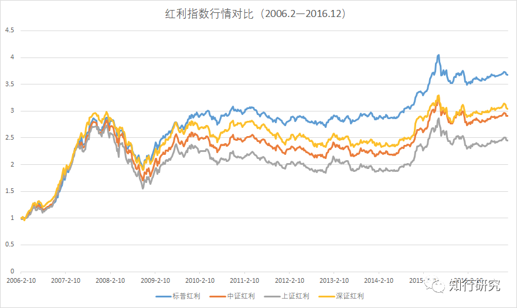
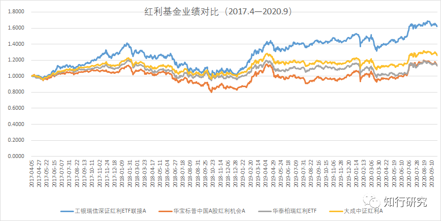
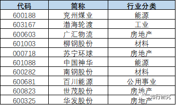
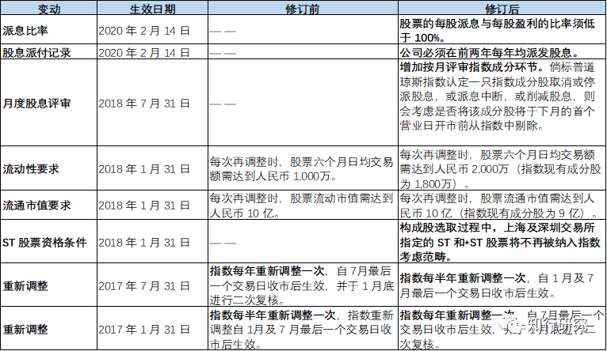

# 红利指数系列（二）：标普红利的高开低走

> 本文发表于 2020 年 09 月 28 日。

本文发表于 2020 年 09 月 28 日。

最近基金圈里热闹得很，科创板 50ETF、参与「蚂蚁」打新的战略配售基金的宣传铺天盖地，募集规模和速度都让人吃惊。很多人争先恐后，想搭上赚钱的快车。但秉承着投研组的一贯风格——人多的地方不去，我决定孤独地更新我的红利指数系列。

本系列第二篇，我们来聊聊标普红利。说来唏嘘，想当年标普红利的宣传得热火朝天，许多知名博主都对它推崇备至，但时过境迁，它今天竟然沦落到了被人或埋怨或抛弃的地步。

标普红利全称是「标普中国A股红利机会指数」。跟深证红利、中证红利、上证红利不同，这个指数是由标普指数公司编制维护的。标普红利发布日期是 2008 年 9 月 11 日，基日是 2004 年 6 月 18 日。指数历史数据并不短，不过，从 2008 年发布一直到 2016 年底，这个指数并没有基金产品进行跟踪，所以并未引起大家的关注。

2017 年初，华宝基金公司发行成立了「华宝标普中国A股红利机会指数基金」。在接下来 2017 年、2018 年，很多平台的大 V 开始推荐这支产品，宣传文案都很类似，基本都把标普红利定位为「史上最强红利指数」。

*虽然吹捧它的大 V 也会解释标普红利的编制方法，但得出「史上最强红利指数」的主要依据还是业绩。*为此我对比了四个红利指数在 2017 年之前（华宝标普红利指数发行之前）的表现，从下图能够看出，标普红利确实表现优异，在业绩上碾压其他三个红利指数。媒体的大量宣传，加上确实优异的历史表现，这支基金吸引了很多用户的关注。华宝标普红利基金规模增长得也很快，成立时只有 4 个亿，2019 年一季度末涨到了 25 亿。

*期望越大，失望越大。*这两年标普红利表现不佳，别说碾压其他红利指数了，基本沦落到了被碾压的地步。我们来看一下具体基金从 2017 年到现在的实盘表现，真是一个惨啊。

失望多了，很多投资者也就抛弃了它，转投其他产品了。也有很多投资者不甘心地发问：说好的史上最强呢？为什么我一买进去就亏损呢？我都投资三年了，这也不短了，为什么业绩这么差？

上面说了，很多人依据历史业绩好选中它，又因为实盘业绩差而抛弃它。然而，我认为跟业绩相比，指数的编制方法更值得关注。

*很多人有误区，觉得选主动型基金才需要关注基金经理的投资理念和选股逻辑，指数不需要。事实上，指数基金也是同样需要分析，因为指数的编制方法决定了它的选股策略。*尤其是像标普红利这种策略指数，通过分析它的编制方法，我们才能知道指数经常配置的是什么行业、什么个股，然后才能知道这些行业个股符不符合我们关于「好资产」的定义。

2017 年指数基金发行时，标普红利的编制方法是：先建立一个成分股备选池，这个备选池需要满足过去 3 年盈利增长必须为正、过去 12 个月的净利润必须为正的要求。*然后，所有入选的股票按照年度（过去 12 个月）股息率排名选出最高的 100 只股票，按照股息率加权构成指数。*在构成指数的过程中，为了分散，规定了*每只股票权重不超过 3%，单个行业不超过 33%。*

是不是有点懵？当初标普指数公司只给了这些介绍，又不公布历史持仓，导致大家没办法分析，根本不知道这个指数具体怎么选股。*不公开不透明，也是包括我在内的很多人从一开始就不推荐标普红利的最重要的理由。*

在基金实盘运作中，因为要定期公布全部持股，后面的问题才逐步浮出水面，我们来具体看一下标普红利的编制方法存在哪些隐患。

## 1. 成分股的股息稳定性不好

标普红利非常看重红利因子，想寻找A股市场上具有稳定高分红能力的公司。但事实上，*它的挑选逻辑是只看过去一年的股息率排名。*

过去一年的周期太短了，这么短的周期，会选中一些出于特殊原因提高自身股息率的公司。例如，某公司或许是为了改制，或许是不看好未来表现而集中分红，从而导致了一次性分红多了一些，然后就被选中了。 但这种短期股息率的提升往往并不具有稳定性。这种不稳定性会导致我们获得稳定高分红股票的愿望落空。

## 2. 周期股占比太高

标普红利选股逻辑会使得它持有很高比例的周期股。需要说明的是，我并不是歧视周期股。周期股具有明显的周期特点，当行业景气时，指数会表现很好，但不景气时，则表现不佳。

看它的十大重仓股，对周期敏感的投资者很容易被劝退。从这两年的持仓中，可以看出标普红利一直持有钢铁股等周期股，比例还不低。标普红利容易在经营业绩很好、分红多的时候纳入周期股，并且权重不低，但周期过去后，这些个股业绩较差，股价会大幅下跌。

股价下跌会导致这类产品股息率一直很高，很难从指数中剔除出去，指数就会被这类成分股的股价下跌所拖累，有苦难言。

## 3. 对垃圾股的容忍度高

首先，在 2017 年公布的编制方法中，标普红利并没有像其他红利指数那样剔除 ST 等垃圾股，而是在所有A股中进行选择。

其次，成分股虽然最初被选中，但后期也有可能会爆雷。尤其是A股，业绩做假也不少见。如何应对这种情况，也是指数需要考虑的。

也许是因为标普指数公司不太了解国内行情，所以标普红利除了一年两次正常调整指数成分之外，并没有引入临时调整方案。这将标普红利带上了风口浪尖。

2019 年初，标普红利第一权重仓股 ST 银亿申请破产重组，引起了很多人的热议。ST 银亿之前表现还不错，但由于大股东挪用公司资产，导致公司破产。

事实上，它在 2018 年底就传出有问题，其他指数因为有临时调整和专家判断，所以都没选它。而标普红利因为不具备临时调整方案，只能忍着亏损一直拿到下一个调整期限。

对于投资者来说，买入爆雷的股票已经很生气了，何况还不及时调整出去。这一次伤了很多人的心。

## 4. 指数样本调整频率高

调整频率方面，标普红利每半年调整一次样本，调整频率比其他红利指数高。这种定期调整和临时调整不一样，临时调整是为了把个别临时出问题的调整出去，而定期调整则是按照指数选股逻辑重新选择。

本来就是按照过去一年的股息率排名选股，成分股变动已经挺大了，再加上半年调整一次，这就导致成分股变动更大。这也进一步说明以一年为周期，很难选出 100 只长期稳定高分红的股票，而频繁调换使得交易成本增高，我们也很难分享公司长期稳定的股息收益。

从标普红利官网能够看出，标普指数公司也意识到指数编制方面存在问题。所以，从 2017 年至今，他们不断修改标普红利的编制方法：从半年调整一次到一年调整一次，又再次调整到半年调整一次；将 ST 和 *ST 股票不再纳入指数考虑范畴；增加月度评审环节应对临时调整；注重股息的稳定性等。具体编制方法的变更见下表。

*这也就意味着，不论历史回测多么牛，一旦实盘验证，总能发现指数不适应的地方，需要不断进行优化。*不过到目前为止，按照过去一年股息率进行排名以及调整频率过高等问题仍未得到解决，所以在选择红利指数方面，仍然需要对标普红利持观望态度。

[红利指数系列（一）：深证红利为什么风景独好?](https://youzhiyouxing.cn/n/materials/795)

> 来源：公众号「知行研究」 转载文章发表的所有信息仅代表作者个人观点，不对您构成任何投资建议，详见[《文章免责声明》](https://youzhiyouxing.cn/agreements/ARTICLE_DISCLAIMER)。
