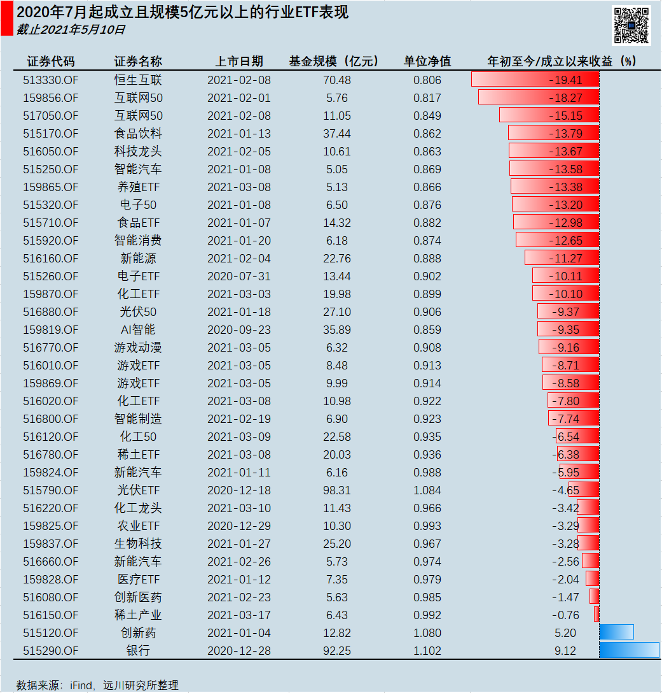
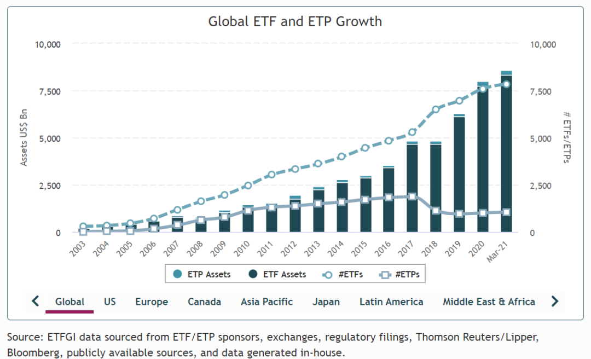
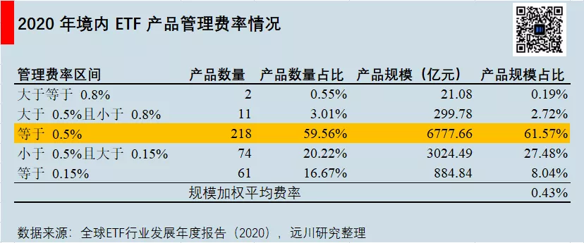
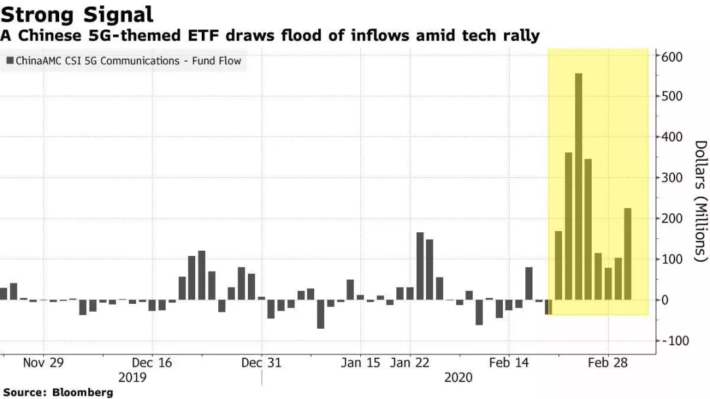
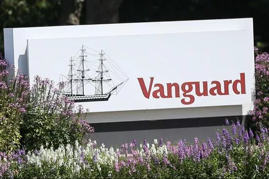

# 行业 ETF 的蜜糖与砒霜

过去一年是行业 ETF 的大热之年，新发行的 ETF 行业也越来越细分，比如第一批游戏 ETF，畜牧 ETF，化工产业 ETF，令人眼花缭乱。行业 ETF 为什么这么火？到底哪些行业值得押注？

今天为你推荐的，是少有的讲透行业 ETF 优缺点的好文章。只有克服喜好轮动、博弈的投机心理，行业 ETF 才能真正为投资者所用，显现出它的优势。

祝开卷有知。

「你知道节目的评分跌得跟基金一样了么？而且，你以为这就到底了吗？」这名场面来自于《吐槽大会》易立竞向李诞发出的灵魂拷问。

高开低走并不罕见，与过往不同的是，本轮基金绿出了圈，连一向与金融圈的严肃相隔甚远的综艺节目，也会不时向基金来两句调侃。

春节以来，新基金发行逐渐遇冷，但基金公司布局行业主题 ETF 的节奏并未放缓，例如最近被誉为「尊享版东方纳斯达克」的恒生科技 ETF，顶着反垄断的阴云，在脆弱的行情下一口气发了 6 只。

在投资者心中，可能会有一个普遍认知，市场再怎么清冷，总会有一个行业题材能走出自己的阿尔法。可本轮杀跌，总给人惊喜的A股市场并没令人失望，面对「全行业」的无差别攻击，去年 7 月以后新发的行业 ETF 都成了「渣男」，似乎只有银行才是「老实人」。

图说：银行 ETF 鹤立「基」群

尤其是寄予厚望的新能源车、光伏及化工新任「三傻」，这些不是顶着产业政策光环，就是步入了基本面大拐点。但这巨大的跌幅着实看着有些尴尬，让原本专注行业轮动「打游击」的投机者，统统接受了「风物长宜放眼量」的现实。为何越是浓眉大眼的行业 ETF，越让投资者受伤？

正如任何事物都有 A 面和 B 面，水能载舟，亦能覆舟，*行业 ETF 说到底还是投资者如何运用的问题，用的好就是蜜糖，用不好则是砒霜。*

1992 年，先锋领航集团(目前管理规模逾 7.1 万亿美元)创始人约翰·博格 7 点就早早来到了自己的办公室，等待着一位优雅的绅士——内森·莫斯特。

莫斯特，语气柔和，担任美国证券交易所新产品开发部副总裁的他，用传道士的口吻向博格构想一款新式金融产品 ETF，*这将使得指数可以全天交易，就像股票一样。*当时他并没有想到这个略显荒诞的设想后来能风靡世界，甚至成为先锋领航的招牌产品之一。然而，这个伟大设想在当时却被博格给拒了。

图说：全球ETF规模增长不断创出新高

时隔 30 年，相比成熟市场 ESG ETF、Smart Beta ETF、反向 ETF、主动管理 ETF 种类的繁多，国内市场似乎还是以行业主题 ETF 为主。该现象也说明，长期肾上腺素狂飙的新兴市场还是没有完全摆脱行业轮动的快感。

行业 ETF 能在我国市场如此风靡，不仅是土壤合适，更是其自带的蜜糖属性。

行业 ETF 作为一篮子股票，就好比你去生鲜超市买菜，*最大的优势就是省时省力。*众所周知，「自上而下」的投资一般分为四步：看宏观、看风格、看行业、看个股。而投资行业 ETF 就直接省去了看个股这一步骤。可别小看了这一步，这几乎就是普通投资者和专业研究员之间难以逾越的天堑。

普通人总会觉得自己的炒股水平处于市场前二分之一，行为金融学称之为过度自信。而事实上，对于个股，普通人并没有专业研究员的财务分析能力，也没有多少机会实地调研上市公司，更没有卖方提供的专业服务，从研究能力、信息差、资源禀赋三方面被完全碾压。

「996」的打工人，与其耗费心力地深夜秃头（研究）DCF（现金流估值），白天摸鱼看线，不如解放双手，告别选股的痛苦，选行业的难度要远远小的多。毕竟，投资是为了更好享受生活，而不是徒添烦恼，不然钱没赚到，还养出了三高。

对于上班族来说，省时省力是远远不够的，还得省钱。许多人不明白，为何巴菲特战胜市场不费力，而自己炒股赚钱却比上王者还难。这忽略了一个致命的问题——投资者买卖股票的换手率实在太高了。

特别是热衷于「高频交易」的A股投资者，一天打 5 个板，一年 50 倍的换手率，还没开始赚钱，就要先计提 10% 左右的印花税亏损，实打实的负和博弈。相反，相反，巴菲特有无限的现金流入，在起跑线就已经赢了。正如巴菲特自己说的，*投资盈利的最大敌人是费用与冲动。*

图说：境内 ETF 管理费率普遍 ≤ 0.5%

所以，*行业 ETF 另一个优势就是低费率，*去年境内 ETF 产品管理费率大多位于 0.5% 及以下水平。就以诺安成长为例，虽被基民解读为半导体 ETF 增强版本，但其「1.5% 管理费 + 0.25% 托管费 + 2% 申赎费」与国泰半导体 ETF「0.5% 管理费 + 0.1% 托管费 + 0.03% 申赎费」相比着实没有性价比，再出于蔡经理高集中度，大开大合的操作，这个增强得打上问号。

随着价格战的硝烟弥漫，行业 ETF 日后费率只会更低，例如近 期火热的南方中证新能源 ETF 管理费只有 0.15%。另外，在场内交易 ETF 不用交印花税，相比炒股来说也极具性价比。

当然，A股有那么一批投资者，不缺时间、精力和金钱，以徐翔为偶像，视股票为女友。他们就是对风口热点的把握有着超越常人的敏锐度，而行业ETF刚好也满足了这批人的掌控欲。此外，更有甚者把行业 ETF 当做行业估值的锚，并因此当做布局行业个股的依据。所以，行业 ETF 确实也成为了部分投资者创造超额收益的工具。

另一方面，A股总是布满难以琢磨的雷，就如最近的顺丰和美年，即便是专业的投资者也难加以辨认，就如同一捆筷子总是比一根筷子更不易折，行业 ETF 提供了行业的风险暴露，降低了个股「黑天鹅」事件的风险。即便白酒行业曾遭遇「塑化剂」及「八项规定」利空的双轮驱动，最后还是回补突破新高成为永远的神。

个股能退市，行业难消亡。行业 ETF 拥有交易灵活、省时省力、费用低廉、降低风险、满足投资者掌控欲等种种蜜糖，乍一看像是一个完美的金融创新，但往深层想，行业 ETF 具备的灵活性和主动性似乎又与指数基金的长期主义相悖。因此，博格一开始拒绝 ETF 的行为也不难理解了。

福兮祸之所倚，那么蜜糖背后，博格的顾虑究竟是什么？

博格兴致勃勃地听完莫斯特天马行空的设想，指出了问题：「先锋领航的指数基金是专门为长期投资者设计的，我*担心增加的流动性会大大吸引短期投机者，其交易不利于长期持有人的利益。*」事实上，A股的行业 ETF 投资者正在兑现着博格当时的忧虑。

2020 年 1 月，国泰半导体 50ETF 在过去一年走出了翻倍的势头。市场基于华为禁令延迟的消息，以及新基建政策下国产替代的远大展望，硬是让新成立的华夏与广发的芯片 ETF 加起来募了 73 亿。

图说：庞大的炒「芯」资金站在了山顶上（5G 包括半导体、通信和计算机）

连让成熟市场吓尿的疫情都无法阻止 ETF 投资者的亢奋，千股跌停后，半导体 50ETF 一个月涨了近 50% 成为夜空中最亮的「芯」。2 月，无数慕名而来的投资者前来排队站岗，后续一个月跌去了 30% 多。半导体 ETF 的惨痛教训，也证实了行业 ETF 成为散户赚钱的手段并不简单，更容易成为其追涨杀跌的工具。

另一方面，*机构对 ETF 场内场外的套利，也加剧了规模的扩大，进而影响行情。*例如大家对半导体 ETF 的热捧，其价格总是高于净值，做市商和套利者不断买入股票申购 ETF 份额，然后把份额高价卖给抢着买的投资者，此购买行为不仅影响了半导体 ETF 规模在十几天增加了 30%，还推高了半导体股票的价格，加剧了整个行业的波动。

此外，部分行业 ETF 指数编制存在*集中度过高*的问题，例如有新能源 ETF 20% 以上的仓位集中在宁德和隆基的，有互联网 ETF 60% 以上的仓位集中在阿里和腾讯的。这样的编制手法加剧了在市场估值不合理的情况下，越是被高估的股票权重越大。在核心资产杀跌的时候，并没有很好地体现分摊风险的作用，散户买入后调整也会很剧烈。

2020 年 5 月，高毅资产邓晓峰在采访中所说：「今年行业 ETF 的快速发展，某种程度上会强化市场的短期风格，可能会带来未来调整的压力。」而后续，行业 ETF 的投机也确实成为后续创业板及题材股暴涨暴跌的一个重要归因。

如果散户对行业 ETF 追涨杀跌，机构对行业 ETF 套利，基金公司对行业 ETF 编制集中度过高是其不可避免自带的砒霜毒性，那么基金时常在行业高位或者行业吹风最盛的时候发行，则是外在加剧了毒性的浓度。

《证券投资基金法》规定，基金管理人应当自收到核准文件起 6 个月内进行基金募集。同时，基金管理人可根据基金销售情况在基金募集期限内适当延长、缩短或者调整基金的发售时间并及时公告。这也使得，只要基金公司有意向，6 个月完全可以宏观调控行业 ETF 的发售时间，在行业涨的最「骚」的时候发行。

自去年年初华宝科技 ETF 破百亿规模之后，国内各式各样的行业 ETF 开启井喷模式。力图率先抢占规模高地的各大基金公司，旗帜很快插满了各个行业，铆足劲儿在行业高位发行。特别是今年年初发行的新能源 ETF、光伏 ETF、化工 ETF……一个个「精准地终结」了前一段行业妖娆的上涨行情。

2021 年 4 月 17 日，华为入场智能驾驶，与北汽新能源联合发布了高端汽车极狐阿尔法 S。令人匪夷所思的是，华为前脚「造车」消息放出，基金公司就带着「万亿蓝海，鸿蒙初开」的口号，大力推销智能汽车 ETF 或自动驾驶 ETF，更有甚者直接发行了新能源车 ETF。

虽然从超长维度来看，行业 ETF 大多数是能突破新高的，而且基金从申请募集到证监会注册批复再到发行，间隔的时间一般很长，基金公司一开始或许并不以行业行情火热为发行初衷。但是*短期来看，许多投资者既不具备判断行业高低点位的能力，也没有长期的格局，并且跌幅过大就会冒然选择亏损割肉。*

从结果来看，基金公司如果选择在某个行业消息催化的高潮点发行或营销，基金好卖与规模增长都是暂时的，而投资者的损失是永久的。相信大多数金融机构设立行业 ETF 立足于行业的长期增长，开出时间的玫瑰赠予投资者，然而时常事与愿违，最终落得一地荆棘。

图说：2019 年 6 月，先锋领航集团旗下共管理 1.01 万亿美元的美国 ETF 资产

约翰·博格在生前绝笔《坚守》中写道，只有极少数的创新能够满足长期投资者的需求，太多的 ETF 不符合该标准，基金公司对开发一种热门新产品的诱惑是无法抵抗的。在此前提下，投资者能做的无非就是，食之蜜糖，弃之砒霜。

总体而言，行业 ETF 能成为砒霜的本质是投资者自身*喜好轮动、博弈的投机心理。*

泓德基金经理邬传雁在一季报中写道，轮动策略的底层思维是均值回归，均值回归适用于A股上市公司和行业差异不大的过去三十年。而未来，经济已经进入以科学技术和管理技术驱动的质量型增长的环境中，当投资者试图跟随每一次轮动节奏的时候，或许离长期的投资目标越来越远。

所以，在当下只有少数行业的企业能够走出二次甚至三次增长曲线的结构性牛市当中，对于天生自带轮动属性的行业 ETF，我们要对其重新审视，把手中的筹码分布到未来前景最广阔的行业，放弃轮动赚差价的思维，立足指数基金投资的本质，被动长期持有或者定投。

当然，即便是这样，也总会有看错行业的时候。若想百分百规避砒霜，最好的建议或许是遵循约翰·博格所提倡的：

*在投资组合中应重视宽基指数（如沪深300、标普500）的指数基金，不交易他们，遵循这种策略，坚持前行。*

> 来源：公众号「远川投资评论」转载文章发表的所有信息仅代表作者个人观点，不对您构成任何投资建议，详见[《文章免责声明》](https://youzhiyouxing.cn/agreements/ARTICLE_DISCLAIMER)。
